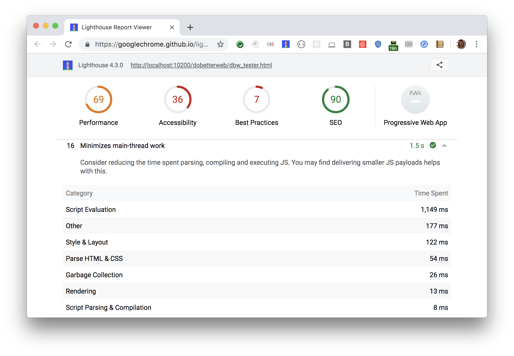

Consider reducing the time spent parsing, compiling, and executing JS.
Lighthouse shows a breakdown of execution timings on the main thread
in the Diagnostics section:

<figure class="w-figure">
  
  <figcaption class="w-figcaption">
    Fig. 1 — Minimize main-thread work
  </figcaption>
</figure>

## More information

- [Minimize main-thread work audit source](https://github.com/GoogleChrome/lighthouse/blob/master/lighthouse-core/audits/mainthread-work-breakdown.js)