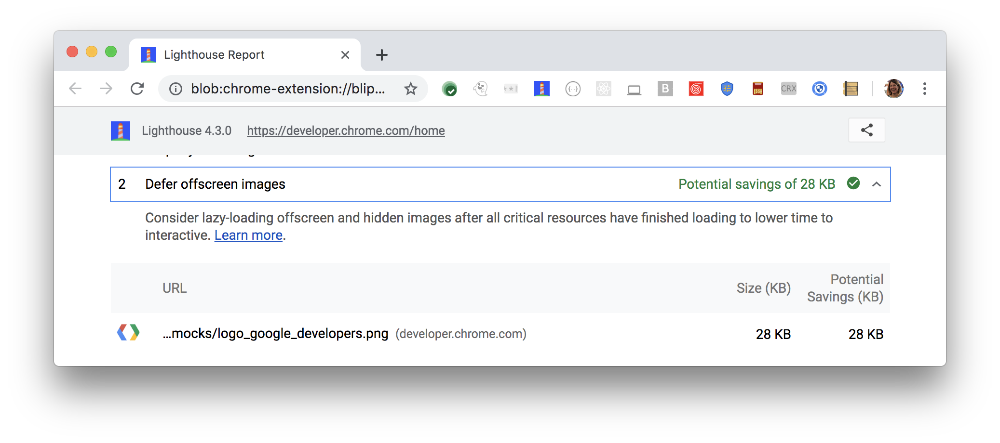

The Opportunities section of your Lighthouse report lists
all offscreen or hidden images in your page
along with the potential savings in kilobytes (KB).
Consider lazy-loading these images
after all critical resources have finished loading
to lower [Time to Interactive](/performance-audits/time-to-interactive):

<figure class="w-figure">
  
  <figcaption class="w-figcaption">
    Fig. 1 — Defer offscreen images
  </figcaption>
</figure>

## More information

- [Defer offscreen images audit source](https://github.com/GoogleChrome/lighthouse/blob/master/lighthouse-core/audits/byte-efficiency/offscreen-images.js)
- [Lazy load offscreen images with lazysizes codelab](/fast/use-lazysizes-to-lazyload-images/codelab-use-lazysizes-to-lazyload-images)