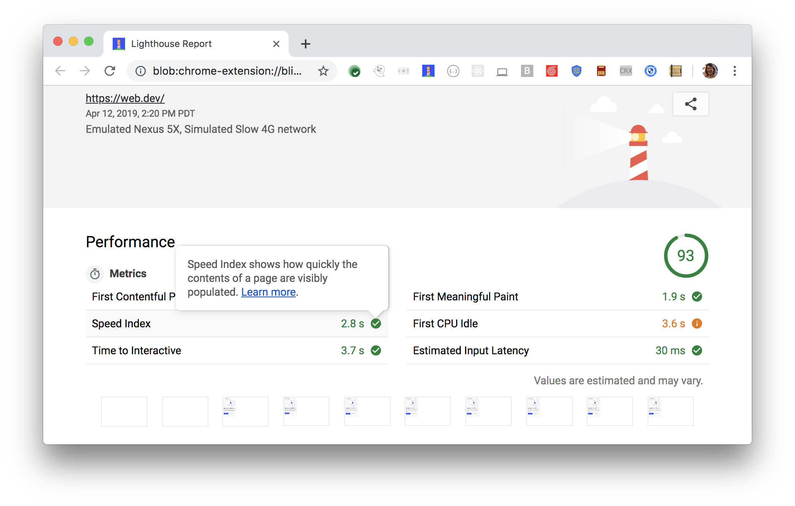
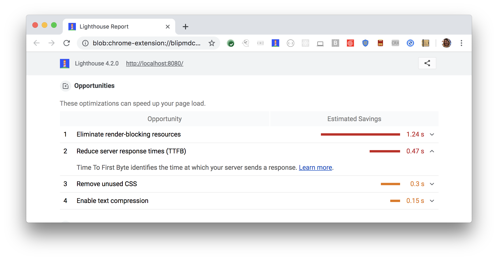

Speed Index is one of six metrics tracked in the performance section of the Lighthouse report.
Each of these metrics captures some aspect of page load speed.
The Lighthouse reports displays the Speed Index time period in seconds:

<figure class="w-figure">
  
  <figcaption class="w-figcaption">
    Fig. 1 — Speed Index
  </figcaption>
</figure>

## What does Speed Index measure

Speed Index measures how fast content gets visually displayed during page load.
This is done by capturing a video of the page loading in the browser,
computing the visual progression between frames.

Lighthouse uses the [Speedline node module](https://github.com/paulirish/speedline)
to generate the Speed Index score.
Speedline is based on the same principals as the
[original speed index introduced by WebpageTest.org](https://sites.google.com/a/webpagetest.org/docs/using-webpagetest/metrics/speed-index),
but it computes the visual progression between frames using the
[structural similarity (SSIM) index](https://en.wikipedia.org/wiki/Structural_similarity)
instead of the histogram distance.

## How Lighthouse determines your Speed Index score

In order to be able to calculate your overall performance score,
Lighthouse assigns each performance metric an individual score between 0 - 100.
The Speed Index score is a comparison between how fast your Speed Index is,
compared to [real website performance data tracked in HTTParchive](https://bigquery.cloud.google.com/table/httparchive:lighthouse.2019_03_01_mobile?pli=1).

This table helps explain how to interpret your Speed Index score:

  <table>
    <thead>
      <tr>
        <th>Speed Index (in seconds)</th>
        <th>Color-coding</th>
        <th>Speed Index score</th>
      </tr>
    </thead>
    <tbody>
      <tr>
        <td>0 - 4.3 seconds</td>
        <td>Green (fast)</td> 
        <td>75 - 100</td>
      </tr>
      <tr>
        <td>4.4 - 5.8 seconds</td>
        <td>Orange (average)</td> 
        <td>50 - 74</td>
      </tr>
      <tr>
        <td>Over 5.8 seconds</td>
        <td>Red (slow)</td> 
        <td>0 - 49</td>
      </tr>
    </tbody>
    <caption>Table 1 — Speed Index metric compared to Speed Index score</caption>
  </table>

## How your Speed Index score impacts overall performance score

The overall Lighthouse performance score is a weighted-average of the performance metrics,
including Speed Index, as well as,
[First Contentful Paint](/performance-audits/first-contentful-paint),
[First Meaningful Paint](/performance-audits/first-meaningful-paint),
[First CPU Idle](/performance-audits/first-cpu-idle),
and [Time to Interactive](/performance-audits/time-to-interactive).

Heavier-weighted metrics have a larger impact on the overall performance score.
Speed Index is weighted 4, the second heaviest score,
with Time to Interactive the only heavier-weighted score
(see [Scoring Details](https://docs.google.com/spreadsheets/d/1Cxzhy5ecqJCucdf1M0iOzM8mIxNc7mmx107o5nj38Eo/edit#gid=0) for specifics).

Try also the [Scoring Calculator](https://docs.google.com/spreadsheets/d/1Cxzhy5ecqJCucdf1M0iOzM8mIxNc7mmx107o5nj38Eo/edit#gid=283330180) to get a better sense of how Lighthouse scoring works.

## How to improve your performance score

Improving your Lighthouse performance score
isn't so much about tackling one performance metric at a time,
but seeing page load speed more holistic.
Anything you do to improve page load speed, will improve not just one performance metric,
but quite likely all of these metrics.

The most effective way to improve your performance score
is to fix the load opportunities highlighted in your Lighthouse report.
The more significant the opportunity,
the greater impact it will have on improving your performance score.

<figure class="w-figure">
  
  <figcaption class="w-figcaption">
    Fig. 2 — Opportunities section
  </figcaption>
</figure>

For example,
[Eliminate render-blocking resources](/performance-audits/render-blocking-resources)
shows opportunities to improve page load speed (in seconds).
Eliminate any one or all of the blocking resources, and not only will your Speed Index score improve,
but so will additional performance metrics, and your overall Lighthouse performance score.

Anything you can do to improve page load speed,
improves your Speed Index score.
Look for additional potential savings in these Diagnostic audits
listed in your Lighthouse report:

- [Minimize main-thread work](/performance-audits/mainthread-work-breakdown)
- [JavaScript execution time](/performance-audits/bootup-time)
- [Ensure text remains visible during webfont load](/performance-audits/font-display)

Learn more about these potential savings from the [Performance audits landing page](/performance-audits).

## More information

- [Speed Index audit source](https://github.com/GoogleChrome/lighthouse/blob/master/lighthouse-core/audits/metrics/speed-index.js)
- [Lighthouse v3 Scoring Guide](https://developers.google.com/web/tools/lighthouse/v3/scoring)
- [Speedline](https://github.com/paulirish/speedline)

