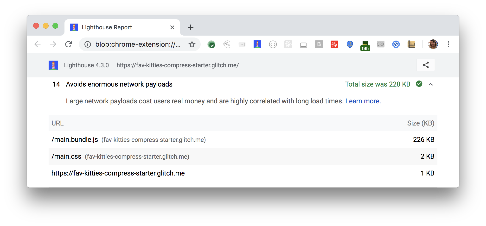

Large network payloads cost users real money and are highly correlated with long load times.
Lighthouse reports in the Diagnostics section the total byte size in killobytes of all network resources: 

<figure class="w-figure">
  
  <figcaption class="w-figcaption">
    Fig. 1 — Avoid enormous network payloads
  </figcaption>
</figure>

## More information

- [Avoid enormous network payloads audit source](https://github.com/GoogleChrome/lighthouse/blob/master/lighthouse-core/audits/byte-efficiency/total-byte-weight.js)