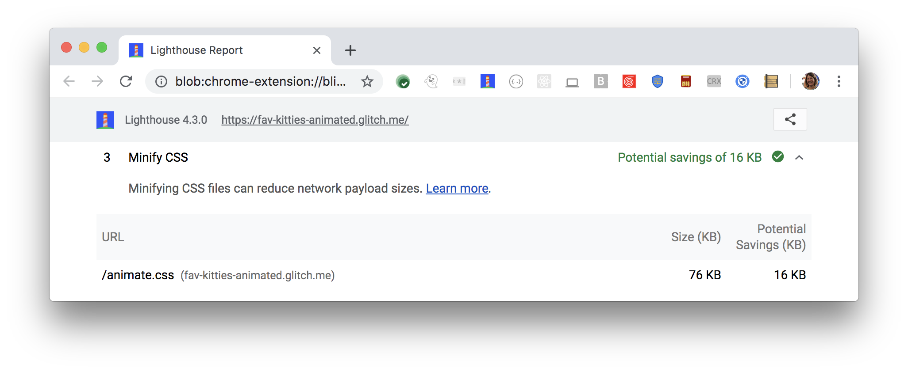

The Opportunities section of your Lighthouse report lists
all unminified CSS files,
along with the potential savings in kilobytes (KB)
when these files are minified:

<figure class="w-figure">
  
  <figcaption class="w-figcaption">
    Fig. 1 — Minify CSS
  </figcaption>
</figure>

## More information

- [Unminified CSS audit source](https://github.com/GoogleChrome/lighthouse/blob/master/lighthouse-core/audits/byte-efficiency/unminified-css.js)
- [Minify CSS](/fast/minify-css)