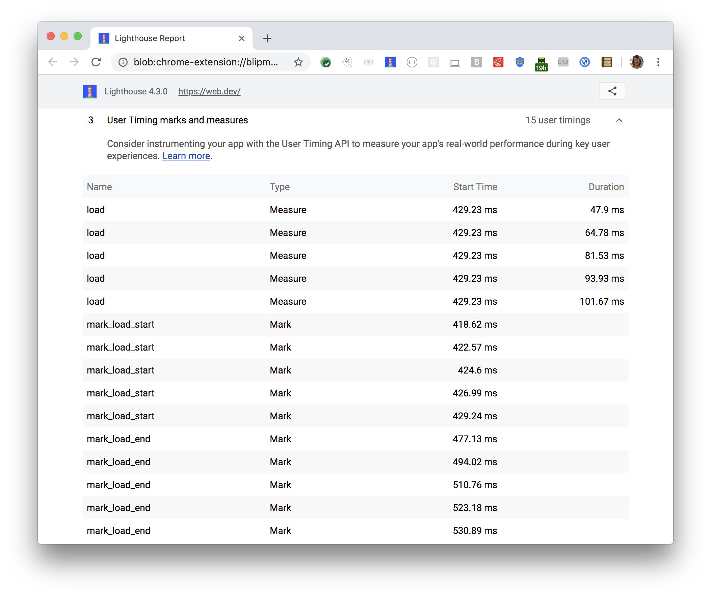

Consider instrumenting your app with the
[User Timing API](https://www.html5rocks.com/en/tutorials/webperformance/usertiming/)
to measure your app's real-world performance during key user experiences.
When your app includes User Timing Marks and Measures, 
Lighthouse reports the User Timing Marks and Measures in the Diagnostics section: 

<figure class="w-figure">
  
  <figcaption class="w-figcaption">
    Fig. 1 — User Timing markes and measures
  </figcaption>
</figure>

## Scoring

This audit is not structured as a "pass" or "fail" test. It's just an opportunity to discover a useful API that can aid you in measuring your app's performance. The score that Lighthouse reports for this audit corresponds to the number of User Timing Marks and Measures that it finds in your app.

## More information

- [User Timings marks and measures audit source](https://github.com/GoogleChrome/lighthouse/blob/master/lighthouse-core/audits/user-timings.js)