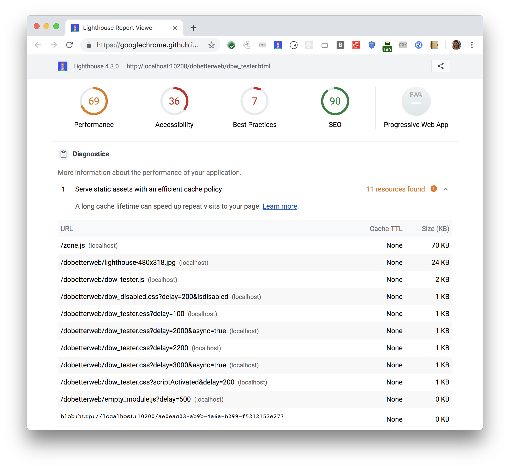

A long cache lifetime can speed up repeat visits to your page.
Lighthouse reports all static resources that aren't cached
in the Diagnostics section: 

<figure class="w-figure">
  
  <figcaption class="w-figcaption">
    Fig. 1 — Serve static assets with an efficient cache policy
  </figcaption>
</figure>

## More information

- [Serve static assets with an efficient cache policy](https://github.com/GoogleChrome/lighthouse/blob/master/lighthouse-core/audits/byte-efficiency/uses-long-cache-ttl.js)