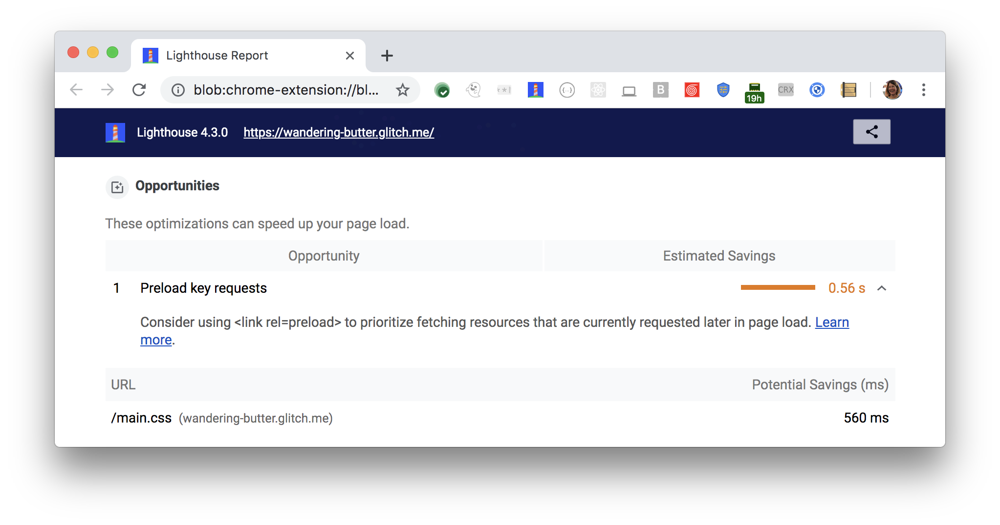

The Opportunities section of your Lighthouse report lists all key requests
that aren't yet prioritizing fetch requests with `<link rel=preload>`:

<figure class="w-figure">
  
  <figcaption class="w-figcaption">
    Fig. 1 — Preload key requests
  </figcaption>
</figure>

## More information

- [Preload key requests audit source](https://github.com/GoogleChrome/lighthouse/blob/master/lighthouse-core/audits/uses-rel-preload.js)