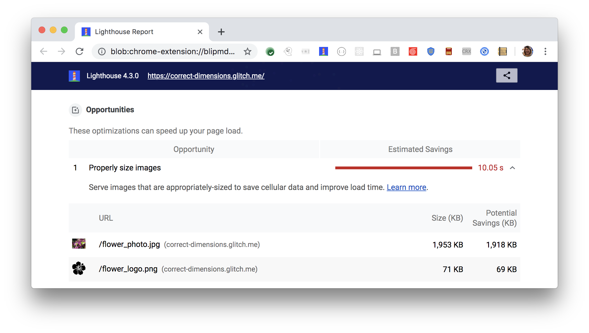

The Opportunities section of your Lighthouse report lists all images in your page
that aren't appropriately sized,
along with the potential savings in kilobytes (KB).
Resize these images to save data and improve page load time:

<figure class="w-figure">
  
  <figcaption class="w-figcaption">
    Fig. 1 — Properly size images
  </figcaption>
</figure>

## More information

- [Properly size images audit source](https://github.com/GoogleChrome/lighthouse/blob/master/lighthouse-core/audits/byte-efficiency/uses-responsive-images.js)
- [Serve images with correct dimensions codelab](/fast/serve-images-with-correct-dimensions/codelab-serve-images-correct-dimensions)