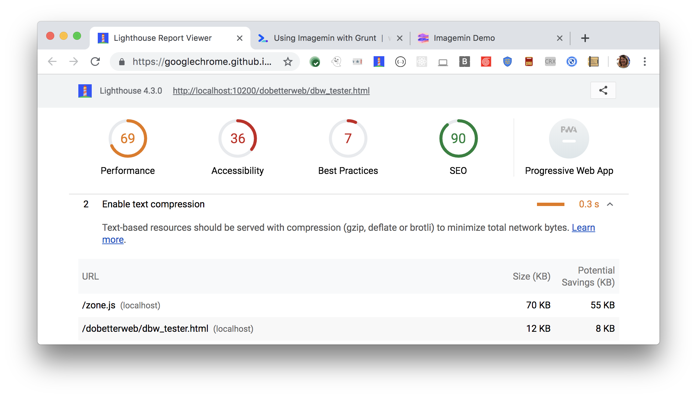

The Opportunities section of your Lighthouse report lists all text-based resources
that aren't compressed. 
Text-based resources should be served with compression
(gzip, deflate or brotli) to minimize total network bytes:

<figure class="w-figure">
  
  <figcaption class="w-figcaption">
    Fig. 1 — Enable text compression
  </figcaption>
</figure>

## More information

- [Enable text compression audit source](https://github.com/GoogleChrome/lighthouse/blob/master/lighthouse-core/audits/byte-efficiency/uses-text-compression.js)