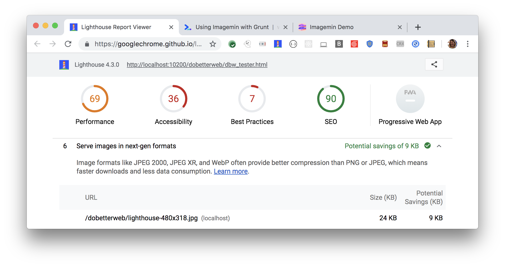

The Opportunities section of your Lighthouse report lists all images
in older image formats,
showing potential savings gained by serving webp versions of those images:

<figure class="w-figure">
  
  <figcaption class="w-figcaption">
    Fig. 1 — Serve images in next-gen formats
  </figcaption>
</figure>

## More information

- [Render-blocking resources audit source](https://github.com/GoogleChrome/lighthouse/blob/master/lighthouse-core/audits/byte-efficiency/render-blocking-resources.js)
- [Use WebP images](https://web.dev/fast/serve-images-webp)
- [Creating WebP images with the Command Line codelab](https://web.dev/fast/serve-images-webp)