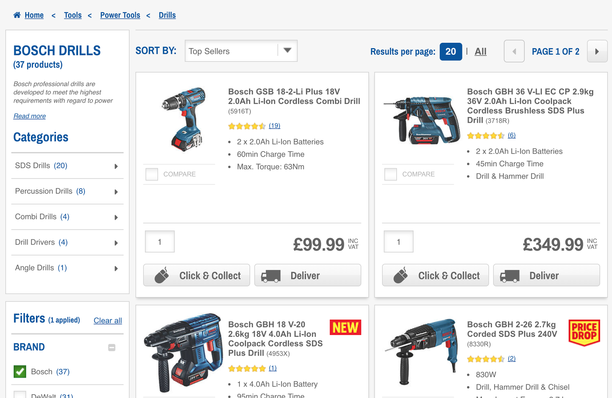
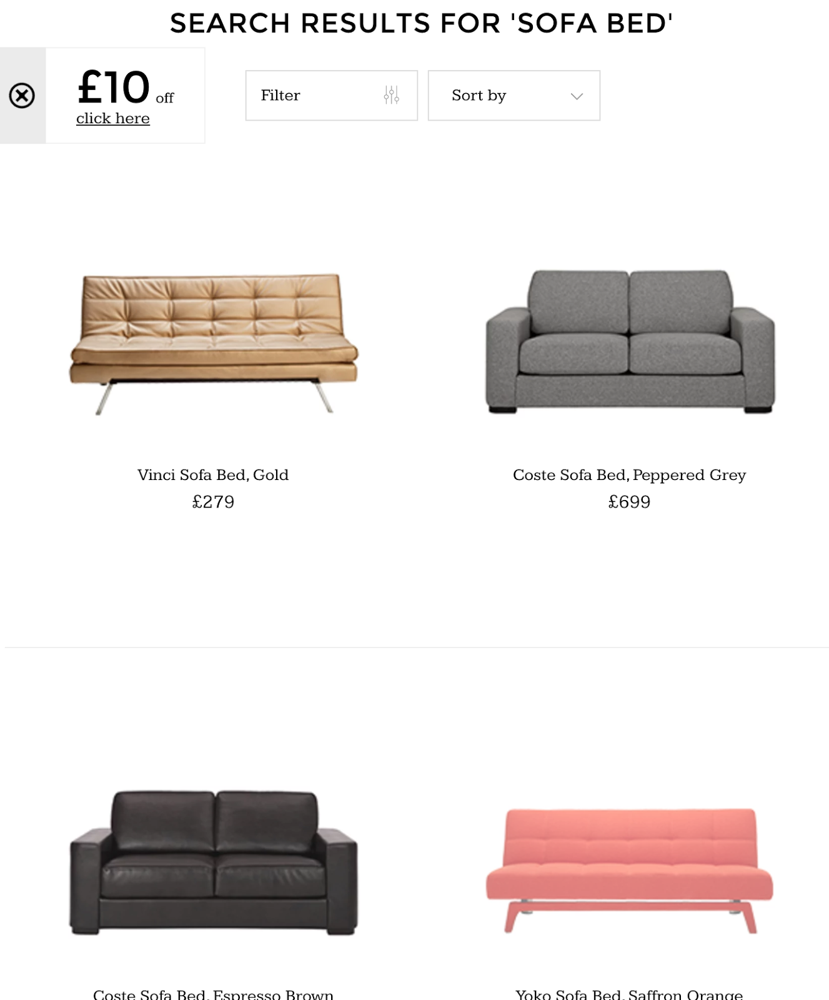
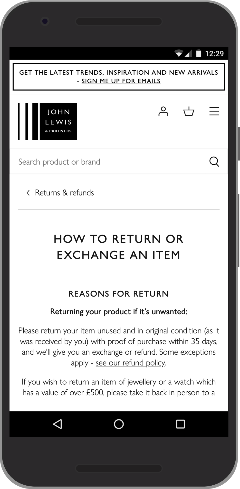
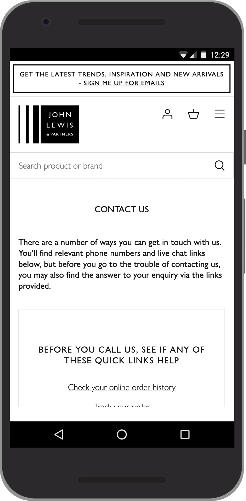
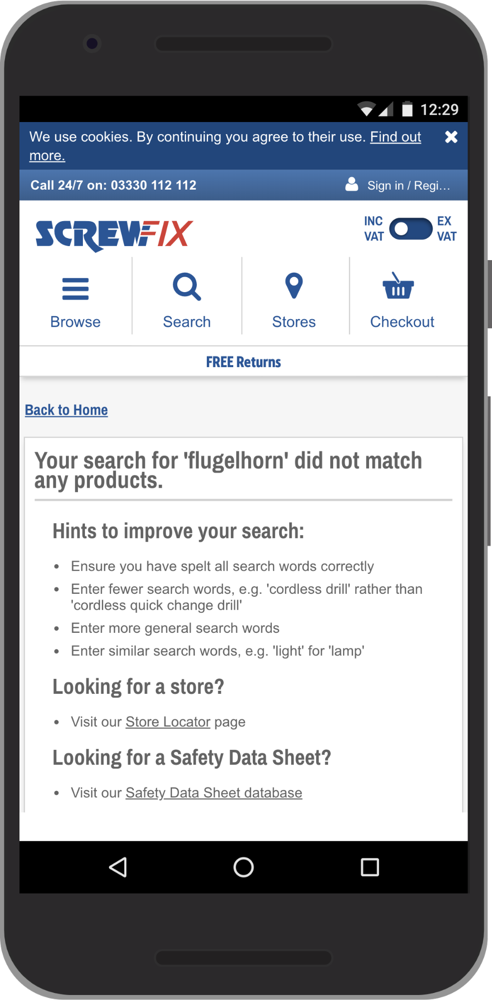

Search results design is critical for online stores.

Customers enter text to search for a product, and your search engine returns a
list of zero or more results. Sounds simple, but it's crucial to get right.

Well designed search is a prime source of engagement and conversion: 'searchers'
are [far more likely to convert](https://www.bigcommerce.co.uk/blog/ecommerce-site-search/#your-on-site-search-optimization-checklist)
than 'browsers'.

Conversely, many people [will abandon a site and probably never return](https://baymard.com/blog/mobile-ecommerce-search-and-navigation)
after a poor search experience.

Best practices for a great search experience are outlined below.

## Design search results for better discover and more conversions

### Get customers to products and checkout as quickly as possible

+   Don't forget the basics. Every product listing should at least have a
    product image ([make it
    beautiful](https://www.johnlewis.com/search?search-term=chair)!), a name,
    description and product details.
+   Work out what people want and give it to them. If only one result is
    returned, it may be best to go directly to the relevant item—for example,
    when a customer enters a part number.
+   Avoid zero search results! You can help people avoid errors on input—
    see our article
    [Build a great search box](https://docs.google.com/document/d/1_5QZzRJTyCC9byZyCyljFoSoW7D47YVNXMQInBQWfvk/edit)
    [TODO: add web.dev link]. Even if a search doesn't get any results, don't
    leave people with nothing. Provide suggestions based on the search, or
    other options such as links to shop categories or a store locator.
+   Add Buy Now to each item in a results listing.
    [Many customers use search simply to make a single or repeat purchase](https://blah).
    [TODO: add link]

### Taylor listings to suit the customer

+   Tailor information to the product. Depending on what you're selling
    this might include customer reviews, external expert ratings such as
    tasting scores, style options such as fabric choices, technical details and
    dimensions.
+   Tailor functionality to the product. If appropriate, enable one-click
    purchase. Don't force people to go to the product page—every click loses
    users!
+   Reviews and ratings are compelling source  of trust and engagement:
    consider incorporating them in search results.

### Learn how customers want to filter and rank

+   Allow filtering by whatever factors are relevant for your products:
    customers ratings, external reviews, and product attributes.
+   Likewise, enable results ranking by whatever product attributes matter
    to your customer. This is likely to vary considerably between product types.
+   Make it easy for your customers to do a new search based on their old
    one. Retain their search text and selected filters so they can refine their
    search.

### Understand what your customers want

+   Customers may not be searching for products. Make sure to provide
    relevant results for queries such as 'customer services' or 'returns'.
+   Whatever you do, test! Check analytics for searches where users didn't
    click on any results. (Google Analytics, for example, provides search
    analytics with  [Site
    Search](https://support.google.com/analytics/answer/1012264?hl=en).) Always
    ensure that configuration changes that work for some searches don't mess up
    others. Accurate result ranking is fundamental to successful search.

## Examples

[Screwfix](https://www.screwfix.com/) provides checkout options right on the
search results page, and automatically transforms a search query (in this case
'bosch drill') into a filtered set of results, which each include review ratings
and a sensible level of product detail:

By contrast, [Made](https://www.made.com/) keeps results clean and uncluttered,
which suits the brand:

Searches on [John Lewis](https://www.johnlewis.com/) work well for non-product
queries—in this case 'returns' and 'customer services':

[Screwfix](https://www.screwfix.com/) also make sensible suggestions when no
search results are found:

## Next steps

+   [Add search to your website]()
    [TODO: web.dev link]
Overview of the guides in this series.
+   [Choose a product search engine]()
[TODO: web.dev link]
    Learn how to choose between server and client-side alternatives.
+   [Help customers search]()
[TODO: web.dev link]
    Make the most of search engine features that help customers input search text.
+   [Build a great search box]()
[TODO: web.dev link]
    Design and code successful UI elements for product search.
+   [Build offline search]() [TODO: web.dev link]
    Learn how to build search that doesn't need an internet connection.
