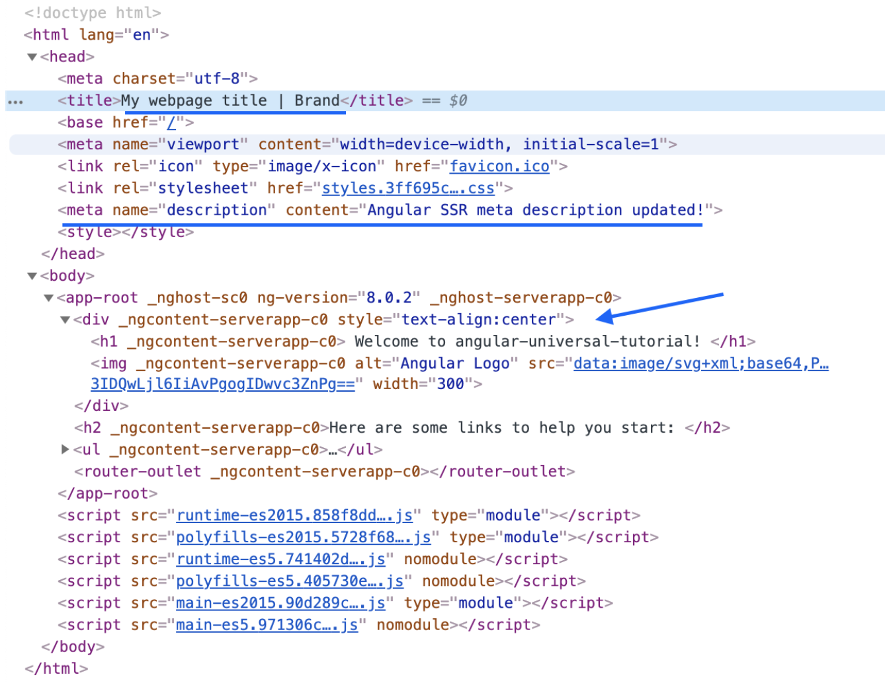

In this post, you'll learn how to use the [Angular command line interface (CLI)](https://cli.angular.io/) to set up server-side rendering (SSR) using Angular Universal. SSR can give you more control over your search engine optimization (SEO) and social media previews and get faster [First Meaningful Paints](/first-meaningful-paint).



This post assumes you're already familiar with SSR and its benefits versus traditional client-side rendering (CSR) applications. If you need a refresher, check out Google's [Rendering on the Web](https://developers.google.com/web/updates/2019/02/rendering-on-the-web) article.



## What is Angular Universal?

Angular Universal is a nickname for SSR with Angular. SSR is the process of rendering your application on the server rather than in the browser (that is, client-side), which is how most Angular applications have traditionally been rendered.

## Set up SSR for your Angular CLI project

_You can find the code sample from this post [on GitHub](https://github.com/trilonio/angular-universal-tutorial)._

To set up a new Angular application for SSR, run a single command:

```bash
ng add @nguniversal/express-engine --clientProject angular-universal-tutorial
```


`clientProject` refers to your application name, which is found in your `angular.json` file. In our [sample code](https://github.com/trilonio/angular-universal-tutorial), the application name is `angular-universal-tutorial`, but make sure to update this to reflect your project's actual name.


Here's what this command does:

1. Creates and modifies project files to prepare your application for SSR.
2. Creates Node.js scripts for dynamic and static SSR.
3. Installs all necessary dependencies.
4. Creates new `package.json` scripts that you can use to build SSR.

You now have additional scripts in the sample app that can do dynamic SSR. You'll need to customize these Node.js scripts for production applications, but they're great starting points.

To set up dynamic SSR, run:

```bash
npm run build:ssr && npm run serve:ssr
```

For a brand new CLI application, you should be able to run the script above, and everything will work without any problems. But what about your large existing applications?

## Prepare your existing application for SSR

It's important to remember that with SSR your application is being rendered on the server, so any browser-specific functionality will cause errors. Two kinds of code that often cause SSR errors are [global objects](https://developer.mozilla.org/en-US/docs/Glossary/Global_object) and [timeouts](https://developer.mozilla.org/en-US/docs/Web/API/WindowOrWorkerGlobalScope/setTimeout) / intervals.

Attempting to access browser globals such as `window`, `document`, or `localStorage` will cause your SSR to fail to render.

Similarly, timers such as `setTimeout` or `setInterval` will cause your SSR render to be _delayed_ or, in the case of `setInterval`, never render at all.

### Conditionally wrap code that may cause SSR errors

To keep browser-specific functionality from interfering with your SSR render, conditionally wrap code _specific_ to browsers:

```javascript/7-15
import { isPlatformBrowser } from '@angular/common';

@Component({ /*...*/ })
export class ExampleComponent {
  private isBrowser: boolean = isPlatformBrowser(this.platformId);

  constructor(@Inject(PLATFORM_ID) private platformId: object) {
    If (this.isBrowser) {
      // ** Any code here will only run in the browser! **
      const location = window.location;

      setTimeout(() => {
           // this would otherwise delay your SSR
      }, 1000);

    }
  }
}
```

Alternatively, you can use a `public` property on a component and conditionally render portions of your templates. This approach helps prevent nested components with browser-specific code from rendering during SSR:

```javascript/4
import { isPlatformBrowser } from '@angular/common';

@Component({
  template: `
    <ng-container *ngIf=”isBrowser”>
      <!-- some html / component we only want to load in the browser -->
    </ng-container>
  `
})
export class ExampleComponent {
  // now public
  public isBrowser: boolean = isPlatformBrowser(this.platformId);

  constructor(@Inject(PLATFORM_ID) private platformId: object) { }
}
```

Using this technique gives you complete control over what to render in both the browser and server environments.

## Set up SEO for Angular SSR

With SSR set up, you can use common Angular packages such as `Title`, `Meta`, and `Document` to customize everything you need to make sure your application appears exactly like you want it to in search results. To do that in the sample app, add this code to `app.component.ts`:

```javascript
import { Meta, Title } from '@angular/platform-browser';


export class AppComponent {
  constructor(private meta: Meta, private title: Title) {
    this.title.setTitle('My webpage title | Brand');
    this.meta.updateTag({
      name: 'description',
      content: 'Angular SSR meta description updated!'
    });
  }
}
```

When running your SSR application you'll be able to view source and see your server-rendered tags! Notice `<title>`, `<meta name=”description”>`, and even `<app-root>` itself is populated with HTML!

<figure class="w-figure  w-figure--center">
  
</figure>

## Conclusion

To add SSR to an Angular app:

1. Add `@nguniversal/express-engine` to your project using the Angular CLI.
2. Decide whether static SSR, dynamic SSR, or a mix of both makes sense for your application.
3. Set up SEO in your application.
4. If you're adding SSR to an existing project, conditionally wrap code that may cause SSR errors, such as global browser-specific objects and timeouts/intervals.
