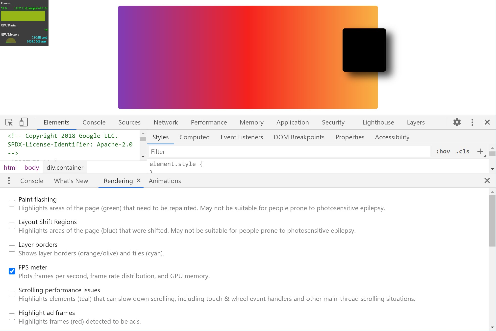

In the overview to CSS animations you learned how the performance of CSS animations is closely tied
to which stage of the rendering pipeline the animation triggers.
In this guide you will learn more about how to create high performance animations,
and the tools that are available in browsers to help.

## Rendering pipeline triggers

You should try to restrict animations to changes to `translate`, `scale`,
and `rotation` using the [`transform`](https://developer.mozilla.org/en-US/docs/Web/CSS/transform) property,
and [`opacity`](https://developer.mozilla.org/en-US/docs/Web/CSS/opacity).
These things can be animated relatively cheaply due to the fact they act only on the compositing stage of the rendering pipeline.
See [Why are some animations slow?](/animations-overview) for more information about the pipeline.

Animating other properties will trigger earlier stages of the pipeline.
The stage that is triggered is not always the same across browsers.
If you need to animate a property other than `transform` or `opacity`
the [CSS Triggers](https://csstriggers.com/) site can help you understand where in the pipeline the process will be triggered.

Your browser DevTools will also help you to see how animations impact rendering,
as you can see below.

## Triggering layout

As layout is the earliest stage of the pipeline,
you should avoid triggering the process here if possible.
Quite often an expensive operation using a property that will trigger layout can be changed to one which does not.

For example, to animate an item from the top left of a box to the bottom right you could change the values of `top` and `left`.

```css
.box {
  position: absolute;
  top: 10px;
  left: 10px;
  animation: move 3s ease infinite;
}

@keyframes move {
  50% {
     top: calc(90vh - 160px);
     left: calc(90vw - 200px);
  }
}
```

[See this example on Glitch](https://glitch.com/~animation-with-top-left).

The [CSS Triggers](https://csstriggers.com/) site shows these properties trigger layout, paint, and composite in all browsers.

<figure class="w-figure">
  
</figure>

We can confirm this behavior in DevTools.
Using Chrome DevTools, open the Performance tab and record a few seconds of the animation.
In the Summary you can see that Layout and Paint have been triggered.
You can also inspect the timeline for more details.

The Rendering tab also contains a number of tools that can help.
To find out how many frames this animation is dropping try the FPS Meter.

<figure class="w-figure">
  
</figure>


For more information on the timeline in Chrome DevTools see
[Get Started With Analyzing Runtime Performance](https://developers.google.com/web/tools/chrome-devtools/evaluate-performance).


In Firefox DevTools create a recording using the Performance tab, again you only need a few seconds.
Then look at the Waterfall to see which operations have taken place.


[Animating CSS Properties](https://developer.mozilla.org/en-US/docs/Tools/Performance/Scenarios/Animating_CSS_properties)
explains how to use the Firefox Performance Tools Waterfall to inspect animation performance.


Instead of animating `top` and `left`,
you could use `transform` and all of the work could be done in the composite step, skipping layout and paint.

```css
.box {
  position: absolute;
  top: 10px;
  left: 10px;
  animation: move 3s ease infinite;
}

@keyframes move {
  50% {
     transform: translate(calc(90vw - 200px), calc(90vh - 160px));
  }
}
```

[See this example on Glitch](https://glitch.com/~animation-with-transform).

Test this example in Chrome and Firefox DevTools to see the difference that the change makes.

## Finding paint problems

DevTools can help you to identify which parts of your page are being repainted.
In Chrome DevTools, open the Rendering Tab and select Paint Flashing.
In Firefox DevTools add a Toolbox button for [Paint Flashing](https://developer.mozilla.org/en-US/docs/Tools/Paint_Flashing_Tool).
These tools will highlight areas of the page that will be repainted.

<figure class="w-figure">
  
</figure>

If you see the whole screen flashing,
or areas that you don't think should change highlighted then you can do some investigation.

When it comes to painting, some things are more expensive than others.
For example, anything that involves a blur (like a shadow, for example) is going to take longer to paint than drawing a red box.
In terms of CSS, however, this isn't always obvious:
`background: red;` and `box-shadow: 0, 4px, 4px, rgba(0,0,0,0.5);`
don't necessarily look like they have vastly different performance characteristics, but they do.

If you need to dig into whether a particular property is causing performance issues due to painting,
the [paint profiler](https://developers.google.com/web/tools/chrome-devtools/evaluate-performance/reference#paint-profiler)
in Chrome DevTools can help.

## Forcing layer creation

As explained in [Why are some animations slow](/animations-overview),
by placing elements on a new layer they can be repainted without also requiring the rest of the layout to be repainted.

Browsers will often make good decisions about which items should be placed on a new layer,
you can highlight these layers in Chrome DevTools,
again using the tool located in the Rendering tab.

To force layer creation you can use the CSS
[`will-change`](https://developer.mozilla.org/en-US/docs/Web/CSS/will-change) property.
As the name suggests, this property tells the browser that this element is going to be changed in some way.


As layer creation can cause other performance issues,
this property should not be used as a premature optimization.
Instead, use it when you are seeing jank and think that promoting the element to a new layer may help.


In CSS this property can be applied to any selector:

```css
body > .sidebar {
  will-change: transform;
}
```

However, the specification suggests this approach should only be taken for elements that are always about to change.
If the above example was a sidebar the user could slide in and out, that might be the case.
Some items on your page may not frequently change,
and so it would be better to apply the property using JavaScript
at a point where it becomes likely the change will occur.
Giving the browser enough time to perform the optimizations needed.
Then, removing the property once the changing has stopped.


For more information and examples of correct use of `will-change` read
[Everything You Need To Know About The CSS will-change Property](https://dev.opera.com/articles/css-will-change-property/).


The `will-change` property is well supported in browsers.
If you need a way to force layer creation in older browsers (most likely Internet Explorer at this point)
then setting `transform: translateZ(0)` will do so.

## Conclusion

Where possible restrict animations to `opacity` and `transform`
in order to keep animations on the compositing stage of the rendering path.
Use DevTools to check which stage of the path is being affected by your animations.

Use the paint profiler to see if any paint operations are particularly expensive.
If you find anything,
see if a different CSS property will give the same look and feel with better performance.

Use the `will-change` property sparingly,
and only if you encounter a performance issue.
