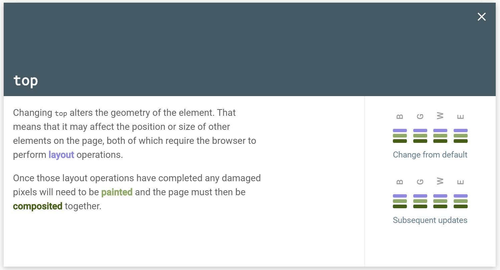
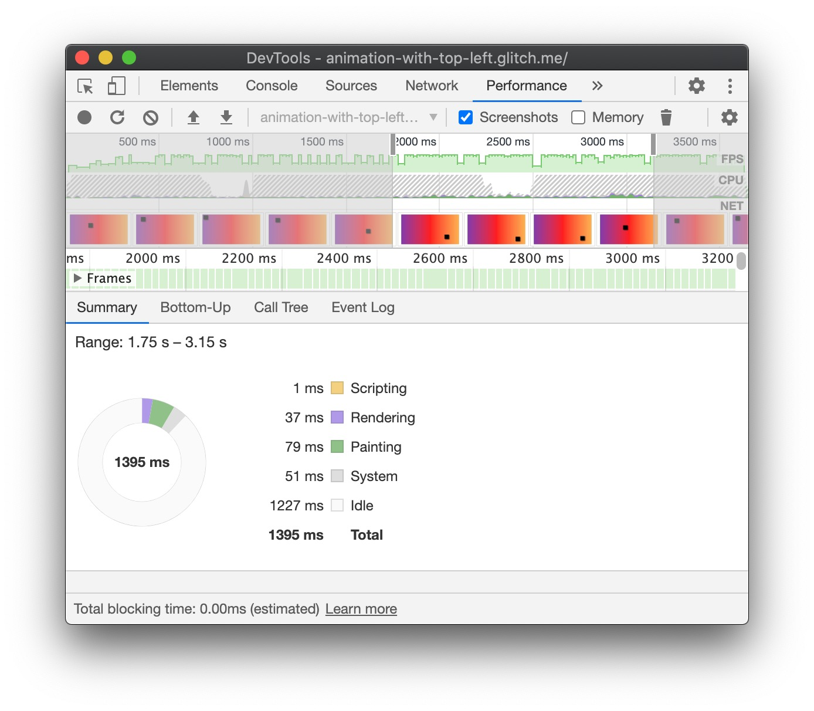
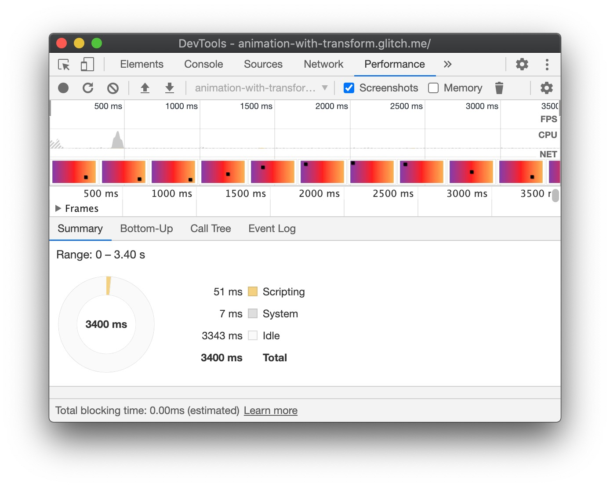
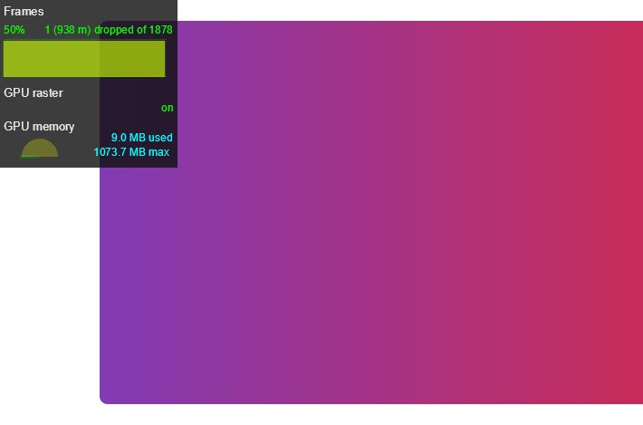

This guide teaches you how to create high-performance CSS animations.

See [Why are some animations slow?](/animations-overview/) to learn the theory behind
these recommendations.

## Browser compatibility

All of the CSS properties that this guide recommends have good cross-browser support.

* [`transform`](https://developer.mozilla.org/en-US/docs/Web/CSS/transform#Browser_compatibility)
* [`opacity`](https://developer.mozilla.org/en-US/docs/Web/CSS/opacity#Browser_compatibility)
* [`will-change`](https://developer.mozilla.org/en-US/docs/Web/CSS/will-change#Browser_compatibility)

## Move an element {: #move }

To move an element, use the `translate` or `rotation` keyword values of the
[`transform`](https://developer.mozilla.org/en-US/docs/Web/CSS/transform) property.

<!-- TODO(kaycebasques): Add more basic examples -->

<!-- TODO(kaycebasques): This before and after comparison is useful, but we need
     to rephrase the intro of this section to explain that we will introduce the
     low-performance way followed by the high-performance way 
     (currently the intro just says "use transform" -->


```css/9-10
.box {
  position: absolute;
  top: 10px;
  left: 10px;
  animation: move 3s ease infinite;
}

@keyframes move {
  50% {
     top: calc(90vh - 160px);
     left: calc(90vw - 200px);
  }
}
```



```css/9
.box {
  position: absolute;
  top: 10px;
  left: 10px;
  animation: move 3s ease infinite;
}

@keyframes move {
  50% {
     transform: translate(calc(90vw - 200px), calc(90vh - 160px));
  }
}
```


## Resize an element {: #resize }

To resize an element, use the `scale` keyword value of the
[`transform`](https://developer.mozilla.org/en-US/docs/Web/CSS/transform) property.

## Change an element's visibility {: #visibility }

To show or hide an element, use [`opacity`](https://developer.mozilla.org/en-US/docs/Web/CSS/opacity).

<!-- TODO(kaycebasques): Add basic examples -->

## Avoid properties that trigger layout or paint {: #triggers }

Before using any CSS property for animation (other than `transform` and `opacity`), go to
[CSS Triggers](https://csstriggers.com/) to determine the property's impact on the
[rendering pipeline](/animations-overview/#pipeline). Avoid any property
that triggers layout or paint unless absolutely necessary. 

<figure class="w-figure">
  
</figure>


  If you must use a property
  that triggers layout or paint, it is unlikely that you will be able to make the animation
  smooth and high-performance.


## Force layer creation {: #force }

As explained in [Why are some animations slow?](/animations-overview),
by placing elements on a new layer they can be repainted without also requiring the rest of the layout to be repainted.

Browsers will often make good decisions about which items should be placed on a new layer,
but you can manually force layer creation with the 
[`will-change`](https://developer.mozilla.org/en-US/docs/Web/CSS/will-change) property.
As the name suggests, this property tells the browser that this element is going to be changed in some way.


As layer creation can cause other performance issues,
this property should not be used as a premature optimization.
Instead, you should only use it when you are seeing jank and think that promoting
the element to a new layer may help.


In CSS this property can be applied to any selector:

```css
body > .sidebar {
  will-change: transform;
}
```

<!-- TODO(kaycebasques): Link to spec -->

However, the specification suggests this approach should only be taken for elements that are always about to change.
If the above example was a sidebar the user could slide in and out, that might be the case.
Some items on your page may not frequently change,
and so it would be better to apply `will-change` using JavaScript
at a point where it becomes likely the change will occur.
You'll need to make sure to give the browser enough time to perform the optimizations needed
and then remove the property once the changing has stopped.


For more information and examples of correct use of `will-change` read
[Everything You Need To Know About The CSS `will-change` Property](https://dev.opera.com/articles/css-will-change-property/).


If you need a way to force layer creation in one of the rare browsers that doesn't support
`will-change` (most likely Internet Explorer at this point),
you can set `transform: translateZ(0)`.

## Debug slow or janky animations {: #debug }

Chrome DevTools and Firefox DevTools have lots of tools to help you figure out why
your animations are slow or janky.

### Check if an animation triggers layout {: #layout }

[Before](https://glitch.com/~animation-with-top-left).

[After](https://glitch.com/~animation-with-transform).

#### Chrome DevTools {: #layout-chrome }

1. Open the **Performance** panel.
1. [Record runtime performance](https://developers.google.com/web/tools/chrome-devtools/evaluate-performance/reference#record-runtime)
   while your animation is happening.
1. Inspect the **Summary** tab.

If you see a nonzero value for **Rendering** in the **Summary** tab, it may mean that your
animation is causing the browser to do layout work.

<figure>
  
  <figcaption>
    The <a href="https://animation-with-top-left.glitch.me/">animation-with-top-left</a>
    example causes rendering work.
  </figcaption>
</figure>

<figure>
  
  <figcaption>
    The <a href="https://animation-with-transform.glitch.me/">animation-with-transform</a>
    example does not cause rendering work.
  </figcaption>
</figure>

<!-- TODO(kaycebasques): Add video -->

#### Firefox DevTools {: #layout-firefox }

<!-- TODO(kaycebasques): Follow the Chrome DevTools model above -->

### Check if an animation is dropping frames {: #fps }

1. Open the [**Rendering** tab][rendering] of Chrome DevTools.
1. Enable the **FPS meter** checkbox.

<!-- TODO(kaycebasques): Need to rephrase how to interpret results
     because the explanation I've provided is not correct -->

At the top of the **FPS meter** UI you see the label **Frames**. Below
that you see a value along the lines of `49% 405 (1292 m) dropped of 3114`.
A high-performance animation will has a high percentage, e.g. `99%`. A
high percentage means that no frames are being dropped.

<figure>
  
  <figcaption>
    The <a href="https://animation-with-top-left.glitch.me/">animation-with-top-left</a>
    example causes 49% of frames to be dropped
  </figcaption>
</figure>

<figure>
  
  <figcaption>
    The <a href="https://animation-with-transform.glitch.me/">animation-with-transform</a>
    example does not cause rendering work.
  </figcaption>
</figure>

### Check if an animation triggers paint {: #paint }

#### Chrome DevTools {: #paint-chrome }

<!-- TODO(kaycebasques): create step-by-step instructions and interpretation along the lines of 
     the layout and fps sections above. -->

DevTools can help you to identify which parts of your page are being repainted.
In Chrome DevTools, open the Rendering Tab and select Paint Flashing.

<figure class="w-figure">
  
</figure>

If you see the whole screen flashing,
or areas that you don't think should change highlighted then you can do some investigation.

When it comes to painting, some things are more expensive than others.
For example, anything that involves a blur (like a shadow, for example) is going to take longer to paint than drawing a red box.
In terms of CSS, however, this isn't always obvious:
`background: red;` and `box-shadow: 0, 4px, 4px, rgba(0,0,0,0.5);`
don't necessarily look like they have vastly different performance characteristics, but they do.

If you need to dig into whether a particular property is causing performance issues due to painting,
the [paint profiler](https://developers.google.com/web/tools/chrome-devtools/evaluate-performance/reference#paint-profiler)
in Chrome DevTools can help.

#### Firefox DevTools {: #paint-firefox }

<!-- TODO(kaycebasques): create step-by-step instructions and interpretation along the lines of 
     the layout and fps sections above. -->

In Firefox DevTools add a Toolbox button for [Paint Flashing](https://developer.mozilla.org/en-US/docs/Tools/Paint_Flashing_Tool).
These tools will highlight areas of the page that will be repainted.

## Conclusion

Where possible restrict animations to `opacity` and `transform`
in order to keep animations on the compositing stage of the rendering path.
Use DevTools to check which stage of the path is being affected by your animations.

Use the paint profiler to see if any paint operations are particularly expensive.
If you find anything,
see if a different CSS property will give the same look and feel with better performance.

Use the `will-change` property sparingly,
and only if you encounter a performance issue.

[rendering]: https://developers.google.com/web/tools/chrome-devtools/evaluate-performance/reference#rendering