It's awesome to build sites that are inclusive and accessible to everyone.
There are at least six key areas of disability you can optimize for:
visual, hearing, mobility, cognition, speech, and neural.
Many tools and resources can help here,
even if you're totally new to web accessibility.

Over one&nbsp;billion people live with some form of disability.
You might have been in a loud room at some point
trying to hear the conversation around you
or in a low-lighting condition trying to find something in the dark.
Do you remember the frustration you felt with that circumstance?
Now imagine if that temporary condition were permanent.
How different would your experience on the web be?

To be accessible, sites need to work across multiple devices
with varying screen-sizes and different kinds of input, such as screen readers.
Moreover, sites should be usable by the broadest group of users,
including those with disabilities.
Here are a sample of just a few disabilities your users may have:

<div class="w-table-wrapper">
  <table>
    <thead>
      <tr>
        <th>Vision</th>
        <th>Hearing</th>
        <th>Mobility</th>
      </tr>
    </thead>
    <tbody>
      <tr>
        <td>
          <ul>
            <li>Low vision</li>
            <li>Blind</li>
            <li>Color blind</li>
            <li>Cataracts</li>
            <li>Sun glare</li>
          </ul>
        </td>
        <td>
          <ul>
            <li>Hard of hearing</li>
            <li>Deaf</li>
            <li>Noise</li>
            <li>Ear infection</li>
          </ul>
        </td>
        <td>
          <ul>
            <li>Spinal cord injury</li>
            <li>Limited dexterity</li>
            <li>Hands full</li>
          </ul>
        </td>
      </tr>
      <tr>
        <th>Cognitive</th>
        <th>Speech</th>
        <th>Neural</th>
      </tr>
      <tr>
        <td>
          <ul>
            <li>Learning disabilities</li>
            <li>Sleepy or distracted</li>
            <li>Migraine</li>
            <li>Autism</li>
            <li>Seizure</li>
          </ul>
        </td>
        <td>
          <ul>
            <li>Ambient noise</li>
            <li>Sore throat</li>
            <li>Speech impediment</li>
            <li>Unable to speak</li>
          </ul>
        </td>
        <td>
          <ul>
            <li>Depression</li>
            <li>PTSD</li>
            <li>Bipolar</li>
            <li>Anxiety</li>
          </ul>
        </td>
      </tr>
    </tbody>
  </table>
</div>

**Visual issues** range from an inability to distinguish colors to no vision at all.

- Ensure a minimum
  [contrast ratio threshold](http://www.w3.org/TR/WCAG20/#visual-audio-contrast-contrast)
  is met for text content.
- Avoid communicating information
  [using solely color](http://www.w3.org/TR/2008/REC-WCAG20-20081211/#visual-audio-contrast-without-color)
  and ensure that all text is
  [resizable](http://www.w3.org/TR/2008/REC-WCAG20-20081211/#visual-audio-contrast-scale).
- Ensure all user interface components can be used with assistive technologies
  such as screen readers, magnifiers and braille displays.
  This entails ensuring that UI components are marked up
  such that accessibility APIs can programmatically determine
  the _role_, _state_, _value_, and _title_ of any element.

**Tip:** Inspect element in Chrome, Edge, and Firefox DevTools
displays a tooltip of CSS properties
that includes a quick check for color contrast ratio.

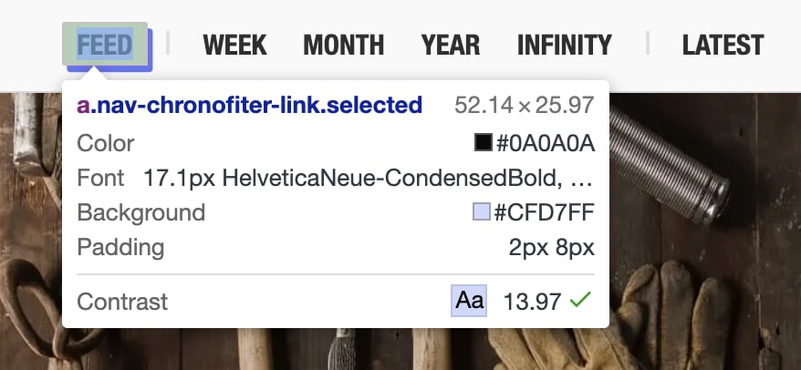

I personally live with low-vision and am embarrassed to say
I'm that person who always zooms in on sites, their DevTools, and terminal.
While supporting zoom is almost never at the top of anyone's list,
optimizing for low-vision users is always appreciated… 🤓

**Hearing issues** mean a user may have issues hearing sound emitted from a page.

- Make the content understandable using
  [text alternatives](http://www.w3.org/TR/WCAG20/#media-equiv-av-only-alt)
  for all content that is not strictly text.
- Ensure you test that your UI components are still functional
  [without sound](http://www.w3.org/TR/2008/REC-WCAG20-20081211/#content-structure-separation-understanding).

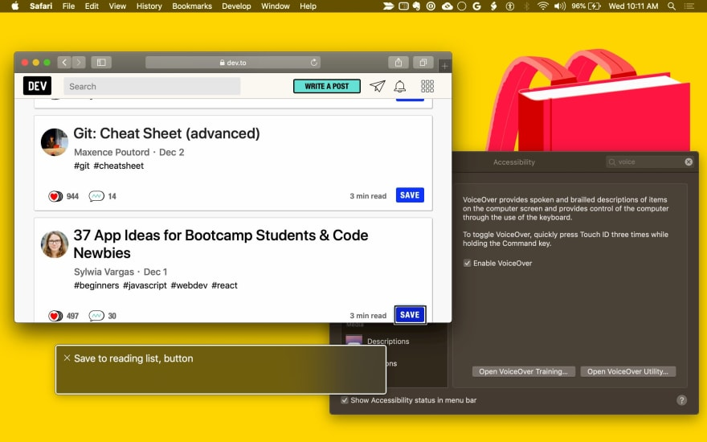

**Mobility issues** can include the inability to operate a mouse, a keyboard or touch-screen.

- Make the content of your UI components [functionally accessible from a keyboard](http://www.w3.org/TR/wai-aria-practices/#keyboard) for any actions one would otherwise use a mouse for.
- Ensure pages are correctly marked up for assistive technologies; these users may use technologies such as voice control software and physical switch controls, which tend to use the same APIs as other assistive technologies like screen readers.

**Cognitive issues** mean a user may require assistive technologies to help them with reading text, so it's important to ensure text alternatives exist.

- Be mindful when using animations. Avoid a visual presentation that is [repetitive](http://www.w3.org/TR/WCAG20/#time-limits) or flashing as this can cause some users [issues](http://www.w3.org/TR/WCAG20/#seizure).

The [`prefers-reduced-motion`](https://developers.google.com/web/updates/2019/03/prefers-reduced-motion#too_much_motion_in_real_life_and_on_the_web)
CSS media query allows you to limit animations and autoplaying videos for users who prefer reduced motion.

```css
/*
If the user expressed a preference for reduced motion, don't use animations on buttons.
*/
@media (prefers-reduced-motion: reduce) {
  button {
    animation: none;
  }
}
```

- Avoid interactions that are timing-based.

This may seem like a lot of bases to cover, but we'll walk through the process for assessing and then improving the accessibility of your UI components.

**Tip:** Some great [accessibility do's and don'ts digital posters](https://accessibility.blog.gov.uk/2016/09/02/dos-and-donts-on-designing-for-accessibility/) are available by the Gov.uk accessibility team for spreading awareness of best practices in your team:

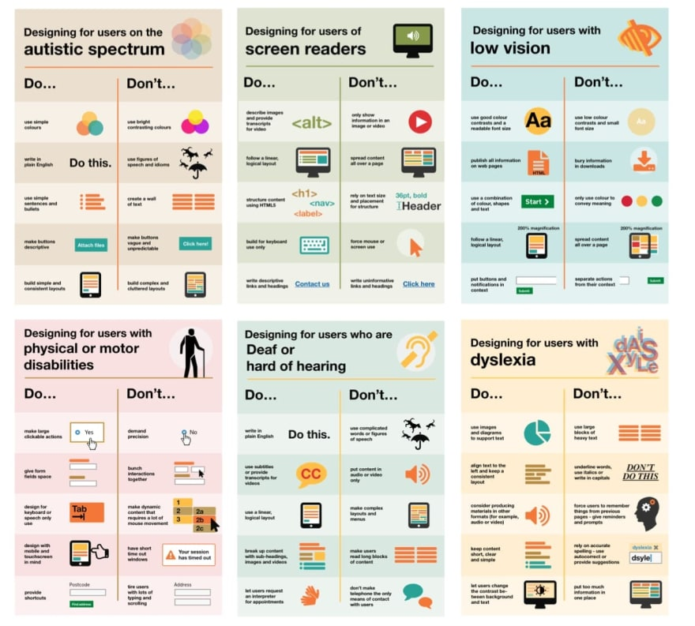

## Are your UI components accessible?

**Summary (tl;dr)**

When auditing your page's UI components for accessibility, ask yourself:

- **Can you use your UI component with the keyboard only?** Does it manage to focus and avoid focus traps? Can it respond to the appropriate keyboard events?
- Can you use your UI component with a screen reader? Have you provided text alternatives for any information which is presented visually? Have you added semantic information using ARIA?
- **Can your UI component work without sound?** Turn off your speakers and go through your use cases.
- **Can it work without color?** Ensure your UI component can be used by someone who cannot see colors. A helpful tool for simulating color blindness is a Chrome extension called [SEE](https://chrome.google.com/webstore/detail/see/dkihcccbkkakkbpikjmpnbamkgbjfdcn), (try all four forms of color blindness simulation available). You may also be interested in the [Daltonize](https://chrome.google.com/webstore/detail/chrome-daltonize/efeladnkafmoofnbagdbfaieabmejfcf) extension which is similarly useful.
- **Can your UI component work with high-contrast mode enabled?** All modern operating systems support a high contrast mode. [High Contrast](https://chrome.google.com/webstore/detail/high-contrast/djcfdncoelnlbldjfhinnjlhdjlikmph?hl=en) is a Chrome extension available that can help here.

Native controls (such as `<button>` and `<select>`) have accessibility built-in by the browser. They are focusable using the tab key, respond to keyboard events (like Enter, space and arrow keys), and have semantic roles, states and properties used by accessibility tools. The default styling should also meet the accessibility requirements listed above.

Custom UI components (with the exception of components that extend native elements like `<button>`) do not have any built-in functionality, including accessibility, so this needs to be provided by you. A good place to start when implementing accessibility is to compare your components to an analogous native element (or a combination of several native elements, depending on how complex your component is).

**Tip:** Most browser DevTools support inspecting the accessibility tree of a page. In Chrome, this is available via the Accessibility tab in the Elements panel.

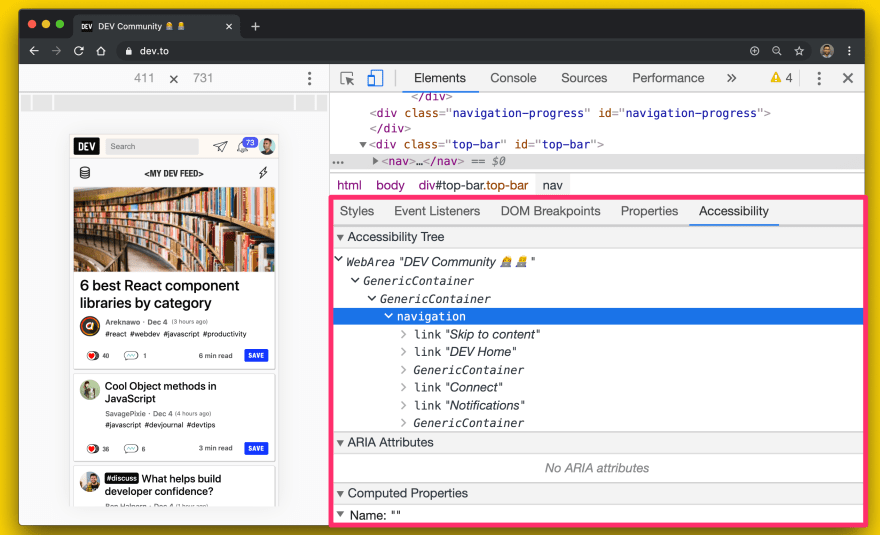

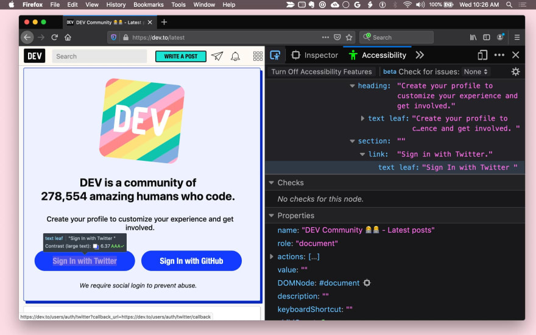

Firefox also has an Accessibility panel, and Safari exposes this information in the Element's panel Node tab.

The following is a list of questions you can ask yourself when attempting to make your UI components more accessible.

## Can your UI component be used with the keyboard alone?

Ideally, ensure that all functionality in your UI component can be reached by a keyboard. During your UX design, think about how you would use your element with the keyboard alone, and figure out a consistent set of keyboard interactions.

Firstly, ensure that you have a sensible focus target for each component. For example, a complex component like a menu may be one focus target within a page, but should then manage focus within itself so that the active menu item always takes focus.

<figure class="w-figure w-figure--center">
  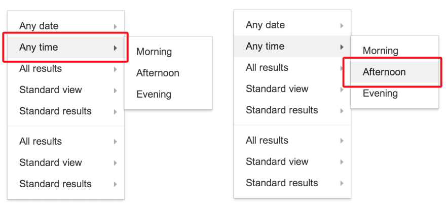
  <figcaption class="w-figcaption">
    Managing focus within a complex element.
  </figcaption>
</figure>

### Using tabindex
The `tabindex` attribute allows elements / UI components to be focused using the keyboard. Keyboard-only and assistive technology users both need to be able to place keyboard focus on elements in order to interact with them. Native interactive elements are implicitly focusable, so they don't need a `tabindex` attribute unless we wish to change their position in the tab order.

**There are three types of `tabindex` values:**

- **`tabindex="0"`** is the most common, and will place the element in the "natural" tab order (defined by the DOM order).

- **a `tabindex` value greater than 0** will place the element in a manual tab order—all elements in the page with a positive tabindex value will be visited in numerical order before elements in the natural tab order.

- **a `tabindex` value equal to -1** will cause the element to be programmatically focusable, but not in the tab order.

For custom UI components, always use `tabindex` values of 0 or -1, as you won't be able to determine the order of elements on a given page ahead of time—and even if we did, they may be subject to change. A `tabindex` value of -1 is particularly useful for managing focus within complex components as described above.

Also ensure that focus is always visible, whether by allowing the default focus ring style, or applying a discernible focus style. Remember not to trap the keyboard user—focus should be able to be moved away from an element using only the keyboard.


You may also be interested in the roving `tabindex` or `aria-activedescendant` approaches,
covered over on [MDN](https://developer.mozilla.org/en-US/docs/Web/Accessibility/Keyboard-navigable_JavaScript_widgets#Technique_1_Roving_tabindex).


### Using autofocus
The HTML autofocus attribute allows an author to specify that a particular element should automatically take focus when the page is loaded. It is already supported on [all web form controls](https://html.spec.whatwg.org/multipage/forms.html#association-of-controls-and-forms), including . To `autofocus` elements in your own custom UI components, call the [`focus()`](https://developer.mozilla.org/en-US/docs/Web/API/HTMLElement.focus) method supported on all HTML elements that can be focused (e.g., `document.querySelector('myButton').focus()`).

### Adding keyboard interaction
Once your UI component is focusable, try to provide a good keyboard interaction story when a component is focused, by handling appropriate keyboard events—for example, allow the user to use arrow keys to select menu options, and space or enter to activate buttons. The ARIA [design patterns guide](http://www.w3.org/TR/wai-aria-practices/#aria_ex) provides some guidance here.

Finally, ensure that your keyboard shortcuts are discoverable. For example, a common practice is to have a keyboard shortcut legend (on-screen text) to inform the user that shortcuts exist. For example, "Press ? for keyboard shortcuts". Alternatively a hint such a tooltip could be used to inform the user about the shortcut existing.

The importance of managing focus cannot be understated. One example is a navigation drawer. If adding a UI component to the page you need to direct focus to an element inside of it otherwise users may have to tab through the entire page to get there. This can be a frustrating experience, so be sure to test focus for all keyboard navigable components in your page.

**Tip:** You can use [Puppeteer](https://github.com/puppeteer/puppeteer) to automate running keyboard accessibility tests for toggling UI states. [WalkMe Engineering](https://medium.com/walkme-engineering/web-accessibility-testing-d499a7f7a032) have a great guide on this I recommend reading.

<figure class="w-figure w-figure--center">
  <video controls autoplay loop muted class="w-screenshot">
    <source src="https://storage.googleapis.com/web-dev-assets/a11y-tips-for-web-dev/aria-expanded.webm" type="video/webm; codecs=vp8">
    <source src="https://storage.googleapis.com/web-dev-assets/a11y-tips-for-web-dev/aria-expanded.mp4" type="video/mp4; codecs=h264">
  </video>
</figure>

```js
// Example for expanding and collapsing a category with the spacebar key
const category = await page.$(`.category`);

// verify tabIndex, role and focus
expect(await page.evaluate(elem => elem.getAttribute(`role`), category)).toEqual(`button`);
expect(await page.evaluate(elem => elem.getAttribute(`tabindex`), category)).toEqual(`0`);
expect(await page.evaluate(elem => window.document.activeElement === elem, category)).toEqual(true);

// verify aria-expanded = false
expect(await page.evaluate(elem => elem.getAttribute(`aria-expanded`), category)).toEqual(`false`);

// toggle category by press space
await page.keyboard.press('Space');

// verify aria-expanded = true
expect(await page.evaluate(elem => elem.getAttribute(`aria-expanded`), category)).toEqual(`true`);
```

## Can you use your UI component with a screen reader?

Around 1–2% of users will be using a screen reader. Can you determine all important information and interact with the component using the screen reader and keyboard alone?

The following questions should help guide you in addressing screen reader accessibility:

### Do all components and images have meaningful text alternatives?

Wherever information about the _name_ or _purpose_ of an interactive component is conveyed visually, an accessible text alternative needs to be provided.

For example, if your `<fancy-menu>` UI component only displays an icon such as a Settings menu icon to indicate that it is a settings menu, it needs an accessible text alternative such as "settings," which conveys the same information. Depending on context, this may use an alt attribute, an aria-label attribute, an aria-labelledby attribute, or plain text in the Shadow DOM. You can find general technical tips in [WebAIM Quick Reference](http://webaim.org/resources/quickref/).

Any UI component which displays an image should provide a mechanism for providing alternative text for that image, analogous to the alt attribute.

### Do your components provide semantic information?

Assistive technology conveys semantic information which is otherwise expressed to sighted users via visual cues such as formatting, cursor style, or position. Native elements have this semantic information built-in by the browser, but for custom components you need to use [ARIA](http://www.w3.org/WAI/PF/aria/) to add this information in.

As a rule of thumb, any component which listens to a mouse click or hover event should not only have some kind of keyboard event listener, but also an ARIA role and potentially ARIA states and attributes.

For example, a custom `<fancy-slider>` UI component might take an ARIA role of slider, which has some related ARIA attributes: aria-valuenow, aria-valuemin and aria-valuemax. By binding these attributes to the relevant properties on your custom component, you can allow users of assistive technology to interact with the element and change its value, and even cause the visual presentation of the element to change accordingly.

<figure class="w-figure w-figure--center">
  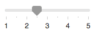
  <figcaption class="w-figcaption">
    A range slider component.
  </figcaption>
</figure>

```html
<fancy-slider role="slider" aria-valuemin="1" aria-valuemax="5" aria-valuenow="2.5"></fancy-slider>
```

### Can users understand everything without relying on color?

Color shouldn't be used as the only means of conveying information, such as indicating a status, prompting for a response or distinguishing a visual custom component. For example, if you created an `<fancy-map>` component using color to distinguish between heavy, moderate and light traffic, an alternative means of distinguishing traffic levels should also be made available: one solution might be to hover over an element to display information in a tooltip.

### Is there sufficient contrast between the text/images and the background?

Any text content displayed in your component should meet the [minimum (AA) contrast bar](http://www.w3.org/TR/2008/REC-WCAG20-20081211/#visual-audio-contrast-contrast). Consider providing a high-contrast theme which meets the [higher (AAA) bar](http://www.w3.org/TR/2008/REC-WCAG20-20081211/#visual-audio-contrast7), and also ensure that user agent style sheets can be applied if users require extreme contrast or different colors. You can use this [Color Contrast Checker](http://webaim.org/resources/contrastchecker/) as an aid when doing design.

### Is the moving or flashing content in your components stoppable and safe?

Content that moves, scrolls or blinks that lasts for anything more than five seconds should be able to be paused, stopped or hidden. In general, try to flash no more than three times per second.

## Accessibility Tooling
A number of tools are available that can assist with debugging the accessibility of your visual components.

- [Axe](http://www.deque.com/products/axe/) provides automated accessibility testing for your framework or browser of choice. [Axe Puppeteer](https://www.deque.com/blog/axe-and-attest-integration-puppeteer/) can be used for writing automated accessibility tests.
- The [Lighthouse](https://developers.google.com/web/tools/lighthouse) Accessibility audits provide helpful insights for discovering common accessibility issues. The accessibility score is a weighted average of all accessibility audits, based on [Axe user impact assessments](https://github.com/dequelabs/axe-core/blob/develop/doc/rule-descriptions.md). For monitoring accessibility via continuous integration, see [Lighthouse CI](https://github.com/GoogleChrome/lighthouse-ci).

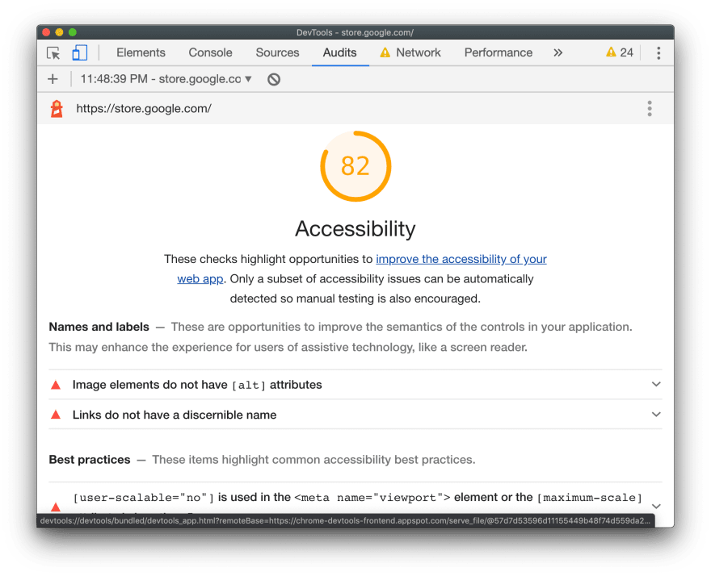

- [Tenon.io](https://tenon.io/) is useful for testing common accessibility problems. Tenon has strong integration support across build tools, browsers (via extensions) and even text editors.
- There are many library and framework specific tools for highlighting accessibility issues with components. For example, [web.dev](https://web.dev/accessibility-auditing-react/) covers using [eslint-plugin-jsx-a11y](https://www.npmjs.com/package/eslint-plugin-jsx-a11y) to highlight accessibility issues for React components in your editor:

  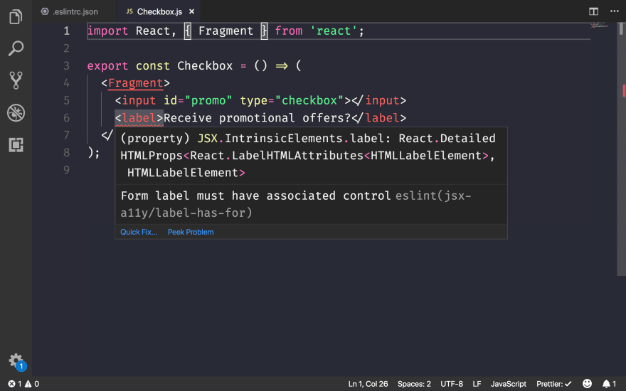

  If you use Angular, [codelyzer](/accessible-angular-with-codelyzer) provides in-editor accessibility audits too:

  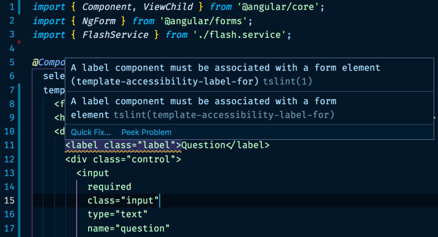

- You can examine the way that assistive technologies see web content by using [Accessibility Inspector](https://developer.apple.com/library/mac/documentation/Accessibility/Conceptual/AccessibilityMacOSX/OSXAXTesting/OSXAXTestingApps.html#//apple_ref/doc/uid/TP40001078-CH210-TPXREF101) (Mac), or [Windows Automation API Testing Tools](http://msdn.microsoft.com/en-us/library/windows/desktop/dd373661(v=vs.85).aspx) and [AccProbe](http://accessibility.linuxfoundation.org/a11yweb/util/accprobe/) (Windows). Additionally you can see the full accessibility tree that Chrome creates by navigating to `chrome://accessibility`.
- The best way to test for screen reader support on a Mac is using the VoiceOver utility. You can use `⌘F5` to enable/disable, `Ctrl+Option ←→` to move through the page and `Ctrl+Shift+Option + ↑↓` to move up/down tree. For more detailed instructions, see the [full list of VoiceOver commands](http://www.apple.com/voiceover/info/guide/_1131.html) and the [list of VoiceOver Web commands](http://www.apple.com/voiceover/info/guide/_1131.html#vo27972).
- [tota11y](http://khan.github.io/tota11y/) is a useful visualizer for assistive technology issues built by Khan Academy. It's a script that adds a button to your document that triggers several plugins for annotating things like insufficient contrast ratio and other a11y violations.
- On Windows, [NVDA](http://www.nvaccess.org/) is a free, open source screen reader which is fully featured and rapidly gaining in popularity. However, note that it has a much steeper learning curve for sighted users than VoiceOver.
- [ChromeLens](http://chromelens.xyz/) helps develop for the visually impaired. It's also got great support for visualizing keyboard navigation paths

  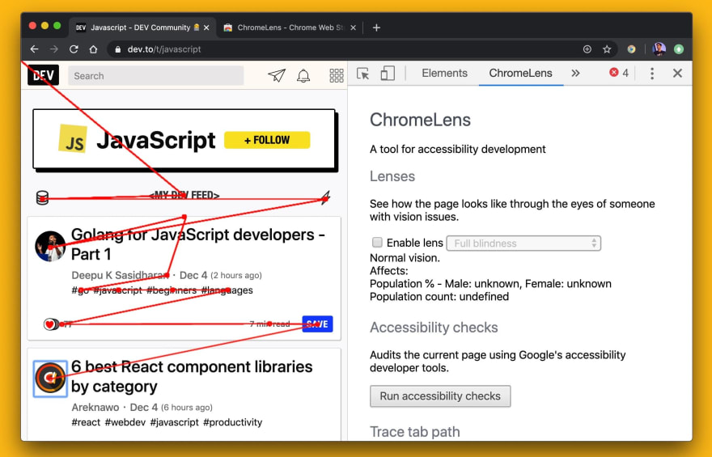

- [ChromeVox](http://www.chromevox.com/) is a screen reader which is available as a Chrome extension, and built in on ChromeOS devices.

## Conclusions

We still have a long way to go improving accessibility on the web. Per the [Web Almanac](https://almanac.httparchive.org/en/2019/accessibility):

- 4 out of every 5 sites have text which easily blends into the background, making it unreadable.
- 49.91% of pages still fail to provide alt attributes for some of their images
- Only 24% of pages that use buttons or links include textual labels with these controls.
- Only 22.33% of pages provide labels for all their form inputs.

To learn more about accessibility fundamentals to help us improve the above, I recommend the [Accessible to all](/accessible/) docs on web.dev. There's much we can do to build experiences that are more inclusive of everyone.

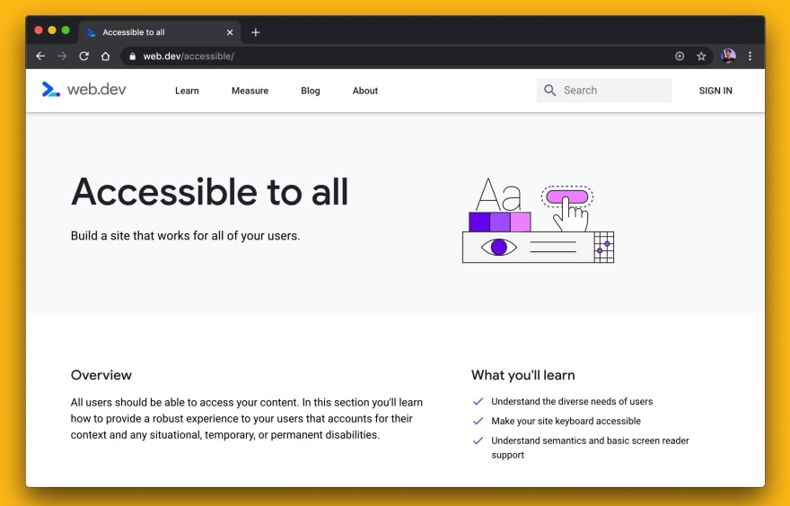
