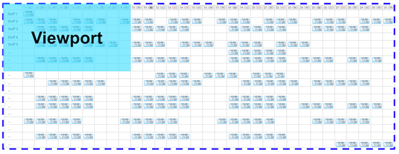
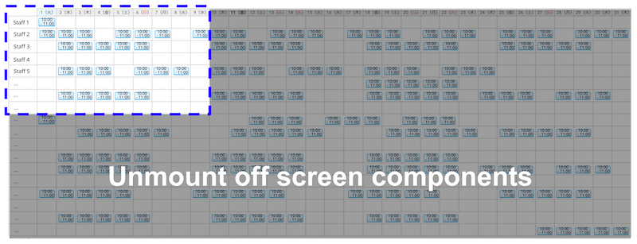
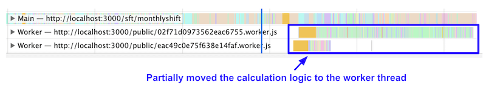

Website performance is not just about load time. It is critical to provide a fast and responsive experience to users, especially for productivity desktop apps which people use everyday. The engineering team at [Recruit Technologies](https://recruit-tech.co.jp/) went through a refactoring project to improve one of their web apps, [AirSHIFT](https://airregi.jp/shift/), for better user input performance. Here's how they did it.

## Slow response, less productivity
AirSHIFT is a desktop web application that helps store owners, like restaurants and cafes, to manage the shift work of their staff members. Built with React, the single page application provides rich client features including various grid tables of shift schedules organized by day, week, month and more.


To meet user expectations they have been adding new functionalities to the app but as they continue to add features, they started seeing more feedback around slow performance. The engineering manager of the product, Yosuke Furukawa says "We did a user research and one of the store owners even said she would leave her seat to brew coffee after clicking a button… just to kill time waiting for the shift table to load, which was a shocking fact we faced". 

After going through the research, the engineering team realized that many of their users were still using low spec computers such as 1 GHz Celeron M laptop from 10 years ago with a tiny amount of memory and having a massive shift table on screen. 

<figure class="w-figure w-figure--fullbleed">
  <video controls autoplay loop muted class="w-screenshot">
    <source src="https://storage.googleapis.com/web-dev-assets/airshift-perf-optimization/endless_spinner_vp9.webm" type="video/webm; codecs=vp8">
    <source src="https://storage.googleapis.com/web-dev-assets/airshift-perf-optimization/endless_spinner_h264.mp4" type="video/mp4; codecs=h264">
  </video>
 <figcaption class="w-figcaption w-figcaption--fullbleed">
    Endless spinner on low end devices
  </figcaption>
</figure>

On the other hand, AifSHIFT had many expensive scripts that ran on the device, which was consuming the majority of the main thread activity, but the engineering team did not realize how harmful it was because they were developing and testing on a rich spec computer with fast WiFi.

<figure class="w-figure w-figure--fullbleed">
  
  <figcaption class="w-figcaption w-figcaption--fullbleed">
    A chart that shows when loading the shift table, around 80% of the load time was consumed by running scripts
  </figcaption>
</figure>

It was now obvious that performance optimization was needed. AirSHIFT formed a task force to tackle this issue and here are 5 things they focused on to make their app more responsive.


## **1. Virtualize large tables**
Displaying the shift table required multiple expensive steps: constructing the virtual DOM and rendering it on screen in proportion to the number of staff members and time slots. For example, if a restaurant had 50 working members and wanted to check their monthly shift schedule, it would be a table of 50 (members) multiplied by 30 (days) which would lead to 1,500 cell components to render. This is a very expensive operation especially for low spec devices. In reality, things get worse. From the research they understood there were shops that need to manage around 200 staff members requiring around 6,000 cell components in the single monthly table.

To reduce the cost of this operation, AirSHIFT virtualized the shift table. This means that it will only mount the components within the viewport and unmount any of the off screen components. 

<figure class="w-figure w-figure--fullbleed">
  
  <figcaption class="w-figcaption w-figcaption--fullbleed">
    Before: rendering all the shift table cells
  </figcaption>
</figure>

<figure class="w-figure w-figure--fullbleed">
  
  <figcaption class="w-figcaption w-figcaption--fullbleed">
    After: only rendering the cells within the viewport
  </figcaption>
</figure>

In this case, AirSHIFT used [react-virtualized](https://github.com/bvaughn/react-virtualized) as there were requirements around enabling complex two dimensional grid table. They are also exploring ways to convert the implementation to use the lightweight [react-window](https://github.com/bvaughn/react-window) in the future.


Related article: [Virtualize large lists with react-window](https://web.dev/virtualize-long-lists-react-window/)


### Results
Virtualizing the table alone reduced scripting time by 6 seconds on a 4x CPU slowdown + Fast 3G throttled Macbook Pro environment which contributed the most in this performance optimization project. 

<figure class="w-figure w-figure--fullbleed">
  
  <figcaption class="w-figcaption w-figcaption--fullbleed">
    Before: around 10 seconds of scripting from user interaction to updating the screen
  </figcaption>
</figure>

<figure class="w-figure w-figure--fullbleed">
  
  <figcaption class="w-figcaption w-figcaption--fullbleed">
    After: 4 seconds to load the screen
  </figcaption>
</figure>


## **2. Audit with User Timing API**
Refactoring scripts that run on user input was the next step AirSHIFT took. In order to check this, [Chrome DevTools](https://developers.google.com/web/tools/chrome-devtools/) provides a powerful feature which captures the JavaScript call stacks in the performance tab a.k.a. main thread Flame Chart. While this [Flame Chart](https://developers.google.com/web/tools/chrome-devtools/evaluate-performance/reference) is useful to see what is actually happening in the main thread, if the application was using some sort of framework it would be better to check the chart based on the framework's lifecycle. 

React 16 provides its performance trace via [User Timing API](https://developer.mozilla.org/en-US/docs/Web/API/User_Timing_API) which developers could access from the DevTool's user timing section. AirSHIFT used this to see if there was any unnecessary logic running in each of the React lifecycle events. By doing this, it was more obvious for them to identify inefficient operations in the DevTool. 

<figure class="w-figure w-figure--fullbleed">
  
  <figcaption class="w-figcaption w-figcaption--fullbleed">
    The React user timing section in DevTools
  </figcaption>
</figure>


Related article: [Profiling Components with the DevTools Profiler](https://reactjs.org/docs/optimizing-performance.html#profiling-components-with-the-chrome-performance-tab)


### Results
As an example, they found that an unnecessary [React Tree Reconciliation](https://reactjs.org/docs/reconciliation.html) was happening right before every route navigation. This means that React would update the shift table unnecessarily immediately before navigation. An unnecessary Redux state update was causing this issue and fixing it saved around 750 ms of scripting time. AirSHIFT made other micro optimizations as well totaling 1 second improvement of scripting time by reducing inefficient scripts.

## **3. Suspense x Web Worker**
AirSHIFT has a built in chat application and many of the store owners communicate with their staff members via the chat while looking at the shift table. Which also means that a user might be typing a message while the table is loading. If the main thread is occupied with scripts that are rendering the table, user input could be janky. 

To improve this experience, AirSHIFT now uses React.lazy and Suspense to show placeholders for table contents while lazily loading the actual components. 


Related article: [Code splitting with React.lazy and Suspense](https://web.dev/code-splitting-suspense/)


They even went further ahead and migrated some of the expensive logic within the lazily loaded components to [Web Workers](https://developer.mozilla.org/en-US/docs/Web/API/Web_Workers_API/Using_web_workers). This was a perfect solution to solve the jank since the component is now asynchronously loaded by having business logic running in the worker thread which frees up the main thread to keep it responsive for user input. 

Typically developers face complexity in using Workers but this time [Comlink](https://github.com/GoogleChromeLabs/comlink) did the heavy lifting for them. Below is the pseudo code of how AirSHIFT workerized  one of the most expensive operations they had: calculating total labor costs.

*In App.js, use React.lazy and Suspense to show fallback content while loading*
```javascript
/** App.js */
import React, { lazy, Suspense } from 'react'
 
// Lazily loading the Cost component with React.lazy
const Hello = lazy(() => import('./Cost'))
 
const Loading = () => (
  <div>Some fallback content to show while loading</div>
)
 
// Showing the fallback content while loading the Cost component by Suspense
export default function App({ userInfo }) {
   return (
    <div>
      <Suspense fallback={<Loading />}>
        <Cost />
      </Suspense>
    </div>
  )
}
```

*In the Cost component, use comlink to execute the calc logic*
```javascript
/** Cost.js */
import React from 'react';
import { proxy } from 'comlink';
 
// import the workerlized calc function with comlink
const WorkerlizedCostCalc = proxy(new Worker('./WorkerlizedCostCalc.js'));
export default function Cost({ userInfo }) {
  // execute the calculation in the worker
  const instance = await new WorkerlizedCostCalc();
  const cost = await instance.calc(userInfo);
  return <p>{cost}</p>;
}
```

*Implement the calculation logic that runs in the worker and expose it with comlink*
```javascript
// WorkerlizedCostCalc.js
import { expose } from 'comlink'
import { someExpensiveCalculation } from './CostCalc.js'
 
// Expose the new workerlized calc function with comlink
expose({
  calc(userInfo) {
    // run existing (expensive) function in the worker
    return someExpensiveCalculation(userInfo);
  }
}, self);
```


Related article: [React + Redux + Comlink = Off-main-thread](https://dassur.ma/things/react-redux-comlink/) by [Surma](https://twitter.com/DasSurma)


### Results
Despite the limited amount of logic they workerlized as a trial, AirSHIFT saw around 100 ms of their JavaScript running on the worker thread instead of occupying the main thread (simulated with 4x CPU throttling). 



They are currently seeking if they could adopt this combination of Suspense x Web Worker even more to other existing components to remove all the janks in the application.


## **4. Setting a performance budget**
Having implemented all of these optimizations, it was critical to "keep" the application responsive. AirSHIFT now uses [bundlesize](https://github.com/siddharthkp/bundlesize) to not exceed the current JavaScript and CSS file size. Aside from setting these basic budgets, they built a dashboard to show various percentiles of the shift table loading time to check whether the application is performant even in non-ideal conditions.

- AirSHIFT now measures the script completion time for every Redux event
- Uses [Elasticsearch](https://www.elastic.co/jp/) to collect those performance data
- Visualize the data with [Kibana](https://www.elastic.co/jp/products/kibana). The dashboard will show the 10th, 25th, 50th and 75th percentile performance of each event

AirSHIFT is now monitoring the shift table loading event to complete in 3 seconds for the 75th percentile users. This is an unforced budget for now but considering auto notification via Elasticsearch when exceeding the budget.

<figure class="w-figure w-figure--fullbleed">
  
  <figcaption class="w-figcaption w-figcaption--fullbleed">
    The Kibana dashboard showing daily performance data by percentiles
  </figcaption>
</figure>


Related article: [Performance budgets 101](https://web.dev/performance-budgets-101)


### Results
From the graph above, you can tell that AirSHIFT is now mostly hitting the 3 seconds budget for 75th percentile users and also loading the shift table within a second for 25th percentile users. By capturing RUM performance data from various conditions and devices, AirSHIFT can now check whether a new feature release is actually affecting the application's performance or not.

## **5. Performance hackathons**
While all of these efforts regarding the performance optimization is important, it is not always easy to prioritize teams, both engineering and business, to focus on these non-functional development. Rather than dealing with this with a well-planned waterfall approach, some of the optimizations require more agility having try-and-error mindset.

AirSHIFT is now conducting internal 1 day performance hackathons letting the engineers focus only on performance related works. In this hackathon they remove all the existing constraints and respect the participants' creativity, meaning any implementation that contributes to speed, is worth considering. To accelerate the hack, they split the group into small teams and compete by how much they were able to improve the [Lighthouse](https://developers.google.com/web/tools/lighthouse) performance score (which every team would be very competitive 🔥).



Related article: [Learn how to optimize speed with web.dev/fast](https://web.dev/fast)


### Results
The hackathon approach is working well for them.

- Performance bottleneck can be easily detected by actually trying out multiple approaches during the hackathon and measuring each one of them with Lighthouse.
- After the hackathon, it's rather easy to convince the team which optimization they should be prioritizing for production release.
- It's also an effective way of advocating the importance of speed. Every participant can understand the correlation between how you code and how it results in performance.

A good side effect was that many other engineering teams within Recruit got interested in this hands-on approach and the AirSHIFT team is now facilitating multiple speed hackathons within the company.


## Summary
It was definitely not the easiest journey for AirSHIFT to work on these optimizations but it certainly paid off. Now AirSHIFT is loading the shift table within 1.5 sec in median which is a 6x improvement from the very beginning of the project.

<figure class="w-figure w-figure--fullbleed">
  <video controls autoplay loop muted class="w-screenshot">
    <source src="https://storage.googleapis.com/web-dev-assets/airshift-perf-optimization/compare_speed_vp9.webm" type="video/webm; codecs=vp8">
    <source src="https://storage.googleapis.com/web-dev-assets/airshift-perf-optimization/compare_speed_h264.mp4" type="video/mp4; codecs=h264">
  </video>
</figure>

"Thank you so much for making the shift table load fast. It is now way more efficient to arrange the shift work than ever." is a quote from one of the store owners after the optimization. The engineering team is satisfied with the result and promises to make AirSHIFT even more performant. 
