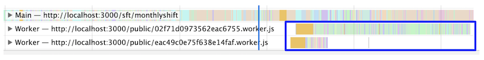

Website performance is not just about load time. It is critical to provide a fast and responsive experience to users, especially for productivity desktop apps which people use everyday. The engineering team at [Recruit Technologies](https://recruit-tech.co.jp/) went through a refactoring project to improve one of their web apps, [AirSHIFT](https://airregi.jp/shift/), for better user input performance. Here's how they did it.

## Slow response, less productivity
AirSHIFT is a desktop web application that helps store owners, like restaurants and cafes, to manage the shift work of their staff members. Built with React, the single page application provides rich client features including various grid tables of shift schedules organized by day, week, month and more.


As the Recruit Technologies engineering team added new features to the
AirSHIFT app, they started seeing more feedback around slow performance.
The engineering manager of AirSHIFT said, Yosuke Furukawa, said:

<blockquote>
  In a user research study, we were shocked when one of the store owners said she
  would leave her seat to brew coffee after clicking a button, just to kill time waiting
  for the shift table to load.
</blockquote> 

After going through the research, the engineering team realized that many of their users were trying to load massive shift tables on low spec computers, such as a 1 GHz Celeron M laptop from 10 years ago.

<figure class="w-figure w-figure--fullbleed">
  <video controls autoplay loop muted class="w-screenshot">
    <source src="https://storage.googleapis.com/web-dev-assets/airshift-perf-optimization/endless_spinner_vp9.webm" type="video/webm; codecs=vp8">
    <source src="https://storage.googleapis.com/web-dev-assets/airshift-perf-optimization/endless_spinner_h264.mp4" type="video/mp4; codecs=h264">
  </video>
 <figcaption class="w-figcaption w-figcaption--fullbleed">
    Endless spinner on low end devices
  </figcaption>
</figure>

The AirSHIFT app was blocking the main thread with expensive scripts,
but the engineering team didn't realize how expensive the scripts were because they
were developing and testing on rich spec computers with fast Wi-Fi connections.

<figure class="w-figure w-figure--fullbleed">
  
  <figcaption class="w-figcaption w-figcaption--fullbleed">
    A chart that shows when loading the shift table, around 80% of the load time was consumed by running scripts
  </figcaption>
</figure>

It was now obvious that performance optimization was needed. 
AirSHIFT formed a task force to tackle this issue. Here are 5 things
they focused on to make their app more responsive to user input.


## 1. Virtualize large tables
Displaying the shift table required multiple expensive steps: constructing the virtual DOM and rendering it on screen in proportion to the number of staff members and time slots. For example, if a restaurant had 50 working members and wanted to check their monthly shift schedule, it would be a table of 50 (members) multiplied by 30 (days) which would lead to 1,500 cell components to render. This is a very expensive operation, especially for low spec devices. In reality, things were worse. From the research they learned there were shops managing 200 staff members, requiring around 6,000 cell components in a single monthly table.

To reduce the cost of this operation, AirSHIFT virtualized the shift table. The app now only mounts the components within the viewport and unmounts the off-screen components. 

<figure class="w-figure w-figure--fullbleed">
  
  <figcaption class="w-figcaption w-figcaption--fullbleed">
    Before: rendering all the shift table cells
  </figcaption>
</figure>

<figure class="w-figure w-figure--fullbleed">
  
  <figcaption class="w-figcaption w-figcaption--fullbleed">
    After: only rendering the cells within the viewport
  </figcaption>
</figure>

In this case, AirSHIFT used [react-virtualized](https://github.com/bvaughn/react-virtualized) as there were requirements around enabling complex two dimensional grid tables. They are also exploring ways to convert the implementation to use the lightweight [react-window](/virtualize-long-lists-react-window/) in the future.

### Results
Virtualizing the table alone reduced scripting time by 6 seconds (on a 4x CPU slowdown + Fast 3G throttled Macbook Pro environment). This was the most impactful performance improvement in the refactoring project.

<figure class="w-figure w-figure--fullbleed">
  
  <figcaption class="w-figcaption w-figcaption--fullbleed">
    Before: Around 10 seconds of scripting from user interaction to updating the screen
  </figcaption>
</figure>

<figure class="w-figure w-figure--fullbleed">
  
  <figcaption class="w-figcaption w-figcaption--fullbleed">
    After: 4 seconds of scripting from user interaction to updating the screen
  </figcaption>
</figure>


## 2. Audit with User Timing API
Next, the AirSHIFT team refactored the scripts that run on user input.
The [flame chart](https://developers.google.com/web/tools/chrome-devtools/evaluate-performance/reference#main)
of [Chrome DevTools](https://developers.google.com/web/tools/chrome-devtools/)
makes it possible to analyze what's actually happening in the main thread.
But the AirSHIFT team found it easier to analyze application activity based
on React's lifecycle.

React 16 provides its performance trace via the 
[User Timing API](https://developer.mozilla.org/en-US/docs/Web/API/User_Timing_API)
which developers can visualize from the
[Timings section](https://developers.google.com/web/updates/2018/04/devtools#tabs)
of Chrome DevTools. AirSHIFT used the Timings section to find
unnecessary logic running in the React lifecycle events.

<figure class="w-figure w-figure--fullbleed">
  
  <figcaption class="w-figcaption w-figcaption--fullbleed">
    The React user timing section in DevTools
  </figcaption>
</figure>


Related article: [Profiling Components with the Chrome Performance Tab](https://reactjs.org/docs/optimizing-performance.html#profiling-components-with-the-chrome-performance-tab)


### Results
The AirSHIFT team discovered that an unnecessary 
[React Tree Reconciliation](https://reactjs.org/docs/reconciliation.html)
was happening right before every route navigation. This meant that
React was updating the shift table unnecessarily before navigations.
An unnecessary Redux state update was causing this issue.
Fixing it saved around 750 ms of scripting time. AirSHIFT
made other micro optimizations as well which eventually led to
a 1 second total reduction in scripting time.

## 3. Lazy load components and move expensive logic to web workers
AirSHIFT has a built in chat application and many of the store owners communicate with their staff members via the chat while looking at the shift table. Which also means that a user might be typing a message while the table is loading. If the main thread is occupied with scripts that are rendering the table, user input could be janky. 

To improve this experience, AirSHIFT now uses [React.lazy and Suspense](https://web.dev/code-splitting-suspense/) to show placeholders for table contents while lazily loading the actual components. 


Related article: [Code splitting with React.lazy and Suspense](https://web.dev/code-splitting-suspense/)


The AirSHIFT team also migrated some of the expensive business logic
within the lazily loaded components to
[web workers](https://developer.mozilla.org/en-US/docs/Web/API/Web_Workers_API/Using_web_workers).
This solved the user input jank problem by freeing up the main thread
so that it could focus on responding to user input.

Typically developers face complexity in using workers but this time [Comlink](https://github.com/GoogleChromeLabs/comlink) did the heavy lifting for them. Below is the pseudo code of how AirSHIFT workerized one of the most expensive operations they had: calculating total labor costs.

*In App.js, use React.lazy and Suspense to show fallback content while loading*
```javascript
/** App.js */
import React, { lazy, Suspense } from 'react'
 
// Lazily loading the Cost component with React.lazy
const Hello = lazy(() => import('./Cost'))
 
const Loading = () => (
  <div>Some fallback content to show while loading</div>
)
 
// Showing the fallback content while loading the Cost component by Suspense
export default function App({ userInfo }) {
   return (
    <div>
      <Suspense fallback={<Loading />}>
        <Cost />
      </Suspense>
    </div>
  )
}
```

*In the Cost component, use comlink to execute the calc logic*
```javascript
/** Cost.js */
import React from 'react';
import { proxy } from 'comlink';
 
// import the workerlized calc function with comlink
const WorkerlizedCostCalc = proxy(new Worker('./WorkerlizedCostCalc.js'));
export default function Cost({ userInfo }) {
  // execute the calculation in the worker
  const instance = await new WorkerlizedCostCalc();
  const cost = await instance.calc(userInfo);
  return <p>{cost}</p>;
}
```

*Implement the calculation logic that runs in the worker and expose it with comlink*
```javascript
// WorkerlizedCostCalc.js
import { expose } from 'comlink'
import { someExpensiveCalculation } from './CostCalc.js'
 
// Expose the new workerlized calc function with comlink
expose({
  calc(userInfo) {
    // run existing (expensive) function in the worker
    return someExpensiveCalculation(userInfo);
  }
}, self);
```


Related article: [React + Redux + Comlink = Off-main-thread](https://dassur.ma/things/react-redux-comlink/) by [Surma](https://twitter.com/DasSurma)


### Results
Despite the limited amount of logic they workerlized as a trial, AirSHIFT saw around 100 ms of their JavaScript running on the worker thread instead of occupying the main thread (simulated with 4x CPU throttling). 



They are currently seeking if they could adopt this combination of Suspense x Web Worker even more to other existing components to remove all the janks in the application.


## **4. Setting a performance budget**
Having implemented all of these optimizations, it was critical to "keep" the application responsive. AirSHIFT now uses [bundlesize](https://github.com/siddharthkp/bundlesize) to not exceed the current JavaScript and CSS file size. Aside from setting these basic budgets, they built a dashboard to show various percentiles of the shift table loading time to check whether the application is performant even in non-ideal conditions.

- AirSHIFT now measures the script completion time for every Redux event
- Uses [Elasticsearch](https://www.elastic.co/jp/) to collect those performance data
- Visualize the data with [Kibana](https://www.elastic.co/jp/products/kibana). The dashboard will show the 10th, 25th, 50th and 75th percentile performance of each event

AirSHIFT is now monitoring the shift table loading event to make sure it completes in 3 seconds for the 75th percentile users. This is an unforced budget for now but they are considering auto-notifications via Elasticsearch when they exceed their budget.

<figure class="w-figure w-figure--fullbleed">
  
  <figcaption class="w-figcaption w-figcaption--fullbleed">
    The Kibana dashboard showing daily performance data by percentiles
  </figcaption>
</figure>


Related article: [Performance budgets 101](https://web.dev/performance-budgets-101)


### Results
From the graph above, you can tell that AirSHIFT is now mostly hitting the 3 seconds budget for 75th percentile users and also loading the shift table within a second for 25th percentile users. By capturing RUM performance data from various conditions and devices, AirSHIFT can now check whether a new feature release is actually affecting the application's performance or not.

## 5. Performance hackathons
Even though all of these performance optimization efforts were important and impactful,
it's not always easy to get engineering and business teams to prioritize non-functional
development. Part of the challenge is that some of these performance optimizations
can't be planned. They require a trial-and-error mindset.

AirSHIFT is now conducting internal 1 day performance hackathons to let engineers focus only on performance related work. In these hackathons they remove all constraints and respect the engineers' creativity, meaning any implementation that contributes to speed is worth considering. To accelerate the hackathon, AirSHIFT splits the group into small teams and each team competes to see who can get the biggest [Lighthouse](https://developers.google.com/web/tools/lighthouse) performance score improvement.
(The teams get very competitive 🔥)



Related article: [Learn how to optimize speed with web.dev/fast](https://web.dev/fast)


### Results
The hackathon approach is working well for them.

- Performance bottleneck can be easily detected by actually trying out multiple approaches during the hackathon and measuring each one of them with Lighthouse.
- After the hackathon, it's rather easy to convince the team which optimization they should be prioritizing for production release.
- It's also an effective way of advocating the importance of speed. Every participant can understand the correlation between how you code and how it results in performance.

A good side effect was that many other engineering teams within Recruit got interested in this hands-on approach and the AirSHIFT team is now facilitating multiple speed hackathons within the company.


## Summary
It was definitely not the easiest journey for AirSHIFT to work on these optimizations but it certainly paid off. Now AirSHIFT is loading the shift table within 1.5 sec in median which is a 6x improvement from the very beginning of the project.

<figure class="w-figure w-figure--fullbleed">
  <video controls autoplay loop muted class="w-screenshot">
    <source src="https://storage.googleapis.com/web-dev-assets/airshift-perf-optimization/compare_speed_vp9.webm" type="video/webm; codecs=vp8">
    <source src="https://storage.googleapis.com/web-dev-assets/airshift-perf-optimization/compare_speed_h264.mp4" type="video/mp4; codecs=h264">
  </video>
</figure>

After the performance optimizations launched, one user said:

<blockquote>
  Thank you so much for making the shift table load fast.
  Arranging the shift work is so much more efficient now.
</blockquote>
