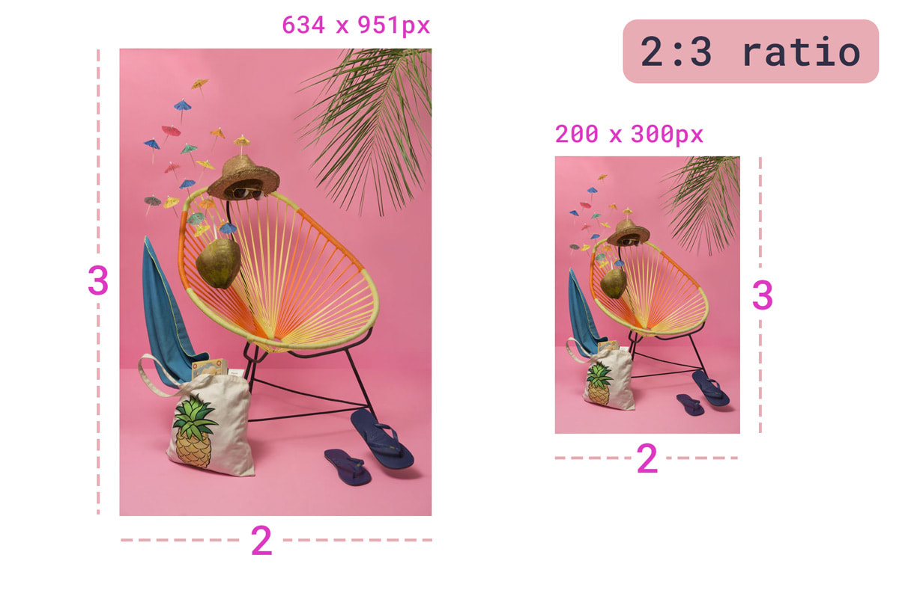
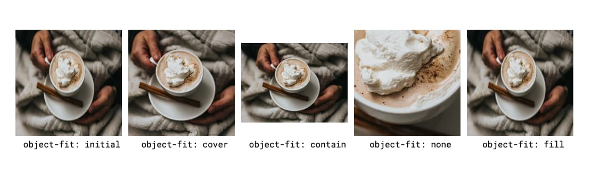
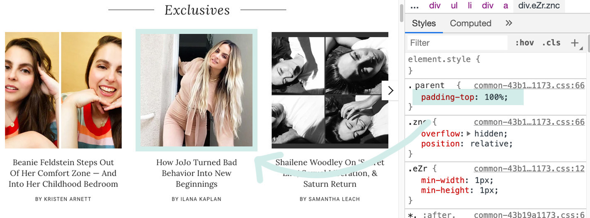
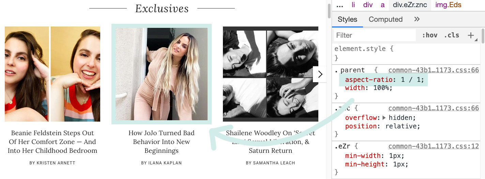
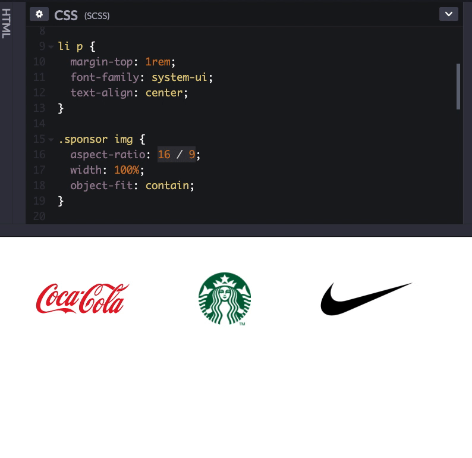

---
title: 'Maintaining Aspect Ratio in CSS' subhead: The new aspect-ratio property
can help with responsive dimension-based imaged. authors:
  - una date: 2021-01-12 hero: hero.jpg alt: Image of colorful telephones
    resized with the same aspect ratio. description: There are several ways to
    maintain aspect ratio and image dimensions on the web. This post goes over
    two ways—one popular hack, and one new CSS property. tags:
  - blog
  - css
    ---

When resizing some media, in many cases, a design calls to maintain this ratio
and ensure the image resizes in an even distribution. This width-to-height ratio
is called the *aspect-ratio*.

Aspect ratio is most commonly expressed as two integers and a colon in the
dimensions of: width:height, or x:y. The most common aspect ratios for
photography are 4:3 and 3:2, while video, and more recent consumer cameras, tend
to have a 16:9 aspect ratio.


<figure class="w-figure">
  
  <figcaption class="w-figcaption">
    Two images with the same aspect ratio. One is 634 x 951px while the other is 200 x 300px. Both have a 2:3 aspect ratio.
  </figcaption>
</figure>

## Why maintain aspect ratio

With the advent of responsive design, maintaining aspect ratio has been
increasingly important for web developers, especially as image dimensions
differ. At times, it is difficult to maintain consistent layout sizing and place
media like [video](http://fitvidsjs.com/) and background images within a parent
block.

## Object-fit

One way to fit a media object into a parent is using the `object-fit` property,
which enables users describe how content within a block should fill that block:

<figure class="w-figure">
  
  <figcaption class="w-figcaption">
    Showcasing various <code>object-fit</code> values. See <a href="https://codepen.io/una/pen/mdrLGjR">demo on Codepen</a>.
  </figcaption>
</figure>

The `initial` and fill value will re-adjust the image to fill the space. In our
example, this causes the image to be squished and blurry, as it re-adjusts
pixels. This is not ideal. `object-fit: cover` uses the image’s smallest
dimension to fill the space and crops the image to fit into it based on this
dimension. It “zooms in at its lowest boundary. `object-fit: contain` will
ensure that the entire image is always visible, and so the opposite of `cover`:
where it takes the largest boundary (in our example above this is width), and
resize the image to maintain its intrinsic aspect-ratio while fitting into the
space. The `object-fit: none` case shows the image cropped in it’s center
(default object position) at its natural size.

`object-fit: cover` tends to work in most situations to ensure a nice uniform
interface when dealing with images of varying dimensions, however, you lose data
this way (the image is cropped at its longest edges). 

If these details are important (for example, when working with a flat lay of
beauty products), cropping important content is not acceptable. So the ideal
scenario would be responsive images of varying sizes that fit the UI space
without cropping.

## Maintaining aspect ratio with `padding-top`

<figure class="w-figure">
  
  <figcaption class="w-figcaption">
    Using `padding-top` to set a 1:1 aspect ratio on post preview images within a carousel.
  </figcaption>
</figure>

In order to make these more responsive, we can use aspect-ratio. This allows for
us to set a specific ratio size and base the rest of the media on an individual
axis (height or width).

A currently well-accepted cross-browser solution for maintaining aspect ratio
based on an image’s width is known as the “Padding-Top Hack". This solution
requires a parent container and an absolutely placed child container. One would
then calculate the aspect ratio as a percentage to set as the `padding-top`. For
example:

1:1 aspect ratio = 1 / 1 = 1 = `padding-top: 100%` 4:3 aspect ratio = 3 / 4 =
0.75 = `padding-top: 75%` 3:2 aspect ratio = 2 / 3 = 0.66666 = `padding-top:
66.67%` 16:9 aspect ratio = 9 / 16 = 0.5625 = `padding-top: 56.25%`

Now that we have identified the aspect ratio value, we can apply that to our
parent container. Consider the following example:

```html
<div class="container">
  
</div>
```

We could then write the following CSS:

```css
.container {
  position: relative;
  width: 100%;
  padding-top: 56.25%; /* 16:9 Aspect Ratio */
}

.media {
  position: absolute;
  top: 0;
}
```

## Maintaining aspect ratio with `aspect-ratio`

<figure class="w-figure">
  
  <figcaption class="w-figcaption">
    Using `aspect-ratio` to set a 1:1 aspect ratio on post preview images within a carousel.
  </figcaption>
</figure>

Unfortunately, calculating these `padding-top` values is not very intuitive, and
requires some additional overhead and positioning. With the new intrinsic
`aspect-ratio` [CSS property](https://www.w3.org/TR/css-sizing-4/#aspect-ratio),
coming to Chromium 88, Safari Technical Preview 118, and Firefox __, the
language for maintaining aspect ratios is much more clear.

With the same markup, we can replace: `padding-top: 56.25%` with `aspect-ratio:
16 / 9`, setting `aspect-ratio` to a specified ratio of `width` / `height`.

<div class="w-columns">

```css
.container {
  width: 100%;
  padding-top: 56.25%;
}
```



```css
.container {
  width: 100%;
  aspect-ratio: 16 / 9;
}
```

</div>

Using `aspect-ratio` instead of `padding-top` is much more clear, and does not
overhaul the padding property to do something outside of its usual scope.

Now, not only is the aspect ratio much more clear, but this new property also
adds the ability to set aspect ratio to `auto`, where “replaced elements with an
intrinsic aspect ratio use that aspect ratio; otherwise the box has no preferred
aspect ratio." If both `auto` and a `<ratio>` are specified together, the
preferred aspect ratio is the specified ratio of `width` / `height` unless it is
a replaced element with an intrinsic aspect ratio, in which case that aspect
ratio is used instead.

This works really well with CSS layout mechanisms like CSS Grid and Flexbox as
well. Consider a list with children that you want to maintain a 1:1 aspect
ratio, such as a grid of sponsor icons:

```html
<ul class="sponsor-grid">
  <li class="sponsor">…
  <li class="sponsor">…
</ul>
```

```css
.sponsor-grid {
  display: grid;
  grid-template-columns: repeat(auto-fill, minmax(120px, 1fr));
}

.sponsor img {
  aspect-ratio: 1/1;
  width: 100%;
  object-fit: contain;
}
```

<figure class="w-figure">
  
  <figcaption class="w-figcaption">
    [Demo](https://codepen.io/una/pen/e89deff424a107349a0f1e30908cddbf?editors=0110) _TODO: make public_ and make this a hosted video
  </figcaption>
</figure>


## Conclusion

With the new `aspect-ratio` CSS property, launching in Chromium and Firefox,
maintaining proper aspect ratios in your media gets a little bit more
straightforward. 


Photos by [Amy Shamblen](https://unsplash.com/photos/TXg_38oImi0) and [Lionel
Gustave](https://unsplash.com/photos/c1rOy44wuts) via Unsplash.