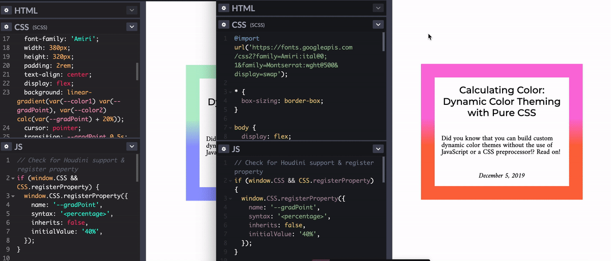
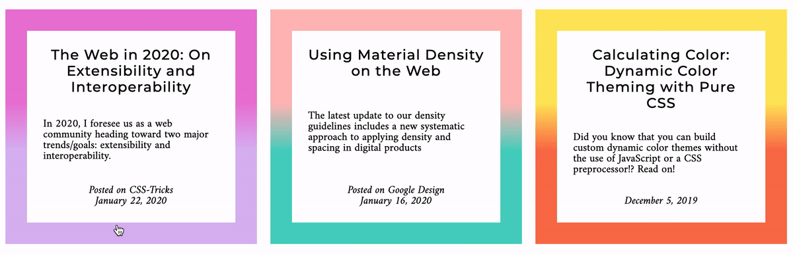

[CSS Houdini](https://ishoudinireadyyet.com) is an umbrella term that covers a set of low-level APIs which expose parts of the CSS rendering engine, and give developers much more available access to the CSS Object Model. This is a huge change for the CSS ecosystem, as it enables developers to tell the browser how to read and parse custom CSS without waiting for browser vendors to natively implement these features. So exciting!

One of the most exciting additions to CSS within the Houdini umbrella is the [Properties and Values API](https://developer.mozilla.org/en-US/docs/Web/API/CSS_Properties_and_Values_API). This API supercharges your CSS custom properties (also commonly referred to as CSS variables) by giving them semantic meaning (tied to a syntax) and even fallback values, enabling CSS testing.

## Writing Houdini Custom Properties

Here's an example of setting a custom property (think: CSS variable), but now with a syntax (type), initial value (fallback), and inheritance statement (does it inherit the value from it's parent or not?). The current way to do this is through `CSS.RegisterProperty` in JavaScript, but in Chromium 85+, the `@property` syntax will be supported in your CSS files:

<div class="w-columns">

```js
CSS.registerProperty({
  name: '--colorPrimary',
  syntax: '<color>',
  initialValue: 'magenta',
  inherits: false
});
```



```css
@property --colorPrimary {
  syntax: '<color>';
  initial-value: magenta;
  inherits: false;
}
```

</div>

Now you can access `--colorPrimary` like any other CSS custom property, via `var(--colorPrimary)`. However, the difference here is that `colorPrimary` isn't just read as a string. It has data!


  When writing a registered custom property with a specified `syntax`, you *must* also include an `initial-value`.


## Fallback Values

As with any other custom property, you can get (using var) or set (write/rewrite) values, but with Houdini custom properties, if you set a falsey value when overriding it, the CSS rendering engine will send the initial value (it's fallback value) instead of ignoring the line.

```css
.card {
  background-color: var(--colorPrimary); /* magenta */
}

.highlight-card {
  --colorPrimary: yellow;
  background-color: var(--colorPrimary); /* yellow */
}

.another-card {
  --colorPrimary: 23;
  background-color: var(--colorPrimary); /* magenta */
}
```

For example, if a developer enters an invalid value (i.e. "23")  for a custom property that has a set syntax (i.e. "color"), the predefined fallback still returns instead of the CSS parser ignoring the invalid code. This allows for some true fallbacks and testing within CSS. Neat!

## Syntax

With the syntax feature, you can now write semantic CSS (CSS which has a "type" attached to it). The current types that are allowed include:

- `length`
- `number`
- `percentage`
- `length-percentage`
- `color`
- `image`
- `url`
- `integer`
- `angle`
- `time`
- `resolution`
- `transform-list`
- `transform-function`
- `custom-ident` (a custom identifier string)


Setting a syntax allows for the custom properties we initialize to be interpreted as more than just strings by the browser, enabling them to be parsed as typed values. This has a lot of great benefits.

Let's take a look at animating a gradient to illustrate this point. Currently, there is no way to smoothly animate (or interpolate) between gradient values, as each gradient declaration is parsed as a string. 

<figure class="w-figure w-figure--fullbleed">
  
  <figcaption class="w-figcaption w-figcaption--fullbleed">
    Using a custom property with a "number" syntax, the gradient on the left shows a smooth transition between stop values. The gradient on the right uses a default custom property (no syntax defined) and shows an abrupt transition.
  </figcaption>
</figure>

In this example, the gradient stop percentage is being animated from a starting value of 40% to an ending value of 100% via a hover interaction. We expect a smooth transition of that top gradient color downward.

The browser on the right supports the Houdini Properties and Values API, enabling a smooth gradient stop transition, and the on the right does not. The non-supporting browser is only able to understand this change as a string going from point A to point B. There is no opportunity to interpolate the values, and thus you don't see that smooth transition.

However, if you declare syntax type when writing custom properties, and then use those custom properties to enable the animation, you'll see the transition. You can instantiate the custom property `--gradPoint` like so:

```css
/* Check for Houdini support & register property */
@supports (background: paint(something)) {
  @property --gradPoint {
    syntax: '<percentage>';
    inherits: false;
    initial-value: 40%;
  }
}
```

And then when it comes time to animate it, you can update the value from the initial `40%` to `100%`:

```css
@supports (background: paint(something)) {
  .post:hover,
  .post:focus {
    --gradPoint: 100%;
  }
}
```

This will now enable that smooth gradient transition.

<figure class="w-figure w-figure--fullbleed">
  
  <figcaption class="w-figcaption w-figcaption--fullbleed">
    Smoothly transitioning gradient borders. <a href="https://glitch.com/~houdini-gradient-borders">See Demo on Glitch</a>
  </figcaption>
</figure>

## Conclusion 

The `@property` syntax makes an exciting technology even more accessible by allowing us to write semantically meaningful CSS within CSS itself. To learn more about CSS Houdini and the Properties and Values API, check out these resources:

- [Is Houdini Ready Yet?](http://ishoudinireadyyet.com/)
- [Smarter custom properties with Houdini's new API](https://web.dev/css-props-and-vals/)
- [Houdini CSSWG Issue Queue](https://github.com/w3c/css-houdini-drafts/issues)
