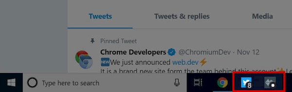


  This API is part of the new
  [capabilities project](https://developers.google.com/web/updates/capabilities),
  and starting in Chrome 73 it is available as an [**origin trial**](#ot).
  This post will be updated as the Badging API evolves.


## What is the Badging API? {: #what }

<figure class="w-figure w-figure--inline-right">
  
  <figcaption class="w-figcaption">
    Example of Twitter with eight notifications and another app showing a flag
    type badge.
  </figcaption>
</figure>

The Badging API allows installed web apps to set an application-wide badge,
shown in an operating-system-specific place associated with the application
(such as the shelf or home screen).

Badging makes it easy to subtly notify the user that there is some new activity
that might require their attention, or to indicate a small amount of
information, such as an unread count.

Badges tend to be more user-friendly than notifications, and can be updated
with a much higher frequency, since they don't interrupt the user. And,
because they don't interrupt the user, they don't need the user's permission.

### Possible use cases {: #use-cases }

Examples of sites that may use this API include:

* Chat, email, and social apps, to signal that new messages have arrived, or to
  show the number of unread items.
* Productivity apps, to signal that a long-running background task (such as
  rendering an image or video) has completed.
* Games, to signal that a player action is required (e.g., in Chess, when it
  is the player's turn).

## Current status {: #status }

<div class="w-table-wrapper">

| Step                                       | Status                       |
| ------------------------------------------ | ---------------------------- |
| 1. Create explainer                        | [Complete][explainer]        |
| 2. Create initial draft of specification   | [Complete][spec]             |
| 3. Gather feedback & iterate on design     | [In progress](#feedback)     |
| **4. Origin trial**                        | [**In progress**](#ot)       |
| 5. Launch                                  | Not started                  |

</div>

## Try it

1. Using Chrome 73 or later on Windows or Mac, open the [Badging API demo][demo].
2. When prompted, click **Install** to install the app, or use the Chrome
   menu to install it.
3. Open it as an installed PWA. Note, it must be running as an installed PWA (in
   your task bar or dock).
4. Click the **Set** or **Clear** button to set or clear the badge from the app
   icon. You can also provide a number for the *Badge value*.


  While the Badging API *in Chrome* requires an installed app
  with an icon that can actually be badged, you shouldn't
  make calls to the Badging API dependent on the install state.
  The Badging API can apply to *anywhere* a browser might want to show a badge,
  so developers shouldn't make any assumptions about situations where
  the browser will display them. Just call the API when it exists.
  If it works, it works. If not, it simply doesn't.


## How to use the Badging API {: #use }

Starting in Chrome 73, the Badging API is available as an origin trial
for Windows (7+) and macOS.


  Android is not supported because it requires you to show a notification,
  though this may change in the future. Chrome OS support is pending
  implementation of badging on the platform.


### Register for the origin trial {: #ot }





### Alternatives to the origin trial

If you want to experiment with the Badging API locally, without an origin trial,
enable the `#enable-experimental-web-platform-features` flag in `chrome://flags`.

### Using the Badging API during the origin trial


  During the origin trial, the API will be available via
  `window.ExperimentalBadge`. The code below is based on the current design,
  and will change before it lands in the browser as a standardized API.


To use the Badging API, your web app needs to meet
[Chrome's installability criteria](https://developers.google.com/web/fundamentals/app-install-banners/#criteria),
and users must add it to their home screens.

The `ExperimentalBadge` interface is a member object on `window`. It contains
two methods:

* `set([number])`: Sets the app's badge. If a value is provided, set the badge
  to the provided value otherwise, display a plain white dot (or other flag as
  appropriate to the platform).
* `clear()`: Removes app's badge.

For example:

```js
// In a web page
const unreadCount = 24;
window.ExperimentalBadge.set(unreadCount);
```

`ExperimentalBadge.set()` and `ExperimentalBadge.clear()` can be called from
a foreground page, or potentially in the future, a service worker. In either
case, it affects the whole app, not just the current page.

In some cases, the OS may not allow the exact representation of the badge,
in this case, the browser will attempt to provide the best representation for
that device. For example, while the Badging API isn't supported on Android,
Android only ever shows a dot instead of a numeric value.

Don't assume anything about how the user agent wants to display the badge.
Some user agents may take a number like "4000" and rewrite it as
"99+". If you saturate the badge yourself (for example by setting it to "99")
then the "+" won't appear. No matter the actual number, just set
`Badge.set(unreadCount)` and let the user agent deal with displaying it
accordingly.

## Feedback {: #feedback }

The Chrome team wants to hear about your experiences with the Badging API.

### Tell us about the API design

Is there something about the API that doesn't work like you expected? Or are
there missing methods or properties that you need to implement your idea?
Have a question or comment on the security model?

* File a spec issue on the [Badging API GitHub repo][issues], or add your
  thoughts to an existing issue.

### Problem with the implementation?

Did you find a bug with Chrome's implementation? Or is the implementation
different from the spec?

* File a bug at <https://new.crbug.com>. Be sure to include as much detail
  as you can, simple instructions for reproducing, and set
  Components to `UI>Browser>WebAppInstalls`. [Glitch](https://glitch.com) works great for
  sharing quick and easy repros.

### Planning to use the API?

Planning to use Badging API on your site? Your public support helps the Chrome
team to prioritize features, and shows other browser vendors how critical it
is to support them.

* Send a Tweet to [@ChromiumDev](https://twitter.com/chromiumdev) tagged with
  `#badgingapi` and let us know where and how you're using it.

## Helpful links {: #helpful }

* [Public explainer][explainer]
* [Badging API Demo][demo] | [Badging API Demo source][demo-source]
* [Tracking bug][cr-bug]
* [ChromeStatus.com entry][cr-status]
* Request an [origin trial token]({{origin_trial.url}})
* [How to use an origin trial token][ot-use]
* Blink Component: `UI>Browser>WebAppInstalls`

[spec]: https://wicg.github.io/badging/
[issues]: https://github.com/WICG/badging/issues
[cr-bug]: https://bugs.chromium.org/p/chromium/issues/detail?id=719176
[cr-status]: https://www.chromestatus.com/features/6068482055602176
[demo]: https://badging-api.glitch.me/
[demo-source]: https://glitch.com/edit/#!/badging-api?path=demo.js
[ot-what-is]: https://github.com/GoogleChrome/OriginTrials/blob/gh-pages/README.md
[ot-dev-guide]: https://github.com/GoogleChrome/OriginTrials/blob/gh-pages/developer-guide.md
[ot-use]: https://github.com/GoogleChrome/OriginTrials/blob/gh-pages/developer-guide.md#how-do-i-enable-an-experimental-feature-on-my-origin
[wicg-discourse]: https://discourse.wicg.io/t/badging-api-for-showing-an-indicator-on-a-web-apps-shelf-icon/2900
[explainer]: https://github.com/WICG/badging/blob/master/explainer.md
