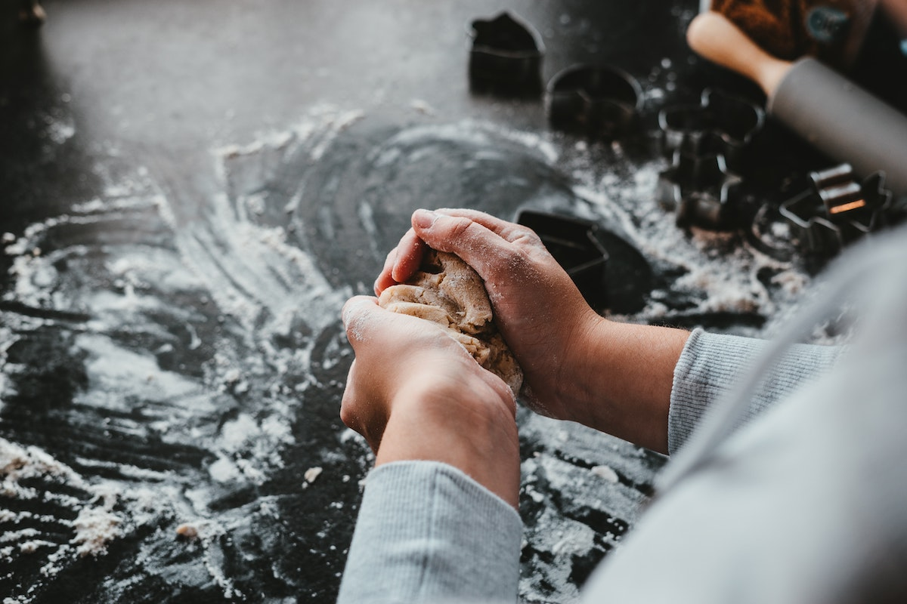
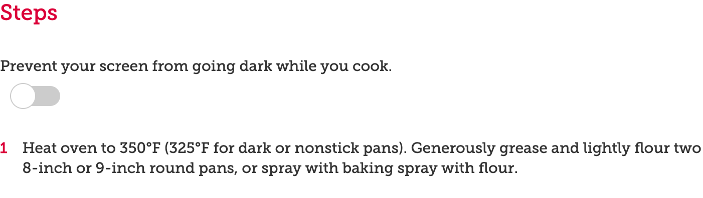
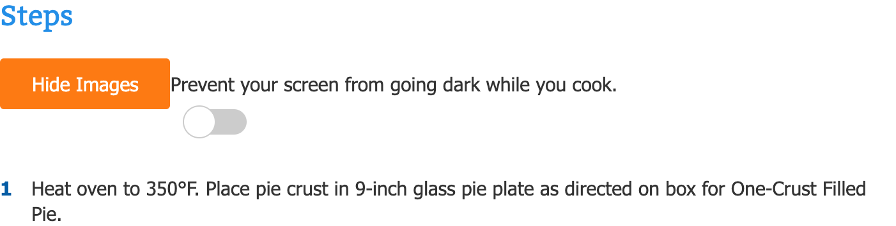
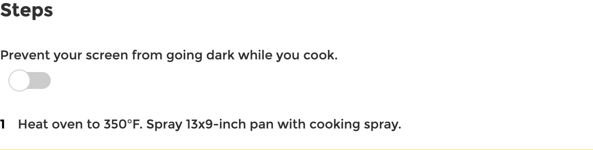

## About Betty Crocker

For nearly a century, Betty Crocker has been America's source for modern cooking instruction
and trusted recipe development.
Since 1921, when (the fictive character) Betty Crocker began answering questions
about baking by letter, she has been working to teach people to cook.
Launched in 1997, [BettyCrocker.com](https://www.bettycrocker.com/)
continues the legacy of adapting, discovering, and sharing the knowledge that home cooks crave.
Today, the site receives more than 12&nbsp;million visitors per month.

## The retired iOS and Android apps

Launched to [much fanfare](https://consumergoods.com/betty-crocker-launches-cookbook-app) in 2014,
Betty Crocker recently took their native apps out of the Apple App Store and the Google Play Store
after it had been mostly neglected and deprioritized.
For a long time, the Betty Crocker team has preferred adding new features to the mobile site
instead of the native apps.
The technical platform the native apps were created on was outdated,
and the business did not have the resources
to support updating and maintaining the apps moving forward.
In addition to that, the web app also was objectively way bigger traffic-wise,
more modern, and easier to enhance.

The native apps did have one *killer feature*, though, that its users loved:

> Millennial cooking pro tip: the [@BettyCrocker](https://twitter.com/BettyCrocker) mobile app
  doesn't dim or lock when you're following a recipe. TRYING THIS TONIGHT!
  […]—[@AvaBeilke](https://twitter.com/AvaBeilke/status/996746473168670720)

> 80% of people cook with a device in the kitchen, but screen dimming and locking is a problem.
  What did [@BettyCrocker](https://twitter.com/BettyCrocker) do?
  Updated their app to NOT dim when users are in a recipe.
  That's listening to your consumer!
  […]—[@Katie_Tweedy_](https://twitter.com/Katie_Tweedy_/status/996746567762763776)

> Shout to [@livefront](https://twitter.com/livefront) in minneapolis
  who solved for the screen dim issues on [@BettyCrocker](https://twitter.com/BettyCrocker) app.
  It takes a village. […]—[@aimeereker](https://twitter.com/aimeereker/status/996751679415570435)

## The Wake Lock API

When cooking with a device, there is nothing more frustrating
than having to touch the screen with messy hands or even your nose when the screen turns off.
Betty Crocker asked themselves how they could port the killer feature of their native app
over to the web app.
This is when they learned about
[Project Fugu](https://developers.google.com/web/updates/capabilities) and the
[Wake Lock API](https://web.dev/wakelock/).



The Wake Lock API provides a way to prevent the device
from dimming or locking the screen.
This capability enables new experiences that, until now, required a native app.
The Wake Lock API reduces the need for hacky and potentially power-hungry workarounds.

### Requesting a wake lock

To request a wake lock, you need to call the `navigator.wakeLock.request()` method
that returns a `WakeLockSentinel` object.
The browser can refuse the request for various reasons
(for example, because the battery is too low),
so it is a good practice to wrap the call in a `try…catch` statement.

### Releasing a wake lock

You also need a way to release a wake lock,
which is achieved by calling the `release()` method of the `WakeLockSentinel` object.
If you want to automatically release the wake lock after a certain period of time has passed,
you can use `window.setTimeout()` to call `release()`, as shown in the example below.

```js
// The wake lock sentinel.
let wakeLock = null;

// Function that attempts to request a wake lock.
const requestWakeLock = async () => {
  try {
    wakeLock = await navigator.wakeLock.request('screen');
    wakeLock.addEventListener('release', () => {
      console.log('Wake Lock was released');
    });
    console.log('Wake Lock is active');
  } catch (err) {
    console.error(`${err.name}, ${err.message}`);
  }
};

// Request a wake lock…
await requestWakeLock();
// …and release it again after 5s.
window.setTimeout(() => {
  wakeLock.release();
  wakeLock = null;
}, 5000);
```

## The implementation

With the new web app, users should be enabled to easily navigate through a recipe,
complete steps, and even walk away without the screen locking.
To achieve this goal, the team first built a quick front-end prototype
as a proof the concept and to gather UX input.

After the prototype proved useful, they designed a
[Vue.js component](https://vuejs.org/v2/guide/components.html)
that could be shared across all their brands ([BettyCrocker](https://www.bettycrocker.com/),
[Pillsbury](https://www.pillsbury.com/), and [Tablespoon](https://www.tablespoon.com/)).
Even though only Betty Crocker had a native app,
the three sites do have a shared code base,
so they were able to implement the component once, and deploy it everywhere,
as shown in the screenshots below.







While focusing on the [`ViewModel` layer of the MVVM pattern](https://012.vuejs.org/guide/)
in developing the component based on the new site's modernized framework,
they developed with interoperability in mind
to enable functionality on legacy and new frameworks of the site.

To keep track of viewability and usability, Betty Crocker integrated analytics tracking
for core events in the wake lock lifecycle.
The team utilized feature management to deploy the wake lock component
to a single site for initial production rollout,
and then deployed the feature to the rest of the sites after monitoring usage and page health.
They continue to monitor analytics data based on the usage of this component.

As a failsafe for users, the team created a forced timeout
to disable the wake lock after one hour of inactivity.
The final implementation they settled on
was in the short-term a toggle switch on all recipe pages across their sites.
In the long-term, they envision a revamped recipe page view.

### The wake lock container

```js
var wakeLockControl = () => {
  return import(/* webpackChunkName: 'wakeLock' */ './wakeLock');
};

export default {
  components: {
    wakeLockControl: wakeLockControl,
  },
  data() {
    return {
      config: {},
      wakeLockComponent: '',
    };
  },
  methods: {
    init: function(config) {
      this.config = config || {};
      if ('wakeLock' in navigator && 'request' in navigator.wakeLock) {
        this.wakeLockComponent = 'wakeLockControl';
      } else {
        if (window.GeneralMills.debugMode) {
          console.log('Browser not supported');
        }
      }
    },
  },
};
```

### The wake lock component

```html
<template>
  <div class="wakeLock">
    <div class="textAbove">{{settingsInternal.textAbove}}</div>
    <label class="switch" :aria-label="settingsInternal.textAbove">
      <input type="checkbox" @change="onChange()" v-model="isChecked">
      <span class="slider round"></span>
    </label>
  </div>
</template>

<script type="text/javascript">
  import debounce from 'lodash.debounce';

  const scrollDebounceMs = 1000;

  export default {
    props: {
      settings: { type: Object },
    },
    data() {
      return {
        settingsInternal: this.settings || {},
        isChecked: false,
        wakeLock: null,
        timerId: 0,
      };
    },
    created() {
      this.$_raiseAnalyticsEvent('Wake Lock Toggle Available');
    },
    methods: {
      onChange: function() {
        if (this.isChecked) {
          this.$_requestWakeLock();
        } else {
          this.$_releaseWakeLock();
        }
      },
      $_requestWakeLock: async function() {
        try {
          this.wakeLock = await navigator.wakeLock.request('screen');
          //Start new timer
          this.$_handleAbortTimer();
          //Only add event listeners after wake lock is successfully enabled
          document.addEventListener(
            'visibilitychange',
            this.$_handleVisibilityChange,
          );
          window.addEventListener(
            'scroll',
            debounce(this.$_handleAbortTimer, scrollDebounceMs),
          );
          this.$_raiseAnalyticsEvent('Wake Lock Toggle Enabled');
          if (window.GeneralMills.debugMode) {
            console.log('Wake Lock Active');
          }
        } catch (e) {
          this.isChecked = false;
          if (window.GeneralMills.debugMode) {
            console.log(`Wake Lock Request Error: ${e.name}, ${e.message}`);
          }
        }
      },
      $_releaseWakeLock: function() {
        try {
          this.wakeLock.release();
          this.wakeLock = null;
          //Clear timer
          this.$_handleAbortTimer();
          //Clean up event listeners
          document.removeEventListener(
            'visibilitychange',
            this.$_handleVisibilityChange,
          );
          window.removeEventListener(
            'scroll',
            debounce(this.$_handleAbortTimer, scrollDebounceMs),
          );
          if (window.GeneralMills.debugMode) {
            console.log('Wake Lock Released');
          }
        } catch (e) {
          if (window.GeneralMills.debugMode) {
            console.log(`Wake Lock Release Error: ${e.name}, ${e.message}`);
          }
        }
      },
      $_handleAbortTimer: function() {
        //If there is an existing timer then clear it and set to zero
        if (this.timerId !== 0) {
          clearTimeout(this.timerId);
          this.timerId = 0;
        }
        //Start new timer; Will be triggered from toggle enabled or scroll event
        if (this.isChecked) {
          this.timerId = setTimeout(
            this.$_releaseWakeLock,
            this.settingsInternal.timeoutDurationMs,
          );
        }
      },
      $_handleVisibilityChange: function() {
        //Handle navigating away from page/tab
        if (this.isChecked) {
          this.$_releaseWakeLock();
          this.isChecked = false;
        }
      },
      $_raiseAnalyticsEvent: function(eventType) {
        let eventParams = {
          EventType: eventType,
          Position: window.location.pathname || '',
        };
        GeneralMills.Analytics && GeneralMills.Analytics.raiseEvent(eventParams);
      },
    },
  };
</script>
```

### Results

The Vue.js component has been deployed on the three sites and delivered great results.
The measuring period lasted from December 10th, 2019 to January 10th, 2020
and covered the site BettyCrocker.com.

- Of all Betty Crocker users with a browser compatible with the Wake Lock API,
  3.5% of them enabled the feature (~127,000 users).
- The session duration for users who enabled the wake lock was 4min 18sec,
  versus 1min 38sec for users who did not.
- The bounce rate for users who enabled the wake lock was 21.85%,
  versus 56.51% for users who did not.
- During a one month time period, 27,563 users enabled the wake lock multiple times.
- After enabling the wake lock, 1.43% of users intended to purchase ingredients
  (measured by coupon code clicks), versus 0.37% for all users.

## Conclusions

Betty Crocker have seen fantastic results with the Wake Lock API.
You can test the feature yourself by searching for your favorite recipe on any of their sites
([BettyCrocker](https://www.bettycrocker.com/),
[Pillsbury](https://www.pillsbury.com/), or [Tablespoon](https://www.tablespoon.com/))
and toggling the "Prevent your screen from going dark while you cook" toggle.

Use cases for wake locks do not stop at recipe sites.
Other examples are boarding pass or ticket apps that need to keep the screen on
until the barcode has been scanned, kiosk-style apps that keep the screen on continuously,
or web-based presentation apps that prevent the screen from sleeping during a presentation.

We have compiled [everything you need to know about the Wake Lock API](https://web.dev/wakelock/)
in a comprehensive article over on our developer portal.
Happy reading, and happy cooking!

## Acknowledgements

Hero image courtesy of the
[collection of the Auckland Museum Tamaki Paenga Hira, 2015.4.50](https://commons.wikimedia.org/wiki/File:Packet,_food_product_(AM_2015.4.50-10).jpg).
Doughy fingers photo by [Julian Hochgesang](https://unsplash.com/@julianhochgesang) on
[Unsplash](https://unsplash.com/photos/huepD-06_pQ).
