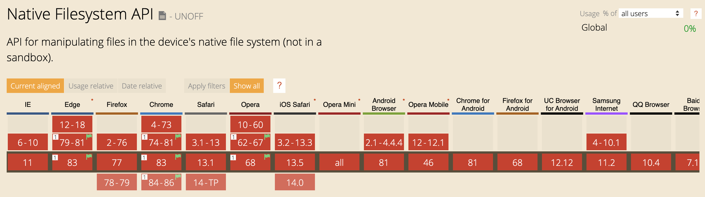
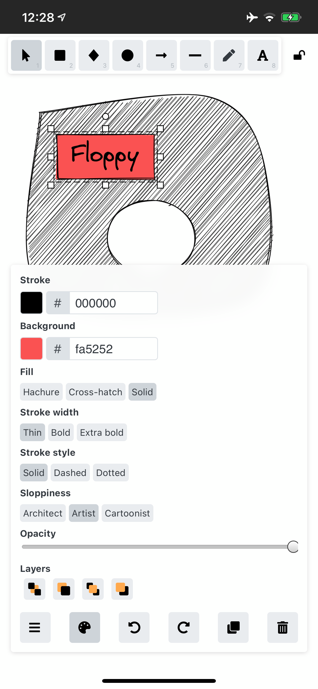
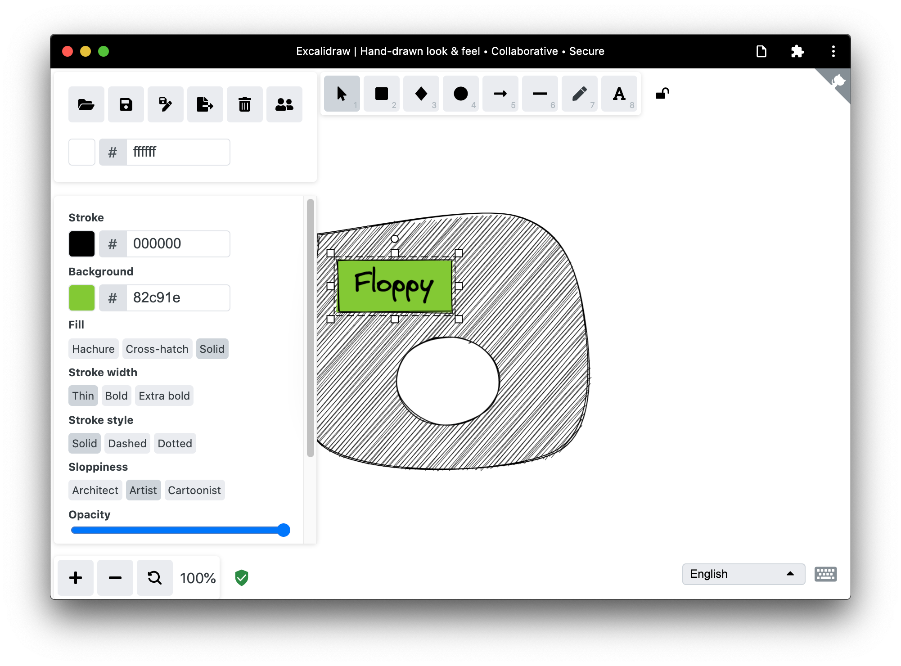
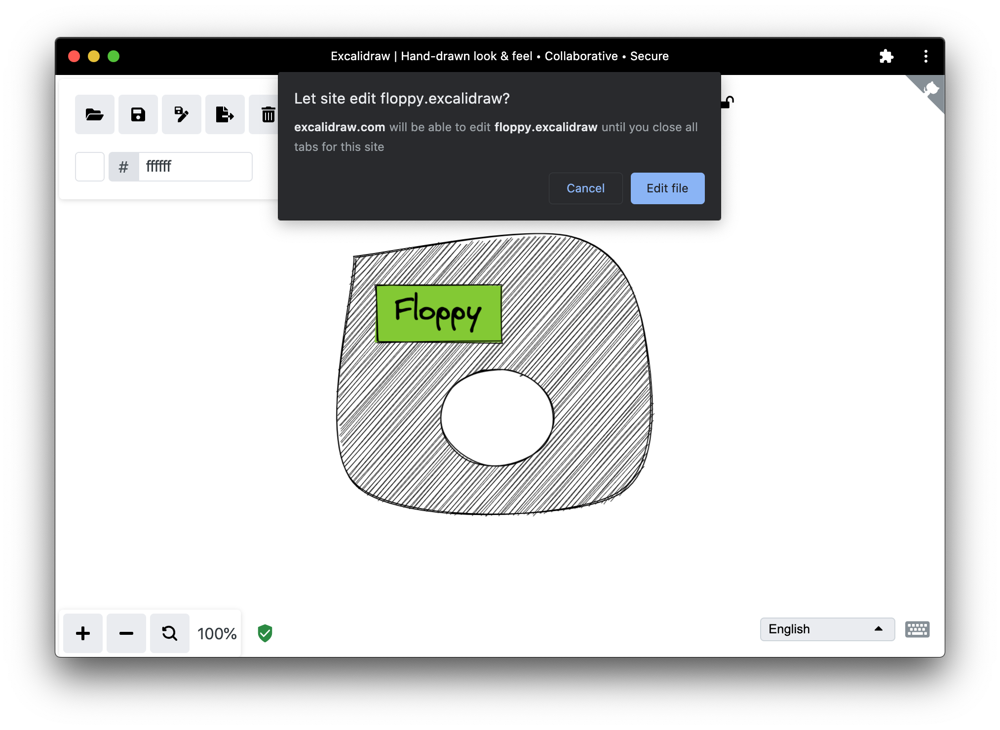
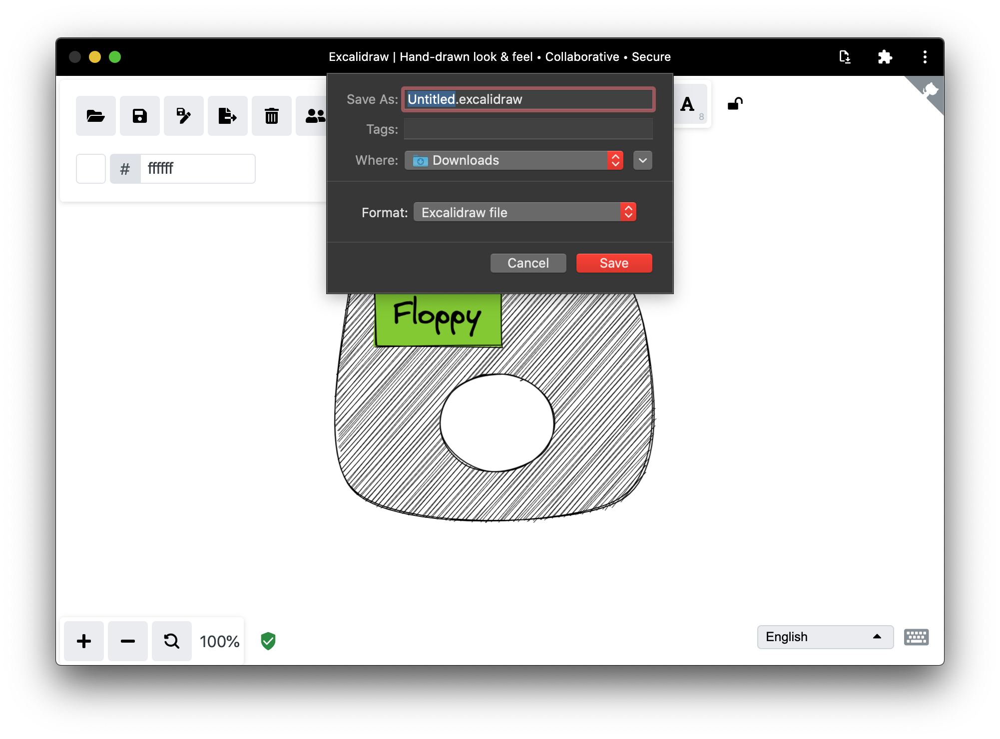
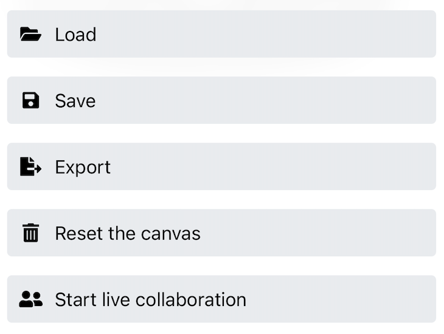
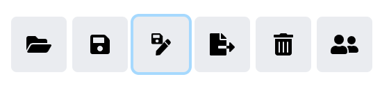

Browsers have been able to deal with files and directories for a long time.
The [File API](https://w3c.github.io/FileAPI/)
provides features for representing file objects in web applications,
as well as programmatically selecting them and accessing their data.
The moment you look closer, though, all that glitters is not gold.

## The traditional way of dealing with files


  If you know how it used to work the old way, you can
  [jump down straight to the new way](#the-native-file-system-api).


### Opening files

As a developer, you can open and read files via the
[`<input type="file">`](https://developer.mozilla.org/en-US/docs/Web/HTML/Element/input/file)
element.
In its simplest form, opening a file can look something like the code sample below.
The `input` object gives you a [`FileList`](https://developer.mozilla.org/en-US/docs/Web/API/FileList),
which in the case below consists of just one
[`File`](https://developer.mozilla.org/en-US/docs/Web/API/File).
A `File` is a specific kind of [`Blob`](https://developer.mozilla.org/en-US/docs/Web/API/Blob),
and can be used in any context that a Blob can.

```js
const openFile = async () => {
  return new Promise((resolve) => {
    const input = document.createElement('input');
    input.type = 'file';
    input.addEventListener('change', () => {
      resolve(input.files[0]);
    });
    input.click();
  });
};
```

### Opening directories

For opening folders (or directories), you can set the
[`<input webkitdirectory>`](https://developer.mozilla.org/en-US/docs/Web/HTML/Element/input#attr-webkitdirectory)
attribute.
Apart from that, everything else works the same as above.
Despite its vendor-prefixed name,
`webkitdirectory` is not only usable in Chromium and WebKit browsers, but also in the legacy EdgeHTML-based Edge as well as in Firefox.

### Saving (rather: downloading) files

For saving a file, traditionally, you are limited to *downloading* a file,
which works thanks to the
[`<a download>`](https://developer.mozilla.org/en-US/docs/Web/HTML/Element/a#attr-download:~:text=download)
attribute.
Given a Blob, you can set the anchor's `href` attribute to a `blob:` URL that you can get from the
[`URL.createObjectURL()`](https://developer.mozilla.org/en-US/docs/Web/API/URL/createObjectURL)
method.

To prevent memory leaks, always revoke the URL after the download.


```js
const saveFile = async (blob) => {
  const a = document.createElement('a');
  a.download = 'my-file.txt';
  a.href = URL.createObjectURL(blob);
  a.addEventListener('click', (e) => {
    setTimeout(() => URL.revokeObjectURL(a.href), 30 * 1000);
  });
  a.click();
};
```

### The problem

A massive downside of the *download* approach is that there is no way to make a classic
open→edit→save flow happen, that is, there is no way to *overwrite* the original file.
Instead, you end up with a new *copy* of the original file
in the operating system's default Downloads folder whenever you "save".

## The Native File System API

The Native File System API makes both operations, opening and saving, a lot simpler.
It also enables *true saving*, that is, you can not only choose where to save a file,
but also overwrite an existing file.


  For a more thorough introduction to the Native File System API, see the article
  [The Native File System API: simplifying access to local files](https://web.dev/native-file-system/).


### Opening files

With the [Native File System API](https://wicg.github.io/native-file-system/),
opening a file is a matter of one call to the `window.showOpenFilePicker()` method.
This call returns a file handle, from which you can get the actual `File` via the `getFile()` method.

```js
const openFile = async () => {
  try {
    // Always returns an array.
    const [handle] = await window. showOpenFilePicker();
    return handle.getFile();
  } catch (err) {
    console.error(err.name, err.message);
  }
};
```

### Opening directories

Open a directory by calling
`window.showDirectoryPicker()` that makes directories selectable in the file dialog box.

### Saving files

Saving files is similarly straightforward.
From a file handle, you create a writable stream via `createWritable()`,
then you write the Blob data by calling the stream's `write()` method,
and finally you close the stream by calling its `close()` method.

```js
const saveFile = async (blob) => {
  try {
    const handle = await window.showSaveFilePicker({
      types: [{
        accept: {
          // Omitted
        },
      }],
    });
    const writable = await handle.createWritable();
    await writable.write(blob);
    await writable.close();
    return handle;
  } catch (err) {
    console.error(err.name, err.message);
  }
};
```

## Introducing browser-nativefs

As perfectly fine as the Native File System API is,
it's [not yet  widely available](https://caniuse.com/#feat=native-filesystem-api).

<figure class="w-figure">
  
  <figcaption class="w-figcaption">
    Browser support table for the Native File System API.
    (<a href="https://caniuse.com/#feat=native-filesystem-api">Source</a>)
  </figcaption>
</figure>

This is why I see the Native File System API as a [progressive enhancement](/progressively-enhance-your-pwa).
As such, I want to use it when the browser supports it,
and use the traditional approach if not;
all while never punishing the user with unnecessary downloads of unsupported JavaScript code.
The [browser-nativefs](https://github.com/GoogleChromeLabs/browser-nativefs)
library is my answer to this challenge.

### Design philosophy

Since the Native File System API is still likely to change in the future,
the browser-nativefs API is not modeled after it.
That is, the library is not a [polyfill](https://developer.mozilla.org/en-US/docs/Glossary/Polyfill),
but rather a [ponyfill](https://github.com/sindresorhus/ponyfill).
You can (statically or dynamically) exclusively import whatever functionality you need to keep your app as small as possible.
The available methods are the aptly named
[`fileOpen()`](https://github.com/GoogleChromeLabs/browser-nativefs#opening-files),
[`directoryOpen()`](https://github.com/GoogleChromeLabs/browser-nativefs#opening-directories), and
[`fileSave()`](https://github.com/GoogleChromeLabs/browser-nativefs#saving-files).
Internally, the library feature-detects if the Native File System API is supported,
and then imports the corresponding code path.

### Using the browser-nativefs library

The three methods are intuitive to use.
You can specify your app's accepted `mimeTypes` or file `extensions`, and set a `multiple` flag
to allow or disallow selection of multiple files or directories.
For full details, see the
[browser-nativefs API documentation](https://github.com/GoogleChromeLabs/browser-nativefs#api-documentation).
The code sample below shows how you can open and save image files.

```js
// The imported methods will use the Native
// File System API or a fallback implementation.
import {
  fileOpen,
  directoryOpen,
  fileSave,
} from 'https://unpkg.com/browser-nativefs';

(async () => {
  // Open an image file.
  const blob = await fileOpen({
    mimeTypes: ['image/*'],
  });

  // Open multiple image files.
  const blobs = await fileOpen({
    mimeTypes: ['image/*'],
    multiple: true,
  });

  // Open all files in a directory,
  // recursively including subdirectories.
  const blobsInDirectory = await directoryOpen({
    recursive: true
  });

  // Save a file.
  await fileSave(blob, {
    fileName: 'Untitled.png',
  });
})();
```

### Demo

You can see the above code in action in a [demo](https://browser-nativefs.glitch.me/) on Glitch.
Its [source code](https://glitch.com/edit/#!/browser-nativefs) is likewise available there.
Since for security reasons cross origin sub frames are not allowed to show a file picker,
the demo cannot be embedded in this article.

## The browser-nativefs library in the wild

In my free time, I contribute a tiny bit to an
[installable PWA](https://web.dev/progressive-web-apps/#installable)
called [Excalidraw](https://excalidraw.com/),
a whiteboard tool that lets you easily sketch diagrams with a hand-drawn feel.
It is fully responsive and works well on a range of devices from small mobile phones to computers with large screens.
This means it needs to deal with files on all the various platforms
whether or not they support the Native File System API.
This makes it a great candidate for the browser-nativefs library.

I can, for example, start a drawing on my iPhone,
save it (technically: download it, since Safari does not support the Native File System API)
to my iPhone Downloads folder, open the file on my desktop (after transferring it from my phone),
modify the file, and overwrite it with my changes, or even save it as a new file.

<figure class="w-figure">
  
  <figcaption class="w-figcaption">
    Starting an Excalidraw drawing on an iPhone where the Native File System API is not supported,
    but where a file can be saved (downloaded) to the Downloads folder.</a>)
  </figcaption>
</figure>

<figure class="w-figure">
  
  <figcaption class="w-figcaption">
    Opening and modifying the Excalidraw drawing on the desktop where the Native File System API is supported
    and thus the file can be accessed via the API.
  </figcaption>
</figure>

<figure class="w-figure">
  
  <figcaption class="w-figcaption">
    Overwriting the original file with the modifications to the original Excalidraw drawing file.
    The browser shows a dialog asking me whether this is fine.
  </figcaption>
</figure>

<figure class="w-figure">
  
  <figcaption class="w-figcaption">
    Saving the modifications to a new Excalidraw file. The original file remains untouched.
  </figcaption>
</figure>

### Real life code sample

Below, you can see an actual example of browser-nativefs as it is used in Excalidraw.
This excerpt is taken from
[`/src/data/json.ts`](https://github.com/excalidraw/excalidraw/blob/cd87bd6901b47430a692a06a8928b0f732d77097/src/data/jsonts#L24-L52).
Of special interest is how the `saveAsJSON()` method passes either a file handle or `null` to browser-nativefs'
`fileSave()` method, which causes it to overwrite when a handle is given,
or to save to a new file if not.

```js
export const saveAsJSON = async (
  elements: readonly ExcalidrawElement[],
  appState: AppState,
  fileHandle: any,
) => {
  const serialized = serializeAsJSON(elements, appState);
  const blob = new Blob([serialized], {
    type: "application/json",
  });
  const name = `${appState.name}.excalidraw`;
  (window as any).handle = await fileSave(
    blob,
    {
      fileName: name,
      description: "Excalidraw file",
      extensions: ["excalidraw"],
    },
    fileHandle || null,
  );
};

export const loadFromJSON = async () => {
  const blob = await fileOpen({
    description: "Excalidraw files",
    extensions: ["json", "excalidraw"],
    mimeTypes: ["application/json"],
  });
  return loadFromBlob(blob);
};
```

### UI considerations

Whether in Excalidraw or your app,
the UI should adapt to the browser's support situation.
If the Native File System API is supported (`if ('showOpenFilePicker' in window) {}`)
you can show a **Save As** button in addition to a **Save** button.
The screenshots below show the difference between Excalidraw's responsive main app toolbar on iPhone and on Chrome desktop.
Note how on iPhone the **Save As** button is missing.

<figure class="w-figure">
  
  <figcaption class="w-figcaption">
    Excalidraw app toolbar on iPhone with just a <strong>Save</strong> button.
  </figcaption>
</figure>

<figure class="w-figure">
  
  <figcaption class="w-figcaption">
    Excalidraw app toolbar on Chrome  with a <strong>Save</strong> and a focused <strong>Save As</strong> button.
  </figcaption>
</figure>

## Conclusions

Working with native files technically works on all modern browsers.
On browsers that support the Native File System API, you can make the experience better by allowing
for true saving and overwriting (not just downloading) of files and
by letting your users create new files wherever they want,
all while remaining functional on browsers that do not support the Native File System API.
The [browser-nativefs](https://github.com/GoogleChromeLabs/browser-nativefs) makes your life easier
by dealing with the subtleties of progressive enhancement and making your code as simple as possible.

## Acknowledgements

This article was reviewed by [Joe Medley](https://github.com/jpmedley) and
[Kayce Basques](https://github.com/kaycebasques).
Thanks to the [contributors to Excalidraw](https://github.com/excalidraw/excalidraw/graphs/contributors)
for their work on the project and for reviewing my Pull Requests.
[Hero image](https://unsplash.com/photos/hXrPSgGFpqQ) by
[Ilya Pavlov](https://unsplash.com/@ilyapavlov) on Unsplash.
