High quality search is fundamental to e-commerce—and the gateway to search is
the humble input element.

A prominent, well designed search input element invites engagement and
interaction. It's a way of saying ‘Welcome! How can I help?'

Unfortunately there's also a 'double distance' between success and failure: a
good search experience means easier product discovery and more conversions, but
poorly implemented search annoys customers and turns them away.

This article shows some simple ways to make the search input an invitation, not a barrier.

<blockquote style="margin: 0 0 20px 0;padding: 10px;">
    <p>The search field represents the initial step of the user's search
    process … design of the search field is instrumental at an even more
    fundamental level —the field design can influence the user's entire
    approach to how they find products on the site.</p>
    <p>— <a href="https://baymard.com/blog/search-field-design" title="Baymard Institute report about search field design for e-commerce">Baymard Institute</a></p>
</blockquote>


## tl;dr

The search box is probably the single most important component of any e-commerce
site.

+   Make search visible and prominent
+   Put search where people expect it, on every page
+   Make the search input large enough to enter text and work as a touch target
+   Give the search input a label and a magnifying glass icon
+   Don't force users to click on the search icon to display the text input
+   Show recent searches
+   Provide suggestions and completions
+   Enable synonym search or other methods of dealing with ambiguous queries
+   Be ‘typo tolerant'
+   Retain query text
+   Consider voice-generated queries
+   Test!

Here are three demos to try out if you want to dive straight into code:
+   [Responsive search input using JavaScript](https://search-input-js.glitch.me)
+   [Responsive search input using a form](https://search-input-form.glitch.me)
+   [Complete responsive header element with branding, search and cart](https://search-input-header.glitch.me)

<div class="glitch-embed-wrap" style="height: 420px; width: 100%;">
  <iframe
    allow=""
    src="https://glitch.com/embed/#!/embed/search-input-header?path=src/index.js&amp;previewSize=0"
    alt="search-input-header on Glitch"
    style="height: 100%; width: 100%; border: 0;">
  </iframe>
</div>

<br>

## Make search visible and prominent

People give up quickly: attention spans are short. If users can't find something
immediately, they're likely to give up. Notice how prominent search is on eBay
and Amazon:

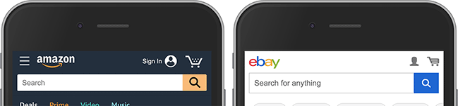

[Showing users things they recognize improves usability](https://www.nngroup.com/articles/recognition-and-recall/).
This might seem obvious, but it's surprising how many sites get this wrong.
Successful e-commerce sites tend to use simple, obvious search inputs without
much styling.

If you really don't want to do that, at least make sure the search input still
looks like a search input.


**For every rule, there's an exception.**

A well designed, prominent search input will encourage people to
navigate your site via search.

However, some retailers deliberately downplay the prominence of search
UI to encourage browsing rather than searching.

This is often the case for sites selling clothes, as in the screenshot below.

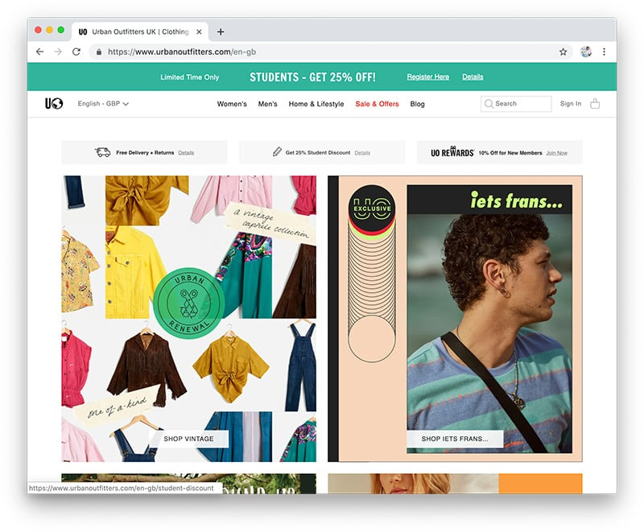

The point is that you should make search prominent unless there's a
good reason not to.

De-emphasising search should only be done as a
deliberate choice.


## Put search where users expect it

The best-known e-commerce sites all put the search input at the top of the page,
generally in the middle or at the right (or on the left for right-to-left
languages). There are several examples
[here](https://baymard.com/ecommerce-search/benchmark/page-types/search-field) .
Putting search somewhere else will force users to look where they're not
expecting. Don't do it!

## Put search on every page

Search should be accessible from every page including About, Contact, and 404
pages.
Be careful to clearly disambiguate product search from other type of search such
as a store locator or account search. The simplest way to do that is to keep
product search at the top of the page, and other types of search in the middle
of the page.

## Make it accessible

There are several simple ways to make input elements more accessible.

### Provide a label

Give the input a label and give the label a for attribute:

``` html
<label for="search">Search</label>
<input id="search">
```

Adding the `for` attribute means the input gets focus when a user taps, clicks
or otherwise selects the label. This means the label then becomes an extension
of the input as a target, which is especially useful for people with motor
disabilities, and anyone using a site in contexts where it's difficult to click
or tap accurately (for example, on a moving train).

If you must hide the label visually,
[use the method recommended by the W3C](https://www.w3.org/WAI/tutorials/forms/labels/#note-on-hiding-elements).
If you really don't want to use a label element, make sure to give the input a
search icon and an
[aria-label](https://developers.google.com/web/tools/lighthouse/audits/form-labels)
for accessibility.

### Avoid using a placeholder without a label

There are
[good reasons](https://www.smashingmagazine.com/2018/06/placeholder-attribute/)
not to use placeholder text without a label:

+   Assistive technologies expect labels to describe the role of inputs.
    Assistive technologies
    [do not treat placeholder text as labels](https://www.w3.org/WAI/tutorials/forms/instructions/#placeholder-text).
+   The browser default for placeholder text color is light gray, which
    gives poor contrast against a white background. Styling the placeholder
    text for higher contrast makes it look like the placeholder text is
    actually search text!
+   A search input with text in it is less noticeable:
    [users' eyes are drawn to empty fields](https://www.nngroup.com/articles/form-design-placeholders/).

If you must use placeholder text, make it helpful. In the following example,
what constitutes a ‘keyword'—and why not just say ‘item number'?


### Consider using the search type attribute

You can set the type of the input as search:

``` html
<label for="search">Search</label>
<input id="search" type="search">
```

This clarifies the purpose of the input for screen readers and has the added
advantage of an automatic X icon for clearing text once you start typing (in
Chrome, and Safari on desktop, with a
[selector for styling](http://nicolasgallagher.com/about-normalize-css/#normalize-css-corrects-common-bugs)):

<label for="search">Search</label>
<input id="search" type="search">

### Add ARIA attributes

[Adding an ARIA label](https://www.w3.org/WAI/tutorials/forms/labels/#using-aria-label)
to your search input helps screen readers and other assistive technologies:

``` html
<input type="search" aria-label="Search">
```

Add labels to the input and search button (if you use one):

``` html
<input type="search" aria-labelledby="search-button">
<button id="search-button" type="submit">Search</button>
```

### Style for usability

Make sure the input element is large enough to work as a touch target, and that
the text styling provides [adequate
contrast](https://www.w3.org/TR/WCAG20-TECHS/G18). Make text large enough to
read and type: as a general rule, font-size should be at least 16px. Remember
that a high proportion of users have less than perfect vision and/or may be
attempting to search in sub-optimal conditions: bright sunlight, on a busy
street or while in transit.

<blockquote style="margin: 0 0 20px 0;padding: 10px;">
<p>Often, something that's a complete blocker for a few users is also a pain
point for many others, so by fixing the accessibility issue you improve the
experience for everyone.<br>
— <a href="https://developers.google.com/web/fundamentals/accessibility/"
title="Web Fundamentals guide to accessibility">developers.google.com/web</a></p>
</blockquote>

## Make it big enough

Make sure there's adequate space to tap or click into a search input.

Avoid this:

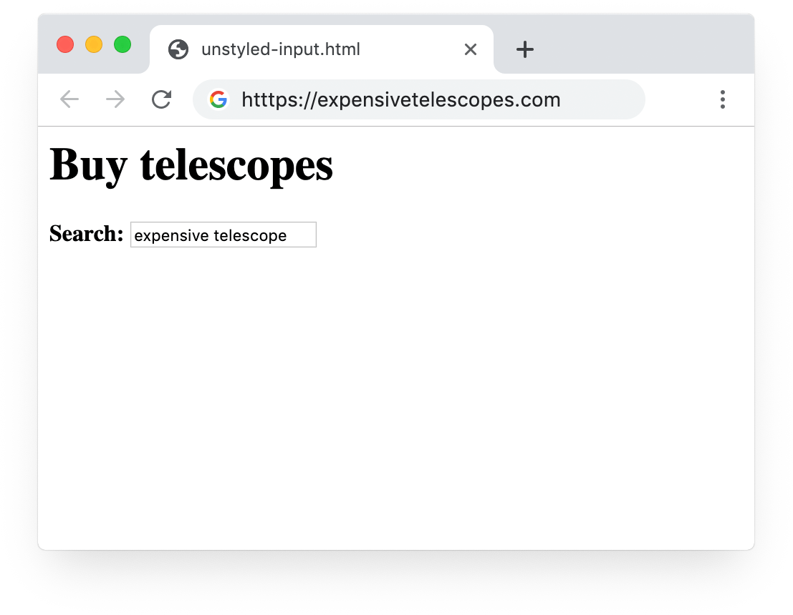

Likewise, allow enough space to enter and display text without overflowing.
Avoid this:

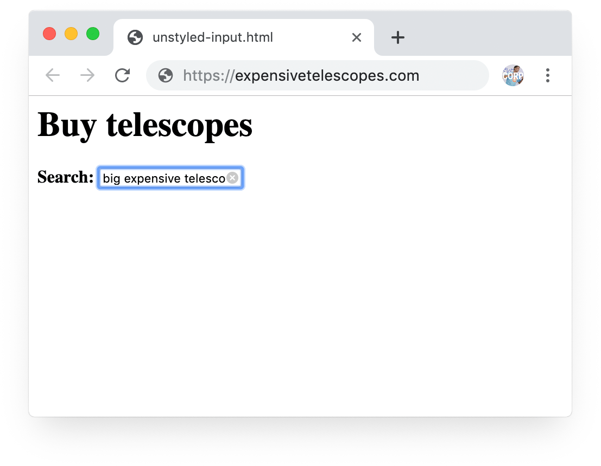

Major e-commerce sites virtually always have large search inputs at the top of
the page: full width on mobile and expanding to fit available width on desktop.


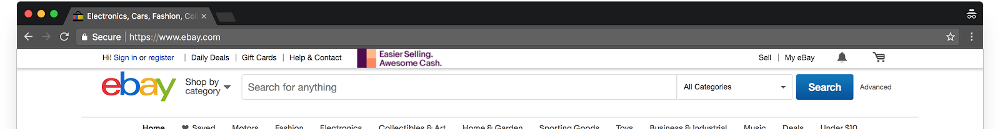

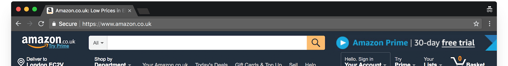

[Baymard Institute](https://baymard.com/ecommerce-search/benchmark/page-types/search-field)
has over 100 other examples.


**A search input is a touch target.**

For many years,
[UI guidelines from Apple, Microsoft and others](https://www.lukew.com/ff/entry.asp?1085)
have recommended touch target sizes corresponding to human finger size: a
minimum physical display width and height of around 7–9 mm, with a minimum of 2
mm between items.

Users may also want to select a search input using their thumb—and thumbs need
larger targets than fingers.

Major e-commerce sites such as Amazon and eBay all follow this rule. Browsers
use an even bigger input size for the URL bar.


## Style it!

The default browser styling for input elements is small and tight, using the
default sans-serif font. This means that without adding CSS, input elements are
much too small on mobile as a touch target, and unpleasantly constricted for
viewing or entering text, even on desktop.

Unless you style it, an input element looks like this:


You need to add adequate padding (at least 5px) and style text using a font that
matches style for your site. You'll probably also want to set the border width,
colour (and possibly radius).

The UK retailer [John Lewis](https://www.johnlewis.com/) do this really well. Colors, type
design and spacing follow house style and makes search feel like an integral
part of the experience:

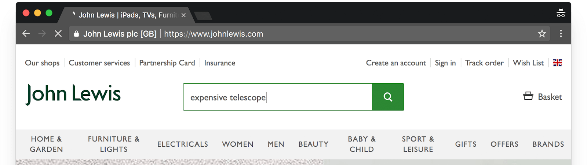

Use CSS Flex and CSS Grid to ensure your search input resizes responsively to
fit mobile and desktop viewport widths.


There is a complete code sample for this at
[search-input-header.glitch.me](https://search-input-header.glitch.me/).

## Add an SVG magnifying glass icon

Most e-commerce sites display a magnifying glass icon next to or inside the
search input element.

Unless you have a very good reason not to, you should do
the same. Consider your users' expectations and follow the
[Rule of Least Surprise](https://en.wikipedia.org/wiki/Principle_of_least_astonishment).
The magnifying glass icon has been used for many years to represent search and
is now one of the few icons that is
[well understood by most people](https://www.nngroup.com/articles/magnifying-glass-icon/).

It's straightforward to add an icon to an input with an inline SVG: see the
[code sample](https://codepen.io/samdutton/pen/MBxxbm). SVG is [supported by all
modern browsers](https://caniuse.com/#search=SVG), and many open source SVG
magnifying glass icons are available, such as those from the [Noun
Project](https://thenounproject.com/term/open-source/)(and the one from
[material.io/icons](https://material.io/icons/) which is used in the [code
sample](https://codepen.io/samdutton/pen/MBxxbm)). Inline SVGs are also
generally
[a better alternative to icon fonts](https://css-tricks.com/icon-fonts-vs-svg/),
especially if you're only using one or two images: no additional requests, less
page weight, less code to maintain and update.

## Don't make users tap or click to display the search input

Many sites force you to tap or click an icon to display the search input. This might
not sound like a big deal, but every tap and click is one more hurdle between
the user and a conversion.

Not displaying the search input makes search much less obvious. Usability
research shows that when users want to search, they look for
[‘the little box where I can type'](https://www.nngroup.com/articles/search-visible-and-simple/).

The page below from an otherwise excellent site makes you click the
magnifying glass, then enter text. Why not just show the search input?


On mobile, this is even more common:


Why not just include the search input itself?


It's worth noting that Amazon, eBay and many other major retailers always
display the search input. The global fashion retailer Lyst found that replacing
the search icon with a search box
[increased usage by 43% on desktop, 13% on mobile](https://www.thinkwithgoogle.com/intl/en-cee/success-stories/local-case-studies/lyst-increases-overall-conversion-rate-25-making-usability-improvements/).

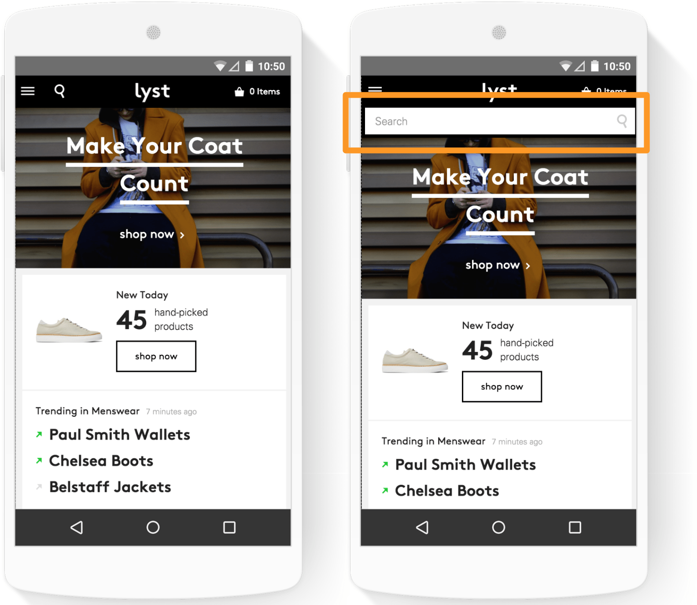

## Make the search icon obvious

Users may not understand that a magnifying glass represents search if the icon
is heavily stylised.
For example, on some sites you need to understand that a circle with a tiny line
to one side means ‘click on me to enter text so you can search'.
Consider visual and textual literacy.

<blockquote style="margin: 0 0 20px 0;padding: 10px;">
<p>… lower-literacy users don't scan text. As a result, for example, they
can't quickly glance at a list of navigation options to select the one they
want.<br>
— <a href="https://www.nngroup.com/articles/writing-for-lower-literacy-users"
  title="Norman Nielsen article about writing for low literacy">Norman Nielsen</a></p>
</blockquote>

## Enable users to search by pressing return or by clicking the search icon

Sounds obvious, but many sites don't do this.

To initiate search after entering query text, some people prefer to tap or click
the search icon, whereas others like to press return. If a user tries either of
these methods and it doesn't work, they are forced to try again, or possibly
just give up.

You can enable the tap/click-or-press-return combination by using a form, as
shown in the code sample at
[search-input-form.glitch.me/](https://search-input-form.glitch.me/).

Alternatively, you can use JavaScript as in the code sample at
[search-input-js.glitch.me/](https://search-input-js.glitch.me/).

## Don't make users sign in to search

Enough said.

## Think twice about ‘instant search'

In some contexts, it can make sense to display results as soon as a match is
found while text is being entered in the search input. Algolia, for example,
provides a JavaScript library for this, and they have a
[demo](https://community.algolia.com/instantsearch.js/v2/examples/e-commerce/)
that uses Amazon product data.

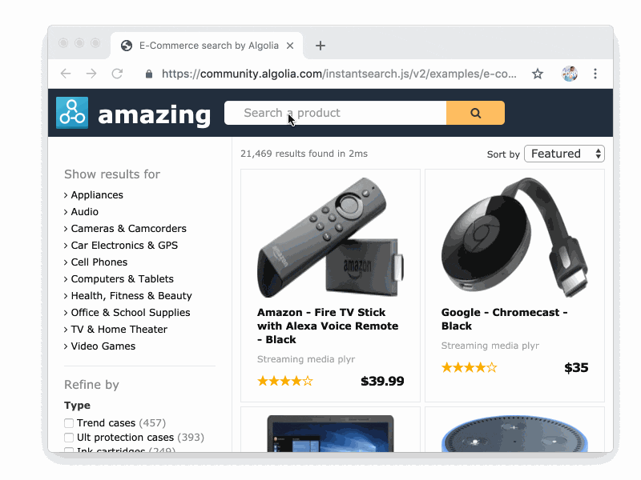

Pretty impressive. Notice how the categories on the left update dynamically, as
do the text highlights in the search results.

Instant search has the advantage of enabling users to try out alternative
queries dynamically, without needing to tap, click or press return. There's no
need to navigate to a search results page. When done right, instant search feels
highly responsive.

However, very few e-commerce sites use it: user action is required to retrieve
results.

The problem is that ‘instant search' feels hyperactive and unstable. It's too
distracting.

‘Instant' search can also be janky and unpredictable on a poor connection: it's
hard for ‘instant' to fail gracefully. Dynamic updates require processing and a
request to the server every time the query changes, which can consume a lot of
CPU, battery and available bandwidth.

A good tradeoff, which many sites now use, is not to update the content of the
page, but provide a rich autocomplete experience, sometimes even with thumbnail
previews of products. This enables a highly responsive input experience, with an
acceptable fallback if connectivity is inadequate.

## Show recent searches

A high proportion of searches are repeat searches: people often search for the
same thing repeatedly, even during the same session.
Because of this it often makes sense to provide recent-search suggestions—and
potentially cache assets for recent searches, such as images or product data.
Again, [John Lewis](https://johnlewis.com/) do this well:

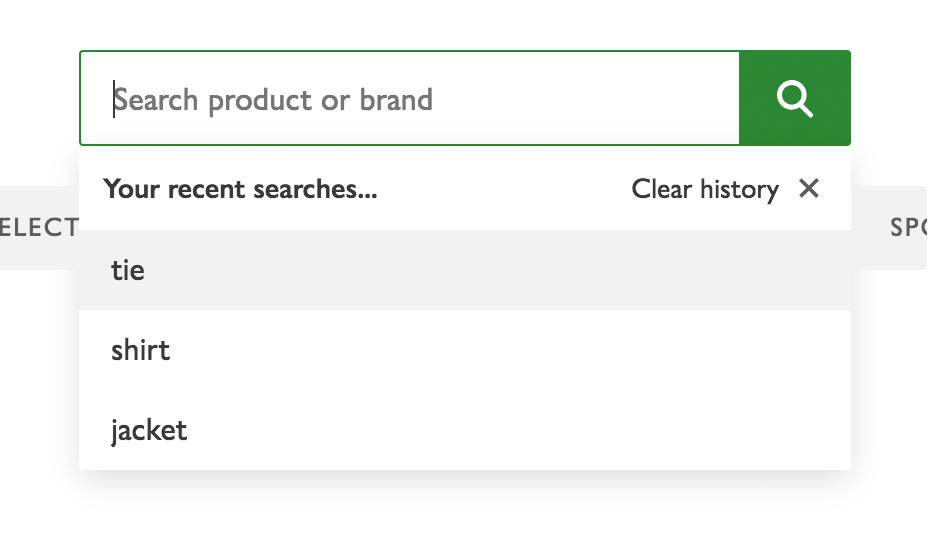

A simple way to implement this is by using the form or input autocomplete
attribute—see our [code sample and demo](https://search-input-header.glitch.me).

## Retain query text

People often want to repeat a search, or refine a search by adding to a previous
query. Being forced to re-enter search text is annoying—especially on mobile.
Retain text in the search input by saving the query value on the server, or by
saving state on the client (for example, by using sessionStorage).
You can add functionality to enable clearing the input text—the standard UI
component for this is an X in the input. Safari and Chrome on desktop provide
this by default if you set the input type to search. You can see an example of
this in the [code demos](https://codepen.io/samdutton/pen/MBxxbm).

## Provide suggestions and completions

Automated suggestions and completions can make search quicker, easier and more
successful:

+   Reduce the need to type—especially important on mobile.
+   Suggest products—potentially a product the customer was not aware of.
+   Reduce spelling errors.

Automated completion can be as simple as adding an autocomplete attribute to the
input element: see the [code sample](https://codepen.io/samdutton/pen/MBxxbm).
This enables the browser to suggest completions based on recent searches.
(Remember that
[a high proportion of searches are repeat searches](http://www.cond.org/sigir07.pdf)!)
Many search platforms offer enhanced autocomplete functionality. Algolia and
other search engines provide
[autocomplete integration](https://github.com/algolia/autocomplete.js/blob/master/README.md)
with a number of frameworks and platforms (there is a demo
[here](https://codepen.io/Algolia/pen/OXgkxv)).

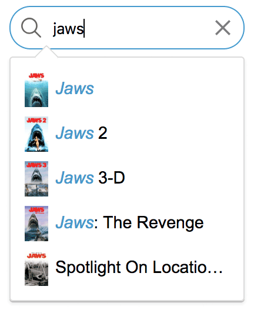

Automated suggestions can help customers their search right on input, rather
than sifting through irrelevant results. For example,a surf shop may sell
surfboard wax, but surfboard descriptions may also mention board and wax,
leading to irrelevant results for board wax, as in the example
below.

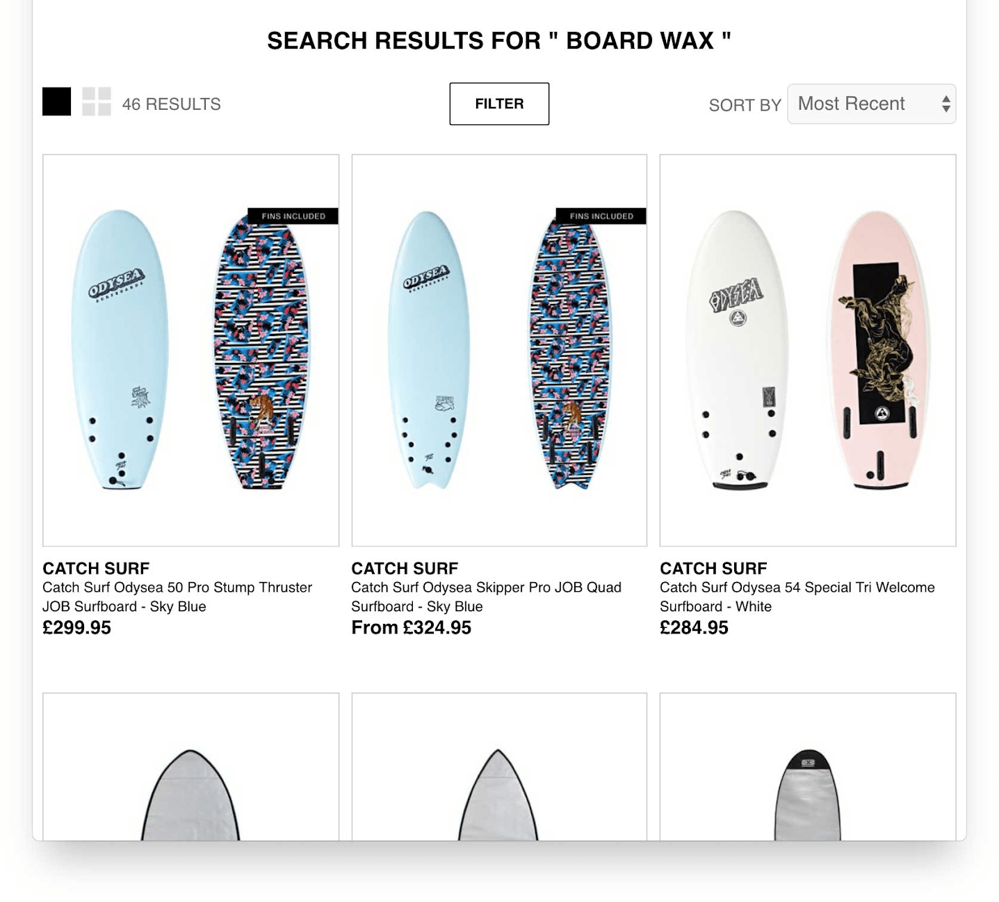

Providing category or product suggestions in the search input would fix that.
Automated suggestions also enable customers to clarify ambiguous queries: if a
user searches for light the search input can suggest alternatives to narrow the
search.

There are many more examples of auto-completion options
[here](https://baymard.com/ecommerce-search/benchmark/page-types/autocomplete-suggestions).

## Enable synonym search

This is crucial for product search, where people tend to use different words for
the same thing: shoes or footwear, wellies or wellingtons or gumboots.
Synonym search is particularly important if you have customers from different
regions who make different word choices.

## Be ‘typo tolerant'

It's easy to make mistakes while entering text, especially on mobile. ‘Typo
tolerance' and auto-correction are now expected by users as the norm for text
entry.

Spelling can be particularly tricky for product names (‘Johnny Walker' or
‘Johnnie Walker'?) and for product identifiers (‘GF1–9' versus ‘GFI-9).


A high proportion of people struggle with spelling.

Nielsen Norman estimate that
[around 40% of people using the web have low literacy levels](https://www.nngroup.com/articles/writing-for-lower-literacy-users/).
They recommend designing homepage content at a 6th grade reading level.

But even people with a high level of literacy can have difficulty getting
spelling right—particularly those whose first language is not the language of
your website.


It's true that
[Solr](https://lucene.apache.org/solr/guide/7_4/spell-checking.html),
[Elasticsearch](https://www.elastic.co/guide/en/elasticsearch/guide/current/fuzzy-matching.html),
[Algolia](https://www.algolia.com/doc/guides/textual-relevance/typo-tolerance/)
and other search engines provide functionality to handle misspellings
server-side. However, it's generally better to try to correct input errors on
the input side, instead of (or as well as) relying on the search engine itself.
Auto-suggest and auto-complete functionality to correct spellings or alternative
queries during input will usually work better than if a search engine needs to
resort to techniques such as
[fuzzy matching](https://www.elastic.co/guide/en/elasticsearch/reference/current/common-options.html#fuzziness),
which can lead to irrelevant results (when you entered ‘shurts', did you mean
‘shirts' or ‘shorts'?).

Many search engines can cope with spelling errors by letting the user clarify on
input:

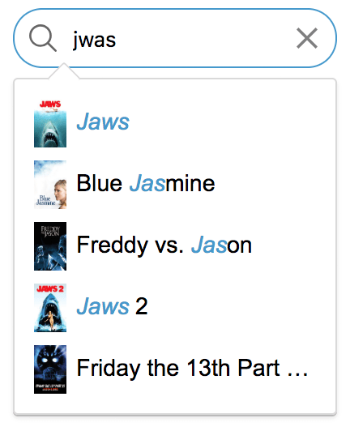


## Find out what people search for

People search and navigate in different ways for different types of products.
You need to accommodate this from the input side—particularly when
incorporating suggestion and completion.
When designing search input functionality, make sure to understand the different
types of search queries used by your customers. Online stores need to be
flexible about the way people want to find what they're looking for—even for
the same product:

+   General text search: google mobile, android phone
+   Product name: pixel, pixel phone, pixel 2
+   Product specification: pixel 64GB kinda blue
+   Product number: G-2PW4100
+   Category: phone, mobile, smartphone
+   Geospatial: secondhand pixel kings cross
+   Search expressions: mobile AND android

You might want to consider broadening search queries that fail—for example
substituting OR for AND, or expanding an exact-match search to include partial
matches, or suggesting matches for similar queries.

Something is usually better than nothing!

What people search for varies between products and stores. For example,
[UX testing from the Baymard Institute](https://baymard.com/blog/search-field-design)
shows that, ‘visually-driven industries such as apparel and home decoration in
particular saw a clear bias toward category navigation—both in terms of the
subjects' initial preference and their subsequent success rate'. For your site,
other types of search and navigation may be more dominant.


For a global audience, all this functionality must work across different
languages, character sets, text directionality, and geographical locations—and
potentially handle linguistics and cultural differences.

For example, [Japanese stemming](http://www.cjk.org/cjk/joa/joapaper.htm) is
very different from the way it's done for English, for example. Search engines
and search services all provide different approaches to internationalisation and
localisation.


The point here is to increase conversions by understanding user behaviour. For
that, you need to monitor input queries and observe how queries change during
the day, week or year—potentially in real time, to learn how products are
found (or not!) All search engine platforms offer logging tools, and [Site
Search](https://support.google.com/analytics/answer/1012264?hl=en) can be used
with Google Analytics to help you log and analyse search behaviour.

## Consider voice input

Some sites already use search query voice input on desktop as well as
mobile—not least [google.com](https://google.com/).

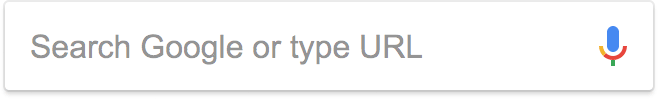

When entering text on Android or iOS, you can tap the microphone button in the
keyboard UI, and speak instead of typing.

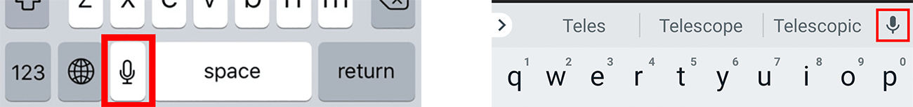

On desktop browsers, this isn't possible. To enable your site to handle speech
input on desktop you will need to build your own UI and JavaScript components to
initiate microphone access and convert speech to text, using the
[Web Speech API](https://developer.mozilla.org/en-US/docs/Web/API/Web_Speech_API)
(demo [here](https://simpl.info/stt)) or a service such as [Google Cloud Speech
to Text](https://cloud.google.com/speech-to-text/).

Search without typing text can be invaluable in contexts where text entry is
difficult—for example, while driving or cooking—and for people who have
difficulty typing, or in regions with multiple dialects or spelling variations.

However, speech recognition requires a round trip to a server to provide a text
result before then doing a search query. This uses battery and bandwidth and can
result in frustrating inaccuracies and irrelevant results.

The text of a voice search can be very different from what's entered via a
keyboard and visual interface. For example, ‘Show me red party dresses under
$200' compared to a ‘party dress' query refined by price and colour. The ability
to handle natural language queries is becoming a critical requirement for search
engines, as artificial intelligence, machine learning and digital assistant
platforms become increasingly ubiquitous and capable.

All in all—try out voice search, and check if your customers are already using
it on mobile. The blog post
[Build a voice-to-text search](https://www.algolia.com/doc/tutorials/getting-started/build-voice-search/)
provides a brief summary of what's required.

## Whatever you do, test

Whenever you make changes, test the results and keep an eye on analytics and
search logging.

Build
[discount usability testing](https://www.nngroup.com/articles/discount-usability-20-years/)
into your workflow. You don't need a fancy usability lab to improve search input
design: simple, iterative user testing and prototyping, done early, with a few
participants, will help avoid expensive design mistakes.
Make it easy for non-techies to monitor and understand search input data:

+   What are people searching for most? What are people _not_ searching for?
+   How does search input vary across platforms? When is search used for
    discovery rather than making a purchase?
+   When and why do some queries provide no results? Can these be fixed by
    adding synonyms, spellchecking, or other changes to search input? Are there
    data problems? Maybe you need to expand your product range.
+   When does a search lead to a sale or other type of ‘conversion'?
+   Do some searches result in users exiting the site rather than clicking
    on a result?
+   Does search input prominence detract from browsing—or vice versa?

## Find out more

+   Baymard Institute:
    [E-Commerce Search Field Design and Its Implications](https://baymard.com/blog/search-field-design)
    provides detailed consumer behaviour research. They have
    [110 different examples](https://baymard.com/ecommerce-search/benchmark/page-types/search-field)
    of search field design (though they're mainly from the US).
+   [Placeholders in Form Fields Are Harmful](https://www.nngroup.com/articles/form-design-placeholders/)
    and
    [Don't Use The Placeholder Attribute](https://www.smashingmagazine.com/2018/06/placeholder-attribute/):
    good reasons not to use placeholders.
+   Google Analytics [Site
    Search](https://support.google.com/analytics/answer/1012264?hl=en): search
    analytics.

## Code samples and demos
+   [Responsive search input using JavaScript](https://search-input-js.glitch.me)
+   [Responsive search input using a form](https://search-input-form.glitch.me)
+   [Complete responsive header element with branding, search and cart](https://search-input-header.glitch.me)

## Next steps

+   [Add search to your website]()
    [TODO: web.dev link]
Overview of the guides in this series.
+   [Choose a product search engine]()
[TODO: web.dev link]
    Learn how to choose between server and client-side alternatives.
+   [Help customers search]()
[TODO: web.dev link]
    Make the most of search engine features that help customers input search text.
+   [Successful search results]()
    [TODO: web.dev link]
Discover best practice for displaying product lists.
+   [Build offline search]() [TODO: web.dev link]
    Learn how to build search that doesn't need an internet connection.
