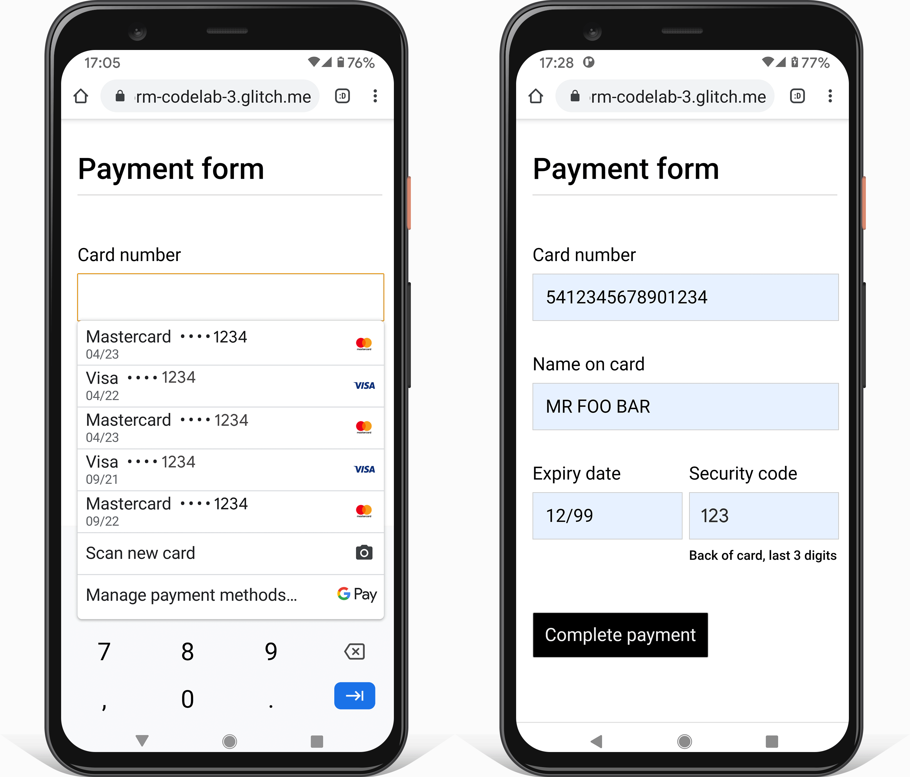

This codelab shows you how to build payment and address forms that are secure, accessible and easy to use.

First: build a payment form.

## Step 1: Use HTML as intended

Use elements built for the job: 
* `<form>`
* `<section>`
* `<label>`
* `<input>`, `<select>`, `<textarea>`
* `<button>`

As you'll see, these elements enable built-in browser functionality, improve accessibility, and 
add meaning to your markup.


* Add the following code inside the `<body>` element:

```html
<main>
    
  <form action="#" method="post">

    <h1>Payment form</h1>

    <section>        
      <label>Card number</label>
      <input>
    </section>

    <section>        
      <label>Name on card</label>
      <input>
    </section>

    <section id="cc-exp-csc">
      <div>
        <label>Expiry date</label>
        <input>
      </div> 
      <div>
        <label>Security code</label>
        <input>
        <div class="explanation">Back of card, last 3 digits</div>
      </div>
    </section>  

    <button id="complete-payment">Complete payment</button>

  </form>

</main>
```

Here's how your `index.html` should look at this point:



Click **View App** to preview your payment form. 

* Does the form work well enough as it is?
* Is there anything you would change to make it work better?
* How about on mobile?

Click **View Source** to return to your source code.

## Step 2: Design for mobile and desktop

The HTML you added is valid, but the default browser styling makes the form hard to use, especially 
on mobile. It doesn't look so good, either!

You need to ensure your forms work well on a range of devices by adjusting padding, margins, and 
font sizes. 

Click the **View Source** button below, copy all the CSS and paste it into your own `main.css` file.



That's a lot of CSS! The main things to be aware of are the changes to sizes:

* `padding` and `margin` are added to inputs.
* `font-size` and other values are different for different viewport sizes.

When you're ready, click **View App** to see the styled form.  You'll also notice that borders have 
been adjusted, and `display: block;` is used for labels so they go on a line on their own, and 
inputs can be full width. [Sign-in form best practices](https://web.dev/sign-in-form-best-practices/#label:~:text=put%20your%20labels%20above%20your%20inputs) 
explains why this is probably best.

The `:invalid` selector is used to indicate when an input has an invalid value. (You'll use this 
later in the codelab.)

The CSS is mobile-first:

* The default CSS is for viewports less than `400px` wide.
* [Media queries](https://developer.mozilla.org/en-US/docs/Learn/CSS/CSS_layout/Media_queries) are 
used to override the default for viewports that are at least `400px` wide, and then again for 
viewports that are at least `500px` wide. This should work well for smaller phones, mobile devices 
with larger screens, and on desktop. 

Whenever you build for the web, you need to test on different devices and viewport sizes. That's 
especially true for forms, because one small glitch can make them unusable. You should always adjust 
[CSS breakpoints](/responsive-web-design-basics/#breakpoints) to ensure they work well with your 
content and your target devices.

There are several ways to test your form on different devices:

* [Use Chrome DevTools Device Mode](https://developers.google.com/web/tools/chrome-devtools/device-mode) 
to simulate mobile devices. 
* [Send the URL from your computer to your phone](https://support.google.com/chrome/answer/9430554).
* Use a service such as [BrowserStack](https://www.browserstack.com/open-source) to test on a range 
of devices and browsers. 

* Is the whole form visible? 
* Are the form inputs big enough? 
* Is all the text readable?
* Did you notice any differences between using a real mobile device, and viewing the form in 
Device Mode in Chrome DevTools?
* Did you need to adjust breakpoints?

## Step 3: Add input attributes to enable built-in browser features

Enable the browser to store and autofill input values, and provide access to secure built-in 
payment and validation features.

Add attributes to the form in your `index.html` file so it looks like this:

```html/5,6,10,11,16,17,20,21
<form action="#" method="post">

  <h1>Payment form</h1>

  <section>        
    <label for="cc-number">Card number</label>
    <input id="cc-number" name="cc-number" autocomplete="cc-number" inputmode="numeric" pattern="[\d ]{10,30}" required>
  </section>

  <section>        
    <label for="cc-name">Name on card</label>
    <input id="cc-name" name="cc-name" autocomplete="cc-name" pattern="[\p{L} \-\.]+" required>
  </section>
  
  <section id="cc-exp-csc">      
    <div>
      <label for="cc-exp">Expiry date</label>
      <input id="cc-exp" name="cc-exp" autocomplete="cc-exp" placeholder="MM/YY" maxlength="5" required>
    </div> 
    <div>
      <label for="cc-csc">Security code</label>
      <input id="cc-csc" name="cc-csc" autocomplete="cc-csc" inputmode="numeric" maxlength="3" required>
      <div class="explanation">Back of card, last 3 digits</div>
    </div>
  </section>  

  <button id="complete-payment">Complete payment</button>

</form>
```

View your app again and then tap or click in the **Card number** field. Depending on the device and 
platform, you may see a chooser showing payment methods stored for the browser, like the one below. 

Once you select a payment method and enter your security code, the browser autofills the form using 
the payment card `autocomplete` values you added to the form:

* `cc-number`
* `cc-name`
* `cc-exp`
* `cc-csc`

Many browsers also check and confirm the validity of credit card numbers and security codes.


Don't be alarmed! Your browser may be able to autofill the form with stored payment card data, but 
no payment can be made, and no data is transferred or saved.


On a mobile device you'll also notice that, as soon as you tap into the **Card number** field, you 
get a numeric keyboard. That's because you used `inputmode="numeric"`. For numeric fields this makes 
it easier to enter numbers and impossible to enter non-numeric characters. This in turn helps remind 
users of the type of data they're entering when a value can't be autofilled.

<figure class="w-figure">
  
  <figcaption class="w-figcaption">Built-in browser payment chooser and autofill.</figcaption>
</figure>

It's extremely important to correctly add all available `autocomplete` values to payment forms. It's 
quite common for sites miss out the `autocomplete` value for the card expiry date and other fields. 
If a single `autofill` value is wrong or missing, users will need to retrieve physical cards to 
manually enter card data, and you may lose out on a sale. If autofill on payment forms doesn't work 
properly, users may also decide to keep a record of payment card details on their phone or computer, 
which is highly insecure. 


Research shows that [it may be better use separate select elements for month and year](https://baymard.com/blog/how-to-format-expiration-date-fields) rather than a single input. It's up to you which you think is 
best. Test this out by remixing and editing the HTML from our complete 
[payment form demo](https://glitch.com/~payment-form), which includes code for both types of expiry 
date field.


Try submitting the payment form with an empty field. The browser prompts to complete missing 
data. Now add a letter to the value in the **Card number** field and try submitting the form. The 
browser warns that value is invalid. This happens because you used the `pattern` attribute to 
specify valid values for a field. The same works for `maxlength` and other 
[validation constraints](https://developer.mozilla.org/en-US/docs/Web/Guide/HTML/HTML5/Constraint_validation) 
No JavaScript required.

Your payment form should now look this:



* Try removing `autocomplete` values and filling in the payment form. What difficulties do you 
encounter?
* Try out payment forms on online stores. Consider what works well and what goes wrong. Are there 
any common problems or best practices you should follow?

## Step 4: Disable the payment button once the form is submitted.

You should consider disabling a submit button once the user has tapped or clicked it—especially when 
the user is making payment. Many users click buttons repeatedly, even if they're working fine. That 
can cause problems with payment processing and add to server load. 

Add the following JavaScript to your `js/main.js` file:

``` js
const form = document.querySelector('form');
const completePaymentButton = document.querySelector('button#complete-payment');

form.addEventListener('submit', handleFormSubmission);

function handleFormSubmission(event) {
  event.preventDefault();
  if (form.checkValidity() === false) {
    // Handle invalid form data.
  } else {
    completePaymentButton.textContent = 'Making payment...';
    completePaymentButton.disabled = 'true';
    setTimeout(() => {alert('Made payment!');}, 500);
  }
}
```

Try submitting the payment form and see what happens. 


Some sites leave form submit buttons disabled until the user has correctly completed all form 
fields. It's best not to do that, since users may accidentally leave out a required value, or use an 
invalid value, then tap or click the disabled submit button and assume your site is broken! Even if 
you mark form values as invalid or missing, the user may not see the warnings (especially for longer 
forms, and on mobile). Better to validate inline while the user is entering data–*and* when they 
try to submit the form.


Here is how your code should look at this point:



* Look at the JavaScript code for payment-form-codelab-4 (as shown above). You'll notice 
commented-out code for data validation. This uses the 
[Constraint Validation API](https://html.spec.whatwg.org/multipage/forms.html#constraints) 
(which is [widely supported](https://caniuse.com/#search=constraint%20validation)) to add custom 
validation, using built-in browser UI to set focus and display prompts. Try it out! 

## Step 5: XXXXX


**For bonus points:** try out something blah blah blah.

Here's how your code should look at this point:



## Going further

We won't show them here, but four crucial payment-and-address form features are still missing:

* Add a **Forgot your password?** link: make it easy for users to reset their password.

* Link to your Terms of Service and privacy policy documents: make it clear to 
users from the start how you safeguard their data.

* Consider style and branding: make sure these match the rest of your site. 

* Add [Analytics and RUM](/payment-and-address-form-best-practices#analytics): enable the 
performance and usability of your form design to be tested and monitored for 
real users. 
