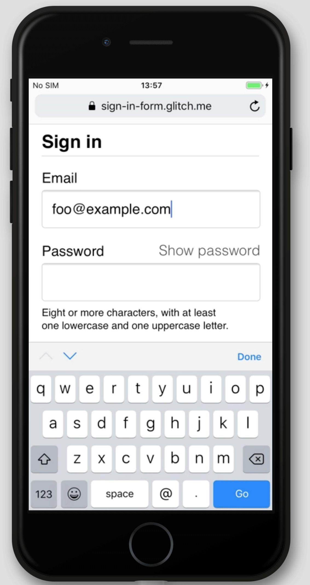

This codelab shows you how to build payment and address forms that are accessible and easy to use.

## Step 1: Use HTML as intended

Use elements built for the job: 
* `<form>`
* `<section>`
* `<label>`
* `<input>`
* `<select>`
* `<textarea>`
* `<select>`
* `<button>`

As you'll see, these elements enable built-in browser functionality, improve accessibility, and 
add meaning to your markup.


* Add the following code inside the `<body>` element:

```html
<form action="#" method="post">
  <h1>Address form</h1>
  <section>
    <label>Name</label>
    <input>
  </section>
  <section>
    <label>Address</label>
    <textarea></textarea>
  </section>
  <section>
    <label>ZIP or postal code (optional)</label>
    <textarea></textarea>
  </section>
  <section>
    <label>ZIP or postal code (optional)</label>
    <textarea></textarea>
  </section>
  <section>
    <label>Country or region</label>
    <select>
      <option>Australia</option>
      <option>India</option>
      <option>United Kingdom</option>
      <option>United States</option>
    </select>
  </section>
  <button>Sign up</button>
</form>
```

Here's how your `index.html` should look at this point:



Click **View App** to preview your sign-in form.
The HTML you just added is valid and correct, but the default browser styling
means it looks terrible and it's hard to use, especially on mobile.

Click **View Source** to return to your source code.


## Step 2: XXXXXXXXXXXXXX

Explanation of this step blah blah blah.

Copy and paste the following CSS into your own `style.css` file:



Click **View App** to check out your freshly styled payment-and-address form. Then
click **View Source** to return to `style.css`.

This is what's happening blah blah blah

When building your own form like this, it's very important at this point to
test your code on real devices on desktop and mobile:

* Is something working blah blah blah?
* Is something else working blah blah blah?

## Step 3: XXXXXXXXXXX

Explanation of this step blah blah blah.

Add blah blah to your HTML so it looks like this:

```html/3,4,7,8,10
<form action="#" method="post">
  <h1>Sign in</h1>
  <section>        
    <label for="email">Email</label>
    <input id="email" name="email" type="email" autocomplete="username" required autofocus>
  </section>
  <section>        
    <label for="current-password">Password</label>
    <input id="password" name="password" type="password" autocomplete="new-password" required>
  </section>
  <button id="payment-and-address">Sign in</button>
</form>
```

View your app again and then do something blah blah. Notice blah blah blah.

Try doing something blah blah blah. Notice something blah blah blah. For example blah blah blah.
All of this happens because blah blah blah.

<figure class="w-figure">
  
</figure>

Try something else blah blah.

It's extremely important to test behaviour across platforms. Try entering values 
and submitting the form in different browsers on different devices. It's easy to 
test on a range of platforms using BrowserStack, which is [free for open source 
projects](https://www.browserstack.com/open-source). Try it out!

Here's how your `index.html` should look at this point:



## Step 4: XXXXX

## Step 5: XXXXX


**For bonus points:** try out something blah blah blah.

Here's how your code should look at this point:



## Going further

We won't show them here, but four crucial payment-and-address form features are still missing:

* Add a **Forgot your password?** link: make it easy for users to reset their password.

* Link to your Terms of Service and privacy policy documents: make it clear to 
users from the start how you safeguard their data.

* Consider style and branding: make sure these match the rest of your site. 

* Add [Analytics and RUM](/payment-and-address-form-best-practices#analytics): enable the 
performance and usability of your form design to be tested and monitored for 
real users. 
