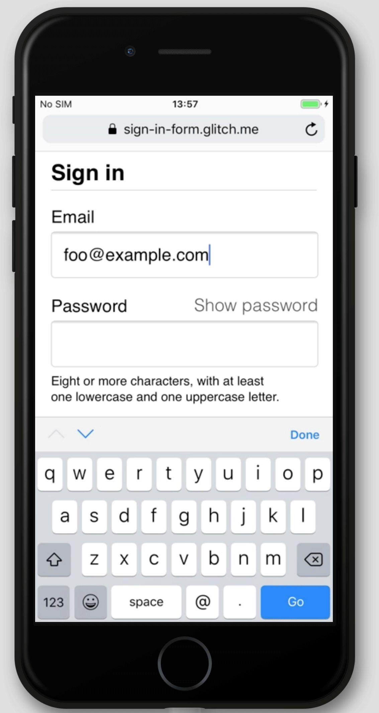

This codelab shows you how to build a sign-in form that is secure, accessible, and easy to use.

## Step 1: Use meaningful HTML

Use elements built for the job: 
* `<form>`
* `<section>`
* `<label>`
* `<button>`

As you'll see, these elements enable built-in browser functionality, improve 
accessibility, and add meaning to your markup.


* Add the following code inside the `<body>` element:

```html
<form action="#" method="post">
  <h1>Sign in</h1>
  <section>
    <label>Email</label>
    <input>
  </section>
  <section>
    <label>Password</label>
    <input>
  </section>
  <button>Sign in</button>
</form>
```

Here's how your `index.html` should look at this point:



Click **View App** to preview your sign-in form.
The HTML you just added is valid and correct, but the default browser styling
means it looks terrible and it's hard to use, especially on mobile.

Click **View Source** to return to your source code.

## Step 2: Design for fingers and thumbs

Ensure your inputs work well on mobile by adjusting padding, margins, and 
font sizes. 

Copy and paste the following CSS into your own `style.css` file:



Click **View App** to check out your freshly styled sign-in form. Then
click **View Source** to return to `style.css`.

That's quite a lot of code! The main things to be aware of are the changes to sizes:

* `padding` and `margin` are added to inputs.
* `font-size` is different for mobile and desktop.

The `:invalid` selector is used to indicate when an input has an invalid value.
This doesn't work yet.

The CSS layout is mobile-first:

* The default CSS is for viewports less than `450px` wide.
* The media query section sets overrides for viewports that are at least `450px` wide.

When building your own form like this, it's very important at this point to
test your code on real devices on desktop and mobile:

* Is label and input text readable, especially for people with low vision?
* Are the inputs and **Sign in** button large enough to use as touch targets for thumbs?

## Step 3: Add input attributes to enable built-in browser features

Enable the browser to store and autofill input values, and provide access to 
built-in password management features.

Add attributes to your form HTML so it looks like this:

```html/3,4,7,8,10
<form action="#" method="post">
  <h1>Sign in</h1>
  <section>        
    <label for="email">Email</label>
    <input id="email" name="email" autocomplete="username" type="email" required autofocus>
  </section>           
  <section>        
    <label for="current-password">Password</label>
    <input id="current-password" name="current-password" autocomplete="current-password" type="password" minlength="8" required>
  </section>
  <button id="sign-in">Sign in</button>
</form>
```

View your app again and then click the label that says **Email**.
Notice how focus moves to the email input.
This is because the label is associated with the input via the `for="email"` attribute.
Screenreaders also announce the label text when the label or the label's associated
input gets focus.

Try focusing the email input on a mobile device. Notice how the keyboard is optimized
for typing an email address. For example, the `@` and `.` characters might be shown on
the primary keyboard, and the operating system might show stored emails above the keyboard.
All of this happens because the `type="email"` attribute is applied to an `<input>` element.

<figure class="w-figure">
  
</figure>

Try typing some text into the password input. The text is hidden by default because the
`type="password"` attribute has been applied to the element.

* The `autocomplete`, `name`, `id`, and `type` attributes help browsers understand 
the role of inputs in order to store data that can later be used for autofill. 

Try focusing the email input on a desktop device and start typing.
You can find the URL of your app by clicking **Fullscreen**
. 
If you've stored any email addresses in your browser, you'll probably see a popup that 
allows you to select from those stored emails. This happens because the 
`autocomplete="username"` attribute was applied to the email input.

* `autocomplete="username"` and `autocomplete="current-password"` help browsers use 
stored values to autofill the inputs.


For email inputs use `autocomplete="username"`, since `username` is recognized 
by password managers in modern browsers—even though you should use `type="email"` 
and you may want to use `id="email"` and `name="email"`.


Different browsers use [different techniques](/sign-in-form-best-practices/#password-managers:~:text=Browser%20password%20and%20autofill%20systems%20are%20not%20simple) 
to work out the role of form inputs and provide autofill for a range of 
different websites. 

Try this out for yourself by adding and removing attributes.

It's extremely important to test behaviour across platforms. Try entering values 
and submitting the form in different browsers on different devices. It's easy to 
test on a range of platforms using BrowserStack, which is [free for open source 
projects](https://www.browserstack.com/open-source). Try it out!

Here's how your `index.html` should look at this point:



## Step 4: Add UI to toggle password display

Enable users to see the password they entered.

Usability experts [strongly recommend](https://www.nngroup.com/articles/stop-password-masking/) adding a **Show password** icon or button to enable users to check the text they've entered. There's currently [no built-in way to do this](https://twitter.com/sw12/status/1251191795377156099), so you'll need to implement it yourself with JavaScript.  

Code to add **Show password** functionality is straightforward—this example uses text, not an icon.

Update [index.html](https://glitch.com/edit/#!/sign-in-form-codelab-4?path=index.html:22:2), [style.css](https://glitch.com/edit/#!/sign-in-form-codelab-4?path=style.css:34:0) and [script.js](https://glitch.com/edit/#!/sign-in-form-codelab-4?path=script.js) as follows.

Add the toggle button to the password section in the HTML:

```html/2
<section>
  <label for="password">Password</label>
  <button id="toggle-password" type="button" aria-label="Show password as plain text. Warning: this will display your password on the screen.">Show password</button>
  <input id="password" name="password" type="password" autocomplete="current-password" required>
</section>
```

Add the following CSS to the bottom of `style.css`.
This makes the **Show password** button actually
looks like plain text, and displays it at the top right of the password section:

```css
button#toggle-password {
  background: none;
  border: none;
  cursor: pointer;
  font-weight: 300;
  padding: 0;
  position: absolute;
  top: -4px;
  right: -2px;
}
```

Add the following JavaScript to `script.js` to toggle password display and set the appropriate `aria-label`:

```javascript
const passwordInput = document.getElementById('password');
const togglePasswordButton = document.getElementById('toggle-password');

togglePasswordButton.addEventListener('click', togglePassword);

function togglePassword() {
  if (passwordInput.type === 'password') {
    passwordInput.type = 'text';
    togglePasswordButton.textContent = 'Hide password';
    togglePasswordButton.setAttribute('aria-label',
      'Hide password.');
  } else {
    passwordInput.type = 'password';
    togglePasswordButton.textContent = 'Show password';
    togglePasswordButton.setAttribute('aria-label',
      'Show password as plain text. ' +
      'Warning: this will display your password on the screen.');
  }
}
```

Try out the show password logic now. View your app, enter some text into the
password field, and then click the **Show password** button.
Try out your new feature on multiple browsers on different operating systems.

Try it out! Think about UX design: will users notice the **Show password** 
button and understand it? Is there a better way to provide this functionality? 
This is a good moment to try out [Discount Usability Testing](https://www.nngroup.com/articles/discount-usability-20-years/) with a small group of friends or colleagues.

To understand how this site works for screenreaders, install the [ChromeVox extension](https://chrome.google.com/webstore/detail/chromevox-classic-extensi/kgejglhpjiefppelpmljglcjbhoiplfn?hl=en) and navigate through the form. Do the 
`aria-label` values work as intended?

**Bonus points**: Sites such as [Gmail](https://mail.google.com) use icons, not 
text, to toggle password display. When you're done with this codelab, try implementing this using SVG images: 
the [Material Design site](https://material.io/resources/icons/?icon=visibility)
has high quality free icons available for download. 

Here's how your code should look at this point:




## Step 5: Add form validation

Help users enter data correctly: validate data before form submission, and show 
users what they need to change.

HTML form elements and attributes have built-in features for basic validation, 
but you should also use JavaScript to do more robust validation while users are 
entering data and when they attempt to submit the form.


Client-side validation helps users enter data and can avoid unnecessary server load, 
but you must always validate and sanitize data on your back-end.


This step uses the [Constraint Validation API](https://html.spec.whatwg.org/multipage/forms.html#constraints) 
(which is [widely supported](https://caniuse.com/#search=constraint%20validation)) 
to add custom validation, using built-in browser UI to set focus and display prompts. 

Tell users the constraints for passwords and any other inputs. Don't make them guess!

Update the password section of `index.html`:

```html
<section>
  <label for="password">Password</label>
  <button id="toggle-password" type="button" aria-label="Show password as plain text. Warning: this will display your password on the screen.">Show password</button>
  <input id="password" name="password" type="password" autocomplete="current-password" aria-describedby="password-constraints" required>
	<div id="password-constraints">At least eight characters, with at least one lowercase and one uppercase letter.</div>
</section>
```

This adds two new features:
* Information about password constraints.
* An `aria-describedby` attribute for the password input. Screenreaders read the label text, the input type (password), and then the description. 

Add the following CSS to the bottom of `style.css`:

```css
div#password-constraints {
  margin: 5px 0 0 0;
  font-size: 16px;
}
```

Add the following JavaScript to `script.js`:

```javascript
passwordInput.addEventListener('input', resetCustomValidity); 
function resetCustomValidity() {
  passwordInput.setCustomValidity('');
}

// A production site would use more stringent password testing. 
function validatePassword() {
  let message= '';
  if (!/.{8,}/.test(passwordInput.value)) {
		message = 'At least eight characters. ';
  }
	if (!/.*[A-Z].*/.test(passwordInput.value)) {
		message += 'At least one uppercase letter. ';
  }
	if (!/.*[a-z].*/.test(passwordInput.value)) {
		message += 'At least one lowercase letter.';
  }
  passwordInput.setCustomValidity(message);
}

const form = document.querySelector('form');
const signinButton = document.querySelector('button#sign-in');

form.addEventListener('submit', handleFormSubmission);                       

function handleFormSubmission(event) {
  event.preventDefault();
  validatePassword();
  form.reportValidity();
  if (form.checkValidity() === false) {
  } else {
    // On a production site do form submission.
    alert('Logging in!')
    signinButton.disabled = 'true';
  }
}
```

Try it out! All recent browsers have built-in features for form validation and 
support validation with JavaScript.

* Enter an invalid email address and press **Sign in**. The browser will 
display a warning—no JavaScript required!

* Enter a valid email but then press **Sign in** without entering a password value. The browser warns that 
you missed a required value and sets focus on the password input.

* Enter an invalid password and press **Sign in**. Now you'll see different 
messages, depending on what's wrong. 

**For bonus points:** try out different ways to help users enter email addresses 
and passwords. [Better password form fields](https://aerotwist.com/blog/better-password-form-fields/) has some clever suggestions.

Here's how your code should look at this point:



## Going further

We won't show them here, but four crucial sign-in form features are still missing:

* Add a **Forgot your password?** link: make it easy for users to reset their password.

* Link to your Terms of Service and privacy policy documents: make it clear to 
users from the start how you safeguard their data.

* Consider style and branding: make sure these match the rest of your site. 

* Add [Analytics and RUM](/sign-in-form-best-practices#analytics): enable the 
performance and usability of your form design to be tested and monitored for 
real users. 
