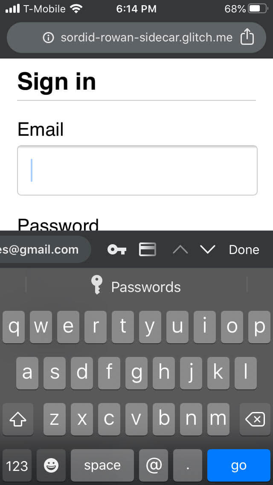

This codelab shows you how to build a login form that is secure, accessible, and easy to use.

## Step 1: Use meaningful HTML

Use elements built for the job: 
* `<form>`
* `<section>`
* `<label>`
* `<button>`

As you'll see, these elements enable built-in browser functionality, improve accessibility, and add meaning to your markup.

Add the following code inside the `<body>` element:

```html
<form id="login" action="#" method="post">
  <h1>Sign in</h1>
  <section>
    <label>Email</label>
    <input>
  </section>
  <section>
    <label>Password</label>
    <input>
  </section>
  <button>Sign in</button>
</form>
```

Here's how your `index.html` should look at this point:

<div class="glitch-embed-wrap" style="height: 480px; width: 100%;">
  <iframe
    src="https://glitch.com/embed/#!/embed/login-form-best-practices-codelab-step-1?path=index.html&attributionHidden=true&sidebarCollapsed=true"
    alt="How the Glitch should look after completing step 1."
    style="height: 100%; width: 100%; border: 0;">
  </iframe>
</div>

Click **View App** to preview your login form. 
The HTML you just added is valid and correct, but the default browser styling
means it looks terrible and it's hard to use, especially on mobile.

Click **View Source** to return to your source code.

## Step 2: Design for fingers and thumbs

TODO(kayce): One-sentence description of the goal here. 

Copy and paste the following CSS into your `style.css`:

<div class="glitch-embed-wrap" style="height: 480px; width: 100%;">
  <iframe
    src="https://glitch.com/embed/#!/embed/login-form-best-practices-codelab-step-2?path=style.css&attributionHidden=true&sidebarCollapsed=true"
    alt="The CSS to copy-paste."
    style="height: 100%; width: 100%; border: 0;">
  </iframe>
</div>

Click **View App** to check out your freshly styled login form, and then
click **View Source** to return to `style.css`.

That's quite a lot of code! The main things to be aware of are the changes to sizes:

* `padding` and `margin` are added to inputs.
* `font-size` is different for mobile and desktop.

The `:invalid` selector is used to indicate when an input has an invalid value.

The CSS layout is mobile-first:

* The default CSS is for viewports less than `450px` wide.
* The media query section sets overrides for viewports that are at least `450px` wide.

It's very important at this point to test your code on real devices on desktop and mobile:

* Is label and input text readable, especially for people with low vision?
* Are the inputs and **Log in** button large enough to use as touch targets for thumbs?

## Step 3: Add input attributes to enable built-in browser features

Add attributes to your form HTML so it looks like this:

TODO(kayce): Is the placeholder value intentional?

TODO(kayce): Clicking on the password label doesn't focus the password input.

```html/3,4,7,8,10
<form id="login" action="#" method="post">
  <h1>Sign in</h1>
  <section>        
    <label for="email">Email</label>
    <input id="email" name="email" type="email" placeholder=" " autocomplete="email" required autofocus>
  </section>
  <section>        
    <label for="current-password">Password</label>
    <input id="password" name="password" type="password" autocomplete="new-password" required>
  </section>
  <button id="sign-in">Sign in</button>
</form>
```

Click the label that says **Email**. Notice how focus moves to the email input.
This is because the label is associated to the input via the `for="email"` attribute.
Screenreaders also announce the label text when the label or the label's associated
input gets focus.

Try focusing the email input on a mobile device. Notice how the keyboard is optimized
for typing an email address. For example, the `@` and `.` characters might be shown on
the primary keyboard, and the operating system might show stored emails above the keyboard.
All of this happened because the `type="email"` attribute is applied to an `<input>` element.

<figure class="w-figure">
  
</figure>

Try typing some text into the password input. The text is hidden by default because the
`type="password"` attribute has been applied to the element.

TODO(kayce): There doesn't seem to be any user-facing change because of the name attributes?

* `name="email"` and `name="current-password"`: help browsers store named values.

Try focusing the email input on a desktop device. If you've stored any email addresses
in your browser, you'll probably see a popup that allows you to select from those
stored emails. This happened because the `autocomplete="email"` attribute was applied
to the email input.

* `autocomplete="email"` and `autocomplete="current-password"`: help browsers use stored values to autofill the inputs.

Once again, it's extremely important to test behaviour across platforms. Try entering values and submitting the form in different browsers on different devices.

Here's how your `index.html` should look at this point:

<div class="glitch-embed-wrap" style="height: 480px; width: 100%;">
  <iframe
    src="https://glitch.com/embed/#!/embed/login-form-best-practices-codelab-step-3?path=index.html&attributionHidden=true&sidebarCollapsed=true"
    alt="How index.html should look after step 3."
    style="height: 100%; width: 100%; border: 0;">
  </iframe>
</div>

## Step 4: Add UI to toggle password display

Usability experts [strongly recommend](https://www.nngroup.com/articles/stop-password-masking/) adding a **Show password** icon or button to enable users to check the text they've entered. There's currently [no built-in way to do this](https://twitter.com/sw12/status/1251191795377156099), so you'll have to do it yourself with JavaScript.  

Code to add **Show password** functionality is straightforward—this example uses text, not an icon.

Update [index.html](https://glitch.com/edit/#!/signin-form-codelab-4?path=index.html:22:2), [style.css](https://glitch.com/edit/#!/signin-form-codelab-4?path=style.css:34:0) and [script.js](https://glitch.com/edit/#!/signin-form-codelab-4?path=script.js) as follows.

Add the toggle button to the password section in the HTML:

```html/2
<section>
  <label for="password">Password</label>
  <button id="toggle-password" type="button" aria-label="Show password as plain text. Warning: this will display your password on the screen.">Show password</button>
  <input id="password" name="password" type="password" autocomplete="current-password" required>
</section>
```

Add the following CSS, so the **Show password** 'button' actually looks like plain text, displayed at the top right of the password section:

```css
button#toggle-password {
  background: none;
  border: none;
  cursor: pointer;
  font-weight: 300;
  padding: 0;
  position: absolute;
  top: -4px;
  right: -2px;
}
```

Add JavaScript to toggle password display and set the appropriate `aria-label`:

```javascript
const passwordInput = document.getElementById('password');
const togglePasswordButton = document.getElementById('toggle-password');

togglePasswordButton.addEventListener('click', togglePassword);

function togglePassword() {
  if (passwordInput.type === 'password') {
    passwordInput.type = 'text';
    togglePasswordButton.textContent = 'Hide password';
    togglePasswordButton.setAttribute('aria-label',
      'Hide password.');
  } else {
    passwordInput.type = 'password';
    togglePasswordButton.textContent = 'Show password';
    togglePasswordButton.setAttribute('aria-label',
      'Show password as plain text. ' +
      'Warning: this will display your password on the screen.');
  }
}
```

Once again, make sure to test your work on different browsers on different platforms.

**Bonus points**: Sites such as [Gmail](https://mail.google.com) use icons, not text, to toggle password display. Try implementing this using SVG images. 


[View complete code for Step 4](https://glitch.com/edit/#!/signin-form-codelab-4).



## Step 5: Add form validation

HTML form elements and attributes have built-in features for basic validation, but you should also use JavaScript to do more robust validation while users are entering data and when they attempt to submit the form.


Client-side validation helps users enter data and can avoid unnecessary server load, but you must always validate and sanitize data on your back-end.


This step uses the [Constraint Validation API](https://html.spec.whatwg.org/multipage/forms.html#constraints) (which is [widely supported](https://caniuse.com/#search=constraint%20validation)) to add custom validation, using built-in browser UI to set focus and display prompts. 

Tell users the constraints for passwords and any other inputs. Don't make them guess!

Update the HTML for the password section:

```html
<section>
  <label for="password">Password</label>
  <button id="toggle-password" type="button" aria-label="Show password as plain text. Warning: this will display your password on the screen.">Show password</button>
  <input id="password" name="password" type="password" autocomplete="current-password" aria-describedby="password-constraints" required>
	<div id="password-constraints">At least eight characters, with at least one lowercase and one uppercase letter.</div>
</section>
```

This adds two new features:
* Information about password constraints.
* An `aria-describedby` attribute for the password input. Screenreaders read the label text, the input type (password), and then the description. 

Add CSS: 

```css
div#password-constraints {
  margin: 5px 0 0 0;
  font-size: 16px;
}
```

Add the following JavaScript:

```javascript
passwordInput.addEventListener('input', resetCustomValidity); 
function resetCustomValidity() {
  passwordInput.setCustomValidity('');
}

// A production site would use more stringent password testing. 
function validatePassword() {
  let message= '';
  if (!/.{8,}/.test(passwordInput.value)) {
		message = 'At least eight characters. ';
  }
	if (!/.*[A-Z].*/.test(passwordInput.value)) {
		message += 'At least one uppercase letter. ';
  }
	if (!/.*[a-z].*/.test(passwordInput.value)) {
		message += 'At least one lowercase letter.';
  }
  passwordInput.setCustomValidity(message);
}

const form = document.querySelector('form');
const loginButton = document.querySelector('button#login');

form.addEventListener('submit', handleFormSubmission);                       

function handleFormSubmission(event) {
  event.preventDefault();
  validatePassword();
  form.reportValidity();
  if (form.checkValidity() === false) {
  } else {
    // On a production site do form submission.
    alert('Logging in!')
    loginButton.disabled = 'true';
  }
}
```


[View complete code for Step 5](https://glitch.com/edit/#!/signin-form-codelab-5).



## And finally…

We won't show them here, but three crucial signin form features are still missing:

* **Forgot your password?** link: make it easy for users to reset their password.

* Links to your Terms of Service and privacy policy documents: make it clear to users from the start how you safeguard their data.

* The logo and name of your company or organization: include these and make sure that visual styles match the rest of your site. This may sound obvious, but many sites present users with forms that don't feel like they belong to the same site.