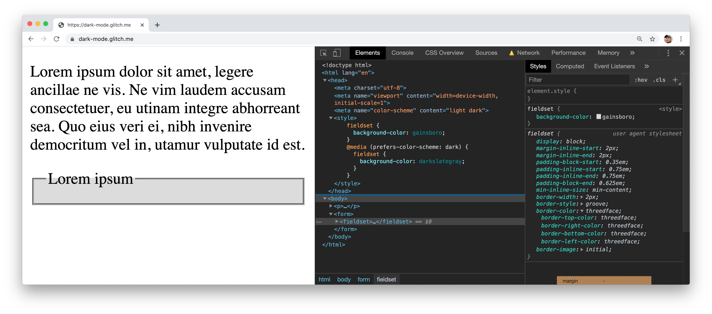
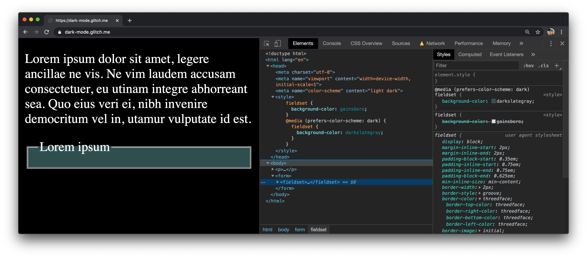
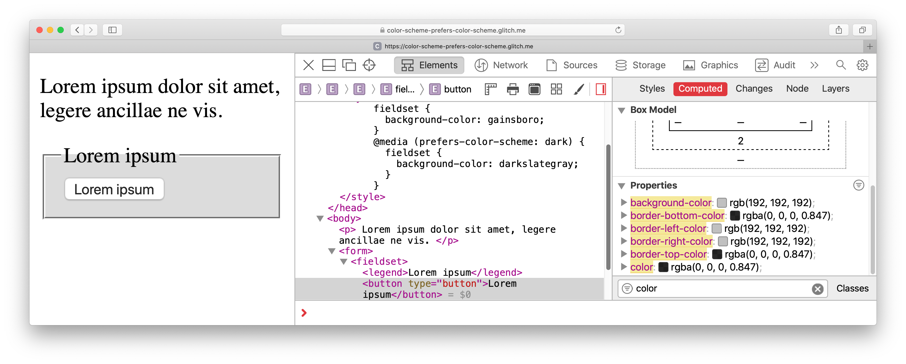
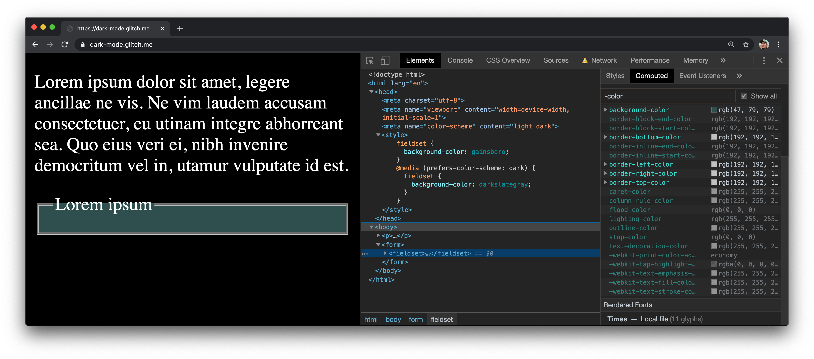

## Background

### The `prefers-color-scheme` user preference media feature

The
[`prefers-color-scheme`](https://developer.mozilla.org/en-US/docs/Web/CSS/@media/prefers-color-scheme)
user preference media feature gives developers full control over their sites' appearances.
You actually may have read my article
[`prefers-color-scheme`: Hello darkness, my old friend](/prefers-color-scheme/),
where I have documented everything I know about creating amazing dark mode experiences.

One puzzle piece that was only mentioned briefly in the article is
the `color-scheme` CSS property and the corresponding meta tag of the same name.
They both make your life as a developer easier
by allowing you to opt in your site to theme-specific defaults of the user-agent stylesheet,
for example for form controls, scroll bars, as well as CSS system colors.
At the same time, this feature prevents browsers from applying any transformations on their own.

### The user-agent stylesheet

Before I continue, let me briefly describe what a user-agent stylesheet is.
Most of the times, you can think of the word *user-agent* (UA for short)
as a fancy way to say *browser*.
The UA stylesheet determines the default look and feel of a page.
As the name suggests, a UA stylesheet is something that is dependent on the UA in question.
You can have a look at
[Chrome's](https://chromium.googlesource.com/chromium/blink/+/master/Source/core/css/html.css)
(and Chromium's) UA stylesheet and compare it to
[Firefox's](https://dxr.mozilla.org/mozilla-central/source/layout/style/res/html.css) or
[Safari's](https://trac.webkit.org/browser/trunk/Source/WebCore/css/html.css) (and WebKit's).
Typically, UA stylesheets agree on the majority of things,
for example, they all make texts black and background colors white,
but there are also important (and sometimes annoying) differences,
for instance, how they display form controls.

Let's have a closer look at
[WebKit's UA stylesheet](https://trac.webkit.org/browser/trunk/Source/WebCore/css/html.css)
and what it does regarding dark mode (do a full text search for "dark" in the code).
It changes the UA stylesheet's default values based on whether dark mode is on or off.
To illustrate this, here is one such CSS rule (using the
[`:matches`](https://css-tricks.com/almanac/selectors/m/matches/)
pseudo class and WebKit-internal variables like `-apple-system-control-background`,
as well as the WebKit-internal preprocessor directive `#if defined`):

```css
input,
input:matches([type="password"], [type="search"]) {
  -webkit-appearance: textfield;
  #if defined(HAVE_OS_DARK_MODE_SUPPORT) &&
      HAVE_OS_DARK_MODE_SUPPORT
    color: text;
    background-color: -apple-system-control-background;
  #else
    background-color: white;
  #endif
  /* snip */
}
```

You will notice some non-standard values for the `color` and `background-color` properties above.
Neither `text` nor `-apple-system-control-background` are valid CSS colors.
They are WebKit-internal *semantic* colors.

Turns out, CSS has standardized semantic system colors, too.
They are specified in
[CSS Color Module Level&nbsp;4](https://drafts.csswg.org/css-color/#css-system-colors).
For example, `Canvas` (not to be confused with the `<canvas>` tag)
is for the background of application content or documents,
whereas `CanvasText` is for text in application content or documents.
The two go together and should not be used in isolation.

UA stylesheets can make use of their own proprietary, or the standardized semantic system colors,
to determine how HTML elements should be rendered by default.
If the operating system is set to dark mode or uses a dark theme,
`CanvasText` (or `text` respectively) would be conditionally set to light white,
and `Canvas` (or `-apple-system-control-background`) would be set to dark black.
The UA stylesheet would then assign the following CSS only once, and cover both light and dark mode.

```css
body {
  color: CanvasText;
  background-color: Canvas
}
```

## The `color-scheme` CSS property

The [CSS Color Adjustment Module Level&nbsp;1](https://drafts.csswg.org/css-color-adjust/) module
introduces a model and controls over automatic color adjustment by the user-agent to handle
user preferences, such as dark mode, contrast adjustment, or specific desired color schemes.

The therein defined `color-scheme` property allows an element to indicate
which color schemes it is comfortable being rendered with.
These values are negotiated with the user's preferences, resulting in a chosen color scheme
that affects user interface (UI) things such as the default colors of form controls
and scroll bars, as well as the used values of the CSS system colors.
The currently usable values are defined as follows:

- *`normal`* Indicates that the element is not aware of color schemes at all,
  and so the element should be rendered with the browser's default color scheme.

- *`[ light | dark ]+`* Indicates that the element is aware of and can handle
  the listed color schemes, and expresses an ordered preference between them.


  Providing both keywords indicates that the first scheme is preferred (by the author),
  but the second is also acceptable if the user prefers it instead.


In this list, `light` represents a light color scheme,
with light background colors and dark foreground colors,
whereas `dark` represents the opposite, with dark background colors and light foreground colors.


  Per the spec, the allowed additional value `light only` indicates that the element
  must be rendered with a light color scheme if possible,
  even if the user's preference is for a different color scheme.
  Authors *should not* use this value, and should instead ensure their page renders well
  with whatever color scheme the user prefers.


For all elements, rendering with a color scheme should cause the colors used
in all browser-provided UI for the element to match with the intent of the color scheme.
Examples are scroll bars, spellcheck underlines, form controls, etc.


  The `color-scheme` CSS property can be used on both the `:root` level,
  as well as on a per-element level.


On the `:root` element, rendering with a color scheme
additionally must affect the surface color of the canvas (that is, the global background color),
the initial value of the `color` property, and the used values of the system colors,
and should also affect the viewport's scroll bars.

```css
/*
  The page supports both dark and light color schemes,
  and the page author prefers dark.
*/
:root {
  color-scheme: dark light;
}
```

## The `color-scheme` meta tag

Honoring the `color-scheme` CSS property requires the CSS to be first downloaded
(if it is referenced via `<link rel="stylesheet">`) and then to be parsed.
To aid user-agents in rendering the page background with the desired color scheme *immediately*,
a `color-scheme` value can also be provided in a `<meta name="color-scheme">` element.

```html
<!--
  The page supports both dark and light color schemes,
  and the page author prefers dark.
-->
<meta name="color-scheme" content="dark light">
```

## Using `color-scheme` in practice

Since both the meta tag and the CSS property (if applied to the `:root` element)
eventually result in the same behavior, I always recommend specifying the color scheme
via the meta tag, so the browser can adopt to the preferred scheme faster.


  While for absolute baseline pages no additional CSS rules are necessary,
  in the general case you should always combine `color-scheme` with `prefers-color-scheme`.

  For example, the proprietary WebKit CSS color `-webkit-link`, used by WebKit and Chrome
  for the classic link blue `rgb(0,0,238)`,
  has an insufficient contrast ratio of 2.23:1 on a black background and
  [fails](https://webaim.org/resources/contrastchecker/?fcolor=0000EE&bcolor=000000)
  both the WCAG&nbsp;AA as well as the WCAG&nbsp;AAA
  [requirements](https://www.w3.org/WAI/WCAG21/Understanding/conformance#levels).


## Interplay with `prefers-color-scheme`

The interplay of the `color-scheme` CSS property and the corresponding meta tag
with the `prefers-color-scheme` user preference media feature may seem confusing at first.
In fact, they play together really well.
The most important thing to understand is that `color-scheme`
exclusively determines the default appearance,
whereas `prefers-color-scheme` also determines the stylable appearance.
To make this clearer, let's assume the following page:

```html
<head>
  <meta name="color-scheme" content="dark light">
  <style>
    fieldset {
      background-color: gainsboro;
    }
    @media (prefers-color-scheme: dark) {
      fieldset {
        background-color: darkslategray;
      }
    }
  </style>
</head>
<body>
  <p>
    Lorem ipsum dolor sit amet, legere ancillae ne vis.
  </p>
  <form>
    <fieldset>
      <legend>Lorem ipsum</legend>
    </fieldset>
  </form>
</body>
```

It sets the `<fieldset>`'s `background-color` to `gainsboro` in the general case,
and to `darkslategray` if the user prefers a `dark` color scheme
according to the `prefers-color-scheme` user preference media feature.

Via the `<meta name="color-scheme" content="dark light">` element,
it tells the browser that the page supports a dark and a light theme,
with a preference for a dark theme.

Depending on whether the operating system is set to dark or light mode,
the whole page appears light on dark, or vice versa.
There is *no* additional CSS involved for the paragraph text or the background color or the page.

Note, however, how the `<fieldset>`'s `background-color` changes
based on whether dark mode is enabled or not, following the rules
in the inline stylesheet on the page.
It is either `gainsboro` or `darkslategray`.

<figure>
  
  <figcaption>
    <strong>Light mode:</strong> Styles specified by the developer and the user-agent.
    The text is black and the background is white as per the user-agent stylesheet.
    The <code>&lt;fieldset&gt;</code>'s <code>background-color</code> is <code>gainsboro</code>
    as per the inlined stylesheet.
  </figcaption>
</figure>

<figure>
  
  <figcaption>
    <strong>Dark mode:</strong> Styles specified by the developer and the user-agent.
    The text is white and the background is black as per the user-agent stylesheet.
    The <code>&lt;fieldset&gt;</code>'s <code>background-color</code> is <code>darkslategray</code>
    as per the inlined stylesheet.
  </figcaption>
</figure>

Finally, note how the `<fieldset>`'s `border-color` changes.
The `border-color` is set to the semantic CSS system color
[`threedface`](https://drafts.csswg.org/css-color/#threedface)
(the character casing does not matter, it can also be written as `ThreeDFace`).
This system color is used for the face background color for 3D elements that appear 3D
due to two concentric layers of surrounding border.

The computed value for the `outline-color`
switches from `rgb(0, 0, 0)` (black) to `rgb(255, 255, 255)` (white),
since the user-agent sets it dynamically based on the color scheme.

<figure>
  
  <figcaption>
    <strong>Light mode:</strong> Computed style values.
    <code>outline-color</code>
  </figcaption>
</figure>

<figure>
  
  <figcaption>Dark mode: computed style values.</figcaption>
</figure>

## Demo

You can see the effects of `color-scheme` applied to a large number of HTML elements
in the demo embedded below, or
[directly on Glitch](https://color-scheme-demo.glitch.me/).
Remember that you need to switch your operating system to dark mode to enjoy this demo.

<div class="glitch-embed-wrap" style="height: 420px; width: 100%;">
  <iframe
    src="https://glitch.com/embed/#!/embed/color-scheme-demo?path=index.html&previewSize=100"
    title="color-scheme-demo on Glitch"
    allow="geolocation; microphone; camera; midi; vr; encrypted-media"
    style="height: 100%; width: 100%; border: 0;"
    loading="lazy">
  </iframe>
</div>

## Acknowledgements

The `color-scheme` CSS property and the corresponding meta tag were implemented by
[Rune Lillesveen](https://github.com/lilles).
Rune is also a co-editor of the CSS Color Adjustment Module Level&nbsp;1 specification.
Hero image by
[Philippe Leone](https://unsplash.com/@philinit?utm_source=unsplash&utm_medium=referral&utm_content=creditCopyText)
on [Unsplash](https://unsplash.com/photos/dbFfEBOCrkU).
