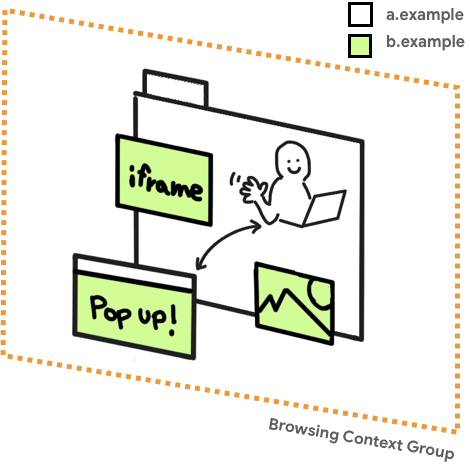
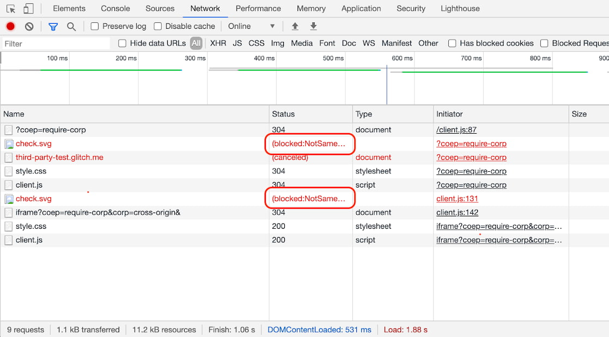
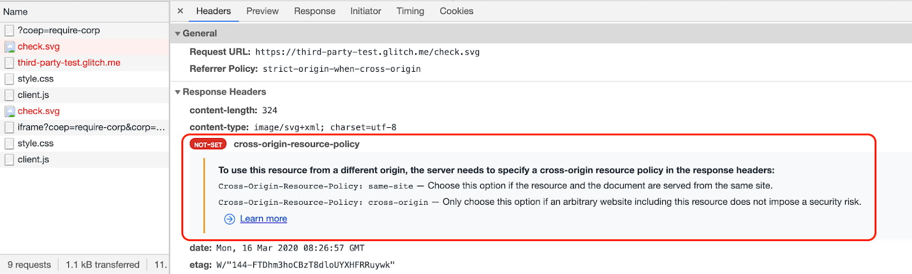

Some web APIs increase the risk of side-channel attacks like Spectre. To 
mitigate that risk, browsers offer an opt-in-based isolated environment called 
cross-origin isolated. With a cross-origin isolated state, the webpage will be 
able to use privileged features including:

* [`SharedArrayBuffer`](https://developer.mozilla.org/docs/Web/JavaScript/Reference/Global_Objects/SharedArrayBuffer)
  (required for WebAssembly Threads)
* [`performance.measureMemory()`](/monitor-total-page-memory-usage/)
* [JS Self-Profiling API](https://wicg.github.io/js-self-profiling/)

The cross-origin isolated state also prevents modifications of 
`document.domain`. (Being able to alter `document.domain` allows 
communication between same-sites and has been considered a loophole in the 
same-origin policy.)


These powerful features and the prevention of `document.domain` modification 
are not yet enabled in Chrome as of version 83. We'll update this post as they 
become available.


To opt in to a cross-origin isolated state, you need to send the following two 
HTTP headers on the main document:

```http
Cross-Origin-Embedder-Policy: require-corp
Cross-Origin-Opener-Policy: same-origin
```

These headers instruct the browser to block loading of resources or iframes 
which haven't opted into being loaded by cross-origin documents, and prevent 
cross-origin windows from directly interacting with your document. This also 
means those resources being loaded cross-origin require opt-ins.

You can determine whether a web page is in a cross-origin isolated state by 
examining `self.crossOriginIsolated`. (This works on Firefox but has yet to be 
implemented in Chrome).

This article shows how to use these new headers. In a follow-up article I will
provide more background and context.


This article is aimed at those who would like to get their websites ready for 
using `SharedArrayBuffer`, WebAssembly Threads, `performance.measureMemory()`
or the JS Self-Profiling API in a more robust manner across browser 
platforms.



This article uses many similar-sounding terminologies. To make things 
clearer, let's define them first:

* [COEP: Cross Origin Embedder 
  Policy](https://wicg.github.io/cross-origin-embedder-policy/)
* [COOP: Cross Origin Opener 
  Policy](https://github.com/whatwg/html/pull/5334/files)
* [CORP: Cross Origin Resource 
  Policy](https://developer.mozilla.org/docs/Web/HTTP/Cross-Origin_Resource_Policy_(CORP))
* [CORS: Cross Origin Resource 
  Sharing](https://developer.mozilla.org/docs/Web/HTTP/CORS)
* [CORB: Cross Origin Read 
  Blocking](https://www.chromium.org/Home/chromium-security/corb-for-developers)


## Deploy COOP and COEP to make your website cross-origin isolated
### Integrate COOP and COEP
#### 1. Set the `Cross-Origin-Opener-Policy: same-origin` header on the top-level document

By enabling COOP on a top-level document, windows 
with the same origin, and windows opened from the document, will have a separate 
browsing context group unless they are in the same origin with the same COOP 
setting. Thus, isolation is enforced for opened windows.

A browsing context group is a group of tabs, windows or iframes which share the
same context. For example, if a website (`https://a.example`) opens a popup
window (`https://b.example`), the opener window and the popup window share the
same browsing context and they have access to each other via DOM APIs such as
`window.opener`.



As of Chrome 83, DevTools support is not yet available for COOP. However, you
can examine `window.opener === null` from the opened window, or
`openedWindow.closed === true` from the opener window to determine if they are
in separate browsing context groups.


[See the impact of different COOP 
params](https://first-party-test.glitch.me/coop).


#### 2. Ensure resources have CORP or CORS enabled

Make sure that all resources in the page are loaded with CORP or CORS
HTTP headers. This step 
is required for [step four, enabling COEP](#enable-coep).

Here is what you need to do depending on the nature of the resource:

* If the resource is expected to be loaded **only from the same origin**, set 
  the `Cross-Origin-Resource-Policy: same-origin` header.
* If the resource is expected to be loaded **only from the same site but cross 
  origin**, set the `Cross-Origin-Resource-Policy: same-site` header.
* If the resource is **loaded from cross origin(s) under your control**, set the 
  `Cross-Origin-Resource-Policy: cross-origin` header if possible. 
* For cross origin resources that you have no control over:
    * Use the `crossorigin` attribute in the loading HTML tag if the resource is
      served with CORS.
    * Ask the owner of the resource to support either CORS or CORP.
* For iframes, use CORP and COEP headers as follows: 
  `Cross-Origin-Resource-Policy: same-origin` and `Cross-Origin-Embedder-Policy: 
  require-corp`.


It's important that you understand the difference between "same-site" and 
"same-origin". Learn about the difference at [Understanding same-site and 
same-origin](/same-site-same-origin).


#### 3. Use the COEP Report-Only HTTP header to assess embedded resources

Before fully enabling COEP, you can do a dry run by using the
`Cross-Origin-Embedder-Policy-Report-Only` header to examine whether the policy
actually works. You will receive reports without blocking embedded content.
Recursively apply this to all documents. For information on the Report-Only HTTP
header, see [Observe issues using the Reporting
API](#observe-issues-using-the-reporting-api).

#### 4. Enable COEP {: #enable-coep }

Once you've confirmed that everything works, and that all resources can be 
successfully loaded, apply the `Cross-Origin-Embedder-Policy: require-corp` HTTP 
header to all documents including those that are embedded via iframes.


[See the impact of different COEP / CORP 
parameters](https://first-party-test.glitch.me/coep).


### Determine whether isolation succeeded with `self.crossOriginIsolated`

The `self.crossOriginIsolated` property returns `true` when the web page is in a 
cross-origin isolated state and all resources and windows are isolated within 
the same browsing context group. You can use this API to determine whether you 
have successfully isolated the browsing context group and gained access to 
powerful features like `performance.measureMemory()`.


The [`self.crossOriginIsolated`](https://www.chromestatus.com/feature/5953286387531776)
property is still under development and not available yet in Chrome as of version 83.


### Debug issues using Chrome DevTools

For resources that are rendered on the screen such as images, it's fairly easy 
to detect COEP issues because the request will be blocked and the page will
indicate a missing image. However, for resources that don't 
necessarily have a visual impact, such as scripts or styles, COEP issues might 
go unnoticed. For those, use the DevTools Network panel. If 
there's an issue with COEP, you should see 
`(blocked:NotSameOriginAfterDefaultedToSameOriginByCoep)` in the **Status**
column.

<figure class="w-figure">
  
</figure>

You can then click the entry to see more details.

<figure class="w-figure">
  
</figure>


While COEP debugging is already available, COOP debugging in Chrome 
DevTools is still [being worked 
on](https://bugs.chromium.org/p/chromium/issues/detail?id=1051466).


### Observe issues using the Reporting API

The [Reporting 
API](https://developers.google.com/web/updates/2018/09/reportingapi) is another 
mechanism through which you can detect various issues. You can configure the 
Reporting API to instruct your users' browser to send a report whenever COEP 
blocks the loading of a resource. Chrome has supported the `Report-To` header since 
version 69 for a variety of uses including COEP.


The Reporting API is undergoing transition to [a new 
](https://w3c.github.io/reporting/)version. Chrome is planning to release it 
soon, but will leave the older API in place for some time. 
Firefox is also [considering the new 
API](https://bugzilla.mozilla.org/show_bug.cgi?id=1620573). You may want to use 
both APIs during the transition.


To specify where the browser should send reports, append the `Report-To`
HTTP header to any document that is served with a COEP HTTP header. The
`Report-To` header also supports a few extra parameters to configure the
reports. For example:

```http
Report-To: { group: 'coep_rollout_1', max_age: 86400, endpoints: [{ url: 'https://first-party-test.glitch.me/report'}]}
```

The parameters object has three properties:

#### `group`

The `group` property names your various reporting endpoints. Use these names to
direct a subset of your reports. For instance, in the
`Cross-Origin-Embedder-Policy` directive you can specify the relevant endpoint
by providing the group name to `report-to=`. For example:

```http
Cross-Origin-Embedder-Policy: require-corp; report-to="coep_rollout_1"
```
When the browser encounters this, it will cross reference the `report-to` value
with the `group` property on the `Report-To` header to look up the endpoint.
This example cross references on `coep_rollout_1` to find the endpoint
`https://first-party-test.glitch.me/report`.

If you prefer to receive reports without blocking any embedded content, use 
`Cross-Origin-Embedder-Policy-Report-Only` instead of 
`Cross-Origin-Embedder-Policy`. For example:

```http
Cross-Origin-Embedder-Policy-Report-Only: require-corp; report-to="coep_rollout_1"
```

By doing this, when the browser detects cross origin resources that don't have 
CORP or CORS, it sends a report using the Reporting API without actually 
blocking those resources.

#### `max_age`

The `max_age` property specifies the time in seconds after which unsent reports
are to be dropped. The browser doesn't send the reports right away.
Instead, it transmits them out-of-band whenever there aren't any other higher
priority tasks. The `max_age` prevents the browser from sending reports that are
too stale to be useful. For example, `max_age: 86400` means that reports older
than twenty-four hours will not be sent.

#### `endpoints`

The `endpoints` property specifies the URLs of one or more reporting endpoints.
The endpoint must accept CORS if it's hosted on a different origin. The browser
will send reports with a Content-Type of `application/reports+json`.

An example payload looks like this:

```json
[{  
  age: 0,  
  body: {  
    'blocked-url': 'https://third-party-test.glitch.me/check.svg',  
    type: 'corp'  
  },  
  type: 'coep',  
  url: 'https://first-party-test.glitch.me/?coep=require-corp',  
  ...  
}]
```

## Conclusion

Use a combination of COOP and COEP HTTP headers to opt a web page into a special 
cross-origin isolated state. You will be able to examine 
`self.crossOriginIsolated` to determine whether a web page is in a 
cross-origin isolated state.

In upcoming releases of Chrome, this cross-origin isolated state will prevent
[altering
`document.domain`](https://developer.mozilla.org/en-US/docs/Web/Security/Same-origin_policy#Changing_origin)
and will give access to powerful features such as:

* [`SharedArrayBuffer`](https://developer.mozilla.org/en-US/docs/Web/JavaScript/Reference/Global_Objects/SharedArrayBuffer) 
  (required for WebAssembly Threads)
* [`performance.measureMemory`](/monitor-total-page-memory-usage/)
* [JS Self-Profiling API](https://wicg.github.io/js-self-profiling/) and more.

We'll keep this post updated as new features are made available to this 
cross-origin isolated state, and further improvements are made to DevTools 
around COOP and COEP.
