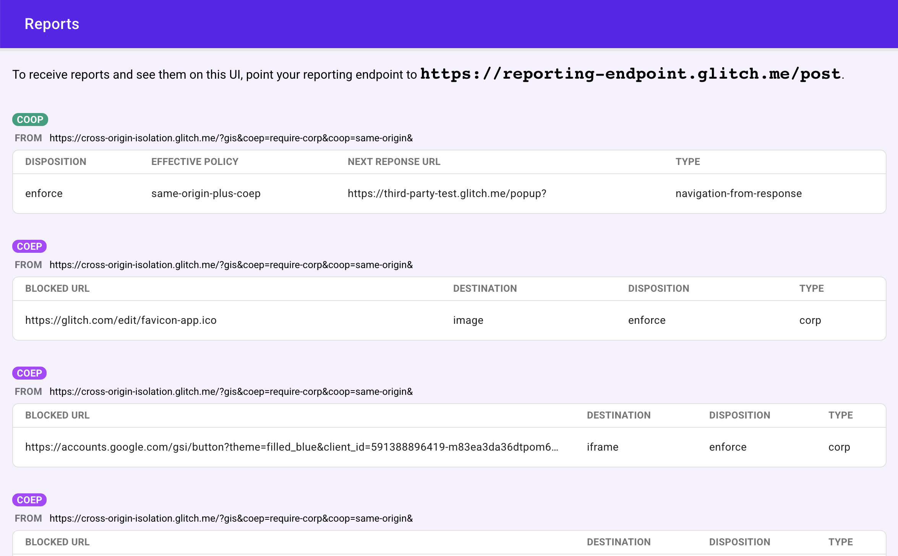

**Updates**

- **February 9, 2021**: Added an instruction [how to set up a reporting
endpoint](#set-up-reporting-endpoint).
- **October 15, 2020**: `self.crossOriginIsolated` is available from Chrome 87.
Reflecting that, `document.domain` is immutable when `self.crossOriginIsolated`
returns `true`. `performance.measureUserAgentSpecificMemory()` is ending its origin trial and is
enabled by default in Chrome 89. Shared Array Buffer on Android
Chrome will be available from Chrome 88.
- **September 1, 2020**: COOP Reporting is behind flags in Chrome 86. See
[Enable Chrome flags](#flags).

Some web APIs increase the risk of side-channel attacks like Spectre. To
mitigate that risk, browsers offer an opt-in-based isolated environment called
cross-origin isolated. With a cross-origin isolated state, the webpage will be
able to use privileged features including:

* [`SharedArrayBuffer`](https://developer.mozilla.org/docs/Web/JavaScript/Reference/Global_Objects/SharedArrayBuffer)
  (required for WebAssembly Threads. This is available from Android Chrome 88.
  Desktop version is currently enabled by default with the help of [Site
  Isolation](https://www.chromium.org/Home/chromium-security/site-isolation),
  but will require the cross-origin isolated state and will be disabled by
  default.)
* [`performance.measureUserAgentSpecificMemory()`](/monitor-total-page-memory-usage/) (Ends its
  origin trial and is planned to be enabled by default in Chrome 88)
* [JS Self-Profiling API](https://wicg.github.io/js-self-profiling/) (Not
  available yet in Chrome)

The cross-origin isolated state also prevents modifications of
`document.domain`. (Being able to alter `document.domain` allows communication
between same-site documents and has been considered a loophole in the
same-origin policy.)

To opt in to a cross-origin isolated state, you need to send the following
HTTP headers on the main document:

```http
Cross-Origin-Embedder-Policy: require-corp
Cross-Origin-Opener-Policy: same-origin
```

These headers instruct the browser to block loading of resources or iframes
which haven't opted into being loaded by cross-origin documents, and prevent
cross-origin windows from directly interacting with your document. This also
means those resources being loaded cross-origin require opt-ins.

You can determine whether a web page is in a cross-origin isolated state by
examining
[`self.crossOriginIsolated`](https://developer.mozilla.org/docs/Web/API/WindowOrWorkerGlobalScope/crossOriginIsolated).

This article shows how to use these new headers. In [a follow-up
article](/why-coop-coep) I will provide more background and context.


This article is aimed at those who would like to get their websites ready for
using `SharedArrayBuffer`, WebAssembly Threads, `performance.measureUserAgentSpecificMemory()`
or the JS Self-Profiling API in a more robust manner across browser
platforms.



This article uses many similar-sounding terminologies. To make things
clearer, let's define them first:

* [COEP: Cross Origin Embedder
  Policy](https://wicg.github.io/cross-origin-embedder-policy/)
* [COOP: Cross Origin Opener
  Policy](https://github.com/whatwg/html/pull/5334/files)
* [CORP: Cross Origin Resource
  Policy](https://developer.mozilla.org/docs/Web/HTTP/Cross-Origin_Resource_Policy_(CORP))
* [CORS: Cross Origin Resource
  Sharing](https://developer.mozilla.org/docs/Web/HTTP/CORS)
* [CORB: Cross Origin Read
  Blocking](https://www.chromium.org/Home/chromium-security/corb-for-developers)


## Deploy COOP and COEP to make your website cross-origin isolated

### Integrate COOP and COEP

#### 1. Set the `Cross-Origin-Opener-Policy: same-origin` header on the top-level document

By enabling COOP on a top-level document, windows
with the same origin, and windows opened from the document, will have a separate
browsing context group unless they are in the same origin with the same COOP
setting. Thus, isolation is enforced for opened windows.

A browsing context group is a group of tabs, windows or iframes which share the
same context. For example, if a website (`https://a.example`) opens a popup
window (`https://b.example`), the opener window and the popup window share the
same browsing context and they have access to each other via DOM APIs such as
`window.opener`.



As of Chrome 83, dedicated DevTools support is not yet available for COOP.
However, you can examine `window.opener === null` from the opened window, or
`openedWindow.closed === true` from the opener window to determine if they are
in separate browsing context groups.


[See the impact of different COOP
params](https://first-party-test.glitch.me/coop).


#### 2. Ensure resources have CORP or CORS enabled

Make sure that all resources in the page are loaded with CORP or CORS
HTTP headers. This step
is required for [step four, enabling COEP](#enable-coep).

Here is what you need to do depending on the nature of the resource:

* If the resource is expected to be loaded **only from the same origin**, set
  the `Cross-Origin-Resource-Policy: same-origin` header.
* If the resource is expected to be loaded **only from the same site but cross
  origin**, set the `Cross-Origin-Resource-Policy: same-site` header.
* If the resource is **loaded from cross origin(s) under your control**, set the
  `Cross-Origin-Resource-Policy: cross-origin` header if possible.
* For cross origin resources that you have no control over:
    * Use the `crossorigin` attribute in the loading HTML tag if the resource is
      served with CORS.
    * Ask the owner of the resource to support either CORS or CORP.
* For iframes, use CORP and COEP headers as follows:
  `Cross-Origin-Resource-Policy: same-origin` (or `same-site`, `cross-origin`
  depending on the context) and `Cross-Origin-Embedder-Policy: require-corp`.


It's important that you understand the difference between "same-site" and
"same-origin". Learn about the difference at [Understanding same-site and
same-origin](/same-site-same-origin).


#### 3. Use the COEP Report-Only HTTP header to assess embedded resources

Before fully enabling COEP, you can do a dry run by using the
`Cross-Origin-Embedder-Policy-Report-Only` header to examine whether the policy
actually works. You will receive reports without blocking embedded content.
Recursively apply this to all documents. For information on the Report-Only HTTP
header, see [Observe issues using the Reporting
API](#observe-issues-using-the-reporting-api).

#### 4. Enable COEP {: #enable-coep }

Once you've confirmed that everything works, and that all resources can be
successfully loaded, apply the `Cross-Origin-Embedder-Policy: require-corp` HTTP
header to all documents including those that are embedded via iframes.


[See the impact of different COEP / CORP
parameters](https://first-party-test.glitch.me/coep).



[Squoosh](https://squoosh.app) (an image optimization PWA) [now uses COOP /
COEP](https://github.com/GoogleChromeLabs/squoosh/pull/829/files#diff-316f969413f2d9a065fcc08c7a5589c088dd1e21deebadccfc5a4372ac5e0cbbR22-R23)
to gain access to Wasm Threads (and Shared Array Buffer) as well on Android
Chrome.


### Determine whether isolation succeeded with `self.crossOriginIsolated`

The `self.crossOriginIsolated` property returns `true` when the web page is in a
cross-origin isolated state and all resources and windows are isolated within
the same browsing context group. You can use this API to determine whether you
have successfully isolated the browsing context group and gained access to
powerful features like `performance.measureUserAgentSpecificMemory()`.


The
[`self.crossOriginIsolated`](https://developer.mozilla.org/docs/Web/API/WindowOrWorkerGlobalScope/crossOriginIsolated)
property is available in Chrome from version 87.


### Debug issues using Chrome DevTools

For resources that are rendered on the screen such as images, it's fairly easy
to detect COEP issues because the request will be blocked and the page will
indicate a missing image. However, for resources that don't
necessarily have a visual impact, such as scripts or styles, COEP issues might
go unnoticed. For those, use the DevTools Network panel. If
there's an issue with COEP, you should see
`(blocked:NotSameOriginAfterDefaultedToSameOriginByCoep)` in the **Status**
column.

<figure class="w-figure">
  
</figure>

You can then click the entry to see more details.

<figure class="w-figure">
  
</figure>


While COEP debugging is already available, COOP debugging in Chrome
DevTools is still [being worked
on](https://bugs.chromium.org/p/chromium/issues/detail?id=1051466).


### Observe issues using the Reporting API

The [Reporting
API](https://developers.google.com/web/updates/2018/09/reportingapi) is another
mechanism through which you can detect various issues. You can configure the
Reporting API to instruct your users' browser to send a report whenever COEP
blocks the loading of a resource or COOP isolates a popup window. Chrome has
supported the
[`Report-To`](https://developer.mozilla.org/docs/Web/HTTP/Headers/Content-Security-Policy/report-to)
header since version 69 for a variety of uses including COEP and COOP.


The Reporting API is undergoing transition to [a new
](https://w3c.github.io/reporting/)version. Chrome is planning to release it
soon, but will leave the older API in place for some time.
Firefox is also [considering the new
API](https://bugzilla.mozilla.org/show_bug.cgi?id=1620573). You may want to use
both APIs during the transition.


#### Enable the Reporting API

While COEP reporting is already fully available on Chrome, you need to do one of
the followings to enable COOP Reporting API on Chrome until its version 89.

1. Enabling Chrome flags
2. Registering for an origin trial

##### Enable via Chrome flags {: #flags }

1. Go to `chrome://flags`
1. Enable **Cross Origin Opener Policy reporting** (`chrome://flags/#cross-origin-opener-policy-reporting`)
1. Enable **Cross Origin Opener Policy access reporting**
   (`chrome://flags/#cross-origin-opener-policy-access-reporting`)

##### Register for an origin trial






To use COOP Reporting API, the token must be served as an HTTP header instead of
a `<meta>` tag.


#### Set up a server to receive reports {: #set-up-reporting-endpoint}

A server with reporting endpoints needs to be set up in order to receive reports
from your COOP/COEP. There are two options:

* Use a solution that accepts reports.
* Build your own server that accepts reports.

##### Use a solution that accepts reports

We are aware of one solution that accepts reports from the browser's COOP/COEP reporting functionality.

* [https://uriports.com](https://uriports.com)

If there's any other solutions that accept reports, [please let us know to
update this post](https://github.com/GoogleChrome/web.dev).

##### Build your own server that accepts reports

Building your own server that receives reports isn't that trivial. We have [a
lightweight sample implementation of a reporting endpoint on
glitch.com](https://reporting-endpoint.glitch.me/). ["Remix Project" to
clone](https://glitch.com/edit/#!/reporting-endpoint) and customize for your own
purposes.

<figure class="w-figure">
  
</figure>

All you have to do is to put the URL indicated in the page as the reporting
endpoint of COOP and COEP. See below to learn how to configure.

#### `Report-To`

To specify where the browser should send reports, append the `Report-To` HTTP
header to any document that is served with a COEP or COOP HTTP header. The
`Report-To` header also supports a few extra parameters to configure the
reports. For example:

```http
Report-To: { group: 'coep_report', max_age: 86400, endpoints: [{ url: 'https://reporting-endpoint.glitch.me/post'}]},{ group: 'coop_report', max_age: 86400, endpoints: [{ url: 'https://reporting-endpoint.glitch.me/post'}]}
```

The parameters object has three properties:

#### `group`

The `group` property names your various reporting endpoints. Use these names to
direct a subset of your reports. For instance, in the
`Cross-Origin-Embedder-Policy` and `Cross-Origin-Opener-Policy` directives you
can specify the relevant endpoint by providing the group name to `report-to=`.
For example:

```http
Cross-Origin-Embedder-Policy: require-corp; report-to="coep_report"
Cross-Origin-Opener-Policy: same-origin; report-to="coop_report"
```
When the browser encounters this, it will cross reference the `report-to` value
with the `group` property on the `Report-To` header to look up the endpoint.
This example cross references `coep_report` and `coop_report` to find the
endpoint `https://first-party-test.glitch.me/report`.

If you prefer to receive reports without blocking any embedded content or
without isolating a popup window, append `-Report-Only` to respective headers:
i.e. `Cross-Origin-Embedder-Policy-Report-Only` and
`Cross-Origin-Opener-Policy-Report-Only`. For example:

```http
Cross-Origin-Embedder-Policy-Report-Only: require-corp; report-to="coep_report"
Cross-Origin-Opener-Policy-Report-Only: same-origin; report-to="coop_report"
```

By doing this, when the browser detects cross origin resources that don't have
CORP or CORS, it sends a report using the Reporting API without actually
blocking those resources because of COEP.

Similarly, when the browser opens a cross-origin popup window, it sends a report
without actually isolating the window because of COOP. It also reports when
different browsing context groups try to access each other, but only in
"report-only" mode.

#### `max_age`

The `max_age` property specifies the time in seconds after which unsent reports
are to be dropped. The browser doesn't send the reports right away.
Instead, it transmits them out-of-band whenever there aren't any other higher
priority tasks. The `max_age` prevents the browser from sending reports that are
too stale to be useful. For example, `max_age: 86400` means that reports older
than twenty-four hours will not be sent.

#### `endpoints`

The `endpoints` property specifies the URLs of one or more reporting endpoints.
The endpoint must accept CORS if it's hosted on a different origin. The browser
will send reports with a Content-Type of `application/reports+json`.

An example COEP report payload when cross-origin resource is blocked looks like
this:

```json
[{
  "age": 25101,
  "body": {
    "blocked-url": "https://third-party-test.glitch.me/check.svg?",
    "blockedURL": "https://third-party-test.glitch.me/check.svg?",
    "destination": "image",
    "disposition": "enforce",
    "type": "corp"
  },
  "type": "coep",
  "url": "https://first-party-test.glitch.me/?coep=require-corp&coop=same-origin&",
  "user_agent": "Mozilla/5.0 (Macintosh; Intel Mac OS X 10_15_6) AppleWebKit/537.36 (KHTML, like Gecko) Chrome/87.0.4249.0 Safari/537.36"
}]
```


`blocked-url` is there for backward compatibility only and [will be removed
eventually](https://github.com/whatwg/html/pull/5848).


An example COOP report payload when a popup window is opened isolated looks like
this:

```json
[{
  "age": 7,
  "body": {
    "disposition": "enforce",
    "effectivePolicy": "same-origin",
    "nextResponseURL": "https://third-party-test.glitch.me/popup?report-only&coop=same-origin&",
    "type": "navigation-from-response"
  },
  "type": "coop",
  "url": "https://first-party-test.glitch.me/coop?coop=same-origin&",
  "user_agent": "Mozilla/5.0 (Macintosh; Intel Mac OS X 10_15_6) AppleWebKit/537.36 (KHTML, like Gecko) Chrome/87.0.4246.0 Safari/537.36"
}]
```

When different browsing context groups try to access each other (only on
"report-only" mode), COOP also sends a report. For example, a report when
`postMessage()` is attempted would look like this:

```json
[{
  "age": 51785,
  "body": {
    "columnNumber": 18,
    "disposition": "reporting",
    "effectivePolicy": "same-origin",
    "lineNumber": 83,
    "property": "postMessage",
    "sourceFile": "https://first-party-test.glitch.me/popup.js",
    "type": "access-from-coop-page-to-openee"
  },
  "type": "coop",
  "url": "https://first-party-test.glitch.me/coop?report-only&coop=same-origin&",
  "user_agent": "Mozilla/5.0 (Macintosh; Intel Mac OS X 10_15_6) AppleWebKit/537.36 (KHTML, like Gecko) Chrome/87.0.4246.0 Safari/537.36"
},
{
  "age": 51785,
  "body": {
    "disposition": "reporting",
    "effectivePolicy": "same-origin",
    "property": "postMessage",
    "type": "access-to-coop-page-from-openee"
  },
  "type": "coop",
  "url": "https://first-party-test.glitch.me/coop?report-only&coop=same-origin&",
  "user_agent": "Mozilla/5.0 (Macintosh; Intel Mac OS X 10_15_6) AppleWebKit/537.36 (KHTML, like Gecko) Chrome/87.0.4246.0 Safari/537.36"
}]
```

## Conclusion

Use a combination of COOP and COEP HTTP headers to opt a web page into a special
cross-origin isolated state. You will be able to examine
`self.crossOriginIsolated` to determine whether a web page is in a
cross-origin isolated state.

In upcoming releases of Chrome, this cross-origin isolated state will prevent
[altering
`document.domain`](https://developer.mozilla.org/en-US/docs/Web/Security/Same-origin_policy#Changing_origin)
and will give access to powerful features such as:

* [`performance.measureUserAgentSpecificMemory()`](/monitor-total-page-memory-usage/)
* [JS Self-Profiling API](https://wicg.github.io/js-self-profiling/) and more.

We'll keep this post updated as new features are made available to this
cross-origin isolated state, and further improvements are made to DevTools
around COOP and COEP.
