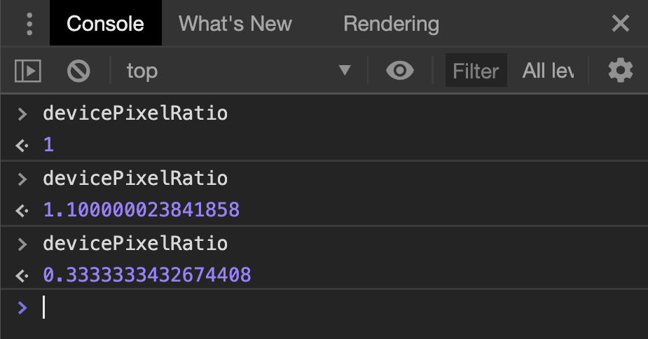
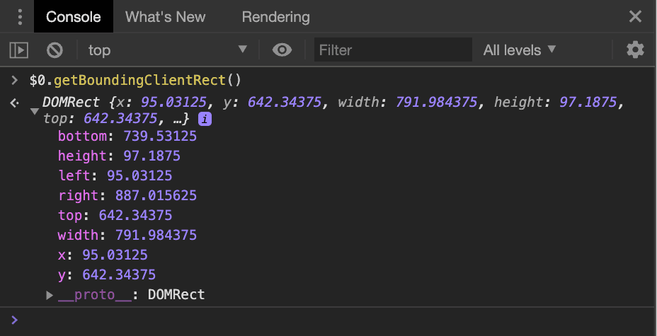
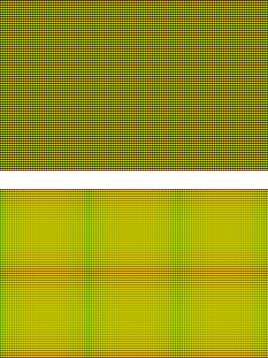

## TL;DR

Since Chrome 84, [ResizeObserver] supports a new box measurement called `device-pixel-content-box`, that measures the element's dimension in _physical_ pixels. This is crucial for rendering pixel-perfect graphics, especially in the context of high-density screens.

## CSS pixels, canvas pixels & physical pixels

While we often work with abstract units of length like `em`, `%` or `vh`, it all boils down to pixels. Whenever we specify the size or position of an element in CSS, the browser's layout engine will eventually convert that value to pixels (`px`). These are "CSS Pixels", which have a lot of history and only have loose relationship with the pixels you have on your screen.

For a long time, it was fairly sound to estimate anyone's screen pixel density with 96DPI ("dots per inch"), meaning any given monitor would have roughly 38 pixels per cm. Over time, monitors grew and/or shrunk or started to have more pixels on the same surface area ("retina displays"). Lots of content on the web defines its dimensions, including font size, in `px` which will end up illegible on these high-density ("HiDPI") screens. To counteract this, browsers started to hide the monitor's actual pixel density and just pretend that the user has a 96 DPI display. The `px` unit represents the size of one pixel on this virtual 96 DPI display, hence the name "CSS Pixel". This unit is only used for measurement and positioning. Before any actual rendering happens, a conversion to physical pixels happens.

Enter `devicePixelRatio`. This global value tells you how many _physical_ pixels you need to form a single CSS pixel. If `devicePixelRatio` (dPR) is `1`, you are working on a monitor with roughly 96DPI. If you have a retina screen, your dPR is probably `2`. On phones it is not uncommon to encounter higher (and weirder) dPR values like `3` or even `3.5`. It is essential to note that this value is _exact_ but not _realistic_. A dPR of `2` means that 1 CSS pixel will map to _exactly_ 2 physical pixels.

**Example:** My monitor has a dPR of `1` according to Chrome. It has 3440 pixels in width and the display area is 79cm wide. That leads to a resolution of 110 DPI. Close to 96, but not quite. That is also the reason why a `<div style="width: 1cm; height: 1cm">` will not actually be 1cm in size.

Finally, dPR can also be affected by your browser's zoom feature. If you zoom in, the browser increases the reported dPR, causing everything to render bigger. If you check `devicePixelRatio` in the DevTools console while zooming, you can see fractional values appear.

<figure class="w-figure">
  
  <figcaption class="w-figcaption">Dev Tools showing a variety of fractional <code>devicePixelRatio</code> due to the user using the browser's zoom function.</figcaption>
</figure>

Now for the `<canvas>` element. You can specify how many pixels you want the canvas to have using the `width` and `height` attributes. So `<canvas width=40 height=30>` would be a canvas with 40 by 30 pixels. However, this does not mean that it will be _displayed_ at 40 by 30 pixels. By default, the canvas above would be displayed with 40 CSS pixels width and 30 CSS pixel height. With everything we have learned so far, it might occur to you that this will not be ideal in every scenario. However, you can use all your existing CSS skills to display the canvas at any size, completely independent of the number of canvas pixels.

To summarize: Canvas elements have a given size that you can draw on. The number of Canvas pixels is completely independent from the canvas' display size, specified in CSS pixels. The canvas will then be shown on the monitor with physical pixels.

### Pixel perfection

In some scenarios, it is desirable to have an exact mapping from canvas pixels to physical pixels. If this mapping is achieved, it's called "pixel-perfect". For example, pixel-perfect rendering is crucial for legible rendering of text, especially when using [subpixel rendering] or when displaying graphics with tightly aligned lines of alternating brightness.

To achieve something as close to a pixel-perfect canvas as possible on the web, this has been more or less the go-to approach:

```html
<style>
  /* … styles that affect the canvas' size … */
</style>
<canvas id="myCanvas"></canvas>
<script>
  const cvs = document.querySelector('#myCanvas');
  // Get the canvas' size in CSS pixels
  const rectangle = cvs.getBoundingClientRect();
  cvs.width = rectangle.width * devicePixelRatio;
  cvs.height = rectangle.height * devicePixelRatio;
  // Start drawing…
</script>
```

The astute reader might be wondering what happens when dPR is not an integer value. That is a good question and exactly where the crux of this entire problem lies. In addition, if you specify an element's position or size using percentages, `vh` or other indirect values, it is possible that they will resolve to fractional CSS pixel values. An element with `margin-left: 33%` can end up with a rectangle like this:

<figure class="w-figure">
  
  <figcaption class="w-figcaption">Dev Tools showing fractional pixel values as a result of a <code>getBoundingClientRect()</code> call.</figcaption>
</figure>

CSS pixels are purely virtual, so having fractions of a pixel is okay in theory, but how does the browser figure out the mapping to physical pixels? Because fractional _physical_ pixels are not a thing.

## Pixel Snapping

The process of the unit conversion pipeline that takes care of aligning elements with physical pixels is called "pixel snapping", and it does what it says on the tin: It snaps fractional pixel values to integer, physical pixel values. How exactly this happens is different from browser to browser. If we have an element with a width of `791.984px` on a dPR=1 display, one browser might render the element at `792px` physical pixels, while another browser might render it at `791px`. That's just a single pixel off, but a single pixel can be detrimental to renderings that need to be pixel-perfect. This can lead to blurriness or even more visible artifacts like the [Moiré effect].

<figure class="w-figure">
  
  <figcaption class="w-figcaption">The top image is a raster of differently colored pixels. The bottom image is the same as above, but the width and height have been reduced by one pixel using bilinear scaling. The emerging pattern is called the Moiré effect.<br>(You might have to open this image in a new tab to see it without any scaling applied to it.)</figcaption>
</figure>

## devicePixelContentBox

At this point, `devicePixelContentBox` should make a lot more sense to you. It gives you an element's content box in device pixel (i.e. physical pixel) units. It's part of `ResizeObserver`. While [ResizeObserver is now supported in all major browsers][ro support] since Safari 13.1, the `devicePixelContentBox` property is only in Chrome for now.

As mentioned in [the main `ResizeObserver` article][resizeobserver], the `ResizeObserver`'s callback function will be called before paint and after layout. That means that the `entries` parameter to the callback will contain the sizes of all elements just before they are being painted. With respect to our problem outlined above, we can use this opportunity to adjust the number of pixels on our canvas, ensuring that we end up with an exact one-to-one mapping between canvas pixels and physical pixels.

```js
const observer = new ResizeObserver((entries) => {
  const entry = entries.find((entry) => entry.target === canvas);
  canvas.width = entry.devicePixelContentBoxSize[0].inlineSize;
  canvas.height = entry.devicePixelContentBoxSize[0].blockSize;

  /* … render to canvas … */
});
observer.observe(canvas, {box: ['device-pixel-content-box']});
```

The `box` property in the options object for `observer.observe()` lets you define which sizes you wish to _observe_. So while `ResizeObserverEntry` will always provide `borderBoxSize`, `contentBoxSize` and `devicePixelContentBoxSize` (provided the browser supports it), the callback will only be invoked if any of the _observed_ box metrics change.

> Note: All of the box metrics are arrays to allow `ResizeObserver` to handle text fragments in the future. At the time of writing, the array is always of length 1.

With this new property, we can even animate our canvas' size and position (effectively guaranteeing fractional pixel values), and not see any Moiré effects on the rendering. If you would like to see the Moiré effect on the approach using `getBoundingClientRect()`, and how the new `ResizeObserver` property allows you to avoid, take a look at the demo!

### Feature detection

To check if a user's browser has support for `devicePixelContentBox`, we can observe any element, and check if the property is present on the ResizeObserverEntry:

```js
function hasDevicePixelContentBox() {
  return new Promise((resolve) => {
    if (!('ResizeObserver' in self)) {
      return resolve(false);
    }
    const ro = new ResizeObserver((entries) => {
      resolve(entries.every((entry) => 'devicePixelContentBoxSize' in entry));
      ro.disconnect();
    });
    ro.observe(document.body, {box: ['device-pixel-content-box']});
  });
}

if (!(await hasDevicePixelContentBox())) {
  // The browser does NOT support devicePixelContentBox
}
```

[resizeobserver]: https://web.dev/resize-observer/
[subpixel rendering]: https://en.wikipedia.org/wiki/Subpixel_rendering
[moiré effect]: https://en.wikipedia.org/wiki/Moir%C3%A9_pattern
[ro support]: https://caniuse.com/#feat=resizeobserver
