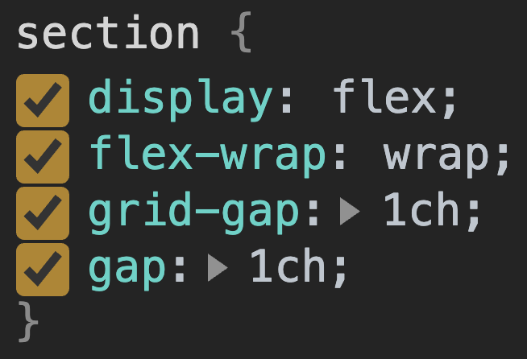

CSS Grid brought a delightful spacing feature called [`grid-gap`](https://developer.mozilla.org/en-US/docs/Web/CSS/gap), which quickly became a popular way to put space into layouts. It was easy to fall in love with because it took upon itself so much responsibility with such elegance. Starting in Chromium 85 `grid-gap` is now just [`gap`](https://drafts.csswg.org/css-align-3/#propdef-gap), and you can use it with Flexbox. 💪

## Browser compatibility

At the time of writing `gap` is supported in desktop Firefox (version 63), Firefox for Android (version 63), and Chromium-based browsers (version 85). See [Browser compatibility](https://developer.mozilla.org/docs/Web/CSS/gap#Browser_compatibility) for updates.

```css/3-4/1-2
.grid {
  display: grid;
  grid-gap: 10px;
  display: flex;
  gap: 10px;
}
```

## CSS Gap


`gap` is the spacing *between children*. You may have heard of this type of spacing being called "gutters" or "alleys". It's space only where the children box edges touch.


`gap` is [flow relative](https://www.w3.org/TR/css-logical-1/#intro), meaning it changes dynamically based on the direction of content flow. For example, `gap` will automatically adjust for the different`writing-mode` or `direction` values that you set for your international users. This significantly eases the burden of spacing challenges for the component and CSS author. **Less code scaling further.**

<figure class="w-figure">
  <video controls autoplay loop muted class="w-screenshot">
    <!-- <source src="https://storage.googleapis.com/web-dev-assets/portals_vp9.webm" type="video/webm; codecs=vp8"> -->
    <source src="https://storage.googleapis.com/web-dev-assets/flexbox-gap/gap-i18n.mp4">
  </video>
  <figcaption class="w-figcaption">
    Gap demonstrating localization support, as it handles changes to direction and writing-mode: <a href="https://codepen.io/argyleink/pen/MWaoZJM">Codepen</a> | <a href="https://twitter.com/argyleink/status/1254794309263491072?s=20">Tweet</a>
  </figcaption>
</figure>

<!-- [TODO:? glitch embed of this https://codepen.io/argyleink/pen/MWaoZJM] -->

### Usage
`gap` accepts any CSS [length](https://drafts.csswg.org/css-values-4/#lengths) or [percentage](https://www.w3.org/TR/css-values-3/#percentages) as a value. 

```css
.gap-example {
  display: grid;
  gap: 10px;
  gap: 2ch;
  gap: 5%;
  gap: 1em;
  gap: 3vmax;
}
```

<br>

Gap can be passed 1 length, which will be used for both row and column.

<div class="w-columns">

```css
.grid {
  display: grid;
  gap: 10px;
}
```


Set both rows and columns at once





```css
.grid {
  display: grid;
  row-gap: 10px;
  column-gap: 10px;
}
```


Set them separately



</div>

<br>

Gap can be passed 2 lengths, which will be used for row and column.

<div class="w-columns">

```css
.grid {
  display: grid;
  gap: 10px 5%;
}
```


Set both rows and columns **separately** at once





```css
.grid {
  display: grid;
  row-gap: 10px;
  column-gap: 5%;
}
```


</div>


## Flexbox `gap`

All of that `gap` goodness we just reviewed is available with Flexbox containers now! Before `gap` was in Flexbox, strategies involved negative margins, complex selectors, `:last` or `:first` type pseudo-class selectors, or other means to manage the space of a dynamically layed-out and wrapping set of children.

### Previous Attempts

Example #1 - pseudo-class selectors
```css
.layout > :not(:first-child) {
  margin-block-end: 10px;
  margin-inline-end: 5%;
}
```

Example #2 - lobotomized owl selector
```css
.layout > * + * {
  margin-block-end: 10px; 
  margin-inline-end: 5%; 
}
```

The above are not a full replacement for `gap` though, and often need `@media` query adjustments to account for wrapping scenarios or writing modes or direction. Adding 1 or 2 media queries doesn't seem so bad, but they can add up and lead to complicated layout logic.

What the above author really intended was to have none of the child items touch. 
### The Antidote

Example #3 - gap
```css
.layout {
  display: flex;
  gap: 10px 5%;
}
```


The ownership of the *spacing shifts from the child to the parent*


In the first 2 examples (without Flexbox `gap`), the children are targeted and assigned spacing from other elements. In Example #3, the container owns the spacing and each child can relieve itself of the burden, while also centralizing the spacing ownership. 

## Chromium DevTools Updates
With these updates come changes to Chromium DevTools, notice how the **Styles** pane handles `grid-gap` and `gap` now 👍

<figure class="w-figure">
  
  <figcaption class="w-figcaption">Devtools shows the both grid-gap and gap, with gap shown used below grid-gap as to let the cascade use the latest syntax.</figcaption>
</figure>

DevTools supports both `grid-gap` and `gap`, this is because `gap` is essentially an alias to the previous syntaxes. 


## New layout potential

With `flex gap`, we unlock more than convenience, we unlock powerful, perfectly spaced, intrinsic layouts. In the video and following code sample below, `grid` cannot achieve the layout that `flex` can. `grid` must have equal rows and columns, even if they're intrinsically assigned. 

<figure class="w-figure">
  <video controls autoplay loop muted class="w-screenshot">
    <!-- <source src="https://storage.googleapis.com/web-dev-assets/portals_vp9.webm" type="video/webm; codecs=vp8"> -->
    <source src="https://storage.googleapis.com/web-dev-assets/flexbox-gap/flex-gap-v1.mp4">
  </video>
  <figcaption class="w-figcaption">
    <a href="https://twitter.com/argyleink/status/1255201934241198081?s=20">Tweet</a>
  </figcaption>
</figure>

Also, notice how dynamic the spacing between children is when they wrap intrinsically like that. Media queries can't detect wrapping like that to make intelligent adjustments. Flexbox `gap` can, and will, do it for you across all internationalizations.


## Multi-column `gap`

In addition to Flexbox supporting the `gap` syntax, multi-column layouts also support the shorter `gap` syntax.

```css/3/2
.grid {
  column-width: 40ch;
  column-gap: 5ch;
  gap: 5ch;
}
```

Pretty cool.

## Summary

Flex gap wasn't all that came with Chromium 85, either. There was also a big multi-year refactor of flexbox: [flexNG](#). Enjoy performance enhancements and new features. It's a great day. 
