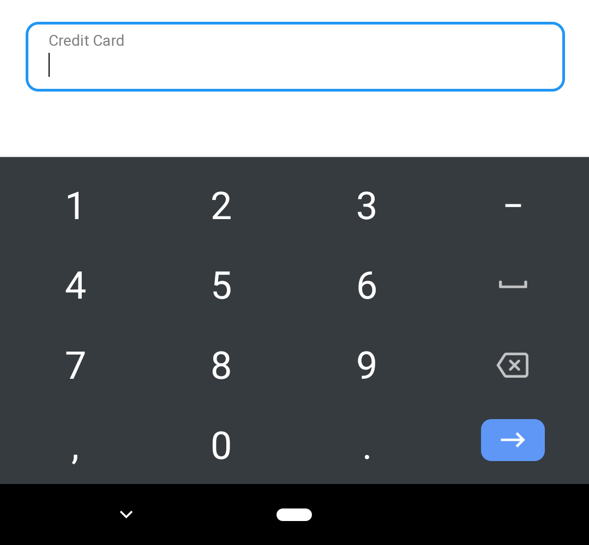

<!-- TODO (mdiblasio): update tags -->

In this guide you will learn how to reduce cart abandonment by guiding users through form-filling.

## Use labels and hints

Labels clarify the purpose of form elements, increase touch target size (the
user can touch or click either the label or the input element), and [improve form
accessibility](https://web.dev/labels-and-text-alternatives/). 


Assign a label that _describes a clear and concise purpose_ for each input element using one of the following methods:

Implicit labels:

```html
<label>First Name <input type="text"/></label>  
```

Explicit labels:

```html
<label for="first">First Name <input type="text" id="first"/></label>  
```

`aria-label` attribute:

```html
<button class="hamburger-menu" aria-label="menu">...</button>  
```

`aria-labelledby` attribute:

```html
<span id="foo">Select seat:</span>  
<custom-dropdown aria-labelledby="foo"></custom-dropdown>  
```


To learn more about `aria-label` and `aria-labelledby`, see [ARIA Labels and Relationships](https://developers.google.com/web/fundamentals/accessibility/semantics-aria/aria-labels-and-relationships).


<p class="w-mb--non">Label text should be aligned with the input line, and always be visible. It can be placed in the middle of a text field, or rest near the top of the container:</p>

<video autoplay loop muted playsinline alt="video illustrating label placement">
  <source src="video-label-placement.mp4" tfype="video/mp4">
</video>

<p class="w-mt--non">The <code>placeholder</code> attribute provides an additional hint to the user about the expected format or content, typically by displaying the value as light text
until the user starts typing in the element.</p>

```html
<input type="search" placeholder="Find anything home...">
```

<figure class="w-figure" style="text-align: center;">
  
</figure>

<!-- TODO (robdodson): display code above or below figure?  -->
<!-- TODO (meggin): display code above or below figure?  -->


Don't use the `input` field `value` to set a placeholder as this can break autofill (described below).



Placeholders should not be used instead of labels, as they disappear as soon as users start to type, [can reduce accessibility](https://www.smashingmagazine.com/2018/06/placeholder-attribute/), and can't be automatically translated. If you choose not to display a label for a given input field, hide the `label` element off-screen using CSS so it is still read by screen readers.


If hints should remain in view while users type, consider using a separate hint element above or below the input field:

<figure class="w-figure" style="text-align: center;">
  
</figure>


When using helper text in addition to a label, associate the text with the input using the [`aria-describedby`](https://developers.google.com/web/fundamentals/accessibility/semantics-aria/aria-labels-and-relationships#aria-describedby) attribute:


```html
<label for="password">Password</label>
<input type="password" id="password" aria-describedby="newpassHelper">
<p id="newpassHelper" class="input-hint">Your password should be 8-20 characters 
long and include 1 number and 1 special character.</p>
```

<!-- TODO (mdiblasio): add info about input masking in future -->

## Choose the best input type

Checkout forms require a broad range of input types. Users appreciate websites
that automatically present number pads when typing credit cards. To display a
matching keyboard for input fields, set the most appropriate `type` attribute,
or consider creating a [custom element](https://developers.google.com/web/fundamentals/web-components/customelements) for entering a quantity or date.

For example, display a numeric keyboard when asking users for their credit card
number by assigning `type="number"`:

```html
<!-- use pattern="\d*" to show numeric on iOS -->
<input type="number" pattern="\d*">  
```

<figure class="w-figure">
  
</figure>


No `type` attribute assigned to credit card input.


<figure class="w-figure">
  
</figure>


`type="number"` attribute assigned to credit card input to display a numeric keyboard.



See [the MDN web docs](https://developer.mozilla.org/en-US/docs/Web/HTML/Element/input#Form_%3Cinput%3E_types) for a full list of `type` attribute values.


## Next steps

This series of guides will show you how to optimize forms for a variety of
e-commerce conversion flows.

+   [Guide users to proper input](../form-fatigue-guide-user-input)

+   [Reduce the number of fields and steps](../form-fatigue-reduce-number-of-fields)

+   [Validate user input](../form-fatigue-validate-user-input)

+   _Coming soon!_ Analytics and A/B testing
<!-- +   [Analytics and A/B testing](../form-fatigue-analytics-ab-testing) -->

## Find out more

+   [Create Amazing Forms](https://developers.google.com/web/fundamentals/design-and-ux/input/forms/)