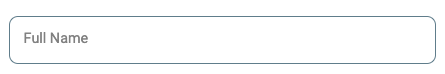

<!-- TODO (): update tags -->

_This is post 3 of 5 of the [Reduce form fatigue series](../form-fatigue) that
shows you how to build better forms for online stores._

<!-- TODO (robdodson): is there a format we should use for this line that opens each article?  -->

<!-- TODO (dutton): is there a format we should use for this line that opens each article?  -->

The best forms are the ones with the fewest inputs. 


<div class="w-stats">
  <div class="w-stat">
    <p class="w-stat__figure">26<sub class="w-stat__sub">%</sub></p>
    <p class="w-stat__desc"><a href="https://baymard.com/lists/cart-abandonment-rate">Of users abandon orders
due to a "too long / complicated checkout process"</a></p>
  </div>
  <div class="w-stat">
    <p class="w-stat__figure">13<sub class="w-stat__sub">%</sub></p>
    <p class="w-stat__desc"><a href="https://baymard.com/lists/cart-abandonment-rate">Of users abandon a site or
app because there are too many steps to purchase</a></p>
  </div>
  <div class="w-stat">
    <p class="w-stat__figure">6-8</p>
    <p class="w-stat__desc"><a href="https://baymard.com/blog/checkout-flow-average-form-fields">Average number of form fields on top performance e-commerce sites</a></p>
  </div>
</div>

+   **Consolidate fields where possible**. For example, ask users for
    their full name instead of first and last names separately:

<figure class="w-figure">
  
</figure>


Separate first and last name inputs.


<figure class="w-figure">
  
</figure>


Full name input.


<div class="w-aside w-aside--note">
  Ensure the contrast ratios of fields and labels are
accessible to all users. Small text should have a contrast ratio of at least
4.5:1 against its background. Large text (at 14-point bold, 18-point regular and
up) should have a contrast ratio of at least 3:1 against its background.
</div>

<!-- Use `street-address` vs both `address-line1` and `address-line2`
unless they're required for your address format. -->

+   **Don't make users confirm information twice**, such as email address:

<figure class="w-figure">
  
</figure>


User must enter email and password twice.


<figure class="w-figure">
  
</figure>


User enters email and password once.


<!-- TODO (mdiblasio): better image illustration -->

+   **Use sensible defaults** on inputs that can be easily inferred, such
    as country and currency. Default to the same billing and shipping addresses:

<figure class="w-figure">
  
  <figcaption class="w-figcaption">
    Fig. 2 — Small image.
  </figcaption>
</figure>

<!-- TODO (mdiblasio): highlight checkbox -->

<div class="w-aside w-aside--caution">
  When users provide separate shipping and billing addresses, don't copy
the shipping address into the billing address (and use separate <code>autocomplete</code>
attributes noted below) as this will create more work for users.
</div>


+   **Avoid collecting data that isn't absolutely necessary**. Remove
    optional form fields that are not required to complete the purchase or
    consider asking later (e.g. "How did you hear about us?")

+   **Set the `required` attribute** on all fields that must contain a
    value before the form can be submitted. 

```html
<input required />  
```

+   **Mark optional fields** (instead of required fields) so it is
    obvious to users. Avoid using the asterisk (\*) to mean "optional":

<figure class="w-figure">
  
  <figcaption class="w-figcaption">
    Fig. 2 — Distinguish optional fields.
  </figcaption>
</figure>

<!-- TODO (mdiblasio): crop? remove?  -->


Distinguish optional fields.


+   **Don't use drop downs if less than three options.** Instead, use
    buttons to minimize taps and display all options to users:

<figure class="w-figure">
  
</figure>


Delivery methods hidden behind dropdown.


<figure class="w-figure">
  
</figure>


All delivery options visible to users.



<div class="w-aside w-aside--note">
If you have more than three options, create standard dropdowns with
<code>&lt;select&gt;</code> elements. Custom dropdowns may not work properly with accessibility
frameworks or autofill. 
</div>

+   **Match the field length** to the expected length of the input.
    Fields like zip code and state should be narrow in width:

<figure class="w-figure">
  
</figure>


Delivery methods hidden behind dropdown.


<figure class="w-figure">
  
</figure>


Zip code and state fields match input length.


+   **Wait to reveal parts of your form** until the user needs to
    interact with it. 

<!-- TODO (mdiblasio): elaborate? -->

## Simplify and structure the checkout journey 

Users are more likely to abandon forms that look long and complex. If there are
more than two steps in your checkout process,  use pagination to reduce
perceived complexity:

+   **Break up long conversion flows** into three to four steps and group
    related fields. For example, Shipping → Payment → Order Review.

+   **Order the steps logically.** Start with the most important or simplest
    questions, like username and password for signed-in checkout or email for
    guest checkout. Ask for information in logical order. For example, ask
    users for their shipping address before they choose from delivery options.

+   **Always show the user their progress** at each step using a visual
    indicator or progress bar.
    [Progress indicators can significantly reduce cart abandonment](https://econsultancy.com/ecommerce-checkout-progress-indicators-essential-not-optional/).

<!-- TODO (mdiblasio): illustration? -->

+   **Use a single high-contrast, large and descriptive call-to-action** 
    that makes the next steps obvious. For example, "Proceed to Payment"
    instead of "Submit".

+   **Limit the number of exit points** by removing unnecessary clutter or
    distractions like menu or search bars. Keep important actions like _Return
    to Cart_ or _Contact Support_ enabled.

+   **Show a summary before the final step.** Users should be able to
    quickly confirm that their order is correct. At minimum, highlight 
    key information, including:
    - Shipping address
    - Billing address
    - Payment method
    - Order details and total cost

## Enable autofill

What's better than a few fields? Fields that fill-in themselves! Autofill saves
time by populating common form fields like name and shipping address
[using data codeviously specified by the user](https://support.google.com/chrome/answer/142893). 

In fact, users who successfully use Chrome Autofill to enter their information
[go through checkout an average of 30% faster](https://developers.google.com/web/fundamentals/design-and-ux/input/forms/)
than those who don't. For example, users can provide their shipping address with
two taps or clicks.

Set the `name` and `autocomplete` attributes on input elements to provide the
browser hints that describe the information you're looking for. Below is a
recommended list of common `name` and `autocomplete` values:

<table>
  <thead>
    <tr>
      <th>Content type</th>
      <th>name attribute</th>
      <th>autocomplete attribute</th>
    </tr>
  </thead>
  <tbody>
    <tr>
      <td>Name</td>
      <td>
        <code>name</code>
        <br>
        <code>fname</code>
        <br>
        <code>lname</code>
      </td>
      <td>name (full name)
        <br>
        <code>given-name</code> (first name)
        <br>
        <code>family-name</code> (last name)</td>
    </tr>
    <tr>
      <td>Email</td>
      <td>
        <code>email</code>
      </td>
      <td>
        <code>email</code>
      </td>
    </tr>
    <tr>
      <td>Address</td>
      <td>
        <code>address</code>
        <br>
        <code>city</code>
        <br>
        <code>region</code>
        <br>
        <code>province</code>
        <br>
        <code>state</code>
        <br>
        <code>zip</code>
        <br>
        <code>zip2</code>
        <br>
        <code>postalcountry</code>
      </td>
      <td>street-address (or for two address inputs use <code>address-line1</code> and <code>address-line2</code>)
        <br>
        <code>address-level1</code> (state or province)
        <br>
        <code>address-level2</code> (city)
        <br>
        <code>postal-code</code> (zip code)
        <br>
        <code>country</code>
      </td>
    </tr>
    <tr>
      <td>Phone</td>
      <td>
        <code>phone</code>
      </td>
      <td>
        <code>tel</code>
      </td>
    </tr>
    <tr>
      <td>Credit Card</td>
      <td>ccname</code>
        <br>
        <code>cardnumber</code>
        <br>
        <code>cvc</code>
        <br>
        <code>ccmonth</code>
        <br>
        <code>ccyear</code>
        <br>
        <code>exp-datecard-type</code>
      </td>
      <td>cc-name
        <br>
        <code>cc-number</code>
        <br>
        <code>cc-csc</code>
        <br>
        <code>cc-exp-month</code>
        <br>
        <code>cc-exp-year</code>
        <br>
        <code>cc-exp cc-type</code>
      </td>
    </tr>
    <tr>
      <td>Usernames</td>
      <td>
        <code>username</code>
      </td>
      <td>
        <code>username</code>
      </td>
    </tr>
    <tr>
      <td>Passwords</td>
      <td>
        <code>password</code>
      </td>
      <td>
        <code>current-password</code> (for sign-in forms)
        <br>
        <code>new-password</code> (for sign-up and password-change forms)</td>
    </tr>
  </tbody>
</table>


For a complete list of all the accepted values, see the
[WHATWG HTML Living Standard](https://html.spec.whatwg.org/multipage/form-control-infrastructure.html#autofill).

<div class="w-aside w-aside--note">
If your form contains billing and shipping address fields, add
<code>billing</code> and <code>shipping</code> to the respective <code>autocomplete</code> attributes:
</div>


```html
<label for="shipping-address">Street Address</label>  
<input id="shipping-address" autocomplete="shipping street-address" …>

<label for="billing-address">Street Address</label>  
<input id="billing-address" autocomplete="billing street-address" …>  
```

<!-- TODO (robdodson): how to highlight / bold individual attributes? -->

<div class="w-aside w-aside--gotchas">
  <p>
    Take caution to correctly spell autocomplete values! A common mistake
for Credit Card CVCs is to use <code>cc-cvc</code> instead of the correct value <code>cc-csv</code>.
  </p>
</div>

<div class="w-aside w-aside--caution">
  <p>
    Take caution to correctly spell autocomplete values! A common mistake
for Credit Card CVCs is to use <code>cc-cvc</code> instead of the correct value <code>cc-csv</code>.
  </p>
</div>

<!-- TODO (robdodson): gotcha or caution?  -->
<!-- TODO (meggin): gotcha or caution?  -->

## Next steps

This series of guides will show you how to optimize forms for a variety of
e-commerce conversion flows.

+   [Guide users to proper input](../form-fatigue-guide-user-input)

+   [Reduce the number of fields and steps](../form-fatigue-reduce-number-of-fields)

+   [Validate user input](../form-fatigue-validate-user-input)

+   [Analytics and A/B testing](../form-fatigue-analytics-ab-testing)

## Find out more

+   [Create Amazing Forms](https://developers.google.com/web/fundamentals/design-and-ux/input/forms/)