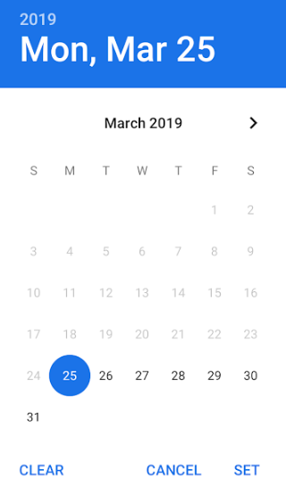
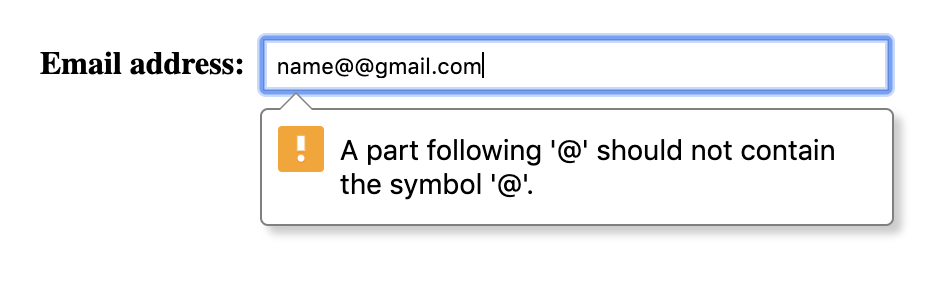
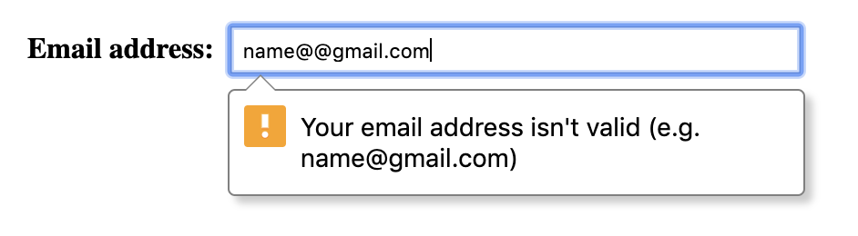

<!-- TODO (mdiblasio): update tags -->

<video autoplay loop muted playsinline>
  <source src="video-typing-on-mobile-is-hard.mp4" type="video/mp4">
</video>

<p class="w-mt--non">No matter how optimized your forms are, users will make mistakes! When this
happens, provide them with helpful feedback in real-time so they can quickly fix
the issue.</p>

## Restrict user input

An effective way to avoid validation errors is to restrict user input (where
possible) using built-in attributes.

+   **For numeric input**, use the `min` and `max` attributes to limit
    input within a range. The `step` attribute can specify how much input
    should each increment/decrement when adjusted by the slider or spinners.
    For example, you can restrict a maximum price filter within a range of $50
    to $500 with a `step` of 50:

```html
<input type="range" min="50" max="500" step="50">  
```

<!-- TODO (meggin):  image illustration or inline glitch? -->

+   **For text input**, use the `minlength` and `maxlength` attributes to
    enforce limits on the length of text. For example, you can limit a
    customized message on a flower delivery card to 50 characters:

```html
<input type="text" maxlength="50">  
```


`minlength` and `maxlength` aren't enforced on mobile browsers. Always
manually validate input on form submission.


+   **For date and time input**, use `min` and `max` to restrict dates
    and times. Browsers that provide a UI for choosing dates may prevent users
    from entering invalid dates. For example, prevent users from selecting a
    delivery date in the past or a delivery time outside of your operating hours:

<figure class="w-figure" style="text-align: center;">
  
  <figcaption class="w-figcaption">
    Chrome's default date picker.
  </figcaption>
</figure>


```html
<input type="date" min="2019-03-25" max="2019-04-25">  
<input type="time" min="11:00" max="17:00">  
```


Browsers that do not support `date` or `time` fallback to type `text`. Always manually validate input on form submission.


## Use the `pattern` attribute

In addition to restricting input, you can validate input against a regular
expression using the `pattern` attribute. For example, a valid US zip code is 5
digits and sometimes followed by a dash and an additional 4 digits:


```html  
<input type="text" pattern="^\d{5,6}(?:[-\s]\d{4})?$">  
```

The following regular expression validates credit card numbers:


```html
^(?:4[0-9]{12}(?:[0-9]{3})?|5[1-5][0-9]{14}|3[47][0-9]{13}|3(?:0[0-5]|[68][0-9])[0-9]{11}|6(?:011|5[0-9]{2})[0-9]{12}|(?:2131|1800|35\d{3})\d{11})$  
```


Unlike `pattern`—`min`, `max`, `minlength` and `maxlength` will restrict user input in real-time.


## Custom validation

If built-in validation attributes aren't enough, use the [Constraint Validation API](https://developer.mozilla.org/en-US/docs/Web/Guide/HTML/HTML5/Constraint_validation) to manually mark fields invalid. To manually invalidate a field, call `setCustomValidity()` on the invalid input element and provide a helpful, specific and non-technical validation message to the user.

For example, you can provide different email validation messages based on a
particular invalidation reason using the `validity` object property. Be sure to reset the error message when the field becomes valid:

```js/2-3,5-6,9
if (!emailInput.validity.valid) {  
  // case 1 - value missing
  if (emailInput.validity.valueMissing)  
    emailInput.setCustomValidity('We need your email to complete your purchase');  
  // case 2 - pattern mismatch
  else if (emailInput.validity.patternMismatch)  
    emailInput.setCustomValidity('Your email address isn\'t valid (e.g. name@gmail.com)');  
  // ...   
} else {  
  emailInput.setCustomValidity('');  
}  
```

<figure class="w-figure">
  
</figure>


Default validation message is technincal and may be difficult for some users to understand.


<figure class="w-figure">
  
</figure>


Custom validation message is  non-technical and easy to understand.



## Show feedback in real-time

You should check form data as users complete each field, rather than waiting for them to submit. This makes it quicker for users to correct mistakes, and makes it less likely that invalid or insecure data will be submitted. 

**Use CSS pseudo-classes** `invalid` and `valid` to apply custom styling:

```css
input:not(:focus):invalid {  
  background-color: #FFD9D9;  
}  
input:not(:focus):valid {  
  background-color: #D9FFD9;  
}  
```  
<!-- [https://codepen.io/samdutton/pen/ZPrpmL](https://codepen.io/samdutton/pen/ZPrpmL) -->

<figure class="w-figure" style="text-align: center;">
  
  <figcaption class="w-figcaption">
    Example - CSS validation styling.
  </figcaption>
</figure>


To make your forms accessible to all users, do not rely on color alone to communicate status. Colors should compliment validation messages. If you don't plan to use real-time, inline validation messages (described below), include an additional cue (e.g. validation symbol) that communicates validity.


**Display validation messages inline.** Users will not see validation messages until they try to submit the form. Rather than wait, display validation messages inline _after_ the user has inputting data using the `blur` event:

```js
firstNameInput.addEventListener("blur", function(evt) {  
  // perform custom validation and update UI if invalid
});  
```

<figure class="w-figure" style="text-align: center;">
  <video class="w-screenshot" autoplay loop muted playsinline>
    <source src="video-inline-validation.mp4" type="video/mp4">
  </video>
  <figcaption class="w-figcaption">
    Example - Real-time inline validation.
  </figcaption>
</figure>



While it's best to wait to show a validation error until the user has
finished typing, it's good practice to validate during data entry in a field
that was in an invalid state so the user is immediately notified when the data becomes valid.


## Prevent form submission with invalid data

If you need to support older browsers, use JavaScript to manually check form
validity by overriding the `submit` event and calling `checkValidity()` on the form element:

```js
form.addEventListener("submit", function(evt) {  
  // validation failure  
  if (form.checkValidity() === false) {  
    evt.preventDefault();  
    return false;  
  }  
  // validation success  
  return true;  
});  
```


This doesn't obviate the need for server-side checks! Always be sure to
validate form submissions server-side.


## Next steps

This series of guides will show you how to optimize forms for a variety of
e-commerce conversion flows.

+   [Guide users to proper input](../form-fatigue-guide-user-input)

+   [Reduce the number of fields and steps](../form-fatigue-reduce-number-of-fields)

+   [Validate user input](../form-fatigue-validate-user-input)

+   _Coming soon!_ Analytics and A/B testing
<!-- +   [Analytics and A/B testing](../form-fatigue-analytics-ab-testing) -->

### Find out more

+   [Create Amazing Forms](https://developers.google.com/web/fundamentals/design-and-ux/input/forms/)