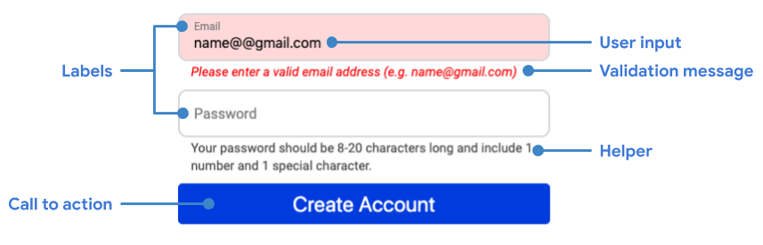

<!-- TODO (mdiblasio): update tags -->

<!-- Designing efficient forms can reduce the number of actions a user must take,
reduce friction and improve conversion — and make the whole checkout experience
less painful for your users!  -->

Efficiently designed forms can reduce the number of actions a user must take, and improve conversions — and make the whole checkout experience nicer for your users!

  

    
26%

    
<a href="https://baymard.com/lists/cart-abandonment-rate">of cart abandonments are due to a “too 
    long/complicated checkout process”</a>

  

In this series, learn how to optimize your checkout
experience to improve e-commerce conversions.

## Form anatomy

E-commerce forms are used to collect information from users to complete actions
such as product selection, sign-in and most importantly, checkout.

Forms have the following components:

<table>
  <tr>
    <th>Component</th>
    <th>Used to...</th>
  </tr>
  <tr>
    <td>
      <strong>Input field</strong>
    </td>
    <td>Collect user input in the form of text, passwords or selection</td>
  </tr>
  <tr>
    <td>
      <strong>Label</strong>
    </td>
    <td>Describe input fields</td>
  </tr>
  <tr>
    <td>
      <strong>Call-to-action</strong>
    </td>
    <td>Perform actions like Add to Cart</td>
  </tr>
  <tr>
    <td>
      <strong>Validation</strong>
    </td>
    <td>Ensure data is valid before sending to server</td>
  </tr>
  <tr>
    <td>
      <strong>Helper</strong>
    </td>
    <td>Provide hints and other helpful text to guide users</td>
  </tr>
</table>

<figure class="w-figure w-figure--fullbleed">
  
  <figcaption class="w-figcaption w-figcaption--fullbleed">
    Form anatomy.
  </figcaption>
</figure>

<figure class="w-figure w-figure--fullbleed">
  
  <figcaption class="w-figcaption w-figcaption--fullbleed">
    Form anatomy.
  </figcaption>
</figure>

## Next steps

This series of guides will show you how to optimize forms for a variety of
e-commerce conversion flows.

+   [Guide users to proper input](../form-fatigue-guide-user-input)

+   [Reduce the number of fields and steps](../form-fatigue-reduce-number-of-fields)

+   [Validate user input](../form-fatigue-validate-user-input)

+   _Coming soon!_ Analytics and A/B testing
<!-- +   [Analytics and A/B testing](../form-fatigue-analytics-ab-testing) -->

## Find out more

-   [Create Amazing Forms](https://developers.google.com/web/fundamentals/design-and-ux/input/forms/)