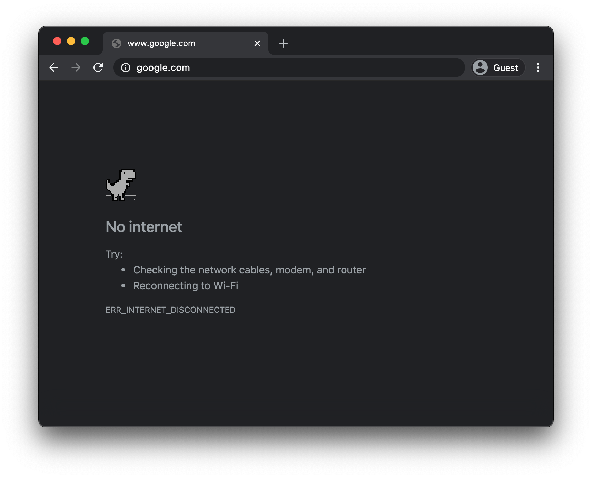
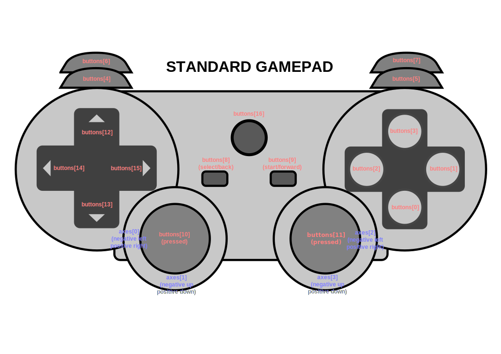

Chrome's offline page easter egg is one of the worst-kept secrets in history
(`[citation needed]`, but claim made for the dramatic effect).
If you press the <kbd>space</kbd> key or, on mobile devices, tap the dinosaur,
the offline page becomes an actually playable arcade game.
You might be aware of the fact that you do not actually have to go offline
when you feel like playing: You can also just navigate to `chrome://dino`, or,
for the geek in you, browse to
`chrome://network-error/-106`.
But did you know that there are currently
[270 million games played every month](https://www.blog.google/products/chrome/chrome-dino#jump-content:~:text=There%20are%20currently%20270%20million%20games%20played%20every%20month)?

<figure class="w-figure">
  
  <figcaption class="w-figcaption">
    Press the space bar to play!
  </figcaption>
</figure>

Another fact that arguably is more useful to know and that you might not be aware of
is that the game can be played with a gamepad.
Gamepad support was added exactly one year ago as of the time of this writing in a
[commit](https://github.com/chromium/chromium/commit/fcafd36b23c535e307da4213b7d639f8c13b8da2)
by [Reilly Grant](https://github.com/reillyeon).
As you can see, the game, just like the rest of the Chromium project,
is fully
[open source](https://github.com/chromium/chromium/tree/master/components/neterror/resources).
In this post, I want to show you how to use the Gamepad API, and as a bonus feature,
let you play the Chrome dino game on a Nintendo Switch (if you own one).

## Using the Gamepad API


  The [Gamepad API](https://w3c.github.io/gamepad/) has been around for a long time.
  This post disregards all the legacy features and vendor prefixes.


### How the browser represents a gamepad

The browser represents gamepads as `Gamepad` objects.
A `Gamepad` has the following fields:

- `id`:
  An identification string for the gamepad.
  This string identifies the brand or style of connected gamepad device.
- `index`:
  The index of the gamepad in the navigator.
- `connected`:
  Indicates whether the gamepad is still connected to the system.
- `timestamp`: The last time the data for this gamepad was updated.
- `mapping`: The mapping in use for this device. Currently the only mapping is `"standard"`.
- `axes`: An array of values for all axes of the gamepad, linearly normalized to the range of
  `-1.0`–`1.0`.
- `buttons`: An array of button states for all buttons of the gamepad.

Note that buttons can be digital (pressed or not pressed) or analog (for example, 78% pressed).
This is why buttons are reported as `GamepadButton` objects, with the following attributes"

- `pressed`: The pressed state of the button (`true` if the button is currently pressed,
  and `false` if it is not pressed.
- `touched`: The touched state of the button. If the button is capable of detecting touch,
  this property is `true` if the button is currently being touched, and `false` otherwise.
- `value`: For buttons that have an analog sensor, this property represents the amount
  which the button has been pressed, linearly normalized to the range of `0.0`–`1.0`.

One additional thing that you might encounter, depending on your browser and the gamepad you have,
is a `vibrationActuator` property.
This field is currently implemented in Chrome and earmarked for being
[merged](https://github.com/w3c/gamepad/pull/68) into the
[Gamepad Extensions](https://w3c.github.io/gamepad/extensions.html) spec.

The schematic overview below, taken
[straight from the spec](https://w3c.github.io/gamepad/#fig-visual-representation-of-a-standard-gamepad-layout:~:text=Figure%201%20Visual%20representation%20of%20a%20standard%20gamepad%20layout.),
shows the mapping and the arrangement of the buttons and axes on a generic gamepad.

<figure class="w-figure">
  
  <figcaption class="w-figcaption">
    Visual representation of a standard gamepad layout
    (<a href="https://w3c.github.io/gamepad/#fig-visual-representation-of-a-standard-gamepad-layout:~:text=Figure%201%20Visual%20representation%20of%20a%20standard%20gamepad%20layout.">
      Source
    </a>).
  </figcaption>
</figure>

### Being notified when a gamepad gets connected

The way an app can find out if a gamepad is connected is by listening for the `gamepadconnected`
event that triggers on the `window` object.
When the user connects a gamepad, which can either happen via USB or via Bluetooth,
a `GamepadEvent` is fired that has the gamepad's details in an aptly named `gamepad` property.
Below you can see an example from an Xbox 360 controller that I had lying around
(yes, I am into retro gaming).

```js
window.addEventListener('gamepadconnected', (event) => {
  console.log('✅ 🎮 A gamepad was connected:', event.gamepad);
  /*
    gamepad: Gamepad
    axes: (4) [0, 0, 0, 0]
    buttons: (17) [GamepadButton, GamepadButton, GamepadButton, GamepadButton, GamepadButton, GamepadButton, GamepadButton, GamepadButton, GamepadButton, GamepadButton, GamepadButton, GamepadButton, GamepadButton, GamepadButton, GamepadButton, GamepadButton, GamepadButton]
    connected: true
    id: "Xbox 360 Controller (STANDARD GAMEPAD Vendor: 045e Product: 028e)"
    index: 0
    mapping: "standard"
    timestamp: 6563054.284999998
    vibrationActuator: GamepadHapticActuator {type: "dual-rumble"}
  */
});
```

### Being notified when a gamepad gets disconnected

Being notified of gamepad disconnects happens analogously to the way connections are detected.
Just this time the app listens for the `gamepaddisconnect` event.
Note how in the example below `connected` is now `false`.

```js
window.addEventListener('gamepadconnected', (event) => {
  console.log('❌ 🎮 A gamepad was disconnected:', event.gamepad);
  /*
    gamepad: Gamepad
    axes: (4) [0, 0, 0, 0]
    buttons: (17) [GamepadButton, GamepadButton, GamepadButton, GamepadButton, GamepadButton, GamepadButton, GamepadButton, GamepadButton, GamepadButton, GamepadButton, GamepadButton, GamepadButton, GamepadButton, GamepadButton, GamepadButton, GamepadButton, GamepadButton]
    connected: false
    id: "Xbox 360 Controller (STANDARD GAMEPAD Vendor: 045e Product: 028e)"
    index: 0
    mapping: "standard"
    timestamp: 6563054.284999998
    vibrationActuator: null
  */
});
```

### The gamepad in your game loop

Getting a hold of a gamepad starts with a call to `navigator.getGamepads()`,
which returns a `GamepadList` object with `Gamepad` items.
Note that for this to work, you may need to "wake" your gamepad by pressing any of its buttons.
More than one gamepad can be connected to a device,
so be sure to check all items of the `GamepadList`.

```js
const pollGamepad = () => {
  // Always call `navigator.getGamepads()` inside of
  // the game loop, not outside.
  const gamepads = navigator.getGamepads();
  for (const gamepad of gamepads) {
    if (!gamepad) {
      continue;
    }
    console.log(gamepad);
    // Process the gamepad state.
  }
  // Call yourself upon the next animation frame.
  // (Typically this happens every 60 times per second.)
  window.requestAnimationFrame(pollGamepad)
};
// Kick off the initial game loop iteration.
window.requestAnimationFrame(pollGamepad)
```


  Do not store a lasting reference to the `GamepadList` result *outside* of the game loop,
  since the method returns a static snapshot, not a live object.
  Call `navigator.getGamepads()` each time anew in your game loop.


## Acknowledgements

Hero image by Laura Torrent Puig.