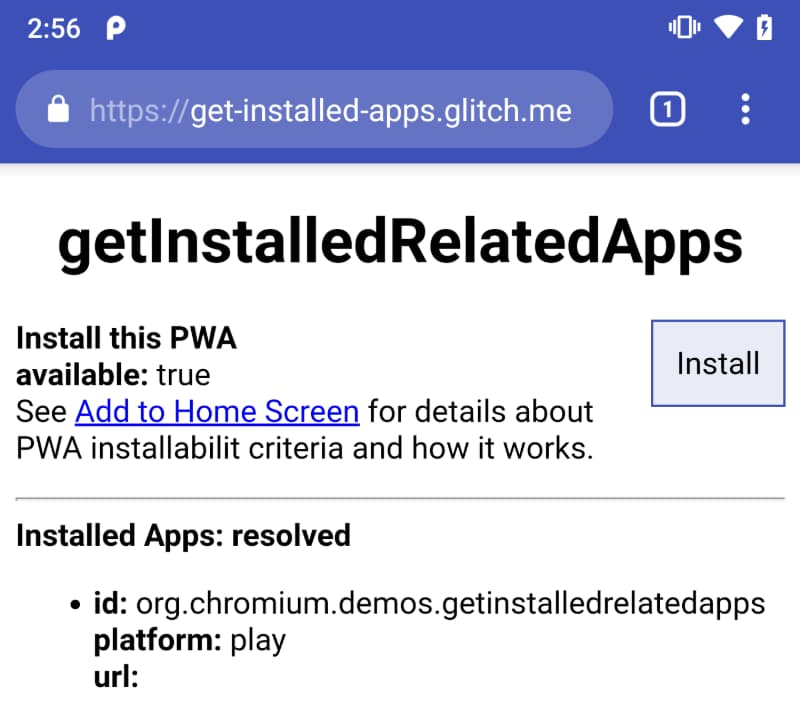

## What is the getInstalledRelatedApps() API? {: #what }

<figure class="w-figure w-figure--inline-right">
  
  <figcaption class="w-figcaption">
    A web app using <code>getInstalledRelatedApps()</code> to determine if its
    related native app is already installed.
  </figcaption>
</figure>

The [`getInstalledRelatedApps()`][spec] makes it possible for a page to check if
your native app, or Progressive Web App (PWA) is installed on a user's device.

It allows you to customize the user experience if your app is already
installed. For example, if the PWA is already installed:

* Redirecting the user from a product marketing page directly into the app.
* Centralizing some functionality like notifications in the native app to
  prevent duplicate notifications.
* Not [promoting the installation](/customize-install/) of your PWA if your
  native app is already installed.

If `getInstalledRelatedApps()` looks familiar, it is. The Chrome team originally
announced this feature in April 2017, when it first went through its first
origin trial. After the origin trial ended, they took stock of the feedback and
iterated on the design.

<div class="w-clearfix"></div>

## Suggested use cases {: #use-cases }

* Checking for the native version of an app and switching to it
* Disabling notifications in the web app when the native app is installed
* Measure how often users visit your website instead of your installed app
* Not prompting users to install the web app if the native app is installed

## Current status {: #status }

<div class="w-table-wrapper">

| Step                                         | Status                       |
| -------------------------------------------- | ---------------------------- |
| 1. Create explainer                          | [Complete][explainer]        |
| 2. Create initial draft of specification     | [Complete][spec]             |
| 3. Gather feedback and iterate on design     | Complete                     |
| 4. Origin trial                              | Complete                     |
| 5. **Launch**                                | Chrome 80, and beyond        |

</div>

## See it in action

1. Using Chrome 80 or later on Android, open the [`getInstalledRelatedApps()` demo][demo].
2. Install the demo app from the Play store and refresh the [demo][demo] page.
   You should now see the app listed.

## Define the relationship to your other apps {: #define-relationship }

To use `getInstalledRelatedApps()`, you must first create a relationship
between between your apps and sites. This relationship prevents other apps
from using the API to detect if your app is installed and prevents sites from
collecting information about the apps you have installed on your device.

In your [web app manifest](/add-manifest/), add a `related_applications`
property. The `related_applications` property is an array containing an object
for each app that you want to detect. Each app object includes:

* `platform` The platform on which the app is hosted
* `id` The unique identifier for your app on that platform
* `url` The URL where your app is hosted

For example:

```json
{
  …
  "related_applications": [{
    "platform": "<platform>",
    "id": "<package-name>",
    "url": "https://example.com",
  }],
  …
}
```

### Define the relationship to a native app {: #relationship-native }

To define the relationship to a native app installed from the Play store,
add a `related_applications` entry in the web app manifest, and update the
Android app to include a digial asset link that proves the relationship
between your site and the app.

In the `related_applications` entry, the `platform` value must be `play`,
and the `id` is the Google Play application ID for your app. The `url`
property is optional and can be excluded.

```json
{
  …
  "related_applications": [{
    "platform": "play",
    "id": "com.android.chrome",
  }],
  …
}
```

In `AndroidManifest.xml` of your native app, use the
[Digital Asset Links system][dig-asset-links] to define the relationship
between your website and Android application:

```xml
<manifest>
  <application>
   …
    <meta-data android:name="asset_statements" android:resource="@string/asset_statements" />
   …
  </application>
</manifest>
```

Then, in `strings.xml`, add the following asset statement, updating `site` with
your domain. Be sure to include the escaping characters.

```xml
<string name="asset_statements">
  [{
    \"relation\": [\"delegate_permission/common.handle_all_urls\"],
    \"target\": {
      \"namespace\": \"web\",
      \"site\": \"https://example.com\"
    }
  }]
</string>
```

Finally, publish your updated Android app to the Play store.

### Define the relationship to an installed PWA {: #relationship-web }


**Coming Soon!**
Starting in Chrome 84, in addition to checking if its native app is already
installed, a PWA can check if it (the PWA) is already installed.
Microsoft is actively working on enabling this API for Edge for Windows and we
hope to see it land in Q3 2020.


To define the relationship to an installed PWA, add a `related_applications`
entry in the web app manifest, set `"platform": "webapp"` and provide
the full path to the PWAs web app manifest in the `url` property.

```json
{
  …
  "related_applications": [{
    "platform": "webapp",
    "url": "https://app.example.com/manifest.json",
  }],
  …
}
```

#### PWA served from a different location


**Coming Soon!**
Starting in Chrome 84, a page can check if its PWA is installed, even if it
is outside the scope of the PWA. Microsoft is actively working on enabling
this API for Edge on Windows and we hope to see it land in Q3 2020.


A page can check if its PWA is installed, even if it is outside the
[scope][scope] of the PWA. For instance, `www.example.com` wants to check if
its PWA served from `app.example.com` is installed. Or a page under
`/about/` to check if the PWA served from `/app/` is already installed.

To enable this, first add a web app manifest that includes the `related_applications` property
([as indicated above](#relationship-web)) to the page that will check if its
related PWA is installed.

Next, you must define the relationship between the two pages using digital
asset links. Add an `assetlinks.json` file to the [`/.well-known/`][well-known]
directory of the domain where the PWA lives (`app.example.com`). In the `site`
property, provide the full path to the web app manifest of the page that is
performing the check.

```json
// Served from https://app.example.com/.well-known/assetlinks.json
{
  "relation": ["delegate_permission/common.query_webapk"],
  "target": {
    "namespace": "web",
    "site": "https://www.example.com/manifest.json"
  }
}
```

## Test for the presence of your installed app {: #use }

Once you've [defined the relationship](define-relationship) to your other apps,
you can check for their presence within your web site. Calling
`navigator.getInstalledRelatedApps()` returns a promise that resolves with an
array of your apps that are installed on the user's device.

```js
const relatedApps = await navigator.getInstalledRelatedApps();
relatedApps.forEach((app) => {
  console.log(app.id, app.platform, app.url);
});
```


`getInstalledRelatedApps()` is currently supported on the following platforms:

* Android: Chrome 80+
* Windows: Edge (coming soon), Chrome (coming soon)


To prevent sites from testing an overly broad set of their own apps,
only the first three apps declared in the web app manifest will be
taken into account. Like most other powerful web APIs, the
`getInstalledRelatedApps()` API is only available when served over **HTTPS**.

## Feedback {: #feedback }

Did you find a bug with Chrome's implementation? Or is the implementation
different from the spec?

* File a bug at [https://new.crbug.com][new-bug]. Include as much
  detail as you can, provide simple instructions for reproducing the bug, and
  enter `Mobile>WebAPKs` in the **Components** box. [Glitch](https://glitch.com)
  works great for sharing quick and easy repros.

## Show support for the API

Are you planning to use the `getInstalledRelatedApps()` API? Your public
support helps the Chrome team to prioritize features and shows other
browser vendors how critical it is to support them.

* Share how you plan to use the API on the [WICG Discourse thread][wicg-discourse].
* Send a Tweet to [@ChromiumDev][cr-dev-twitter] with the `#getInstalledRelatedApps`
  hashtag and let us know where and how you're using it.

## Helpful links {: #helpful }

* [Public explainer for `getInstalledRelatedApps()` API][explainer]
* [`getInstalledRelatedApps()` API demo][demo] |
  [`getInstalledRelatedApps()` API demo source][demo-source]
* [Tracking bug][cr-bug]
* [ChromeStatus.com entry][cr-status]
* [Request an origin trial token]({{origin_trial.url}})
* Blink Component: [`Mobile>WebAPKs`](https://chromestatus.com/features#component%3A%20Mobile%3EWebAPKs)

[spec]: https://wicg.github.io/get-installed-related-apps/spec/
[demo]: https://get-installed-apps.glitch.me
[demo-source]: https://glitch.com/edit/#!/get-installed-apps
[cr-bug]: https://bugs.chromium.org/p/chromium/issues/detail?id=895854
[cr-status]: https://www.chromestatus.com/feature/5695378309513216
[explainer]: https://github.com/WICG/get-installed-related-apps/blob/master/EXPLAINER.md
[wicg-discourse]: https://discourse.wicg.io/t/proposal-get-installed-related-apps-api/1602
[new-bug]: https://bugs.chromium.org/p/chromium/issues/entry?components=Mobile%3EWebAPKs
[cr-dev-twitter]: https://twitter.com/chromiumdev
[dig-asset-links]: https://developers.google.com/digital-asset-links/v1/getting-started
[well-known]: https://tools.ietf.org/html/rfc5785
[scope]: /add-manifest/#scope
