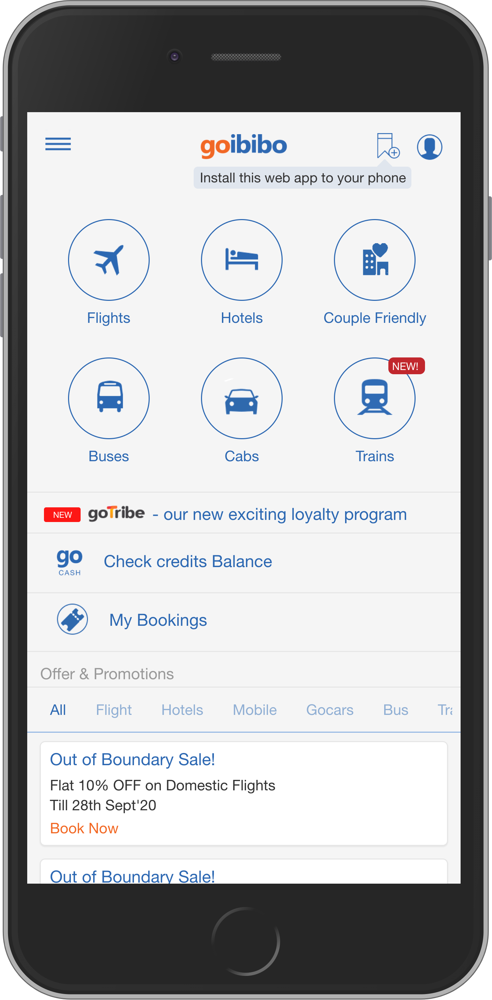

Goibibo is India's leading online travel booking portal. By building a full-featured and reliable
[Progressive Web App](https://web.dev/pwa) that matched the capabilities of their iOS and Android
apps, Goibibo achieved a 60% increase in conversions (compared to their previous web flow).

<!-- TODO drop the device border? -->
<figure class="w-figure">
  
  <figcaption class="w-figcaption">
    TODO
  </figcaption>
</figure>

## Highlighting the opportunity

In their journey to improve user experience, Goibibo noticed a few trends:  

+   With users either already shifted or quickly shifting to mobile, their initial strategy
    towards mobile web was to build a lightweight and functional application. This worked, with
    search-to-details-page conversions equalizing on web and iOS/Android, but the iOS/Android apps
    won in all further steps of the conversion funnel.  
+   There were significant drop offs at the payment stage of the PWA compared to their
    iOS/Android apps. This was when they decided to invest in their PWA with the goal of letting
    users experience the same UX on their PWA as on their iOS/Android apps.  
+   They also noticed nearly 20% of their users were starting a session on the web and
    converting on the app. This reiterated their belief that a chunk of users will go untapped
    without an aligned PWA and iOS/Android app strategy.

<figure class="w-figure">
  
  <figcaption class="w-figcaption">
    TODO
  </figcaption>
</figure>

## The tools they used

**# Contact Picker API **  
Nearly 15% of their logged-in users make bookings for family or friends on the mobile web. So,
Goibibo used the [Contact Picker API](https://web.dev/contact-picker/) to enable PWA users to fill
in forms on behalf of others hassle-free. `w-figure--inline-right`

## Web OTP  
Because secure authentication is a big challenge in India, Goibibo used the [Web OTP (One-Time
Password) API](https://web.dev/web-otp/) to reduce sign-in friction on their PWA.

<figure class="w-figure">
  
  <figcaption class="w-figcaption">
    TODO
  </figcaption>
</figure>

## Web Share API
To bridge the gap between their web and iOS/Android experiences,  Goibibo adopted the [Web Share
API](https://web.dev/web-share/) to make it easier to share  links, text, or files around hotel
details, train availability, and so on. `w-figure--inline-right`

<figure class="w-figure">
  
  <figcaption class="w-figcaption">
    TODO
  </figcaption>
</figure>

## Notifications

Goibibo used [web push
notifications](https://developers.google.com/web/fundamentals/push-notifications) to retarget
bounced users with relevant updates like flight fare alerts and other customized content. 

<figure class="w-figure">
  
  <figcaption class="w-figcaption">
    TODO
  </figcaption>
</figure>

## How new web capabilities helped improve Goibibo's step funnel

<figure class="w-figure">
  
  <figcaption class="w-figcaption">
    TODO
  </figcaption>
</figure>

## Overall Business Results

+   Iterations to PWA interfaces resulted in a 60% jump in conversion rate (compared to the
    previous mobile web flow) and delighted users.
+   [New web capabilities](https://web.dev/fugu-status/) improved UX and caused a 20% increase
    in logged-in users (who convert 6x more)  

> We always strive for seamless user experience and in turn better  conversion rates. We saw
> improved user engagement and better conversion rates on PWA than on the original mobile web flow.
> Hence,  investing in PWA is critical to our success and if we had not, it would have cost us a
> fortune.

Rithish Saralaya    
VP Engineering, Goibibo

<!-- TODO what's this supposed to link to? -->
Read more case studies here. 