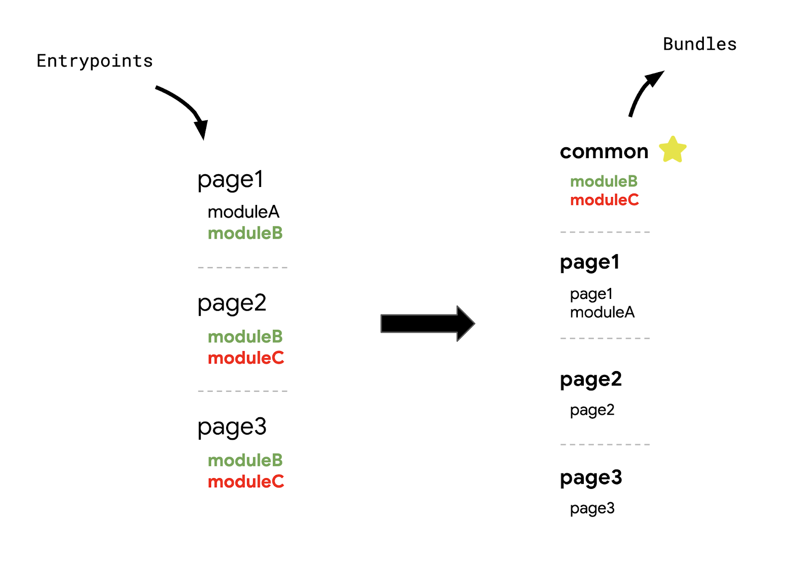
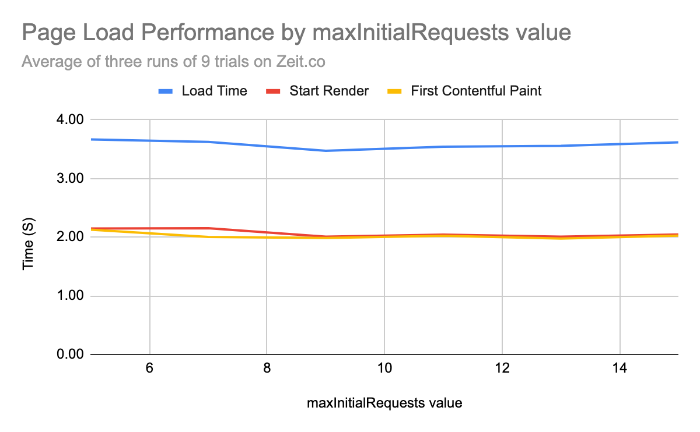
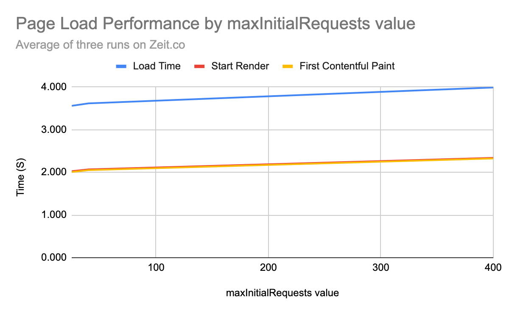
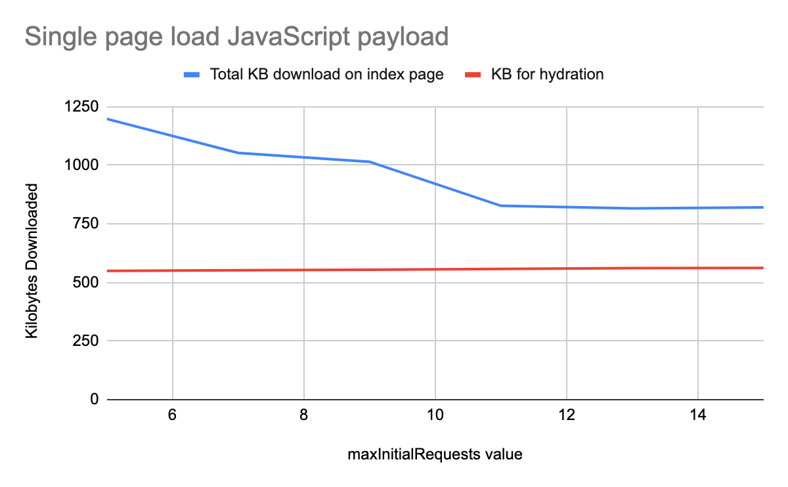
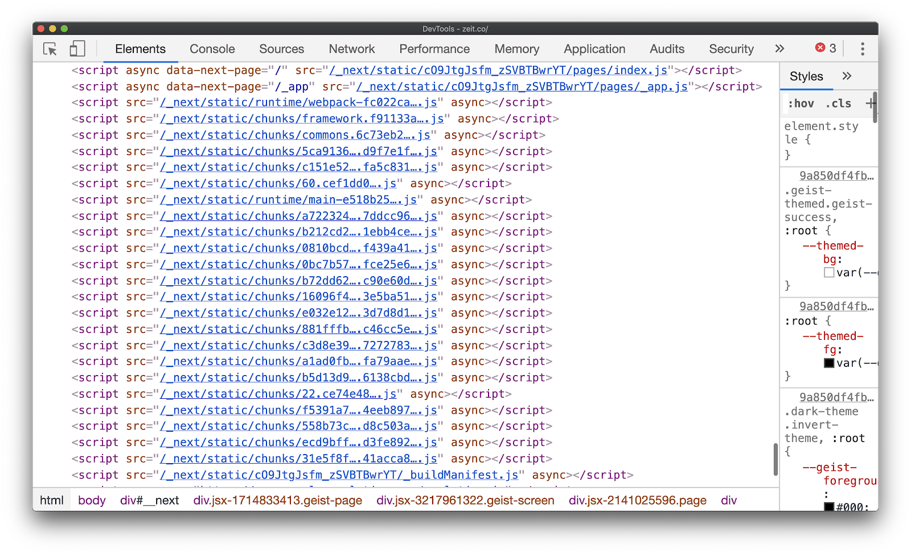

Chrome is [collaborating](https://web.dev/advancing-framework-ecosystem-cds-2019/) with tooling and
frameworks in the JavaScript open-source ecosystem. A number of newer optimizations were recently
added to improve the loading performance of [Next.js](https://nextjs.org/), and this article covers an improved granular
chunking strategy that is now shipped by default in [version 9.2](https://nextjs.org/blog/next-9-2).

## Introduction

Like many web frameworks, Next.js uses [webpack](https://webpack.js.org/) as its core bundler. webpack
v3 introduced [`CommonsChunkPlugin`](https://webpack.js.org/plugins/commons-chunk-plugin/) to make it
possible to output modules shared between different entry points in a single (or few) "commons"
chunk. Shared code can be downloaded separately and stored in the browser cache early on which can
result in a better loading performance.

This pattern became popular with many single-page application frameworks adopting an entrypoint and
bundle configuration that looked like this:



Although practical, the concept of bundling all shared module code into a single chunk has its
limitations. Modules not shared in every entry point can be downloaded for routes that do not use it
resulting in more code being downloaded than necessary (`moduleC` and `page1` in the diagram). For
this reason, along with a few others, webpack v4 removed the plugin in favor of a new
one: [`SplitChunksPlugin`](https://webpack.js.org/plugins/split-chunks-plugin/).

## Improved Chunking

The default settings for `SplitChunksPlugin`  works well for most users. Multiple split chunks are
created depending on a number of [conditions](https://webpack.js.org/plugins/split-chunks-plugin/#defaults)
to prevent fetching duplicated code across multiple routes. 

However, many web frameworks that use this plugin still follow a "single-commons" approach to chunk
splitting. Next.js, for example, would generate a `commons` bundle that contained any module that is
used in more than 50% of pages and all framework dependencies (`react`, `react-dom`, etc…).

```javascript/11,16
const splitChunksConfigs: {
  [propName: string]: webpack.Options.SplitChunksOptions
} = {
  prod: {
    chunks: 'all',
    cacheGroups: {
      default: false,
      vendors: false,
      commons: {
        name: 'commons',
        chunks: 'all',
        minChunks: totalPages > 2 ? totalPages * 0.5 : 2,
      },
      react: {
        name: 'commons',
        chunks: 'all',
        test: /[\\/]node_modules[\\/](react|react-dom|scheduler|use-subscription)[\\/]/,
      },
    },
  },
```
Although including framework-dependent code into a shared chunk means that it can be downloaded and
cached for any entrypoint, the usage-based heuristic of including common modules used in more than
_half of pages_ isn't very effective. Modifying this ratio would only result in one of two outcomes:
more unnecessary code gets downloaded or more code gets duplicated across multiple routes.

To solve this problem, we adopted a [different configuration](https://github.com/zeit/next.js/pull/7696) for`SplitChunksPlugin`
that reduces unecessary code for any route.

+   Any sufficiently large third-party module (> 160 KB) is split into its own individual chunk
+   A separate `frameworks` chunk is created for framework dependencies (`react`, `react-dom`,
    etc…)
+   As many shared chunks as needed are created (up to 25)

This granular chunking strategy provides the following benefits:

1.  **Page load times are improved**. Emitting multiple shared chunks, instead of a single one,
    minimizes the amount of unneeded (or duplicate) code for any entrypoint.
2.  **Improved caching during navigations**. Splitting large libraries and framework dependencies
    into separate chunks reduces the possibility of cache invalidation since both are unlikely to
    change until an upgrade is made.

## More HTTP requests

`SplitChunksPlugin` defined the basis for granular chunking, and applying this approach to a
framework like Next.js was not an entirely new concept. Many frameworks, however, still continued to
use a single heuristic and "commons" bundle strategy for a few reasons. This includes the concern that
many more HTTP requests can negatively affect site performance.

Browsers can only open a limited number of TCP connections to a single origin (6 for Chrome), so
minimizing the number of chunks outputted by a bundler can ensure that the total number of requests
stays under this threshold. However, this only holds true for HTTP/1.1. Multiplexing in HTTP/2
allows for multiple requests to be streamed in parallel using a single connection over a single
origin. In other words, we generally do not need to worry about limiting the number of chunks
emitted by our bundler.

[All major browsers](https://caniuse.com/#feat=http2) support HTTP/2, and we wanted to see for
ourselves if increasing the number of requests by splitting Next.js's single "commons" bundle into
multiple shared chunks would affect loading performance in any way. We began by measuring the
performance of a single site while modifying the maximum number of parallel requests using the
[`maxInitialRequests`](https://webpack.js.org/plugins/split-chunks-plugin/#splitchunksmaxinitialrequests) property.



In an average of three runs of multiple trials on a single web page, the load, start-render and
first contentful paint times all remained about the same when varying the max initial request count
(from 5 to 15). Interestingly enough, we noticed a slight performance overhead only after splitting
aggressively to hundreds of requests.



This showed that staying under a reliable threshold (20~25 requests) struck the right balance
between loading performance and caching efficiency. After some baseline testing, 25 was selected as
the `maxInitialRequest` count. 

Modifying the maximum number of requests that happen in parallel resulted in more than a single
shared bundle, and separating them appropriately for each entry point significantly reduced the
amount of unneeded code for the same page.



## Size reductions with granular chunks

Many frameworks, including Next.js, rely on client-side routing (handled by JavaScript) to inject
newer script tags for every route transition. But how do we predetermine these dynamic chunks at build time?

Next.js uses a server-side build manifest file to determine which outputted chunks are used by
different entry points. To provide this information to the client as well, an abridged client-side
build manifest file was created to map all the dependencies for every entry point.

```javascript
// Returns a promise for the dependencies for a particular route
getDependencies (route) {
  return this.promisedBuildManifest.then(
    man => (man[route] && man[route].map(url => `/_next/${url}`)) || []
  )
}
```



This newer granular chunking strategy was first rolled out in Next.j behind a flag, where it was tested on a
number of early adopters. Many saw significant reductions to the total JavaScript used for their
entire site:

<div class="w-table-wrapper">
  <table>
    <thead>
      <tr>
        <th>Website</th>
        <th>Total JS Change</th>
        <th>% Difference</th>
      </tr>
    </thead>
    <tbody>
      <tr>
        <td><a href="https://www.barnebys.com/">https://www.barnebys.com/</a></td>
        <td>-238 KB</td>
        <td>-23%</td>
      </tr>
      <tr>
        <td><a href="https://sumup.com/">https://sumup.com/</a></td>
        <td>-220 KB</td>
        <td>-30%</td>
      </tr>
      <tr>
        <td><a href="https://www.hashicorp.com/">https://www.hashicorp.com/</a></td>
        <td>-11 MB</td>
        <td>-71%</td>
      </tr>
    </tbody>
    <caption>JavaScript size reductions - across all routes (compressed)</caption>
  </table>
</div>

## Gatsby

Next.js is not the only framework that utilized a usage-based heuristic for defining common modules
in a single shared chunk. [Gatsby](https://www.gatsbyjs.org/), another major React framework, also
used to follow the
[same approach](https://github.com/gatsbyjs/gatsby/blob/e4dae4d6a46fe9ba1c3fb5398d8569e657553bd3/packages/gatsby/src/utils/webpack.config.js#L483-L489).
By optimizing their webpack configuration to adopt a similar granular chunking strategy, they also
noticed sizeable reductions in many large sites:

<div class="w-table-wrapper">
  <table>
    <thead>
      <tr>
        <th>Website</th>
        <th>Total JS Change</th>
        <th>% Difference</th>
      </tr>
    </thead>
    <tbody>
      <tr>
        <td><a href="https://www.gatsbyjs.org/">https://www.gatsbyjs.org/</a></td>
        <td>-680 KB</td>
        <td>-22%</td>
      </tr>
      <tr>
        <td><a href="https://www.thirdandgrove.com/">https://www.thirdandgrove.com/</a></td>
        <td>-390 KB</td>
        <td>-25%</td>
      </tr>
      <tr>
        <td><a href="https://ghost.org/">https://ghost.org/</a></td>
        <td>-1.1 MB</td>
        <td>-35%</td>
      </tr>
      <tr>
        <td><a href="https://reactjs.org/">https://reactjs.org/</a></td>
        <td>-80 Kb</td>
        <td>-8%</td>
      </tr>
    </tbody>
    <caption>JavaScript size reductions - across all routes (compressed)</caption>
  </table>
</div>

Take a look at the [PR](https://github.com/gatsbyjs/gatsby/pull/22253) to understand how they
implemented this logic into their build process, which is shipped by default in v2.20.7.

## Conclusion

It's important to mention that the concept of shipping granular chunks is not specific to Next.js,
Gatsby or even webpack. Everyone should consider improving their application's chunking strategy if
it follows a large "commons" bundle approach, regardless of the framework or module bundler used.

Some resources that can help:

+   Take a look at the [RFC](https://github.com/zeit/next.js/issues/7631) and
    [PR](https://github.com/zeit/next.js/pull/7696) to learn more about how this was enabled for
    Next.js.
+   For Gatsby, the [PR](https://github.com/gatsbyjs/gatsby/pull/22253) that includes these
    optimizations shows how they moved from a similar "common" style approach.
+   If you would like to see this same chunking strategy applied to a vanilla React application,
    take a look at this
    [sample React app](https://github.com/housseindjirdeh/webpack-granular-split-chunks-sample/blob/master/webpack.config.js).
+   If you use Rollup instead of webpack, take a look at the
    [`manualChunks`](https://rollupjs.org/guide/en/#manualchunks) function in order to create
    custom shared chunks.