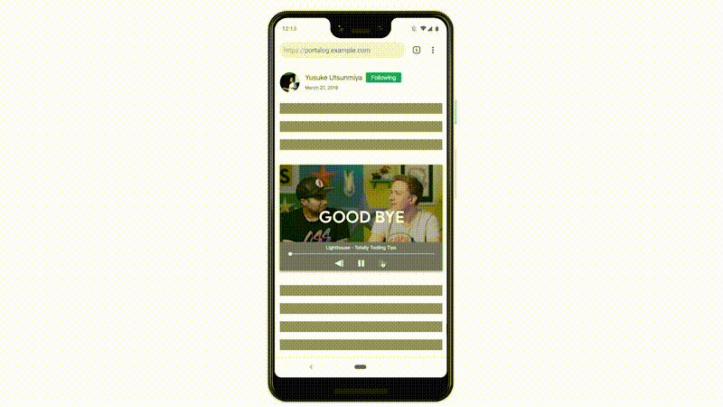

We’ve long stressed the importance of web performance. While it is tempting to focus on individual pages, it is also critical to maintain a good user experience as your users navigate across your pages. A new upcoming web platform API called [Portals](https://github.com/WICG/portals) can help you with that.

# What Portals enables
Single Page Applications with an [App Shell model](https://developers.google.com/web/fundamentals/architecture/app-shell) are one way of achieving seamless navigations. Having a static shell on the page, like the header, footer and side nav, and dynamically changing the content with a transition provides continuity to the user experience in ways that a classic navigation experience in Multiple Page Applications can’t. In particular, the navigation experience on Multiple Page Applications is plagued by frequent flashes of blank or unfinished paints. While SPA result in a better user experience, there are many reasons why you might not want to choose SPA as your frontend architecture. Maybe you don’t have the necessary expertise in your team, or you might just want to simplify the front-end and strategically select the more scalable and productivity friendly MPA architecture. The Web is open to any types of websites and each one of them should have a good way to satisfy the users with liquid smooth experience.



Portals is a new HTML element that can help you keep your front-end simple while allowing seamless navigations with custom transitions. The best part is that Portals is quite easy to work with. Think of it as an iframe in that it allows for embedding, but unlike an iframe it also comes with a feature to directly navigate into its content. Seeing is believing: please first check out what we showcased in Chrome Dev Summit last year.

<div style="width:100%; padding-top: 56.25%; position: relative;">
  <iframe style="width:100%; height: 100%;position: absolute; top: 50%; left: 50%; transform: translate(-50%,-50%);" src="https://www.youtube.com/embed/Ai4aZ9Jbsys?start=1081" frameborder="0" allow="accelerometer; autoplay; encrypted-media; gyroscope; picture-in-picture" allowfullscreen></iframe>
</div>

As you saw in the manga viewer demo, the current experience was based on classic navigations where the reader had to wait with a blank screen until the browser finished to render the next chapter. Whereas the improved experience with Portals was pre-rendering the next chapter, triggered an animation on user interaction, and finally activated the portal to create a magical seamless experience. The demo didn’t show it (because we used Chrome DevTools mobile simulator 😛) but when the pre-rendered chapter on the bottom left corner fully animated and covered the screen, the URL also switched to the next chapter.

Before Portals, we could have rendered another page using an iframe. We could also have added animations to move the frame around the page. But iframes won’t let you navigate into their content. Portals close this gap, enabling interesting use cases.

# Try out Portals in Chrome Canary

You can try out Portals in Chrome Canary by flipping an experimental flag (chrome://flags/#enable-portals). Once Portals is enabled, confirm in DevTools that you have the new shiny HTMLPortalElement.


Let’s walk through a basic example.

```javascript
// Create a portal with the wikipedia page, and embed it
// (like an iframe). You can also use <portal> tag instead.
portal = document.createElement('portal');
portal.src = 'https://en.wikipedia.org/wiki/World_Wide_Web';
portal.style = '...';
document.body.appendChild(portal);

// When the user touches the preview (embedded portal):
// do fancy animation, e.g. expand …
// and finish by doing the actual transition
portal.activate();
```

It’s that simple. Try this code in the DevTools console, the wikipedia page should open up. If you wanted to build something like we showed in CDS, the following snippet will be of interest.


```javascript
// Adding some styles with transitions
const style = document.createElement('style');
const initialScale = 0.4;
style.innerHTML = `
  portal {
    position:fixed;
    width: 100%;
    height: 100%;
    opacity: 0;
    transition:
      transform 0.4s,
      bottom 0.7s,
      left 0.7s,
      opacity 1.0s;
    box-shadow: 0 0 20px 10px #999;
    transform: scale(${initialScale});
    bottom: calc(20px + 50% * ${initialScale} - 50%);
    left: calc(20px + 50% * ${initialScale} - 50%);
    z-index: 10000;
  }
  .portal-reveal {
    transform: scale(1.0);
    bottom: 0px;
    left: 0px;
  }
  .fade-in {
    opacity: 1.0;
  }
`;
const portal = document.createElement('portal');
// Let’s navigate into the WICG Portals spec page
portal.src = 'https://wicg.github.io/portals/';
portal.addEventListener('click', evt => {
  // Animate the portal once user interacts
  portal.classList.add('portal-reveal');
});
portal.addEventListener('transitionend', evt => {
  if (evt.propertyName == 'bottom') {
    // Activate the portal once the transition has completed
    portal.activate();
  }
});
document.body.append(style, portal);

// Waiting for the page to load.
// using setTimeout is a suboptimal way and it’s best to fade-in
// when receiving a load complete message from the portal via postMessage
setTimeout(_ => portal.classList.add('fade-in'), 2000);
```

It is also easy to do feature detection to progressively enhance a website using Portals.

```javascript
if ( 'HTMLPortalElement' in window ) {
  // If this is a platform that has Portals...
  const portal = document.createElement('portal');
  ...
}
```

If you want to quickly experience what Portals feels like, try using [uskay-portals-demo.glitch.me](https://uskay-portals-demo.glitch.me). 1) Enter a URL you want to preview, 2) the page will then be embedded as a portal element, 3) click on the preview 4) The preview will be activated after an animation.


# Check out the spec
We are actively discussing the spec in [WICG](https://github.com/WICG/portals/blob/master/explainer.md). You can check out the details [here](https://wicg.github.io/portals/) but overall there are three important features that builds up the element.

 - [The portal element](https://wicg.github.io/portals/#the-portal-element) … The HTML element itself. The API is very simple. It consists of the `src` attribute, the `activate` function and an interface for messaging (`postMessage`). activate has an optional argument to pass data to the portal upon activation.
 - [The portal host interface](https://wicg.github.io/portals/#the-portalhost-interface) … This adds a `portalHost` object to the window object. This lets you check if the page is embedded as a portal element. It also provides an interface for messaging (`postMessage`) back to the host.
 - [The PortalActivateEvent interface](https://wicg.github.io/portals/#the-portalactivateevent-interface) … An event being fired when the portal is activated. There is a neat function called `adoptPredecessor` which you can use to retrieve the previous page as a `<portal>  ` element. This allows you to create seamless navigations and composed experiences between two pages.

Let’s look beyond the basic usage pattern. Here is a non-exhaustive list of you can achieve with Portals along with sample code.
## Customize the style when embedded as a portal element
```javascript
// Detect whether this page is hosted in a portal
if (window.portalHost) {
  // Customize the UI when being embedded as a portal
}
```
## Messaging between the portal element and portal host
```javascript
// Send message to the portal element
const portal = document.querySelector('portal');
portal.postMessage({someKey: someValue}, ORIGIN);

// Receive message via window.portalHost
window.portalHost.addEventListener('message', evt => {
  const data = evt.data.someKey;
  // handle the event
});
```
## Activating the portal element and receiving the `portalactivate` event
```javascript
// You can optionally add data to the argument of the activate function
portal.activate({data: {'somekey': 'somevalue'}});

// The portal content will receive the portalactivate event
// when the activate happens
window.addEventListener('portalactivate', evt => {
  // Data available as evt.data
  const data = evt.data;   
});
```
## Retrieving the predecessor
```javascript
// Listen to the portalactivate event
window.addEventListener('portalactivate', evt => {
  // ... and creatively use the predecessor
  const portal = evt.adoptPredecessor();
  document.querySelector('someElm').appendChild(portal);
});
```
## Knowing your page was adopted as a predecessor
```javascript
// The activate function returns a Promise.
// When the promise resolves, it means that the portal has been activated.
// If this document was adopted by it, then window.portalHost will exist.
portal.activate().then(_ => {
  // Check if this document was adopted into a portal element.
  if (window.portalHost) {
    // You can start communicating with the portal element
    // i.e. listen to messages
    window.portalHost.addEventListener('message', evt => {
      // handle the event
    });
  }
});
```
By combining all the features supported by Portals, you can build really fancy user experiences. For instance the demo below demonstrates how Portals can enable a seamless user experience between a website and a third party embed content. 

<div style="width:100%; padding-top: 56.25%; position: relative;">
  <iframe style="width:100%; height: 100%;position: absolute; top: 50%; left: 50%; transform: translate(-50%,-50%);" src="https://www.youtube.com/embed/4JkipxFVE9k" frameborder="0" allow="accelerometer; autoplay; encrypted-media; gyroscope; picture-in-picture" allowfullscreen></iframe>
</div>

[Here is the link to the GitHub repo](https://github.com/WICG/portals/tree/master/demos/portal-embed-demo) and you can play around with it. Be creative and have fun!!

# Use cases and the plan
I hope you liked this brief tour of Portals! We can’t wait to see what you can come up with. For instance, you might want to start using Portals for non-trivial navigations such as: prerendering the page for your best-seller product from a product category listing page. Another important thing to know is that Portals can be used in cross-origin navigations, just like iframes. So, if you have multiple websites that cross reference one another, you can also use Portals to create seamless navigations between two different websites. This cross-origin use case is very unique to Portals, and can even improve the user experience of SPA.

Note that Portals is still in early stages so not everything is working yet (that’s why it’s behind an experimental flag). That said, it’s ready for early experimentation in Chrome Canary. Feedback from the community is crucial to the design of new APIs, so please try it out and tell us what you think! You can check the current limitations [here](https://bugs.chromium.org/p/chromium/issues/detail?id=957836) and if you have any feature requests, or feedback, please head over to the [WICG GitHub repo](https://github.com/WICG/portals/issues).