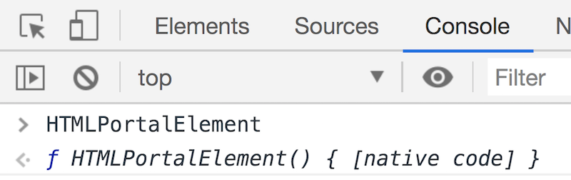
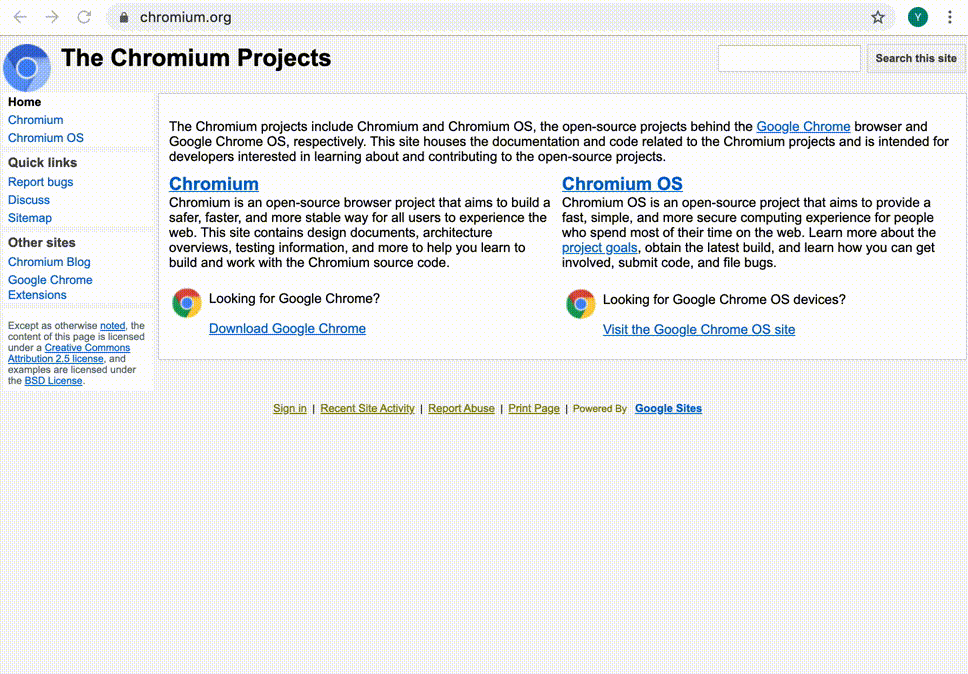
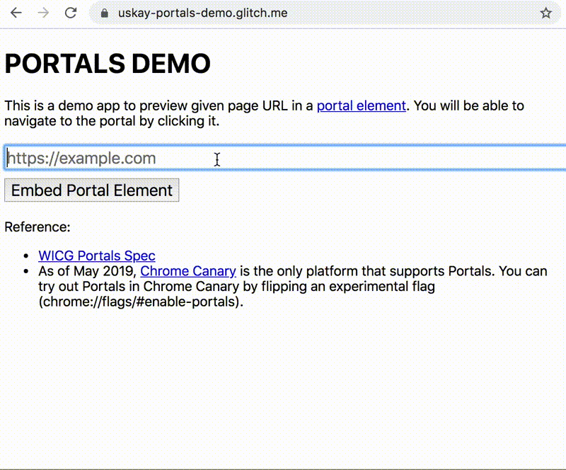

Making sure your pages load fast is key to delivering a good user experience.
But one area we often overlook is page transitions—what our users see when
they move between pages.

A new web platform API called [Portals](https://github.com/WICG/portals) aims to
help with this by streamlining the experience as users navigate _across_ your
site. See Portals in action:

<figure class="w-figure w-figure--fullbleed">
  <video controls autoplay loop muted class="w-screenshot">
    <source src="https://storage.googleapis.com/web-dev-assets/portals_vp9.webm" type="video/webm; codecs=vp8">
    <source src="https://storage.googleapis.com/web-dev-assets/portals_h264.mp4" type="video/mp4; codecs=h264">
  </video>
 <figcaption class="w-figcaption w-figcaption--fullbleed">
    Seamless embeds and navigation with Portals. Created by <a href="https://twitter.com/argyleink">Adam Argyle</a>.
  </figcaption>
</figure>

## What Portals enable

Single Page Applications (SPAs) offer nice transitions
but come at the cost of higher complexity to build.
Multi-page Applications (MPAs) are much easier to build,
but you end up with blank screens between pages.

Portals offer the best of both worlds:
the low complexity of an MPA with the seamless transitions of an SPA.
Think of them like an `<iframe>` in that they allow for embedding,
but unlike an `<iframe>`,
they also come with features to navigate to their content.

Seeing is believing:
please first check out what we showcased at Chrome Dev Summit last year:

<div style="width:100%; padding-top: 56.25%; position: relative;">
  <iframe style="width:100%; height: 100%;position: absolute; top: 50%; left: 50%; transform: translate(-50%,-50%);" src="https://www.youtube.com/embed/Ai4aZ9Jbsys?start=1081" frameborder="0" allow="accelerometer; autoplay; encrypted-media; gyroscope; picture-in-picture" allowfullscreen></iframe>
</div>

With classic navigations, users have to wait with a blank screen
until the browser finishes rendering the destination.
With Portals, users get to experience an animation,
while the `<portal>` pre-renders content and creates a seamless navigation experience.

Before Portals, we could have rendered another page using an `<iframe>`. We could also have added animations to move the frame around the page. But an `<iframe>` won't let you navigate into its content. Portals close this gap, enabling interesting use cases.

## Try out Portals in Chrome Canary

Try out Portals in Chrome Canary by flipping an experimental flag:
`chrome://flags/#enable-portals`.
Once Portals are enabled, confirm in DevTools that you have the new shiny `HTMLPortalElement`.



Let's walk through a basic example.

```javascript
// Create a portal with the wikipedia page, and embed it
// (like an iframe). You can also use the <portal> tag instead.
portal = document.createElement('portal');
portal.src = 'https://en.wikipedia.org/wiki/World_Wide_Web';
portal.style = '...';
document.body.appendChild(portal);

// When the user touches the preview (embedded portal):
// do fancy animation, e.g. expand …
// and finish by doing the actual transition
portal.activate();
```

It's that simple. Try this code in the DevTools console, the wikipedia page should open up.



If you wanted to build something like we showed at Chrome Dev Summit which works just like the demo above,
the following snippet will be of interest.

```javascript
// Adding some styles with transitions
const style = document.createElement('style');
const initialScale = 0.4;
style.innerHTML = `
  portal {
    position:fixed;
    width: 100%;
    height: 100%;
    opacity: 0;
    box-shadow: 0 0 20px 10px #999;
    transform: scale(${initialScale});
    bottom: calc(20px + 50% * ${initialScale} - 50%);
    left: calc(20px + 50% * ${initialScale} - 50%);
    z-index: 10000;
  }
  .portal-transition {
    transition:
      transform 0.4s,
      bottom 0.7s,
      left 0.7s,
      opacity 1.0s;
  }
  @media (prefers-reduced-motion: reduce) {
    .portal-transition {
      transition: all 0.001s;
    }
  }
  .portal-reveal {
    transform: scale(1.0);
    bottom: 0px;
    left: 0px;
  }
  .fade-in {
    opacity: 1.0;
  }
`;
const portal = document.createElement('portal');
// Let's navigate into the WICG Portals spec page
portal.src = 'https://wicg.github.io/portals/';
// Add a class that defines the transition. Consider using 
// `prefers-reduced-motion` media query to control the animation. 
// https://developers.google.com/web/updates/2019/03/prefers-reduced-motion
portal.classList.add('portal-transition');
portal.addEventListener('click', evt => {
  // Animate the portal once user interacts
  portal.classList.add('portal-reveal');
});
portal.addEventListener('transitionend', evt => {
  if (evt.propertyName == 'bottom') {
    // Activate the portal once the transition has completed
    portal.activate();
  }
});
document.body.append(style, portal);

// Waiting for the page to load.
// using setTimeout is a suboptimal way and it's best to fade-in
// when receiving a load complete message from the portal via postMessage
setTimeout(_ => portal.classList.add('fade-in'), 2000);
```

It is also easy to do feature detection to progressively enhance a website using Portals.

```javascript
if ('HTMLPortalElement' in window) {
  // If this is a platform that have Portals...
  const portal = document.createElement('portal');
  ...
}
```

If you want to quickly experience what Portals feel like, try using
[uskay-portals-demo.glitch.me](https://uskay-portals-demo.glitch.me).
Be sure you access it with Chrome Canary and turn on the experimental flag!

1. Enter a URL you want to preview.
1. The page will then be embedded as a `<portal>` element.
1. Click on the preview.
1. The preview will be activated after an animation.



## Check out the spec

We are actively discussing
[the Portals spec](https://wicg.github.io/portals/) in the Web Incubation Community Group (WICG).
To quickly get up to speed, take a look at
[the explainer](https://github.com/WICG/portals/blob/master/explainer.md).
These are the three important features to familiarize yourself with:

 - [The `<portal>` element:](https://wicg.github.io/portals/#the-portal-element) The HTML element itself. The API is very simple. It consists of the `src` attribute, the `activate` function and an interface for messaging (`postMessage`). `activate` takes an optional argument to pass data to the `<portal>` upon activation.
 - [The `portalHost` interface:](https://wicg.github.io/portals/#the-portalhost-interface) Adds a `portalHost` object to the `window` object. This lets you check if the page is embedded as a `<portal>` element. It also provides an interface for messaging (`postMessage`) back to the host.
 - [The PortalActivateEvent interface:](https://wicg.github.io/portals/#the-portalactivateevent-interface) An event that fires when the `<portal>` is activated. There is a neat function called `adoptPredecessor` which you can use to retrieve the previous page as a `<portal>` element. This allows you to create seamless navigations and composed experiences between two pages.

Let's look beyond the basic usage pattern. Here is a non-exhaustive list of what you can achieve with Portals along with sample code.
### Customize the style when embedded as a `<portal>` element
```javascript
// Detect whether this page is hosted in a portal
if (window.portalHost) {
  // Customize the UI when being embedded as a portal
}
```
### Messaging between the `<portal>` element and `portalHost`
```javascript
// Send message to the portal element
const portal = document.querySelector('portal');
portal.postMessage({someKey: someValue}, ORIGIN);

// Receive message via window.portalHost
window.portalHost.addEventListener('message', evt => {
  const data = evt.data.someKey;
  // handle the event
});
```
### Activating the `<portal>` element and receiving the `portalactivate` event
```javascript
// You can optionally add data to the argument of the activate function
portal.activate({data: {'somekey': 'somevalue'}});

// The portal content will receive the portalactivate event
// when the activate happens
window.addEventListener('portalactivate', evt => {
  // Data available as evt.data
  const data = evt.data;   
});
```
### Retrieving the predecessor
```javascript
// Listen to the portalactivate event
window.addEventListener('portalactivate', evt => {
  // ... and creatively use the predecessor
  const portal = evt.adoptPredecessor();
  document.querySelector('someElm').appendChild(portal);
});
```
### Knowing your page was adopted as a predecessor
```javascript
// The activate function returns a Promise.
// When the promise resolves, it means that the portal has been activated.
// If this document was adopted by it, then window.portalHost will exist.
portal.activate().then(_ => {
  // Check if this document was adopted into a portal element.
  if (window.portalHost) {
    // You can start communicating with the portal element
    // i.e. listen to messages
    window.portalHost.addEventListener('message', evt => {
      // handle the event
    });
  }
});
```
By combining all of the features supported by Portals,
you can build really fancy user experiences.
For instance, the demo below demonstrates how Portals can enable a seamless user experience
between a website and third party embed content.

<div style="width:100%; padding-top: 56.25%; position: relative;">
  <iframe style="width:100%; height: 100%;position: absolute; top: 50%; left: 50%; transform: translate(-50%,-50%);" src="https://www.youtube.com/embed/4JkipxFVE9k" frameborder="0" allow="accelerometer; autoplay; encrypted-media; gyroscope; picture-in-picture" allowfullscreen></iframe>
</div>


Interested in this demo?
[Fork it on GitHub](https://github.com/WICG/portals/tree/master/demos/portal-embed-demo)
and build your own version!


## Use cases and plans

We hope you liked this brief tour of Portals! We can't wait to see what you can come up with. For instance, you might want to start using Portals for non-trivial navigations such as: pre-rendering the page for your best-seller product from a product category listing page. 

Another important thing to know is that Portals can be used in cross-origin navigations, just like an `<iframe>`. So, if you have multiple websites that cross reference one another, you can also use Portals to create seamless navigations between two different websites. This cross-origin use case is very unique to Portals, and can even improve the user experience of SPAs.

## Feedback welcome

Portals are still in the early stages so not everything is working yet (that's why it's behind an experimental flag). That said, it's ready for experimentation in Chrome Canary. Feedback from the community is crucial to the design of new APIs, so please try it out and tell us what you think! You can check the current limitations on [the Chromium bug tracker](https://bugs.chromium.org/p/chromium/issues/detail?id=957836) and if you have any feature requests, or feedback, please head over to the [WICG GitHub repo](https://github.com/WICG/portals/issues).
