{# 
   Editorial note from @kaycebasques: I told Sam that this was a good fit for web.dev, and then
   over the next couple months my ideas about content strategy for web.dev evolved. We're going
   to publish this, because I don't have a compelling reason not to, but here's my current thinking
   (2019 Nov 23) around publishing surveys on web.dev/blog. Ultimately we want to **guide** web
   developers towards creating **better** sites. Web developers are faced with an overabundance
   of options. Posting a long list of image optimization techniques (like this post does) might
   further exacerbate their feeling of being overwhelmed. We also have to be careful about posting
   direct comments from web developers, because we don't want to spread FUD or misinformation. On
   the other hand, intermediate to advanced web developers might find the very-specific comments
   from fellow web developers helpful. We need to investigate that further somehow. Also note how
   I added an "Audience" section to this page. In general, all web.dev pages should clearly guide
   web developers towards building a better site. When a page doesn't clearly do that, an "Audience"
   section might help us make it clear why or how this page is useful to a web developer 
   (or the web developer ecosystem). If we can't describe a clear usefulness then that's a clue that
   the content might not be a good fit for web developers. In the future I think we need to help 
   web developers evaluate which image optimization techniques are best for them.
#}


  The statistics contained in this survey should not be cited because our survey methodology was
  flawed, as explained in [Caveats](#caveats). However, we're still posting the responses because we
  got a lot of useful anecdotal feedback about the state of image optimization on the web that you 
  may find helpful.


In July and August 2019 my team, Google Web DevRel, ran a survey asking web developers how they use images. 
We solicited responses through [Web Fundamentals](https://developers.google.com/web) and 
[@ChromiumDev](https://twitter.com/chromiumdev). Our motivation for the survey was to find out why 
most sites don't follow image optimization best practices even though they seem like a relatively 
easy way to improve performance. We got 2946 responses.

## Audience

+ If you're a web developer, you might find this post useful for discovering new image optimization
  techniques, or details on how other web developers have solved a problem that you're facing, as
  well as the costs, benefits, and limitations of each technique.
+ If you're an image service or image CDN provider, this post might help you find new market
  opportunities.

## Caveats

We're not confident that we can rely on our response data for the following reasons:

+ The participants were self-selecting.
+ The form got spammed or completed by some people who didn't seem to know why they were
  there. There weren't any obvious anomalies seen in responses to earlier questions, but 
  about half of all the 650 responses to the final question appeared to be spam or were not 
  relevant. In retrospect it would have been sensible to use spam filters and gather metadata
  that would have enabled us to identify non-developers.

We made some mistakes in the way we asked questions:

+ Some explanations accompanying the questions were cuing (in other words, they expressed an opinion), potentially leading to bias in the responses.
+ The explanations were intended to set the context and provide useful resources, but some of these included distracting material (providing links to resources about the `srcset` attribute, for example).
+ We felt that asking extra questions unrelated to images might feel intrusive or increase bounce rates. In retrospect, it would have been useful to ask participants for their location and other metadata.

With that said, there aren't many obvious anomalies in the response data. For example,
the response data about [framework usage](#framework-usage) resembles
[Stack Overflow's 2019 data](https://insights.stackoverflow.com/survey/2019#technology-_-web-frameworks).

---

## Do you lazy load images?


Why's this important?
[Requesting image files just in time](/use-lazysizes-to-lazyload-images), rather than getting all 
the images for a page as soon as it loads, can improve performance and reduce data cost.


2,946 responses

<figure class="w-figure">
  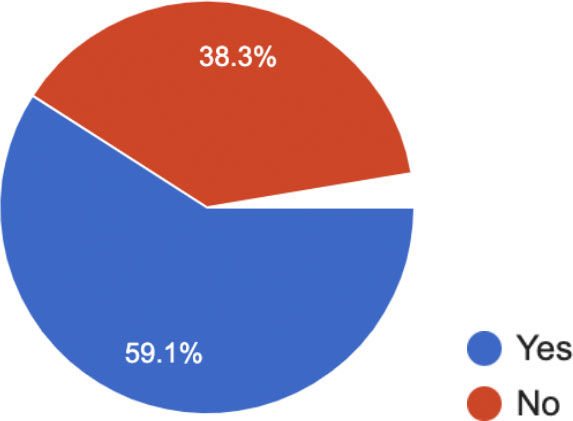
</figure>


  Do not cite these statistics. See [Caveats](#caveats).


Summary of comments from respondents who said "Other":

* Lazy loading can be annoying or confusing for end users.
* They're waiting for native support.
* They don't perceive it to be important, sometimes because their site doesn't have many images.

### If you don't use lazy loading, why not?

1,631 responses

<figure class="w-figure">
  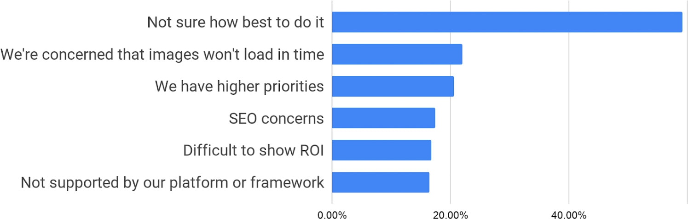
</figure>


  Do not cite these statistics. See [Caveats](#caveats).


---

## Do you use srcset?


Why's this important?
The [`srcset`](/use-srcset-to-automatically-choose-the-right-image) attribute provides alternative image sources. You specify width or pixel density so the browser can choose the smallest image without needing to download images to calculate dimensions.


2,946 responses

<figure class="w-figure">
  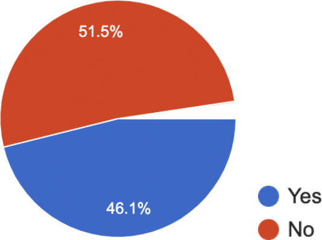
</figure>


  Do not cite these statistics. See [Caveats](#caveats).


Summary of comments from respondents who said "Other":

+ They had a lack of awareness of the benefit of `srcset`.
+ They thought it didn't have good cross-browser support. [Note: `srcset` is [supported in 92% of browsers](https://caniuse.com/#feat=srcset)]
+ They found it difficult to debug.
+ "It depends on the site - There can be quite a lot of build time overhead if generating all the sizes upfront at build time. We use AppEngine a lot, and it has get_serving_url which allows you to load scaled images which works well, but this functionality is being removed with the Python 3 environment!"

### If not, why not?

1,802 responses

<figure class="w-figure">
  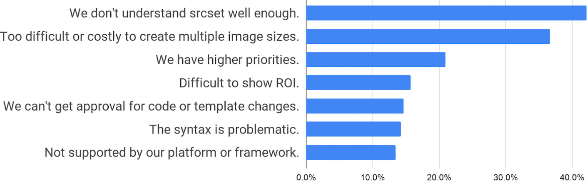
</figure>


  Do not cite these statistics. See [Caveats](#caveats).


---

## Do you use &lt;picture&gt;?


Why's this important?
The `picture` and `source` elements can be used to provide alternative, more data-efficient formats (such as [WebP](/serve-images-webp/) and JPEG) as well as [art direction to deliver different images or image crops for different display sizes](https://developers.google.com/web/fundamentals/design-and-ux/responsive/images#art_direction_in_responsive_images_with_picture).


2,914 responses

<figure class="w-figure">
  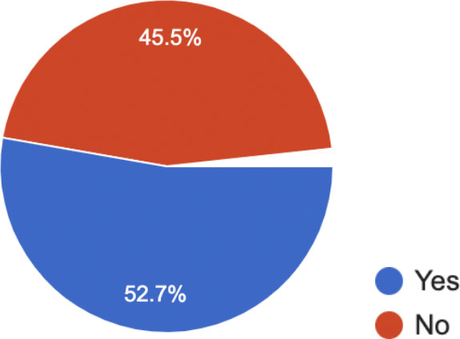
</figure>


  Do not cite these statistics. See [Caveats](#caveats).



  This question somehow got less responses (2,914) than the other required questions.


### If not, why not?

1,698 responses

<figure class="w-figure">
   or <source> well enough: ~45%,
            It's too difficult or costly to create multiple image sizes or formats: ~31%,
            We have higher priorities: ~22%,
            We can't get approval for code or template changes: ~15%,
            Not supported by our platform or framework: 15%,
            Difficult to show ROI: ~15%,
            The syntax is problematic: ~13%" src="picture-if-not.jpg" style="max-width: 75%">
</figure>


  Do not cite these statistics. See [Caveats](#caveats).


---

## Do you use WebP (or other formats) with fallbacks?


Why's this important?
Image formats such as [WebP](/serve-images-webp) can result in smaller files and better quality than older formats such as JPEG and PNG.
There are several techniques for using modern formats with fallback for older browsers.


2,946 responses

<figure class="w-figure">
  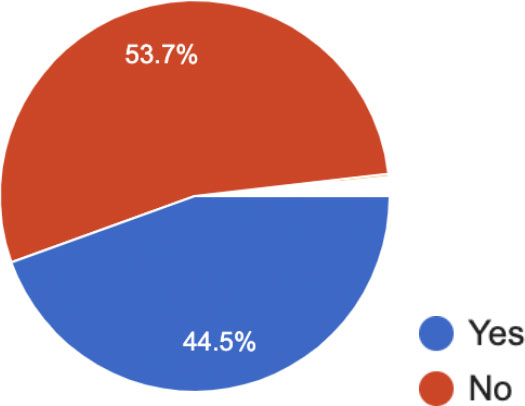
</figure>


  Do not cite these statistics. See [Caveats](#caveats).


Summary of comments from respondents who said "Other":

+ They intend to implement WebP in the future.
+ Safari and other platforms do not support WebP.
+ They're already using other formats.

### If not, why not?

1,830 responses

<figure class="w-figure">
  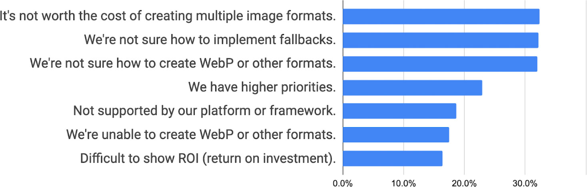
</figure>


  Do not cite these statistics. See [Caveats](#caveats).


---

## Do you use PNGs for photographic images?


Why's this important?
Formats such as [WebP or JPEG are generally much more efficient for photographic images](https://developers.google.com/web/fundamentals/performance/optimizing-content-efficiency/image-optimization) than PNG.


2,946 responses

<figure class="w-figure">
  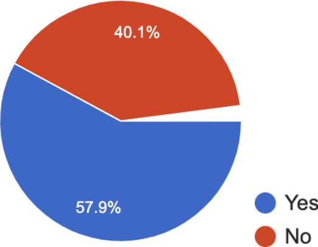
</figure>


  Do not cite these statistics. See [Caveats](#caveats).


Summary of comments from respondents who said "Other":

+ They're forced to use PNG because of the lack of browser support for WebP.

### If so, why?

1,458 responses

<figure class="w-figure">
  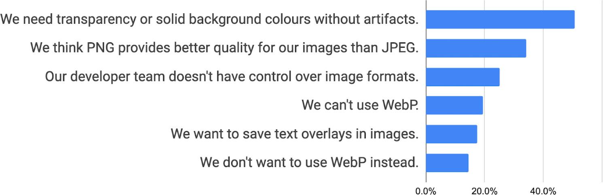
</figure>


  Do not cite these statistics. See [Caveats](#caveats).


---

## Do you serve images with dimensions appropriate for display size?


Why's this important?
[Serving images with appropriate dimensions](/serve-images-with-correct-dimensions) can reduce file size and improve performance.


2,946 responses

<figure class="w-figure">
  
</figure>


  Do not cite these statistics. See [Caveats](#caveats).


Summary of comments from respondents who said "Other":

+ They can only use what their "API" provides.
+ They haven't thought about it or didn't know about it.
+ It's not clearly worth the effort.

### If not, why not?

1,407 responses

<figure class="w-figure">
  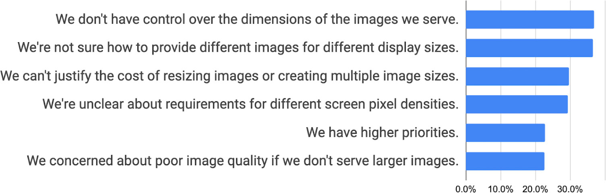
</figure>

---

## Do you use a platform or CMS?

2,946 responses

<figure class="w-figure">
  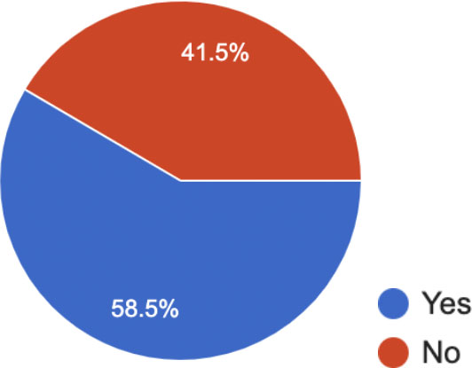
</figure>


  Do not cite these statistics. See [Caveats](#caveats).


### If so, which one(s)?

1,603 responses

<figure class="w-figure">
  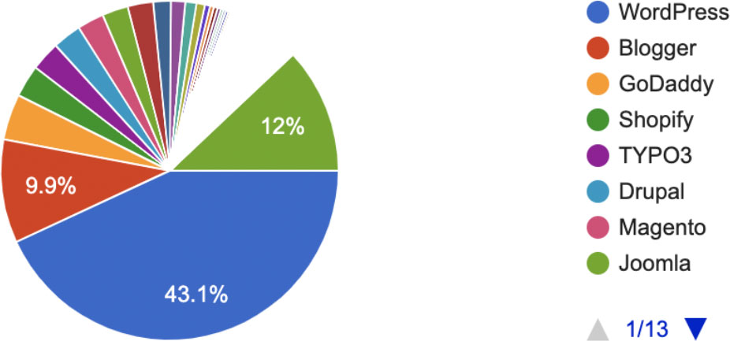
</figure>


  Do not cite these statistics. See [Caveats](#caveats).



These numbers don't make sense. 41.5% of 2,946 respondents said they don't use a platform or CMS, and yet 1,603 (54%) responded to the follow-up question.


---

## Do you use a web framework or library?

2,946 responses

<figure class="w-figure">
  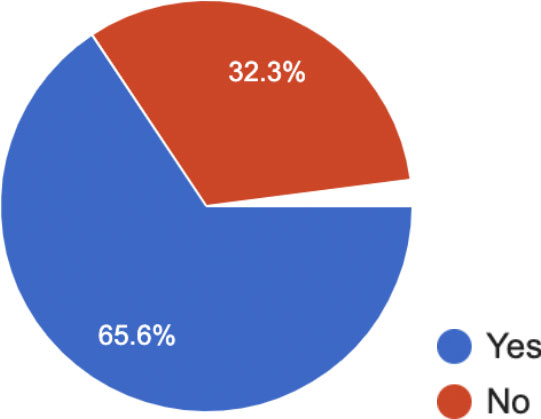
</figure>


  Do not cite these statistics. See [Caveats](#caveats).


### If so, which one(s)? {: #framework-usage }

1,729 responses

<figure class="w-figure">
  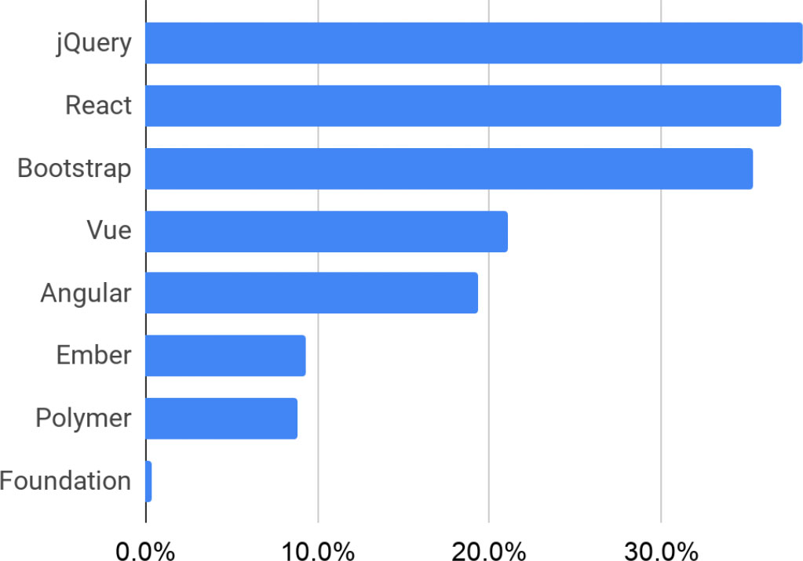
</figure>


  Do not cite these statistics. See [Caveats](#caveats).


---

## How would you describe the sector you work in?

2,946 responses

<figure class="w-figure">
  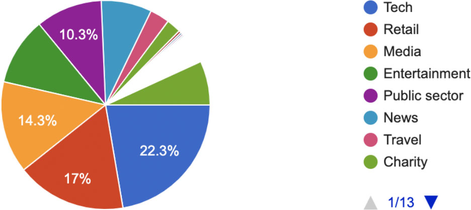
</figure>


  Do not cite these statistics. See [Caveats](#caveats).



  This question could have been phrased better. For example, it's not clear whether a web 
  developer working for an e-commerce agency is in "Tech" or "Retail".


---

## Do you use an image service or CDN?


Why's this important?
**Image services** make it easier to optimize your images. You usually just upload one high-resolution
version of each image and then use a web service API to optimize or transform the image as needed.
**Content Delivery Networks (CDNs)** optimize the distribution and delivery of images and other website assets
and sometimes provide optimization services, such as automatically delivering WebP images to supporting browsers instead of PNG or JPEG, without changing the file extension.


2,946 responses

<figure class="w-figure">
  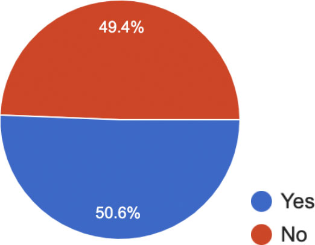
</figure>


  Do not cite these statistics. See [Caveats](#caveats).


### If so, which one(s)?

1,404 responses

<figure class="w-figure">
  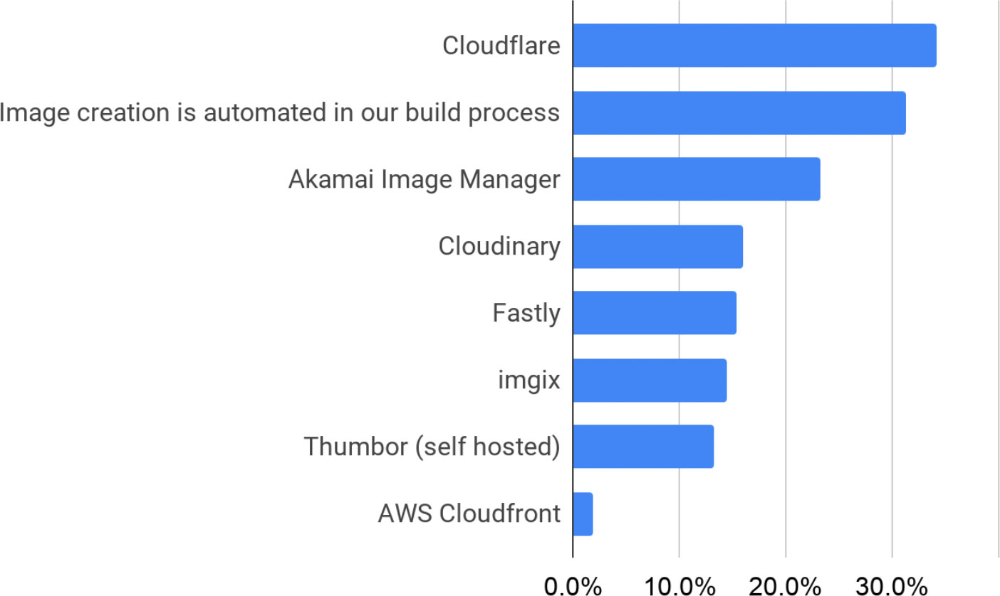
</figure>


  Do not cite these statistics. See [Caveats](#caveats).


---

## Anything else you'd like to tell us about images?

651 responses.

Below is a selection of responses, some of which have been slightly reworded or corrected for typos and other minor errors.

### WebP

+ "I do like WebP but it isn't yet fully ready. Moreover, our WordPress doesn't support WebP. One of the most popular photo editing apps, Photoshop, also doesn't support WebP out of the box. So we can't rely on 3rd party apps or services for image compression."
+ "Make WebP usable on Safari."
+ "I would love to use WebP if I could export them from Photoshop/Figma/Sketch and all browsers supported it." [Note: Sketch does support WebP]
+ "Next gen formatting solution would be great."
+ "Stop pushing WebP so hard when browser support is poor, and consider the need for PNG instead of JPEG for screenshots."
+ "Google Docs doesn't support WebP."
+ "We would use WebP exclusively, but are concerned about browser compatibility."
+ "First fix browser compatibility and update legacy browsers or add legacy fixes, then people will be more inclined to adopt to new image types like WebP…"
+ "Encourage plugin/theme developers to consider providing support to WebP and other next-gen image types, so that non-developers don't need to fiddle with it."

### SVG and vector images

+ "If possible I'm using (animated) SVG. gatsby-image fixed a lot of this. But when you dig into what they've done, it's completely unrealistic that a normal website should have to build out something like that to get images to work right. The browser should take on more of this responsibility."
+ "Would it be possible to document how to create SVG animations with lotty.js?"
+ "We try to use big resolution JPEG pictures with low sizes in our website most of the time to avoid loading times. We also ensure to use SVGs when necessary to provide quality for responsive design."
+ "We try to use optimized vector graphics for all but pics if possible."

### Other format comments

+ "We [need to] better educate people to stop using GIF."

### Lazy loading

+ "Please keep the user in mind when considering features such as lazy load, because for many it's annoying."
+ "Make the lazy load attribute work with background-image please."
+ "We love that lazy loading of images is finally becoming a native feature."
+ "Frameworks should do better asset processing out of the box."
+ "We have converted from lazy loading a long time ago.  User reports of millions of images and sites "NOT LOADING".  That was understanding our team summarized it as.  It's hard for a non-technical users to describe issues."
+ "I'm keen to get a better understanding of using Intersection Observer API for lazy loading rather than using traditional techniques."

### Background images

+ "I usually load images as backgrounds in CSS."
+ "The `` tag is problematic and difficult to control fine-grained details about, especially with user-submitted content. We use `
` and background-image styling much more often as it allows us to use background-size, background-position, and prevent right-click saving of the image."

### Transparency

+ "It's 2019. How are JPGs still without alpha transparency?"
+ "I only really use PNGs for photographs when I need a transparent background."

### Low Quality Image Placeholders (LQIPs)

+ "We use LQIPS and it's a great technique to keep visitors engaged without loading high quality images really early."

### Performance

+ "We actually had a recent performance issue with images. As a user scrolls down on our site, we show the next 60 cards which include a thumbnail. Due to the 6 connection limit on the same domain, the thumbnails were being blocked as well as the next AJAX request to get the next 60 cards if a user continues to scroll down."
+ "We would love to use HTTP/2 but most of our customers use IE11! We are therefore exploring domain sharding / loading AJAX JSON data requests off a different domain."

### Sizing

+ "Sorry for intrinsicsize; leveraging height/width seems better to me."
+ "Looking for a way to generate less sizes, right now it's ~12."
+ "Dynamic resizing of images is really hard and impossible without JS."

### High quality and high-resolution images

+ "How to download compress images without losing DPI quality?"
+ "We're a document management company. Our apps handle MILLIONS of hi-res scanned images, usually TIFF or PDF."
+ "It's a hassle. Hi-res img files are necessary for print format; must be optimized for web. It's a hassle to downsize images for web but it's a show-stopper if authors only supply lightweight files for images destined for print publication. We wind up giving mixed messages about requirements for submission of manuscripts with artwork. We then wind up with complex workflows for processing those materials."

### Browser capability

+ "Auto responsive src crop from browser as native feature would be very useful as it is time consuming to crop all images to 4 sizes and writing all the markup. If we can upload one large photo and writing a simple picture tag that browsers will automatically create the multiple src attributes that would be a winning feature."
+ "Personally I'm having a hard time avoiding page reflows when image with is set by CSS for responsive images (max-width: 100%; height auto or height: width: 100%; height auto), especially in combination with art direction from adaptive images/picture tag. Best way to avoid seems to use the "negative padding hack" for a fixed image ratio and then position the image inside this ratio box. Better browser support/responsive image handling would be a really great help!"
+ "Please disable GIF "autoplay" by fetching just the first frame."

### CDNs and image services

+ "Google should provide a free CDN like Cloudflare."
+ "Maybe more tooling to set up dynamic scaling and CDNs with different providers would be nice."
+ "A single oversized overcompressed image is a very decent solution with no extra production cost. You need around 1000 pixels wide images for mobile (500px render width) and that is also the size you need for large/desktop non-retina displays. I think images resize CDNs are a very bad solution, although I have used it in the past. The CMS should handle the resizing and of that is too complex to set up, a single solution is a good compromise (for now)."
+ "CloudFlare auto-scales our images to best match the user's display. So we can save on loading time because images are loaded in relative to the user's display. For example, if a user is on a phone, it won't load in a desktop-sized background."
+ "Cloudflare does this in the background without us having to do anything except check a box in our settings panel."
+ "Just to reiterate, the only reason I can successfully use srcset, etc. is due to the ease of Cloudinary. But Cloudinary gets expensive, *really* fast. this feels like a major hole in the development experience."
+ "We need a way to easily auto crop images in a smart way so they can work with different aspect ratios in different contexts."
+ "I also use images from Other providers like Unsplash where there is very less control of resolution, quality and compression."

### CMS, platform and framework

+ "I still struggle to find out what is the best way to use images, when I am building a site using a CMS. Authors tend to configure images with different dimensions and expect images not to shrink or scale. I am not sure if it is ok to set max-width or max-height on images"
+ "Been using gatsby-image for the last few projects and have never looked back."
+ "Images are often the hard part as they are put into CMS by end user, they may use any size, format, sometimes original image in ideal image format and dimensions are not available."
+ "Images are difficult to maintain since our system is self-serve adding controls is difficult unless things happen automatically without affecting resolution. Also for us images don't look correct in mobile vs desktop"
+ "I help people to optimize their sites (WordPress). The biggest problems I've seen for images are: Need to depend on a CDN or plugins to create WebP. srcset/picture has to be coded properly by theme developers. Most of the lazy loading plugins loads slowly giving bad UX. Background images are hard to lazy load."

### Cost/benefit

+ "The new practices are effective but increase the development time of the sites."
+ "The lack of adherence to the new standards such as srcset and WebP has been slow to be adopted by many Fortune 500 companies. Seeing this, many companies have resisted the change as an unnecessary development cost for current websites. The performance gains are not widely discussed or reported by the end user (UX). If anything, it makes it somewhat harder to save images from the web."
+ "Costly to create and manage multiple sizes, versions."
+ "They take up a lot of space on our server."

### SEO

+ "It's difficult to balance between acceptable image quality and file size. On one hand, I want fast loading for the SEO benefit, but on the other hand, poor quality images will detract from the UI/UX."

### The web beyond images

+ "There are too many on the web. Stop using useless images that don't enhance the written content."
+ "Do you still remember the time when the web didn't have images and we shared selfies as ASCII-art?"

### Tooling, guidance, standards and best practice: frustrations and requests

+ [One participant wrote a [blog post](https://stokito.wordpress.com/2019/07/19/how-to-make-web-images-better/) in response to this survey]
+ "The requirements seems to constantly change. As a web developer it is extremely frustrating because it is time consuming to save out the images in the first place. We optimize the best we can, we check the site and then months later Google has decided that the images could be even more compressed or need to be in a different format. This prevents us from providing the best possible solution to our client that lasts and instead creates a costly endeavor for them and us. Some of our small business clients simply don't have the budget for us to keep fixing images and re-saving them out to adhere to the requirements. We don't have the budget to do this work within their management packages. Writing the code to call different image sizes for different devices is also time consuming. It would be great to come up with a system of saving out images that would be consistent for a longer period of time."
+ "Yes, I think you got [Keep Request Counts Low And File Sizes Small](https://developers.google.com/web/tools/lighthouse/audits/budgets) all wrong in Lighthouse. If a site serves over HTTP1.x then sure, but if a site serves over HTTP2 then the number of requests is less important or not even an issue if originating from the same hostname. I have a lite website, but I load 30 small WebP files of approx 35 requests total, over HTTP2 on the same hostname. Lighthouse is flagging this as an "Keep Request Counts Low And File Sizes Small" issue whereas it is superfast and because of the HTTP2 on the same hostname the number of requests are not a problem. And yes, the files are already small (most between 1 KB and 2 KB or less). I could load a sprite but then more CSS computing needs to be done. So please update the "Keep Request Counts Low And File Sizes Small" report in Lighthouse to take HTTP2 over same hostname into account."
+ "It has been a struggle for people to remember to compress their images."
+ "Cross browser behavior remains unpredictable so the simplest solutions are often the safest."

### Recommendations

+ "This well works for me: [pwafire.org/developer/codelabs/progressive-loading](https://pwafire.org/developer/codelabs/progressive-loading)."
+ "A tool like [responsivebreakpoints.com](http://responsivebreakpoints.com) is good for web.dev :)."

