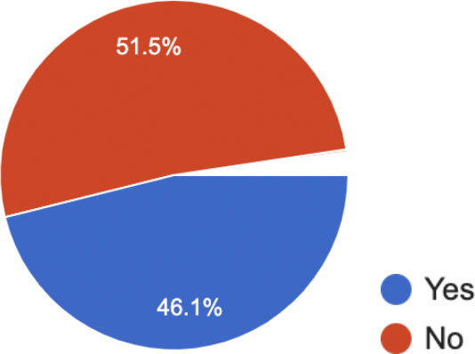
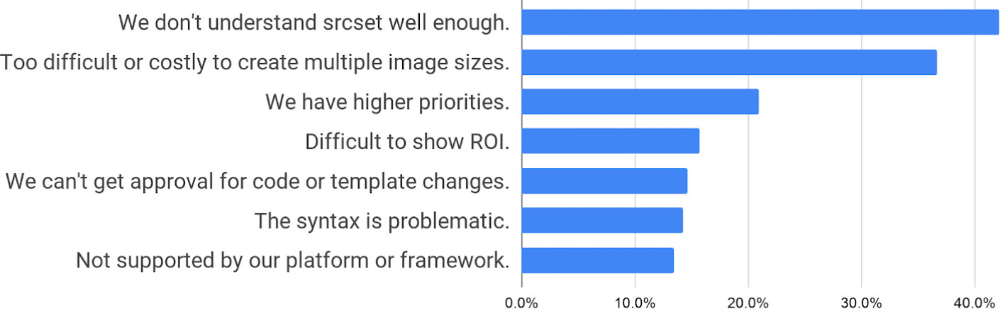
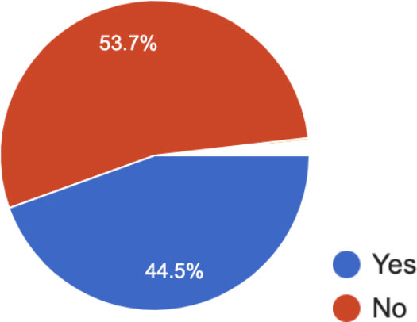
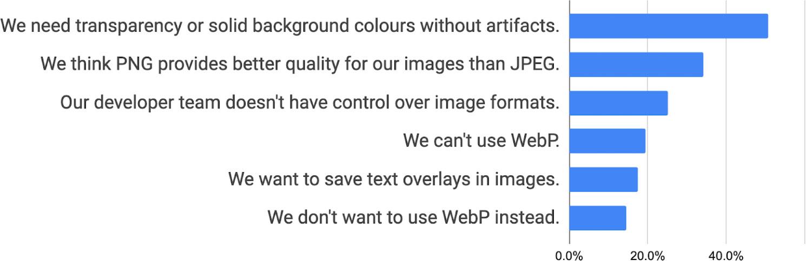

## Draft


The data contained in this survey is not reliable and should not be cited, as explained in Caveats section below.

However, we're still posting the responses because we got a lot of useful anecdotal feedback about the state of image optimization on the web and you may find it helpful to learn about how other web developers think about image optimization.


In July and August 2019 Google Web DevRel ran a survey asking web developers how they use images. We solicited responses through [developers.google.com/web](developers.google.com/web) and the [@ChromiumDev](https://twitter.com/chromiumdev/media?lang=ca) account on Twitter. Our motivation for the survey was to find out why most sites don't follow image optimization best practices even though they seem like a relatively easy way to improve performance. We got 2971 responses.

## Caveats

+ The participants were self selecting.
+ The form got spammed and/or completed by some people who didn't seem to know why they were there. There weren't any obvious anomalies seen in responses to earlier questions, but about half of all the 650 responses to the final question appeared to be spam or were not relevant. In retrospect it would have been sensible to have used CAPTCHA and/or other mechanisms to avoid spam and discourage non-developers from completing the survey.

We made some mistakes in the way we asked questions:

+ Some explanations accompanying the questions were cuing (i.e. they expressed an opinion), potentially leading to bias in the responses.

+ The explanations were intended to set the context and provide useful resources, but some of these included distracting material (providing links to resources about the srcset attribute, for example).

+ We felt that asking extra questions unrelated to images might feel intrusive and/or increase bounce rates. In retrospect, it would have been useful to ask participants for their location/region and other metadata.

---

## Summary of responses

The sections below show responses and comments for each survey question.

**Note:** A small proportion of the respondents selected 'Other' for the Yes/No questions. Their responses are summarised in the 'Other comments' sections.

## Do you lazy load images?

<figure class="w-figure">
  
</figure>


Requesting image files just in time—rather than getting all the images for a page as soon as it loads—can improve performance and reduce data cost.

**Find out more:**

• [web.dev/use-lazysizes-to-lazyload-images](web.dev/use-lazysizes-to-lazyload-images)

• [developers.google.com/search/docs/guides/lazy-loading](developers.google.com/search/docs/guides/lazy-loading)


### If you don't use lazy loading, why not?

1,631 responses

<figure class="w-figure">
  
</figure>

+ Lazy loading can be annoying and/or confusing for end users.
+ Waiting for native support [i.e. [web.dev/native-lazy-loading](https://web.dev/native-lazy-loading)].
+ Not that important, or not all that many images.

### Interpretation

+ Many respondents are unsure how best to implement lazy loading.
+ Many respondents reported SEO concerns.
+ Some respondents expressed concerns that images don't load reliably or in time.

---

## Do you use srcset?

<figure class="w-figure">
  
</figure>


The srcset attribute provides alternative image sources. You specify width or pixel density so the browser can choose the smallest image without needing to download images to calculate dimensions.

**Find out more:**

• [web.dev/use-srcset-to-automatically-choose-the-right-image](web.dev/use-srcset-to-automatically-choose-the-right-image)


### If not, why not?

1,802 responses

<figure class="w-figure">
  
</figure>

### Other  comments

+ Never heard of it / didn't know about it.
+ Perceived lack of support (though srcset is supported by  [>92% of browsers globally](https://caniuse.com/#feat=srcset)).
+ Difficult to debug.
+ 'I'd love Google to offer something like imgix or Cloudinary.'
+ 'It depends on the site - There can be quite a lot of build time overhead if generating all the sizes upfront at build time. We use AppEngine a lot, and it has get_serving_url which allows you to load scaled images which works well, but this functionality is being removed with the Python 3 environment!'

---

## Do you use &lt;picture&gt;?

<figure class="w-figure">
  
</figure>


The `picture` and `source` elements can be used to provide alternative formats (such as WebP and JPEG) as well as art direction to deliver different images or image crops for different display sizes.

**Find out more:**
• [web.dev/serve-images-webp/#serve-webp-images](web.dev/serve-images-webp/#serve-webp-images)
• [simpl.info/pictureart](simpl.info/pictureart)
• [simpl.info/picturetype](simpl.info/picturetype)


### If not, why not?

<figure class="w-figure">
  
</figure>

### Other comments
+ Haven't heard of it before.
+ Perceived lack of browser support (though `picture` and `source` are supported by [>92% of browsers globally](https://caniuse.com/#feat=picture)).
+ Benefits unclear.

---

## Do you use WebP (or other formats) with fallbacks?

2,946 responses

<figure class="w-figure">
  
</figure>


Image formats such as WebP can result in smaller files and better quality than older formats such as JPEG and PNG.

There are several techniques for using modern formats with fallback for older browsers.

**Find out more:**

• [web.dev/serve-images-webp](web.dev/serve-images-webp)


### If not, why not?

1,830 responses

<figure class="w-figure">
  
</figure>

### Other comments

+ Intend to in the future.
+ Safari and other platforms do not support WebP.
+ Using other formats.
+ 'Not supported by Safari, easier to just use a PNG.'

### Interpretation

+ Many developers don't know how to create WebP images, despite GUI tools such as [Squoosh](https://squoosh.app/).
+ Photoshop and some other image editors (apart from Sketch) do not natively support WebP.
+ Many developers aren't aware of command line tools such as [cwebp](https://developers.google.com/speed/webp/docs/cwebp) for bulk encoding (or transcoding) of WebP images.
+ Developers don't know how to use WebP with fallbacks, for example by using the picture element, or via an image service that provides fallback formats depending on user agent capability.
+ Many respondents to this survey believe they can't use WebP because it's not supported by all the browsers they're targeting. This implies that they're not aware of how to use fallbacks.
+ Lack of WebP uptake. Many respondents are skeptical though they're aware of WebP and its potential benefits.
+ Lack of WebP awareness among some developers.
+ Lack of knowledge about how to create WebP images.
+ Doubts about WebP quality.
+ Photoshop and other image editors (apart from Sketch) do not natively support WebP.
+ Concern that creating multiple image formats is costly and complex. The perception from many developers is that WebP offers marginal gains.
+ Lack of understanding that WebP can be used with fallbacks, either using the picture element, or via an image service that checks user agent capability.

---

## Do you use PNGs for photographic images?

2,946 responses

<figure class="w-figure">
  
</figure>


Formats such as WebP or JPEG are generally much more efficient for photographic images than PNG.

Find out more: developers.google.com/web/fundamentals/performance/optimizing-content-efficiency/image-optimization


### If so, why?

1,458 responses

<figure class="w-figure">
  
</figure>

### Other comments

+ 'I honestly don't know.'
+ Lack of browser support for WebP.

---

## Do you serve images with dimensions appropriate for display size?

2,946 responses

<figure class="w-figure">
  
</figure>


Serving images with dimensions appropriate for viewport and display size can reduce file size and improve performance.

**Find out more:**

• [web.dev/serve-images-with-correct-dimensions](web.dev/serve-images-with-correct-dimensions)


### If not, why not?

1,407 responses

<figure class="w-figure">
  
</figure>

### Other comments

+ Can only use what the API provides.
+ Haven't thought about it / didn't know about this.
+ Not clearly worth the effort.

### Interpretation

+ The survey results show that many developers do not understand the value of creating images with sizes appropriate to their display size.
+ Many developers or other decision makers are concerned that they're 'better safe than sorry' and stick with oversize image dimensions.

---

## Do you use a platform or CMS?

2,946 responses

<figure class="w-figure">
  
</figure>

### If so, which one(s)?

1,603 responses

<figure class="w-figure">
  
</figure>


Caution: these numbers don't quite make sense. 41.5% of 2,946 respondents said they don't use a platform or CMS, and yet 1,603 (54%) responded to the follow-up question. We're not sure what happened here.


---

## Do you use a web framework or library?

2,946 responses

<figure class="w-figure">
  
</figure>

### If so, which one(s)?

1,729 responses

<figure class="w-figure">
  
</figure>

(Full report shows many other responses below 0.4%.)

---

## How would you describe the sector you work in?

2,946 responses

<figure class="w-figure">
  
</figure>

### Interpretation

+ We could have done a better job of this question. For example: it's not clear if a web developer working for an ecommerce agency is in 'tech' or 'retail'.

---

## Do you use an image service or CDN?

2,946 responses


**Image services** host and process images. You upload high resolution images and the service provides multiple resolutions and formats, and other features such as 'smart' cropping and optimised caching. Image services can be delivered by a third party (such as [Cloudinary](https://cloudinary.com/)) or self hosted (such as [Thumbor](https://github.com/thumbor/thumbor)).  For an example, open [this sample image on Cloudinary](https://res.cloudinary.com/webdotdev/f_auto/w_500/IMG_20190113_113201.jpg) and try changing the `w` value or the file extension in the URL.

**Content Delivery Networks (CDNs)** optimise distribution and delivery of images and other website assets.

Image services and CDNs also offer additional features, such as [automated delivery of WebP](https://support.cloudflare.com/hc/en-us/articles/360000607372-Using-Cloudflare-Polish-to-compress-images) to supporting browsers instead of PNG or JPEG—without changing the file extension.


<figure class="w-figure">
  
</figure>

### If so, which one(s)?

1,404 responses

<figure class="w-figure">
  
</figure>

(The full report shows several other options from less than 1% of respondents.)

### Interpretation

+ Many developers are not aware of how image services and CDNs work.
+ Migrating
+ Many developers (and other decision makers) are unaware of the potential benefits of using an image service and/or CDN:

    + To create images with different formats and sizes, potentially on-demand, image services can be simpler and more cost effective than build tools.
    + Many image services also provide CDN functionality to optimise storage, caching and distribution.
    + Image services provide digital asset management (DAM) features. If your site uses a significant number of images from multiple sources, and you don't use an image service, you'll need to implement a DAM system yourself.

+ Conversely, there is very little objective guidance available that outlines the costs and requirements of migrating to an image service.
+ Commercial services such as Cloudinary and Fastly have quite generous free tiers, but real or perceived costs put off many sites.
+ DIY alternatives such as Thumbor are quite complex to set up and maintain. (Instructions for running Thumbor on GCP are available internally [here](https://docs.google.com/document/d/1b6VGuT_xuf5HGOeZGyHSGevVyzS7XfCSjmmQsNBOlOs/edit#heading=h.tufd0sd3qko).)

---

## Anything else you'd like to tell us about images?

651 responses.

Below is a selection of 110 responses, some of which have been slightly reworded or corrected for typos and other minor errors.

### WebP

+ I do like WebP but it isn't yet fully ready. Moreover, our WordPress doesn't support WebP. One of the most popular photo editing apps, Photoshop, also doesn't support WebP out of the box. So we can't rely on 3rd party apps or services for image compression.
+ Make WebP usable on Safari.
+ I would love to use WebP if I could export them from Photoshop/Figma/Sketch and all browsers supported it. [Note: Sketch supports WebP.]
+ Will be looking into WebP and lazysizes.
+ Next gen formatting solution would be great.
+ Stop pushing WebP so hard when browser support is poor, and consider the need for PNG instead of JPEG for screenshots.
+ Google Docs doesn't support WebP.
+ We would use WebP exclusively, but are concerned about browser compatibility.
+ I wish WebP format was more supported. Thanks for making the web faster :).
+ First fix browser compatibility and update legacy browsers or add legacy fixes, then people will be more inclined to adopt to new image types like WebP…
+ Encourage plugin/theme developers to consider providing support to WebP and other next-gen image types, so that non-developers don't need to fiddle with it.

### SVG and vector images

+ What about images in SVG format?
+ I use a lot of SVGs too!
+ We used SVG in most of the places in our website, May I know how it will affect our page SEO?
+ We need more knowledge/practice in SVG.
+ If possible I'm using (animated) SVG.gatsby-image fixed a lot of this. But when you dig into what they've done, it's completely unrealistic that a normal website should have to build out something like that to get images to work right. The browser should take on more of this responsibility.
+ Would it be possible to document how to create SVG animations with lotty.js?
+ We try to use big resolution JPEG pictures with low sizes in our website most of the time to avoid loading times. We also ensure to use SVGs when necessary to provide quality for responsive design.
+ We try to use optimized vector graphics for all but pics if possible.

### Other format comments

+ Looking forward to the intrinsicsize attribute and AVIF :-).
+ Are GIFs images or videos?
+ I will not use an image format controlled by a company that will not exist in the near future.
+ We [need to] better educate people to stop using GIF.

### Lazy loading

+ Please keep the user in mind when considering features such as lazy load, because for many it's annoying.
+ Make the lazy load attribute work with background-image please.
+ I am waiting for loading="lazy" img attributes for lazy loading of images.
+ We love that lazy loading of images is finally becoming a native feature.
+ Looking forward to native lazy loading!
+ Lazy loading should be easier and even native in browsers. Frameworks should do better asset processing out of the box.
+ We have converted from lazy loading a long time ago.  User reports of millions of images and sites "NOT LOADING".  That was understanding our team summarized is as.  It's hard for a non-technical users to describe too many issues with our services.
+ I'm keen to get a better understanding of using Intersection Observer API for lazy loading rather than using traditional techniques.
+ Eagerly awaiting native lazyload in Chrome.

### Background images

+ I usually load images as backgrounds in CSS.
+ The  tag is problematic and difficult to control fine-grained details about, especially with user-submitted content. We use 
 and background-image styling much more often as it allows us to use background-size, background-position, and prevent right-click saving of the image.

### Problem: background images

+ There is a perception that background images have more flexible display options.
+ Some respondents appear to be using CSS background images in contexts where img elements would work better.

### Responsive techniques

+ Only when using srcset with image and resources generates more nodes in the DOM.

### Transparency

+ It's 2019. How are JPGs still without alpha transparency?
+ I only really use PNGs for photographs when I need a transparent background.

### Problem: transparency for photographic images

As observed in website reviews elsewhere, and confirmed by this survey, many sites use PNGs for photographic images to enable transparency. These PNGs constitute a significant proportion of the payload on many sites, particularly for homepage hero images and high resolution product images.

### Low Quality Image Placeholders (LQIPs)

+ We use LQIPS and it's a great technique to keep visitors engaged without loading high quality images really early.

### Performance

+ We actually had a recent performance issue with images. As a user scrolls down on our site, we show the next 60 cards which include a thumbnail. Due to the 6 connection limit on the same domain, the thumbnails were being blocked as well as the next AJAX request to get the next 60 cards if a user continues to scroll down.
+ We would love to use HTTP/2 but most of our customers use IE11! We are therefore exploring domain sharding / loading AJAX JSON data requests off a different domain.

### Sizing

+ Sorry for intrinsicsize; leveraging height/width seems better to me.
+ Looking for a way to generate less sizes, right now it's ~12.
+ Why does Google developer site do not specify width and height in HTML even for sample images on this page: [developers.google.com/web/fundamentals/design-and-ux/responsive/images](https://developers.google.com/web/fundamentals/design-and-ux/responsive/images)).
+ Dynamic resizing of images is really hard and impossible without JS.

### High quality and high-resolution images

+ How to download compress images without losing DPI quality?
+ High Def AF.
+ We're a document management company. Our apps handle MILLIONS of hi-res scanned images, usually TIFF or PDF.
+ Need to use high HD pics without affecting page loading speed.
+ It's a hassle. Hi-res img files are necessary for print format; must be optimized for web. It's a hassle to downsize images for web but it's a show-stopper if authors only supply lightweight files for images destined for print publication. We wind up giving mixed messages about requirements for submission of manuscripts with artwork. We then wind up with complex workflows for processing those materials.
+ Pictures are important, like clothes.

### Problem: beautiful images for high-spec devices with good connectivity

+ Many respondents (and developers we meet at events) point out that their users and/or target audience have high-spec devices with good connectivity.
+ Guidance tends to focus on coping with poor connectivity and lower-spec devices.

### Browser capability

+ Auto responsive src crop from browser as native feature would be very useful as it is time consuming to crop all images to 4 sizes and writing all the markup. If we can upload one large photo and writing a simple picture tag that browsers will automatically create the multiple src attributes that would be a winning feature.
+ I hope the web standard will grow and will be supported by the majority of modern browser.
+ Personally I'm having a hard time avoiding page reflows when image with is set by CSS for responsive images (max-width: 100%; height auto or height: width: 100%; height auto), especially in combination with art direction from adaptive images/picture tag. Best way to avoid seems to use the "negative padding hack" for a fixed image ratio and then position the image inside this ratio box. Better browser support/responsive image handling would be a really great help!
+ Please disable GIF "autoplay" by fetching just the first frame.

### CDNs and image services

+ Allow users to setup domain/subdomain over their public folders at Google photos, where they can host image fast, and should have some features like image resize, cropping and compressing URL-based endpoint like Cloudinary.
+ Google makes a free CDN program like cloud CDN.
+ The CDN used by AMP is quite fast. Is Google planning any open source service for better image optimisation, despite using any CMS or web Architecture platform?
+ Can Google provide free CDN image hosting along with different image conversion and image resize technologies?
+ Google should provide a free CDN like Cloudflare.
+ Maybe more tooling to set up dynamic scaling and CDNs with different providers would be nice.
+ A single oversized overcompressed image is a very decent solution with no extra production cost. You need around 1000 pixels wide images for mobile (500px render width) and that is also the size you need for large/desktop non-retina displays. I think images resize CDN' are a very bad solution, although I have used it in the past. The CMS should handle the resizing and of that is too complex to set up, a single solution is a good compromise (for now).
+ How cool would it be if I could use a Google Photos picture in <picture> element, and I would get all those sizes automagically… :D
+ CloudFlare auto-scales our images to best match the user's display. So we can save on loading time because images are loaded in relative to the user's display. For example, if a user is on a phone, it won't load in a desktop-sized background.
+ Cloudflare does this in the background without us having to do anything except check a box in our settings panel. "
+ Just to reiterate, the only reason I can successfully use srcset, etc. is due to the ease of Cloudinary. But Cloudinary gets expensive, *really* fast. this feels like a major hole in the development experience.
+ We need a way to easily auto crop images in a smart way so they can work with different aspect ratios in different contexts.
+ I also use images from Other providers like Unsplash where there is very less control of resolution, quality and compression.

### CMS, platform and framework

+ I still struggle to find out what is the best way to use images, when I am building a site using a CMS. Authors tend to configure images with different dimensions and expect images not to shrink or scale. I am not sure if it is ok to set max-width or max-height on images
+ Been using gatsby-image for the last few projects and have never looked back.
+ Google should get in touch with big CMS like WordPress, Magento and Co. to integrate the best technologies as "standard". For WordPress, e.g. The standard backend does not offer the possibility to edit and assign variations of an image separately. Therefore, the ROI is in most cases very bad when it comes to the subject of pictures. Unlike platforms such as jewelers or furniture. So where the topic is also predestined for such optimizations. In addition, the "Images" tab in Search Console should be able to be integrated into "Web" so that it is easier to see whether the impact is due to the "text" or the "images".
+ Images are often the hard part as they are put into CMS by end user, they may use any size, format, sometimes original image in ideal image format and dimensions are not available.
+ Images are difficult to maintain since our system is self-serve adding controls is difficult unless things happen automatically without affecting resolution. Also for us images don't look correct in mobile vs desktop
+ I help people to optimize their sites (WordPress). The biggest problems I've seen for images are:

    + Need to depend on a CDN or plugins to create WebP.
    + srcset/picture has to be coded properly by theme developers.
    + Most of the lazy loading plugins loads slowly giving bad UX.
    + Background images are hard to lazy load.

### Cost/benefit

+ The new practices are effective but increase the development time of the sites.
+ The lack of adherence to the new standards such as srcset and WebP has been slow to be adopted by many Fortune 500 companies. Seeing this, many companies have resisted the change as an unnecessary development cost for current websites. The performance gains are not widely discussed or reported by the end user (UX). If anything, it makes it somewhat harder to save images from the web.
+ Costly to create and manage multiple sizes, versions.
+ They take up a lot of space on our server.
+ Responsive Design and Images still always takes much more time than it should.

### Accessibility

+ Wanted to know how to use alt tags for multiple images of the same product?

### SEO

+ Would love to know a set of modern guidelines from Google on best practices for images (for speed, usability and SEO).
+ Images in CSS can affect my SEO strategy?
+ It's difficult to balance between acceptable image quality and file size. On one hand, I want fast loading for the SEO benefit, but on the other hand, poor quality images will detract from the UI/UX.

### The web beyond images

+ There are too many on the web. Stop using useless images that don't enhance the written content.
+ Do you still remember the time when the web didn't have images and we shared selfies as ASCII-art?

### Tooling, guidance, standards and best practice: frustrations and requests

+ [One participant wrote a [blog post](https://stokito.wordpress.com/2019/07/19/how-to-make-web-images-better/) in response to this survey.]
+ Google's speed test is irrelevant. My customers are all in Los Angeles with super fast download speeds. I need to upload beautiful high res pics but I get lower SEO points. My download speed for people in LA is only 2 seconds or less. Why does it matter if some dude in Montana will download it slower on his Nokia? The speed should be relevant to the service area average speeds for the site.
+ The requirements seems to constantly change. As a web developer it is extremely frustrating because it is time consuming to save out the images in the first place. We optimize the best we can, we check the site and then months later Google has decided that the images could be even more compressed or need to be in a different format. This prevents us from providing the best possible solution to our client that lasts and instead creates a costly endeavor for them and us. Some of our small business clients simply don't have the budget for us to keep fixing images and re-saving them out to adhere to the requirements. We don't have the budget to do this work within their management packages. Writing the code to call different image sizes for different devices is also time consuming. It would be great to come up with a system of saving out images that would be consistent for a longer period of time.
+ Yes, I think you got [Keep Request Counts Low And File Sizes Small](https://developers.google.com/web/tools/lighthouse/audits/budgets) all wrong in Lighthouse. If a site serves over HTTP1.x then sure, but if a site serves over HTTP2 then the number of requests is less important or not even an issue if originating from the same hostname. I have a lite website, but I load 30 small WebP files of approx 35 requests total, over HTTP2 on the same hostname. Lighthouse is flagging this as an "Keep Request Counts Low And File Sizes Small" issue whereas it is superfast and because of the HTTP2 on the same hostname the number of requests are not a problem. And yes, the files are already small (most between 1 KB and 2 KB or less). I could load a sprite but then more CSS computing needs to be done. So please update the "Keep Request Counts Low And File Sizes Small" report in Lighthouse to take HTTP2 over same hostname into account.
+ There should be much more standards and fixed rules for best practices.
+ I'm interested in optimizing image in my websites. But difficult to manage and build it. Sometimes my customer change images. I want to know best practice for using images on my PHP website.
+ It has been a struggle for people to remember to compress their images.
+ Cross browser behavior remains unpredictable so the simplest solutions are often the safest.

### Learning

+ I'd like to improve things, but I don't know how or where to start.
+ We are looking for good educational resources how to implement and optimize our images in the right way for web and app.
+ I want to know the most appropriate method for image optimization.
+ This is above my head with your language and functionality.
+ I haven't had the time to fully immerse myself about image optimizations, but I will soon start doing it. Thank you for sharing the resources.
+ Google everything you guys showed me, thanks a lot, I didn't see this before and that's why i don't know anything about it, but Google I want to learn and I am ready to learn, thanks.

### Recommendations

+ This well works for me: [pwafire.org/developer/codelabs/progressive-loading](https://pwafire.org/developer/codelabs/progressive-loading).
+ A tool like [responsivebreakpoints.com](http://responsivebreakpoints.com) is good for web.dev :).

### Other comments

+ Images are tough!
+ An image tells a thousand words.
+ I am a beginner; My answers should not represent most survey takers.
+ I need to be able to save photos to my SQL database table.
+ Cheese!

