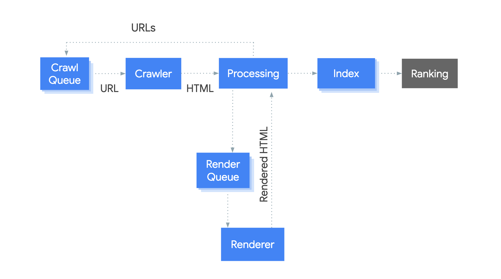
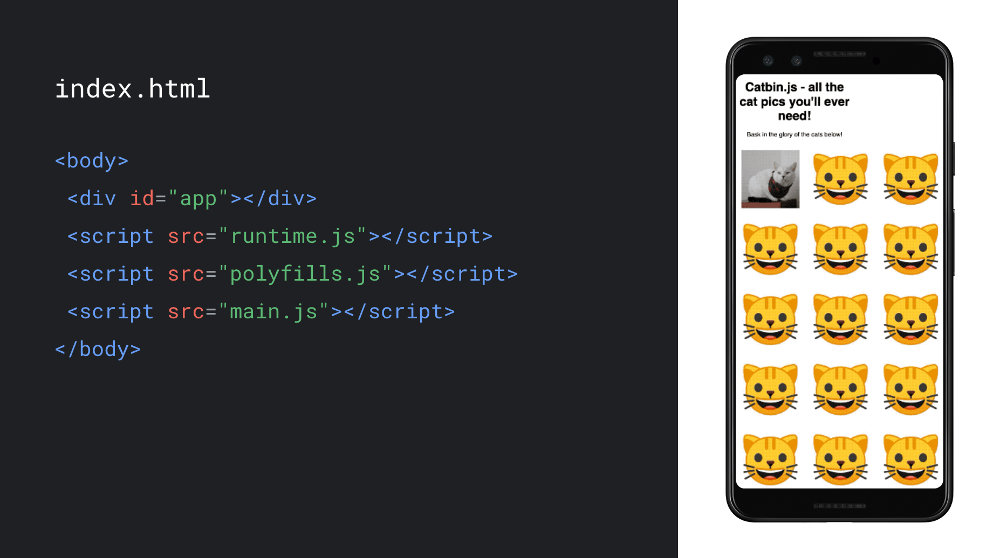
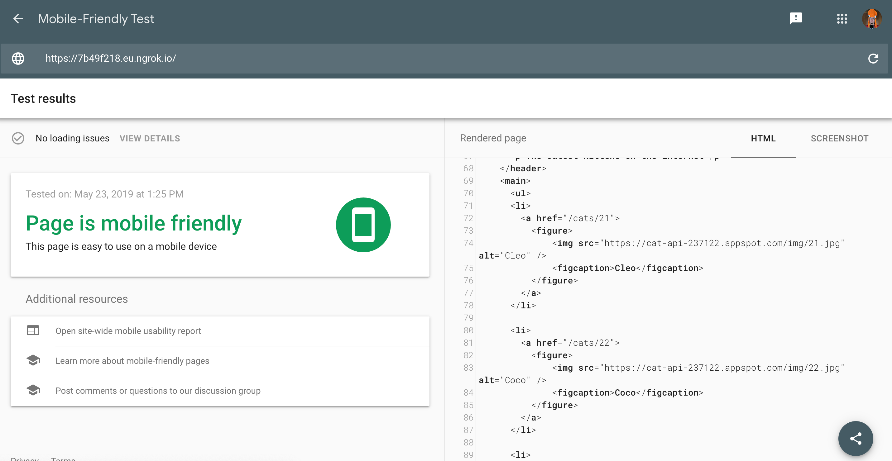
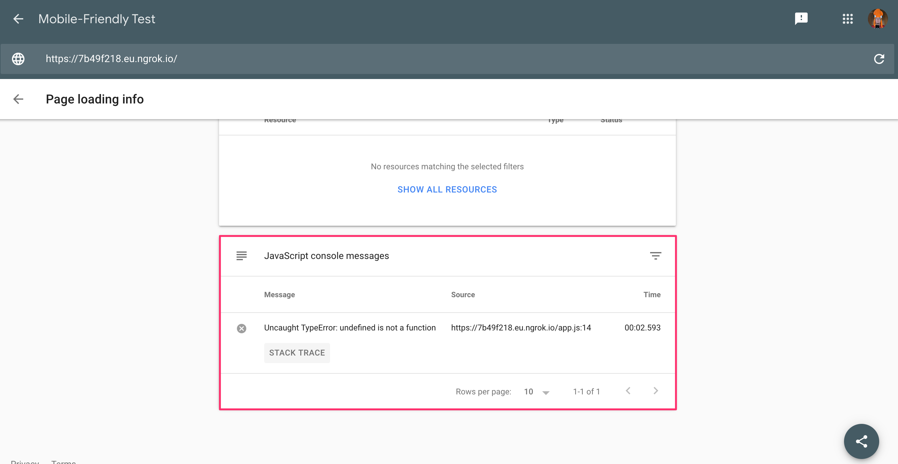
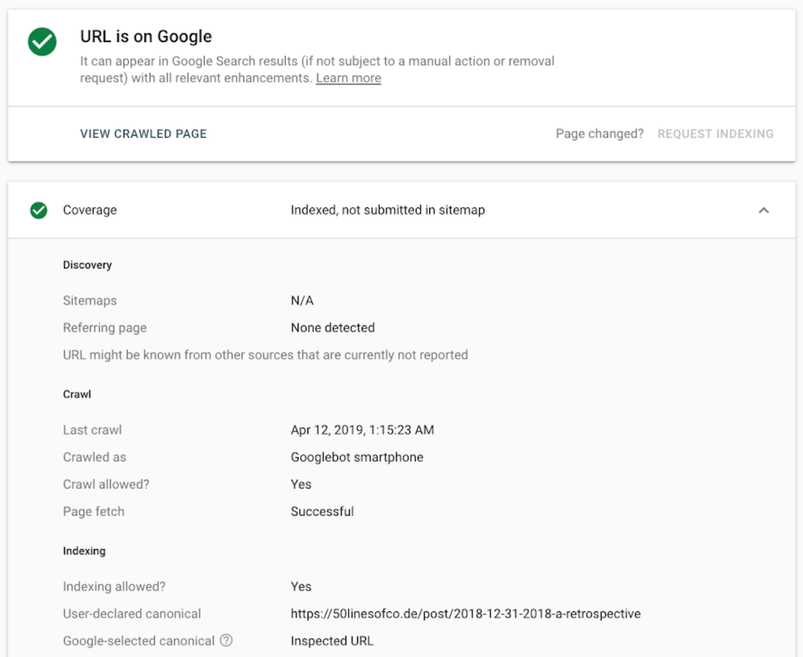
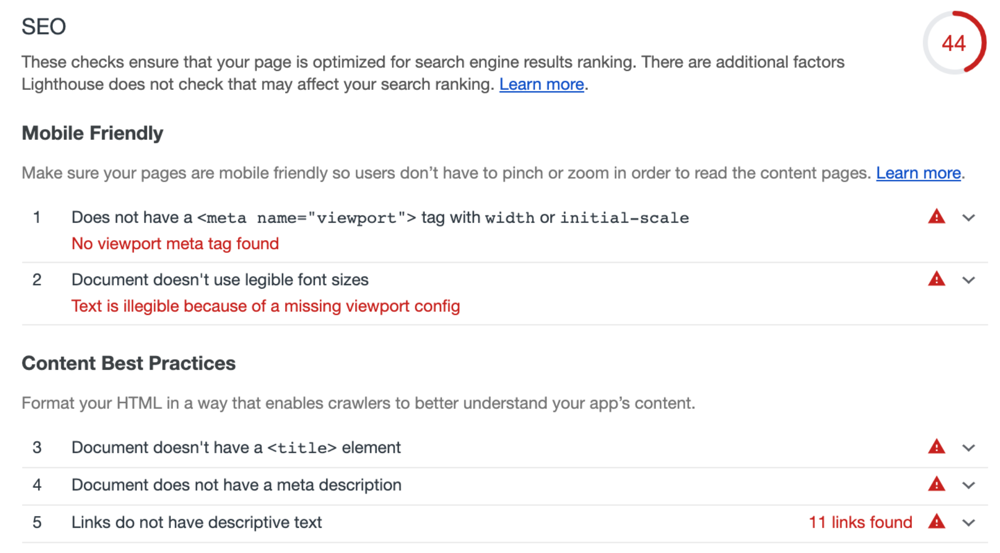

## Meet the evergreen Googlebot

This year Google I/O brought exciting news around Google Search and JavaScript: the much-awaited announcement of the [new evergreen Googlebot](https://webmasters.googleblog.com/2019/05/the-new-evergreen-googlebot.html).

<figure class="w-figure w-figure--center">
  
  <figcaption class="w-figcaption">
    Googlebot is now running a modern Chromium rendering engine.
  </figcaption>
</figure>

Googlebot now uses a modern Chromium engine to render websites for Google Search. On top of that, we test newer versions of Chromium to keep Googlebot updated in the future. We will update Googlebot within a few weeks of a stable Chrome release. This announcement is big news for web developers and SEOs, because it marks the arrival of [1000+ new features](https://caniuse.com/#compare=chrome+41,chrome+74), such as ES6+, IntersectionObserver, and Web Components v1 in Googlebot. 

While the [session on new and upcoming features in Google Search](https://www.youtube.com/watch?v=ufcijo46LCU&list=PLKoqnv2vTMUPsSoDoVlUlgVkyh0OfjB-x) focused on new and upcoming features, we also had a session on JavaScript and Google Search. In this session we shared more details on improving JavaScript-driven web apps. We looked at:

*   Feature detection and error handling
*   Googlebot's pipeline for crawling, rendering and indexing
*   Rendering strategies
*   Testing tools for your website in Google Search
*   Common challenges and possible solutions
*   Best practices for SEO in JavaScript web apps

Here's the full video:

<div style="width:100%; padding-top: 56.25%; position: relative;">
  <iframe style="width:100%; height: 100%;position: absolute; top: 50%; left: 50%; transform: translate(-50%,-50%);" src="https://www.youtube.com/embed/Ey0N1Ry0BPM" frameborder="0" allow="accelerometer; autoplay; encrypted-media; gyroscope; picture-in-picture" allowfullscreen></iframe>
</div>

## Use feature detection and handle errors

The evergreen Googlebot has lots of new features, but some features are still not supported. Relying on unsupported features or not handling errors properly can mean Googlebot can't render or index your content. 

Let's look at an example:

```html
 <body>
   <script>
     navigator.geolocation.getCurrentPosition(function onSuccess(position) {
       loadLocalContent(position);
     });
   </script>
 </body>
```

This page might not show any content in some cases. The code doesn't handle when the user declines the permission or when getCurrentPosition call returns an error. Googlebot declines permission requests like this by default. This is a better solution:

```html
 <body>
   <script>
     if (navigator.geolocation) {
       // this browser supports the Geolocation API, request location!
       navigator.geolocation.getCurrentPosition(
         function onSuccess(position) {
           // we successfully got the location, show local content
           loadLocalContent(position);
         }, function onError() {
           // we failed to get the location, show fallback content
           loadGlobalContent();
         });
     } else {
       // this browser does not support the Geolocation API, show fallback content
       loadGlobalContent();
     }
   </script>
 </body>

```

If you have problems with your JavaScript site, [walk through our troubleshooting guide](https://developers.google.com/search/docs/guides/fix-search-javascript) to find solutions.

## Learn how Googlebot works

Googlebot is a pipeline with different components. Let's take a look at this pipeline to understand how Googlebot indexes pages for Google Search.

<figure class="w-figure w-figure--center w-figure--fullbleed">
  
  <figcaption class="w-figcaption w-figcaption--fullbleed">
    Fig. 1 — Googlebot's pipeline for crawling, rendering and indexing a page.
  </figcaption>
</figure>

The process works like this:

1. Googlebot queues URLs for crawling.
2. It then fetches the URLs with an HTTP request based on the [crawl budget](https://webmasters.googleblog.com/2017/01/what-crawl-budget-means-for-googlebot.html).
3. Googlebot's next stage is scanning the HTML for links and queues the discovered links for crawling.
4. Googlebot then queues the page for rendering.
5. As soon as possible, a headless Chromium instance renders the page (JavaScript is executed here).
6. Googlebot uses the rendered HTML to index the page.

Your technical setup can influence the process of crawling, rendering, and indexing. For example, slow response times or server errors can impact the [crawl budget](https://webmasters.googleblog.com/2017/01/what-crawl-budget-means-for-googlebot.html) and links that are only rendered with JavaScript can lead to a slower discovery of these links.

## Choose the right rendering strategy for your web app

The default rendering strategy for single-page apps today is client-side rendering. The HTML loads the JavaScript which generates the content in the browser as it executes. 

<figure class="w-figure">
  
  <figcaption class="w-figcaption">
    The rendering strategy influences the performance and robustness of your web apps.
  </figcaption>
</figure> 

The rendering strategy of your website influences performance. It also has an impact on how bots like Googlebot interact with it. Server-side rendering or pre-rendering can improve the performance for users and crawlers. Those strategies execute JavaScript on the server to generate the initial HTML content. The browser can start rendering the HTML as it arrives over the network, making the page load faster.  The [rendering session at I/O](https://www.youtube.com/watch?v=k-A2VfuUROg)  or [the blog post about rendering on the web](https://developers.google.com/web/updates/2019/02/rendering-on-the-web) shows how server-side rendering and hydration can improve the performance and user experience of web apps with more examples of how these strategies are implemented.

If you are looking for a workaround to help crawlers that don't execute JavaScript or cannot make changes to your frontend codebase, consider [dynamic rendering](https://developers.google.com/search/docs/guides/dynamic-rendering) - we also have [a codelab that you can try out](https://codelabs.developers.google.com/codelabs/dynamic-rendering). Unlike server-side rendering or pre-rendering you won't get the user experience or performance benefits as dynamic rendering only serves static HTML to crawlers, so it's a workaround rather than a long-term strategy.

## Test your pages

While most pages generally work fine with Googlebot, we recommend testing your pages regularly to make sure your content is available to Googlebot and there are no problems. The easiest way to do a quick check of a page is the [Mobile-Friendly Test](https://g.co/mobilefriendly). Besides showing you issues with mobile-friendliness, it also gives you a screenshot of the above-the-fold content and the rendered HTML as Googlebot sees it.

<figure class="w-figure">
  
  <figcaption class="w-figcaption">
    The mobile-friendly test shows you the rendered HTML Googlebot uses.
  </figcaption>
</figure>

You can also find out if there are resource loading issues or JavaScript errors.

<figure class="w-figure">
  
  <figcaption class="w-figcaption">
    You can use the mobile-friendly test as well to find loading issues or JavaScript errors.
  </figcaption>
</figure>

We recommend to verify your domain in [Google Search Console](https://g.co/searchconsole) so you can use the URL inspection tool to find out more about the crawling and indexing state of a URL, receive messages when we detect issues and find out more details of how your site performs in Google Search.

<figure class="w-figure">
  
  <figcaption class="w-figcaption">
    The URL Inspection Tool in Search Console shows the status of a page in crawling, rendering, and indexing.
  </figcaption>
</figure>

For general SEO tips and guidance, you can use the SEO audits in Lighthouse. To integrate SEO audits into your testing suite, use the [Lighthouse CLI](https://github.com/GoogleChrome/lighthouse/tree/master/lighthouse-cli) or the [Lighthouse CI bot](https://github.com/GoogleChromeLabs/lighthousebot).

<figure class="w-figure">
  
  <figcaption class="w-figcaption">
    Lighthouse shows general SEO recommendations for a page.
  </figcaption>
</figure>

These tools help you identify, debug, and fix issues with pages in Google Search and should be part of your development routine.

## Stay up to date and get in touch

If you want to stay up to date with announcements and changes, you should keep an eye on our [Webmasters Blog](https://webmasters.googleblog.com), the [Google Webmasters Youtube channel](https://youtube.com/GoogleWebmasterHelp), and our [Twitter account](https://twitter.com/googlewmc).

Also check out our [developer guide to Google Search](http://developers.google.com/search/docs/guides/) and our [JavaScript SEO video series](https://www.youtube.com/watch?v=LXF8bM4g-J4&list=PLKoqnv2vTMUPOalM1zuWDP9OQl851WMM9) to learn more on SEO and JavaScript.

<!--

Lorem ipsum dolor sit amet, consectetur adipiscing elit. Proin dictum a massa
sit amet ullamcorper. Suspendisse auctor ultrices ante, nec tempus nibh varius
at. Cras ligula lacus, porta vitae maximus a, ultrices a mauris. Vestibulum
porta dolor erat, vel molestie dolor posuere in. Nam vel elementum augue. Nam
quis enim blandit, posuere justo dignissim, scelerisque diam. Fusce aliquet urna
ac blandit ullamcorper. Proin et semper nibh, sit amet imperdiet velit. Morbi at
quam sem. Integer et erat ac mi scelerisque suscipit et vitae nulla. Aliquam
scelerisque efficitur ante ut facilisis. Aenean et risus fringilla, hendrerit
sapien et, tincidunt orci. Aenean sed tellus aliquam, consectetur metus in,
tempus enim.


  [Using Imagemin with Grunt](#)


Lorem ipsum dolor sit amet, consectetur adipiscing elit. Proin dictum a massa
sit amet ullamcorper. Suspendisse auctor ultrices ante, nec tempus nibh varius
at. Cras ligula lacus, porta vitae maximus a, ultrices a mauris. Vestibulum
porta dolor erat, vel molestie dolor posuere in. Nam vel elementum augue. Nam
quis enim blandit, posuere justo dignissim, scelerisque diam. Fusce aliquet urna
ac blandit ullamcorper. Proin et semper nibh, sit amet imperdiet velit. Morbi at
quam sem. Integer et erat ac mi scelerisque suscipit et vitae nulla. Aliquam
scelerisque efficitur ante ut facilisis. Aenean et risus fringilla, hendrerit
sapien et, tincidunt orci. Aenean sed tellus aliquam, consectetur metus in,
tempus enim.

<figure class="w-figure w-figure--fullbleed">
  
  <figcaption class="w-figcaption w-figcaption--fullbleed">
    Fig. 1 — Large image.
  </figcaption>
</figure>

Lorem ipsum dolor sit amet, consectetur adipiscing elit. Proin dictum a massa
sit amet ullamcorper. Suspendisse auctor ultrices ante, nec tempus nibh varius
at. Cras ligula lacus, porta vitae maximus a, ultrices a mauris. Vestibulum
porta dolor erat, vel molestie dolor posuere in. Nam vel elementum augue. Nam
quis enim blandit, posuere justo dignissim, scelerisque diam. Fusce aliquet urna
ac blandit ullamcorper. Proin et semper nibh, sit amet imperdiet velit. Morbi at
quam sem.

<figure class="w-figure">
  
  <figcaption class="w-figcaption">
    Fig. 2 — Small image.
  </figcaption>
</figure>


  Lorem ipsum dolor sit amet, [consectetur adipiscing elit](#). Proin dictum a
  massa sit amet ullamcorper. Suspendisse auctor ultrices ante, nec tempus nibh
  varius at. `Cras ligula lacus`, porta vitae maximus a, ultrices a mauris.
  [`Vestibulum porta`](#) dolor erat, vel molestie dolor posuere in. Nam vel
  elementum augue.


Lorem ipsum dolor sit amet, consectetur adipiscing elit. Proin dictum a massa
sit amet ullamcorper. Suspendisse auctor ultrices ante, nec tempus nibh varius
at. Cras ligula lacus, porta vitae maximus a, ultrices a mauris. Vestibulum
porta dolor erat, vel molestie dolor posuere in. Nam vel elementum augue. Nam
quis enim blandit, posuere justo dignissim, scelerisque diam. Fusce aliquet urna
ac blandit ullamcorper. Proin et semper nibh, sit amet imperdiet velit. Morbi at
quam sem.

## Image, Inline

<figure class="w-figure w-figure--inline-right">
  
  <figcaption class="w-figcaption">
    Fig. 3 — Inline right, outlined image.
  </figcaption>
</figure>

Lorem ipsum dolor sit amet, consectetur adipiscing elit. Proin dictum a massa
sit amet ullamcorper. Suspendisse auctor ultrices ante, nec tempus nibh varius
at. Cras ligula lacus, porta vitae maximus a, ultrices a mauris. Vestibulum
porta dolor erat, vel molestie dolor posuere in. Nam vel elementum augue. Nam
quis enim blandit, posuere justo dignissim, scelerisque diam. Fusce aliquet urna
ac blandit ullamcorper. Proin et semper nibh, sit amet imperdiet velit. Morbi at
quam sem. Lorem ipsum dolor sit amet, consectetur adipiscing elit. Proin dictum
a massa sit amet ullamcorper. Suspendisse auctor ultrices ante, nec tempus nibh
varius at. Cras ligula lacus, porta vitae maximus a, ultrices a mauris.
Vestibulum porta dolor erat, vel molestie dolor posuere in. Nam vel elementum
augue. Nam quis enim blandit, posuere justo dignissim, scelerisque diam. Fusce
aliquet urna ac blandit ullamcorper. Proin et semper nibh, sit amet imperdiet
velit. Morbi at quam sem.

<figure class="w-figure w-figure--inline-left">
  
  <figcaption class="w-figcaption">
    Fig. 4 — Inline left, outlined image.
  </figcaption>
</figure>

Lorem ipsum dolor sit amet, consectetur adipiscing elit. Proin dictum a massa
sit amet ullamcorper. Suspendisse auctor ultrices ante, nec tempus nibh varius
at. Cras ligula lacus, porta vitae maximus a, ultrices a mauris. Vestibulum
porta dolor erat, vel molestie dolor posuere in. Nam vel elementum augue. Nam
quis enim blandit, posuere justo dignissim, scelerisque diam. Fusce aliquet urna
ac blandit ullamcorper. Proin et semper nibh, sit amet imperdiet velit. Morbi at
quam sem. Lorem ipsum dolor sit amet, consectetur adipiscing elit. Proin dictum
a massa sit amet ullamcorper. Suspendisse auctor ultrices ante, nec tempus nibh
varius at. Cras ligula lacus, porta vitae maximus a, ultrices a mauris.
Vestibulum porta dolor erat, vel molestie dolor posuere in. Nam vel elementum
augue. Nam quis enim blandit, posuere justo dignissim, scelerisque diam. Fusce
aliquet urna ac blandit ullamcorper. Proin et semper nibh, sit amet imperdiet
velit. Morbi at quam sem.

<figure class="w-figure">
  
  <figcaption class="w-figcaption">
    Fig. 5 — Filled screenshot.
  </figcaption>
</figure>


  [This type of callout](#) suggests proceeding with caution.


Lorem ipsum dolor sit amet, consectetur adipiscing elit. Proin dictum a massa
sit amet ullamcorper. Suspendisse auctor ultrices ante, nec tempus nibh varius
at. Cras ligula lacus, porta vitae maximus a, ultrices a mauris. Vestibulum
porta dolor erat, vel molestie dolor posuere in. Nam vel elementum augue. Nam
quis enim blandit, posuere justo dignissim, scelerisque diam. Fusce aliquet urna
ac blandit ullamcorper. Proin et semper nibh, sit amet imperdiet velit. Morbi at
quam sem.

<div class="w-table-wrapper">
  <table>
    <thead>
      <tr>
        <th>Image Format</th>
        <th>Lossy Plugin(s)</th>
        <th>Lossless Plugin(s)</th>
      </tr>
    </thead>
    <tbody>
      <tr>
        <td>JPEG</td>
        <td><a href="#">imagemin-mozjpeg</a></td>
        <td><a href="#">imagemin-jpegtran</a></td>
      </tr>
      <tr>
        <td>PNG</td>
        <td><a href="#">imagemin-pngquant</a></td>
        <td><a href="#">imagemin-optipng</a></td>
      </tr>
      <tr>
        <td>GIF</td>
        <td><a href="#">imagemin-giflossy</a></td>
        <td><a href="#">imagemin-gifsicle</a></td>
      </tr>
      <tr>
        <td>SVG</td>
        <td><a href="#">Imagemin-svgo</a></td>
        <td></td>
      </tr>
      <tr>
        <td>WebP</td>
        <td><a href="#">imagemin-webp</a></td>
        <td></td>
      </tr>
    </tbody>
    <caption>Table 1 — Imagemin plugins for filetypes.</caption>
  </table>
</div>


  This type of callout is stronger than a Caution; it means "Don't do this."


Lorem ipsum dolor sit amet, consectetur adipiscing elit. Proin dictum a massa
sit amet ullamcorper. Suspendisse auctor ultrices ante, nec tempus nibh varius
at. Cras ligula lacus, porta vitae maximus a, ultrices a mauris. Vestibulum
porta dolor erat, vel molestie dolor posuere in. Nam vel elementum augue. Nam
quis enim blandit, posuere justo dignissim, scelerisque diam. Fusce aliquet urna
ac blandit ullamcorper. Proin et semper nibh, sit amet imperdiet velit. Morbi at
quam sem.

## Ordered list

1. Lorem ipsum dolor sit amet, consectetur adipiscing elit.
1. Lorem ipsum dolor sit amet, consectetur adipiscing elit.
1. Lorem ipsum dolor sit amet, consectetur adipiscing elit.

Lorem ipsum dolor sit amet, consectetur adipiscing elit. Proin dictum a massa
sit amet ullamcorper. Suspendisse auctor ultrices ante, nec tempus nibh varius
at. Cras ligula lacus, porta vitae maximus a, ultrices a mauris. Vestibulum
porta dolor erat, vel molestie dolor posuere in. Nam vel elementum augue. Nam
quis enim blandit, posuere justo dignissim, scelerisque diam. Fusce aliquet urna
ac blandit ullamcorper. Proin et semper nibh, sit amet imperdiet velit. Morbi at
quam sem.

<ol>
  <li>
  Lorem ipsum dolor sit amet, consectetur adipiscing elit. Proin dictum a massa
  sit amet ullamcorper.
  </li>
  <li>
  Lorem ipsum dolor sit amet, consectetur adipiscing elit. Proin dictum a massa
  sit amet ullamcorper.
  <figure class="w-figure">
    
    <figcaption class="w-figcaption">
      Fig. 5 — Filled screenshot.
    </figcaption>
  </figure>
  </li>
  <li>
  Lorem ipsum dolor sit amet, consectetur adipiscing elit. Proin dictum a massa
  sit amet ullamcorper.
  </li>
</ol>


  This type of callout describes a successful action or an error-free status.


Lorem ipsum dolor sit amet, consectetur adipiscing elit. Proin dictum a massa
sit amet ullamcorper. Suspendisse auctor ultrices ante, nec tempus nibh varius
at. Cras ligula lacus, porta vitae maximus a, ultrices a mauris. Vestibulum
porta dolor erat, vel molestie dolor posuere in. Nam vel elementum augue. Nam
quis enim blandit, posuere justo dignissim, scelerisque diam. Fusce aliquet urna
ac blandit ullamcorper. Proin et semper nibh, sit amet imperdiet velit. Morbi at
quam sem.

## Unordered list

- Lorem ipsum dolor sit amet, consectetur adipiscing elit.
- Lorem ipsum dolor sit amet, consectetur adipiscing elit.
- Lorem ipsum dolor sit amet, consectetur adipiscing elit.

Lorem ipsum dolor sit amet, consectetur adipiscing elit. Proin dictum a massa
sit amet ullamcorper. Suspendisse auctor ultrices ante, nec tempus nibh varius
at. Cras ligula lacus, porta vitae maximus a, ultrices a mauris. Vestibulum
porta dolor erat, vel molestie dolor posuere in. Nam vel elementum augue. Nam
quis enim blandit, posuere justo dignissim, scelerisque diam. Fusce aliquet urna
ac blandit ullamcorper. Proin et semper nibh, sit amet imperdiet velit. Morbi at
quam sem.

<ul>
  <li>
  Lorem ipsum dolor sit amet, consectetur adipiscing elit. Proin dictum a massa
  sit amet ullamcorper.
  </li>
  <li>
  Lorem ipsum dolor sit amet, consectetur adipiscing elit. Proin dictum a massa
  sit amet ullamcorper.
  <figure class="w-figure">
    
    <figcaption class="w-figcaption">
      Fig. 5 — Filled screenshot.
    </figcaption>
  </figure>
  </li>
  <li>
  Lorem ipsum dolor sit amet, consectetur adipiscing elit. Proin dictum a massa
  sit amet ullamcorper.
  </li>
</ul>

Lorem ipsum dolor sit amet, consectetur adipiscing elit. Proin dictum a massa
sit amet ullamcorper. Suspendisse auctor ultrices ante, nec tempus nibh varius
at. Cras ligula lacus, porta vitae maximus a, ultrices a mauris. Vestibulum
porta dolor erat, vel molestie dolor posuere in. Nam vel elementum augue. Nam
quis enim blandit, posuere justo dignissim, scelerisque diam. Fusce aliquet urna
ac blandit ullamcorper. Proin et semper nibh, sit amet imperdiet velit. Morbi at
quam sem.

```js
const imagemin = require("imagemin");
const imageminMozjpeg = require("imagemin-mozjpeg");

(async () => {
  const files = await imagemin(
    ["source_dir/*.jpg", "another_dir/*.jpg"],
    "destination_dir",
    { plugins: [imageminMozjpeg({ quality: 50 })] }
  );
  console.log(files);
})();
```


  This type of callout defines the goal of a procedure.


Lorem ipsum dolor sit amet, consectetur adipiscing elit. Proin dictum a massa
sit amet ullamcorper. Suspendisse auctor ultrices ante, nec tempus nibh varius
at. Cras ligula lacus, porta vitae maximus a, ultrices a mauris. Vestibulum
porta dolor erat, vel molestie dolor posuere in. Nam vel elementum augue. Nam
quis enim blandit, posuere justo dignissim, scelerisque diam. Fusce aliquet urna
ac blandit ullamcorper. Proin et semper nibh, sit amet imperdiet velit. Morbi at
quam sem.

```js/1
const imagemin = require('imagemin');
const imageminMozjpeg = require('imagemin-mozjpeg');

(async() => {
  const files = await imagemin(
      ['source_dir/*.jpg', 'another_dir/*.jpg'],
      'destination_dir',
      {plugins: [imageminMozjpeg({quality: 50})]}
  );
  console.log(files);
})();
```

Lorem ipsum dolor sit amet, consectetur adipiscing elit. Proin dictum a massa
sit amet ullamcorper. Suspendisse auctor ultrices ante, nec tempus nibh varius
at. Cras ligula lacus, porta vitae maximus a, ultrices a mauris.


  The value of the `type` attribute should be the MIME type corresponding to the
  image format. An image's MIME type and its file extension are often similar,
  but they aren't necessarily the same thing (e.g. `.jpg` vs. `image/jpeg`).


Lorem ipsum dolor sit amet, consectetur adipiscing elit. Proin dictum a massa
sit amet ullamcorper. Suspendisse auctor ultrices ante, nec tempus nibh varius
at. Cras ligula lacus, porta vitae maximus a, ultrices a mauris. Vestibulum
porta dolor erat, vel molestie dolor posuere in. Nam vel elementum augue. Nam
quis enim blandit, posuere justo dignissim, scelerisque diam. Fusce aliquet urna
ac blandit ullamcorper. Proin et semper nibh, sit amet imperdiet velit. Morbi at
quam sem.

```js//1
const imagemin = require('imagemin');
const imageminMozjpeg = require('imagemin-mozjpeg');

(async() => {
  const files = await imagemin(
      ['source_dir/*.jpg', 'another_dir/*.jpg'],
      'destination_dir',
      {plugins: [imageminMozjpeg({quality: 50})]}
  );
  console.log(files);
})();
```

Lorem ipsum dolor sit amet, consectetur adipiscing elit. Proin dictum a massa
sit amet ullamcorper. Suspendisse auctor ultrices ante, nec tempus nibh varius
at. Cras ligula lacus, porta vitae maximus a, ultrices a mauris. Vestibulum
porta dolor erat, vel molestie dolor posuere in. Nam vel elementum augue. Nam
quis enim blandit, posuere justo dignissim, scelerisque diam. Fusce aliquet urna
ac blandit ullamcorper. Proin et semper nibh, sit amet imperdiet velit. Morbi at
quam sem.

```js/6/5
const imagemin = require('imagemin');
const imageminMozjpeg = require('imagemin-mozjpeg');

(async() => {
  const files = await imagemin(
      ['source_dir/*.jpg'],
      ['source_dir/*.jpg', 'another_dir/*.jpg'],
      'destination_dir',
      {plugins: [imageminMozjpeg({quality: 50})]}
  );
  console.log(files);
})();
```

Lorem ipsum dolor sit amet, consectetur adipiscing elit. Proin dictum a massa
sit amet ullamcorper. Suspendisse auctor ultrices ante, nec tempus nibh varius
at. Cras ligula lacus, porta vitae maximus a, ultrices a mauris. Vestibulum
porta dolor erat, vel molestie dolor posuere in. Nam vel elementum augue. Nam
quis enim blandit, posuere justo dignissim, scelerisque diam. Fusce aliquet urna
ac blandit ullamcorper. Proin et semper nibh, sit amet imperdiet velit. Morbi at
quam sem.

<blockquote class="w-blockquote">
  <p class="w-blockquote__text">
    Lorem ipsum dolor sit amet, consectetur adipiscing elit. Proin dictum
    a massa sit amet ullamcorper.
  </p>
  <cite class="w-blockquote__cite">
    by Jon Doe
  </cite>
</blockquote>

Lorem ipsum dolor sit amet, consectetur adipiscing elit. Proin dictum a massa
sit amet ullamcorper. Suspendisse auctor ultrices ante, nec tempus nibh varius
at. Cras ligula lacus, porta vitae maximus a, ultrices a mauris. Vestibulum
porta dolor erat, vel molestie dolor posuere in. Nam vel elementum augue. Nam
quis enim blandit, posuere justo dignissim, scelerisque diam. Fusce aliquet urna
ac blandit ullamcorper. Proin et semper nibh, sit amet imperdiet velit. Morbi at
quam sem.

<div class="glitch-embed-wrap" style="height: 420px; width: 100%;">
  <iframe
    allow="geolocation; microphone; camera; midi; encrypted-media"
    src="https://glitch.com/embed/#!/embed/fav-kitties-starter?path=src/index.js&amp;previewSize=0"
    alt="fav-kitties-starter on Glitch"
    style="height: 100%; width: 100%; border: 0;">
  </iframe>
</div>


  This type of callout defines important terminology.


Lorem ipsum dolor sit amet, consectetur adipiscing elit. Proin dictum a massa
sit amet ullamcorper. Suspendisse auctor ultrices ante, nec tempus nibh varius
at. Cras ligula lacus, porta vitae maximus a, ultrices a mauris. Vestibulum
porta dolor erat, vel molestie dolor posuere in. Nam vel elementum augue. Nam
quis enim blandit, posuere justo dignissim, scelerisque diam. Fusce aliquet urna
ac blandit ullamcorper. Proin et semper nibh, sit amet imperdiet velit. Morbi at
quam sem.

Lorem ipsum dolor sit amet, consectetur adipiscing elit. Proin dictum a massa
sit amet ullamcorper. Suspendisse auctor ultrices ante, nec tempus nibh varius
at. Cras ligula lacus, porta vitae maximus a, ultrices a mauris. Vestibulum
porta dolor erat, vel molestie dolor posuere in. Nam vel elementum augue. Nam
quis enim blandit, posuere justo dignissim, scelerisque diam. Fusce aliquet urna
ac blandit ullamcorper. Proin et semper nibh, sit amet imperdiet velit. Morbi at
quam sem.

<div class="w-stats">
  <div class="w-stat">
    <p class="w-stat__figure">30<sub class="w-stat__sub">%</sub></p>
    <p class="w-stat__desc">Lower cost per conversion</p>
  </div>
  <div class="w-stat">
    <p class="w-stat__figure">13<sub class="w-stat__sub">%</sub></p>
    <p class="w-stat__desc">Higher CTR</p>
  </div>
  <div class="w-stat">
    <p class="w-stat__figure">4<sub class="w-stat__sub">x</sub></p>
    <p class="w-stat__desc">Faster load times</p>
  </div>
</div>

<div class="w-text--center">
  <a href="https://example.com/some.pdf" class="w-button w-button--with-icon" data-icon="file_download">
    Download case study 
  </a>
</div>

Lorem ipsum dolor sit amet, consectetur adipiscing elit. Proin dictum a massa
sit amet ullamcorper. Suspendisse auctor ultrices ante, nec tempus nibh varius
at. Cras ligula lacus, porta vitae maximus a, ultrices a mauris. Vestibulum
porta dolor erat, vel molestie dolor posuere in. Nam vel elementum augue. Nam
quis enim blandit, posuere justo dignissim, scelerisque diam. Fusce aliquet urna
ac blandit ullamcorper. Proin et semper nibh, sit amet imperdiet velit. Morbi at
quam sem.
-->
