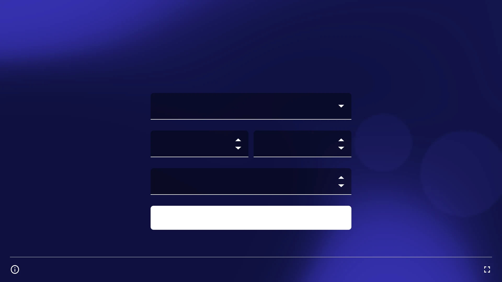
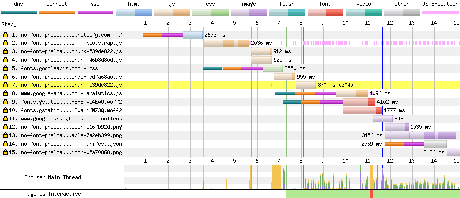
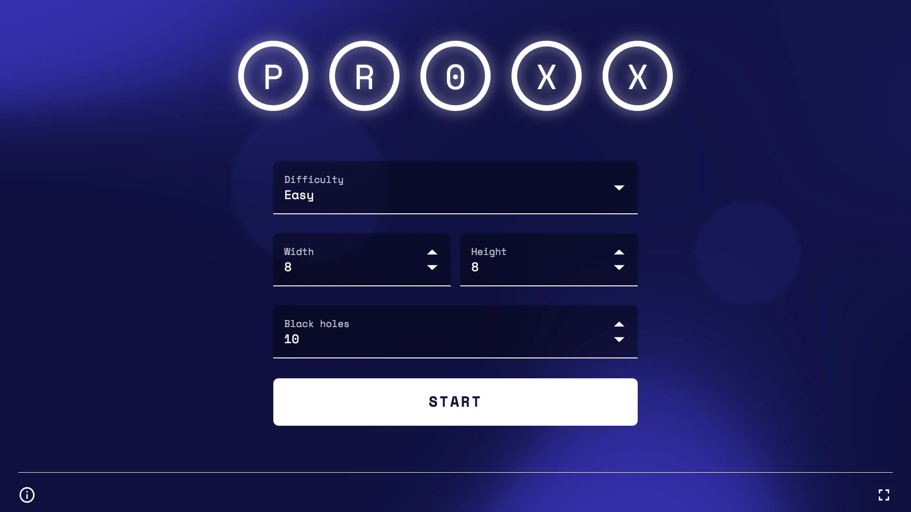

At Google I/O 2019 we shipped [PROXX], a modern Minesweeper-clone on the web. Something that sets PROXX apart from a the other clones out there is the focus on accessibility and the goal to run on a constrained device like a feature phone just as much as a high-end desktop device. Feature phones are constrained in multiple ways: They have weak CPUs, weak or no GPUs, small screens without touch input and small amounts of memory. But they run a modern browser, so you need to be ready if you expect your JavaScript-heavy app to be served to feature phones. You need to pay extra attention to budgets and apply techniques that **make your app resilient to inconsistent performance environments**.

<figure class="w-figure w-figure--center">
  <video controls loop muted
    preload="metadata"
    class="w-screenshot"
    poster="https://storage.googleapis.com/web-dev-assets/js-heavy-sites/proxx-intro-poster.jpg"
    >
    <source
      src="https://storage.googleapis.com/web-dev-assets/js-heavy-sites/proxx-intro.mp4"
      type="video/mp4; codecs=h264">
  </video>
  <figcaption class="w-figcaption w-figcaption--fullbleed">
    The game play of PROXX on a desktop machine.
  </figcaption>
</figure>

## How bad is it?
Before we start into _how_ to address the performance problems, let's cover _why_ it is really necessary. As an example for a JS-heavy website I am going to look at [Reddit]. I ran a trace on a feature phone and a modern phone over the same network with 3G throttling enabled and compared the key metrics:

|   | **Modern phone**  | **Feature phone**  |
|---|---|---|
| **Time to interactive (TTI)** | ~20s  | ~39s  |
| **Total script execution** | ~713ms   | ~16.7s   |
| **Data transferred**  | ~1.1MB  | ~1.1MB  |

The really eye-opening metric here is "Total script execution": In this scenario, the **same amount of code took 20x as long** on a feature phone as it did on a modern mobile phone. **That number is _not_ a rule of thumb**, as there are many factors influencing how long a piece of code takes, but it is indicative of how much more computational power we are used to.

Delivering good performance is paramount to many success metrices that companies rely on. It has been shown that **good performances correlates with increased user retention, improved conversions and &mdash; most importantly &mdash; it's a matter of inclusivity.**. [Jeremy Wagner] has much more data and insight on [why performance matters]. This is doubly true for feature phones: Feature phones are making a resurgence in emerging markets, as they are very cheap to produce and can be sold at very low price points. This allows a whole new audience to come online when they previously couldn't afford to do so. **For 2019 it is projected that around 400 million feature phones will be sold in India alone.**

We have to cover to facets of performance when targeting these devices: Loading performance and runtime performance. Let's pretend we didn't use code splitting with PROXX and see what we can do.

## Loading performance

Testing your loading performance on a _real_ device is critical. If you don't have a real device to hand, I recommend [WebPageTest], specifically the ["simple" setup][wpt simple]. This runs a battery of loading tests on a _real_ device with an emulated 3G connection.


  **Note:** 3G is a good speed to measure. While we might be used to 4G, LTE or soon even 5G, the reality of mobile internet looks quite different. Maybe you are on a train, at a conference, a concert or on a flight. What you will be experiencing there is most likely closer to 3G.

  In emerging markets, 3G coverage is far from complete. Often people are limited to 2G most of the time. Since the PROXX team was targeting feature phones for emerging markets, we will also be looking at 2G speeds in this article.


That being said, we are going to focus on 2G in this article as we were explicitly including feature phones in emerging markets as part of our target audience. Once WebPageTest has run its test, you get a waterfall (similar to what you see in DevTools) as well as a filmstrip at the top. The film strip shows what your user sees at what point in time. On 2G, the loading experience of PROXX was pretty bad:

<figure class="w-figure w-figure--center">
  <video controls muted
    preload="metadata"
    class="w-screenshot"
    poster="https://storage.googleapis.com/web-dev-assets/js-heavy-sites/stupid-proxx-load-poster.jpg"
    >
    <source
      src="https://storage.googleapis.com/web-dev-assets/js-heavy-sites/stupid-proxx-load.mp4"
      type="video/mp4; codecs=h264">
  </video>
  <figcaption class="w-figcaption w-figcaption--fullbleed">
    The filmstrip video shows what the user sees when PROXX is loading on a real, low-end device over an emulated 2G connection.
  </figcaption>
</figure>

When loaded over 3G, the user sees 4 seconds of white nothingness. Over 2G it's even worse: The duration for which the user sees absolutely nothing is over 8 seconds long. If you read Jeremy's article above you know that we have now lost a good porition of our potential users due to impatience. The user needs to download all of 62k of JavaScript to download our UI framework [Preact] and wait for it to put anything on the screen at all. The silver lining in this scenario is that the second anything appears on screen it is also interactive. Or is it?

<figure class="w-figure w-figure--center">
  <picture>
    <source srcset="proxx-first-render.webp" type="image/webp">
    
  </picture>
  <figcaption class="w-figcaption">
    The [First Meaningful Paint (FMP)][FMP] in the unoptimized version of PROXX is _technically_ [interactive][TTI] but useless to the user.
  </figcaption>
</figure>

After about 62kB of gzip'd JS have been downloaded and DOM has been generated, the user gets to see our app. The app is _technically_ interactive. Looking at the visual, however, shows a different reality. The web fonts are still loading in the background and until they are reader the user can see no text. While we can count this state as a ["First Meaningful Paint" (FMP)][FMP], we cannot count it as [interactive][TTI]. It takes another second on 3G and 3 seconds on 2G until the app is ready to go. **All in all, the app takes 6 seconds on 3G and 11 seconds on 2G to load.**

### Waterfall analysis

Now that we know _what_ the user sees, we need to figure out the _why_. For this we will be taking a look at the waterfall and ask ourselves which resources are loading too late. In our 2G trace for PROXX we can see two major red flags:

1. There are multiple thin lines.
2. JavaScript files look sequential.

<figure class="w-figure w-figure--center">
  <picture>
    
  </picture>
  <figcaption class="w-figcaption">
    The waterfall gives insight into which resources are loading when and how long they take. While the colored lines try to estimate multiple metrics (like [Time-to-Meaningful-First-Paint][FMP] or [Time-to-Interactive][TTI]), the film strip is much more reliable for these.
  </figcaption>
</figure>

#### Reducing connection count
Thin lines stand for the creating of a new HTTP/HTTPS/HTTP2 connection. Setting up a new connection is costly and adds around 1s on 3G and roughly 2.5s on 2G. In our waterfall we see a new connection for:

- Our `index.html`
- The styles from `fonts.googleapis.com`
- The fonts themselves from `fonts.gstatic.com`
- Google Analytics
- The Web App Manifest

The new connection for `index.html` is unavoidable. The browser _has_ to create a connection to our server to get the contents. The new connection for Google Analytics might be avoidable with something like [Minimal Analytics], but Google Analytics is not blocking our app from rendering or becoming interactive, so we don't really care about how fast it loads. On the contrary, Google Analytics should be loaded in idle time and should ideally not take up your bandwidth or processing power during the initial load. The new connection for the web app manifest is [prescribed by the fetch spec][fetch connections], as the manifest has to be loaded over a non-credentialed conneciton. Again, the web app manifest doesn't block our app from rendering or becoming interactive, so we don't need to care that much.

The two fonts we are using, however, are a problem as they block rendering and also interactivity. If we look at the CSS that is delivered by `fonts.googleapis.com`, it's just two `@font-face` rules, one for each font. It's so small in fact, that we decided to inline it into our HTML. To avoid the additional connection setup for the font files we can copy them to our own server.


  **Note:** Copying CSS or font files to your own server is okay when using [Google Fonts]. Other font providers might have different rules. Please check with your font provider's terms of service!


#### Paralleleizing loads
Looking at the waterfall, we see that once the first JavaScript file is done loading, new files start loading immediately. This is indicative for module dependencies. Our main file cannot run until the main dependencies have been loaded. The important thing to realize here is that these kind of dependencies are known at build time. We can make use of `<link rel="preload">` tags to make sure all the files we need start loading the second we receive our HTML.

#### Results

At this point it's time to take a quick look at what our changes have achieved. It's important to not change any other variables in our test setup, so we will be using [WebPageTest's easy setup][wpt simple] again and look at the filmstrip:

<figure class="w-figure w-figure--center">
  <video controls muted
    preload="metadata"
    class="w-screenshot"
    poster="https://storage.googleapis.com/web-dev-assets/js-heavy-sites/preload-proxx-load-poster.jpg"
    >
    <source
      src="https://storage.googleapis.com/web-dev-assets/js-heavy-sites/preload-proxx-load.mp4"
      type="video/mp4; codecs=h264">
  </video>
  <figcaption class="w-figcaption w-figcaption--fullbleed">
    Once again we are looking at the filmstrip after our changes have been applied to compare to our earlier results.
  </figcaption>
</figure>

**These changes reduced our TTI from 10.9 to 8.5**, which is roughly the 2.5s connection setup we were expecting to save.

### Prerendering

While we just reduced our [TTI], we haven't really affected the eternally long white screen the user has to endure for 8.5 seconds. Arguably the biggest improvements for Time To First Meaningful Paint (TTFMP)][FMP] can be achieved by adopting a server-side rendering technique (in contrast to a full client-side render). The most common techniques are Prerendering and Server-Side Rendering, which are closely related and are explained in our [Rendering article][Rendering]. Both run the web app in Node to capture the state of the DOM and serialize it to HTML. Server-Side Rendering does this per request on the, well, server's side, while Prerendering does this at build time and stores the output as your new `index.html`. In combination with preloading or even inlining the critical CSS, the browser is able to render the first view much sooner and doesn't have to wait for JavaScript to be downloaded, parsed and executed.

There's many ways to implement a Prerender. In PROXX we chose to use [Puppeteer], which starts Chrome without any UI and allows you to remote control that instance. We utilize this to inject our markup and our initial bundle and then read back the DOM as a string of HTML that has been created. Because we are using [CSS Modules], we get CSS inlining of the styles that we need for free.

```js
  const browser = await puppeteer.launch();
  const page = await browser.newPage();
  await page.setContent(rawIndexHTML);
  await page.evaluate(codeToRun);
  const renderedHTML = await page.content();
  browser.close();
  await writeFile("index.html", renderedHTML);
```

With this in place, we can expect an improvement for our TTFMP, but we still need to load and execute the same amount of JavaScript to become interactive, so we shouldn't expect TTI to change much. If anything, our `index.html` has gotten bigger and might push back our TTI a bit. There's only way to find out: Running WebPageTest.

<figure class="w-figure w-figure--center">
  <video controls muted
    preload="metadata"
    class="w-screenshot"
    poster="https://storage.googleapis.com/web-dev-assets/js-heavy-sites/ssr-proxx-load-poster.jpg"
    >
    <source
      src="https://storage.googleapis.com/web-dev-assets/js-heavy-sites/ssr-proxx-load.mp4"
      type="video/mp4; codecs=h264">
  </video>
  <figcaption class="w-figcaption w-figcaption--fullbleed">
    The filmstrip shows a clear improvement for our TTFMP metric. TTI is mostly unaffected.
  </figcaption>
</figure>

**Our first meaningful paint is moved from 8.5 seconds to 4.9 seconds.** Our TTI still happens at around 8.5 seconds so has been largly unaffected by this change. We did a _perceptual_ change. Some might even call it a sleight of hand. We are visualizing what we are loading, including the user in our progress and changing perceived performance.

### Aggressive code splitting

Code splitting is closely related to lazy-loading: It is the act of breaking apart your monolithic bundle into smaller parts that can be lazy-loaded on-demand. Popular bundlers like [Webpack], [Rollup], and [Parcel] support code splitting by using dynamic `import()`. The bundler will analyze your code and _inline_ all modules that are imported _statically_. Everything that you import _dynamically_ will be put into it's own file and will only be fetched from the network once the `import()` call gets executed. Of course hitting the network has a cost and should only be used if you can afford to wait for the network to respond. The mantra here is to statically import the modules that is _critically_ needed at load time and dynamically load everything else. A good pattern for handling dynamic loading is [Phil Walton]'s ["Idle until Urgent][IUU].

<figure class="w-figure w-figure--center">
  <picture>
    <source srcset="proxx-loaded.webp" type="image/webp">
    
  </picture>
  <figcaption class="w-figcaption">
    The landing page of PROXX. Everything that is shown here is considered "critical".
  </figcaption>
</figure>

Looking at the landing page PROXX, we see a form to configure the game, a logo, and that's pretty much everything there is. Looking at our bundle with a [source map explorer] (or a similar tool) shows that our initial bundle contains much more code: The game logic, the rendering engine, the win screen, the lose screen and a bunch of utilities. Only a small subset of these modules are needed for the very first render. Moving everything that is not strictly required for the first render into a lazily loaded module will decrease the time needed for the FMP _significantly_

<figure class="w-figure w-figure--center">
  <style>
    #map {
      --highlight: #ccc;
      background-color: #eee;
      font-family: monospace;
      color: #333;
    }
    .webtreemap-node {
      margin: 3px 0;
      padding: 3px 7px;
      border: 1px solid #bbb;
      border-radius: 2px;
      display: grid;
      place-content: flex-start stretch;
      place-items: flex-start stretch;
    }
    .webtreemap-caption {
      grid-column: 1 / -1;
    }
    .webtreemap-level0 {
      grid-template-columns: repeat(2, 1fr);
      grid-gap: 6px;
    }
    @media (max-width: 480px) {
      .webtreemap-level0 {
        grid-template-columns: repeat(1, 1fr);
      }
    }
  </style>
  <div id="map">
    <div class="webtreemap-node webtreemap-level0" title="/ • 117.39 KB • 100.0%">
      <div class="webtreemap-caption">/ • 117.39 KB • 100.0%</div>
      <div
        class="webtreemap-node webtreemap-level1"
        title="src • 101.51 KB • 86.5%"
      >
        <div class="webtreemap-caption">src • 101.51 KB • 86.5%</div>
        <div
          class="webtreemap-node webtreemap-level2"
          title="main • 101.06 KB • 86.1%"
        >
          <div class="webtreemap-caption">main • 101.06 KB • 86.1%</div>
          <div
            class="webtreemap-node webtreemap-level3"
            title="services • 60.78 KB • 51.8%"
          >
            <div class="webtreemap-caption">services • 60.78 KB • 51.8%</div>
            <div
              class="webtreemap-node webtreemap-level4"
              title="preact-canvas • 58.01 KB • 49.4%"
            >
              <div class="webtreemap-caption">
                preact-canvas • 58.01 KB • 49.4%
              </div>
              <div
                class="webtreemap-node webtreemap-level4"
                title="components • 50.69 KB • 43.2%"
              >
                <div class="webtreemap-caption">
                  components • 50.69 KB • 43.2%
                </div>
                <div
                  class="webtreemap-node webtreemap-level4"
                  title="about • 8.15 KB • 6.9%"
                >
                  <div class="webtreemap-caption">about • 8.15 KB • 6.9%</div>
                </div>
                <div
                  class="webtreemap-node webtreemap-level4"
                  title="board • 7.93 KB • 6.8%"
                >
                  <div class="webtreemap-caption">board • 7.93 KB • 6.8%</div>
                </div>
                <div
                  class="webtreemap-node webtreemap-level4"
                  title="nebula • 5.94 KB • 5.1%"
                >
                  <div class="webtreemap-caption">nebula • 5.94 KB • 5.1%</div>
                </div>
                <div
                  class="webtreemap-node webtreemap-level4"
                  title="showbiz-title • 4.46 KB • 3.8%"
                >
                  <div class="webtreemap-caption">
                    showbiz-title • 4.46 KB • 3.8%
                  </div>
                </div>
                <div
                  class="webtreemap-node webtreemap-level4"
                  title="top-bar • 4.16 KB • 3.5%"
                  style="background-color: var(--highlight)"
                >
                  <div class="webtreemap-caption">top-bar • 4.16 KB • 3.5%</div>
                </div>
                <div
                  class="webtreemap-node webtreemap-level4"
                  title="game • 4.07 KB • 3.5%"
                >
                  <div class="webtreemap-caption">game • 4.07 KB • 3.5%</div>
                </div>
                <div
                  class="webtreemap-node webtreemap-level4"
                  title="intro • 3.79 KB • 3.2%"
                  style="background-color: var(--highlight)"
                >
                  <div class="webtreemap-caption">intro • 3.79 KB • 3.2%</div>
                </div>
                <div
                  class="webtreemap-node webtreemap-level4"
                  title="bottom-bar • 3.53 KB • 3.0%"
                  style="background-color: var(--highlight)"
                >
                  <div class="webtreemap-caption">
                    bottom-bar • 3.53 KB • 3.0%
                  </div>
                </div>
                <div
                  class="webtreemap-node webtreemap-level4"
                  title="win • 3.04 KB • 2.6%"
                >
                  <div class="webtreemap-caption">win • 3.04 KB • 2.6%</div>
                </div>
                <div
                  class="webtreemap-node webtreemap-level4"
                  title="icons • 1.83 KB • 1.6%"
                >
                  <div class="webtreemap-caption">icons • 1.83 KB • 1.6%</div>
                </div>
                <div
                  class="webtreemap-node webtreemap-level4"
                  title="settings • 1.65 KB • 1.4%"
                >
                  <div class="webtreemap-caption">settings • 1.65 KB • 1.4%</div>
                </div>
                <div
                  class="webtreemap-node webtreemap-level4"
                  title="game-loading • 1.5 KB • 1.3%"
                >
                  <div class="webtreemap-caption">
                    game-loading • 1.5 KB • 1.3%
                  </div>
                </div>
              </div>
            </div>
          </div>
          <div
            class="webtreemap-node webtreemap-level3"
            title="rendering • 27.54 KB • 23.5%"
          >
            <div class="webtreemap-caption">rendering • 27.54 KB • 23.5%</div>
          </div>
          <div
            class="webtreemap-node webtreemap-level3"
            title="utils • 10.74 KB • 9.2%"
          >
            <div class="webtreemap-caption">utils • 10.74 KB • 9.2%</div>
            <div
              class="webtreemap-node webtreemap-level4"
              title="shaderbox.ts • 5.9 KB • 5.0%"
            >
              <div class="webtreemap-caption">shaderbox.ts • 5.9 KB • 5.0%</div>
            </div>
            <div
              class="webtreemap-node webtreemap-level4"
              title="focus-visible.js • 2.32 KB • 2.0%"
            >
              <div class="webtreemap-caption">
                focus-visible.js • 2.32 KB • 2.0%
              </div>
            </div>
            <div
              class="webtreemap-node webtreemap-level4"
              title="cell-sizing.ts • 1.44 KB • 1.2%"
            >
              <div class="webtreemap-caption">
                cell-sizing.ts • 1.44 KB • 1.2%
              </div>
            </div>
          </div>
          <div
            class="webtreemap-node webtreemap-level3"
            title="offline • 1.54 KB • 1.3%"
          >
            <div class="webtreemap-caption">offline • 1.54 KB • 1.3%</div>
          </div>
        </div>
      </div>
      <div
        class="webtreemap-node webtreemap-level1"
        title="node_modules • 15.06 KB • 12.8%"
      >
        <div class="webtreemap-caption">node_modules • 15.06 KB • 12.8%</div>
        <div
          class="webtreemap-node webtreemap-level2"
          title="preact • 8.2 KB • 7.0%"
          style="background-color: var(--highlight)"
        >
          <div class="webtreemap-caption">preact • 8.2 KB • 7.0%</div>
        </div>
        <div
          class="webtreemap-node webtreemap-level2"
          title="comlink • 3.32 KB • 2.8%"
        >
          <div class="webtreemap-caption">comlink • 3.32 KB • 2.8%</div>
        </div>
        <div
          class="webtreemap-node webtreemap-level2"
          title="style-inject • 2.81 KB • 2.4%"
          style="background-color: var(--highlight)"
        >
          <div class="webtreemap-caption">style-inject • 2.81 KB • 2.4%</div>
        </div>
      </div>
    </div>
  </div>
  <figcaption class="w-figcaption">
    Anaylizing the initial bundle of PROXX shows a lot of unneeded resources. Critical resources are highlighted.
  </figcaption>
</figure>

### Server-side rendering

Server-side rendering

<figure class="w-figure w-figure--center">
  <video autoplay controls loop muted
    class="w-screenshot"
    poster="https://storage.googleapis.com/web-dev-assets/layout-instability-api/layout-instability-poster.png"
    width="658" height="510">
    <source
      src="https://storage.googleapis.com/web-dev-assets/layout-instability-api/layout-instability.webm"
      type="video/webm; codecs=vp8">
    <source
      src="https://storage.googleapis.com/web-dev-assets/layout-instability-api/layout-instability.mp4"
      type="video/mp4; codecs=h264">
  </video>
  <figcaption class="w-figcaption w-figcaption--fullbleed">
    A screencast illustrating how layout instability can negatively affect users.
  </figcaption>
</figure>

Unexpected movement of page content usually happens because resources are
loaded asynchronously or DOM elements get dynamically added to the page above
existing content. The culprit might be an image or video with unknown
dimensions, a font that renders larger or smaller than its fallback, or a
third-party ad or widget that dynamically resizes itself.

What makes this issue even more problematic is that how a site functions in
development is often quite different from how users experience it in
production: personalized or third-party content often doesn't behave the same
in development as it does in production, test images are often already in the
developer's browser cache, and API calls that run locally are often so fast
that the delay isn't noticeable.

The first step toward properly solving this problem is to give developers the
tools to measure it and understand how often it's occurring for real users. The
[Layout Instability API](https://github.com/WICG/layout-instability), currently
being incubated in the [WICG](https://www.w3.org/community/wicg/), aims to
address this.

## How is layout instability determined?

Layout Instability is determined by calculating a _layout shift_ score every
time the browser renders a new frame. Developers and analytics providers can
then monitor these scores in the wild, identify the culprits, and improve the
experience for their users.

### Layout shift defined

For each element that's visible in the viewport, if the element's block-start
and inline-start positions (e.g., its top and left position in the default
[writing mode](https://developer.mozilla.org/en-US/docs/Web/CSS/writing-mode))
relative to its [containing
element](https://www.w3.org/TR/CSS2/visudet.html#containing-block-details) has
changed between the frame currently being rendered and the frame that was
previously rendered, the element is identified as unstable.

The union of the visible areas of all unstable elements for the previous frame
_and_ the current frame&mdash;as a fraction of the total area of the
viewport&mdash;is the **layout shift score** for the current frame.

Here are a few examples of how the layout shift score is calculated:


In the image above there's an element that takes up half of the viewport in one
frame. Then, in the next frame, the element shifts down by 25% of the viewport
height. The red, dotted rectangle indicates the union of the element's visible
area in both frames, which, in this case, is 75% of the total viewport, so its
layout shift score is 0.75.

The next example illustrates how adding content to an existing element affects
the layout shift score:


Here the "Click Me!" button is appended to the bottom of the gray box with
black text, which pushes the green box with white text down (and partially out
of the viewport).

In this example, the gray box changes size, but its start position does not
change so it's not an unstable element. The start position of the green box,
however, does change, but since it's been moved partially out of the viewport,
the invisible area is not considered when calculating the layout shift score.
The union of the visible areas for the green box in both frames is the same as
the area of the green box in the first frame, which is 50%, and its layout
shift score is therefore 0.5 (as illustrated by the red, dotted rectangle).

This last example illustrates multiple unstable elements:


In the first frame above we have the initial results of an API request for
animals, sorted in alphabetical order. In the second frame we have some more
results that get added to the sorted list.

The first item in the list ("Cat") does not change its start position between
frames, so it's stable. Similarly, the new items added to the list were not
previously in the DOM, so their start positions don't change either. But the
items labelled "Dog", "Horse", and "Zebra" all shift their start positions, so
they're unstable elements.

Again, the red, dotted rectangles represent the union of these three unstable
elements' before and after areas, which in this case represents around 38% of
the viewport's area (a layout shift score of 0.38).

A key point that's hopefully clear from these examples is that layout shifts
only occur when _existing_ elements change their _start position_. If a new
element is added to the DOM or an existing element changes size, it doesn't
count as a layout shift&mdash;**as long as the change doesn't cause other visible
elements to change their start position**.

### Expected vs unexpected layout shifts

Not all layout shifts are bad. In fact, many dynamic web applications will
frequently change the start position of elements on the page.

#### User-initiated layout shifts

A layout shift is only bad if the user isn't expecting it. On the other hand,
layout shifts that occur in response to user interactions (e.g., clicking a
link, pressing a button, typing in a search box, etc.) are generally fine, as
long as the shift occurs close enough to the interaction that the relationship
is clear to the user.

For example, if a user interaction triggers a network request that may take a
while to complete, it's best to create some space right away and show a loading
indicator to avoid an unpleasant layout shift when the request completes. If
the user doesn't realize something is loading, or doesn't have a sense of when
the resource will be ready, they may try to click something else while
waiting&mdash;something that could move out from under them.

#### Animations and transitions

Animations and transitions, when done well, are a great way to update content
on the page without surprising the user. Content that shifts abruptly and
unexpectedly on the page almost always creates a bad user experience. But
content that moves gradually and naturally from one position to the next can
often help the user better understand what's going on, and guide them between
state changes.

To ensure that effective uses of animations and transitions do not produce
negative layout shift scores in the Layout Instability API, elements whose
start position has changed by less than three pixels since the previous frame
are not considered unstable elements.

### A cumulative layout shift score

Layout shift scores are calculated per-frame, and they are reported regardless
of whether the shift was triggered as a result of user input.

But users can experience layout instability throughout their entire browser
session, and as I mentioned above, not all layout shifts are perceived
negatively.

The cumulative layout shift (CLS) score is determined by calculating the sum of
all unexpected layout shift scores from page load until the page's [lifecycle
state](https://developers.google.com/web/updates/2018/07/page-lifecycle-api)
changes to hidden. In the current Chrome implementation, "unexpected layout
shifts" are those that don't occur within 500 milliseconds of a discrete user
interaction (i.e., click, taps, and key presses, but not scrolls or mouse
moves)

A page that has no unexpected layout shifts will have a cumulative layout shift
score of 0. Most typical content sites and web applications should strive for a
score of 0 to provide the best experience for their users.

In addition, the cumulative layout shift score has been added as an
experimental metric in the [Chrome User Experience
Report](https://developers.google.com/web/tools/chrome-user-experience-report/)
(CrUX), a dataset that captures how real-world Chrome users experience popular
destinations on the web. With the addition of CLS as of the May 2019 release,
developers can get a better understanding of how users experience layout
instability on their sites, on their competitors' sites, and on the web as a
whole.


  **Important:** while most sites should strive for a CLS score of 0, it's
  certainly possible that some sites employ layout shifts deliberately  (for
  example, in multimedia presentations, progressive visualisations, slideshows,
  etc.).

  This is perfectly fine. CLS scores are intended to help developers who may
  not be aware of the problems caused by unexpected layout shifts; they're not
  intended to suggest that sites that deliberately shift the layout are
  necessarily problematic.


## How to use the Layout Instability API

The Layout Instability API is available in Chrome 74+ with the experimental web
platform features flag enabled
(`chrome://flags/#enable-experimental-web-platform-features`) or by through the
[Layout Instability Origin
Trial](https://developers.chrome.com/origintrials/#/view_trial/1215971899390033921),
which will be available until Sept. 3, 2019.

Similar to other performance APIs, Layout Instability can be observed via the
`PerformanceObserver` interface, where you can subscribe to entries of type
`layout-shift`.

The following code logs all layout shift entries as they happen:

```js
const observer = new PerformanceObserver((list) => {
  for (const entry of list.getEntries()) {
    console.log(entry);
  }
})

observer.observe({type: 'layout-shift', buffered: true});
```


  **Note:** The
  [`buffered`](https://w3c.github.io/performance-timeline/#dom-performanceobserverinit-buffered)
  flag in the above example (supported in Chrome 77+) gives you access to entries
  that may have occurred prior to creating the `PerformanceObserver`.



  The `entryType` value for this API has changed a few times during
  the experimentation period. In Chrome 76 it was `layoutShift`, and in Chrome
  74-75 it was `layoutJank`. Developers implementing the stable API should only
  need to observe the current `layout-shift` value (as shown in the example
  above), but developers who are part of the origin trial may need to observe
  multiple entry types to cover their full user base. See [this
  demo](https://output.jsbin.com/zajamil/quiet) for an example of code that
  works in Chrome 74+.


If you want to calculate the cumulative layout shift score for your pages and
track them in your analytics back end, you can declare a variable that stores
the current cumulative layout shift score, and then increment it any time a new
layout shift is detected. You'll typically want to record scores from the
initial page load until the page's lifecycle state changes to hidden:

```js
// Stores the current layout shift score for the page.
let cumulativeLayoutShiftScore = 0;

// Detects new layout shift occurrences and updates the
// `cumulativeLayoutShiftScore` variable.
const observer = new PerformanceObserver((list) => {
  for (const entry of list.getEntries()) {
    // Only count layout shifts without recent user input.
    if (!entry.hadRecentInput) {
      cumulativeLayoutShiftScore += entry.value;
    }
  }
});

observer.observe({type: 'layout-shift', buffered: true});

// Sends the final score to your analytics back end once
// the page's lifecycle state becomes hidden.
document.addEventListener('visibilitychange', () => {
  if (document.visibilityState === 'hidden') {
    // Force any pending records to be dispatched.
    observer.takeRecords();

    // Send the final score to your analytics back end
    // (assumes `sendToAnalytics` is defined elsewhere).
    sendToAnalytics({cumulativeLayoutShiftScore});
  }
});
```

## How to avoid unexpected layout shifts

For most websites, you can avoid all unexpected layout shifts by sticking to a
few guiding principles:


<ul>
  <li>
    <strong>Always include size attributes on your images and video elements,
    or otherwise reserve the required space with something like
    <a href="https://css-tricks.com/aspect-ratio-boxes/">CSS aspect ratio
    boxes</a>.</strong><br>
    This approach ensures that the browser can allocate the correct amount of
    space in the document while the image is loading. Note that you can also
    use the
    <a href="https://github.com/w3c/webappsec-feature-policy/blob/master/policies/unsized-media.md">
    unsized-media feature policy</a> to force this behavior in browsers that
    support feature policies. And in the future you'll be able to use the
    <a href="https://github.com/WICG/intrinsicsize-attribute">
    <code>intrinsicSize</code> attribute</a> to more easily address this issue.
  </li>
  <li>
    <strong>Never insert content above existing content, except in response to
    a user interaction.</strong><br>
    This ensures any layout shifts that occur are expected.
  </li>
  <li>
    <strong>When layout shifts are necessary, use transitions or animation to
    provide context and continuity to the user.</strong><br>
    This creates continuity from state to state that's easier for users to
    follow.
  </li>
</ul>

## Feedback wanted

The Layout Instability API is being incubated in the WICG, and this is the time
feedback from the developer community is the most helpful&mdash;specifically
feedback on how well the API works on real websites and with the actual
development techniques used today.

* Are there any false positives (good experiences reported as unexpected layout
  shifts)?
* Are there any false negatives (clear examples of layout instability not being
  reported)?
* Are the scores meaningful and the data actionable?

You can give feedback by opening up an issue on the [Layout Instability Spec's
GitHub repo](https://github.com/WICG/layout-instability), or by contributing to
the discussion already happening there.

Also, if your site is available in the CrUX dataset, you [can
query](https://console.cloud.google.com/bigquery?p=chrome-ux-report&d=all&t=201905&page=table)
to see how real Chrome users are experiencing the stability of your site's
layout, and you can compare these results to the results you're seeing when
testing your site locally. If the results you see in CrUX are unexpected, you
can sign up for the [Layout Instability Origin
Trial](https://developers.chrome.com/origintrials/#/view_trial/1215971899390033921)
and monitor your user's experience via the JavaScript API.

As I mentioned in the introduction of this post. The first step toward properly
solving layout instability is to measure it and understand how often it occurs
for real users.

[PROXX]: https://proxx.app
[Reddit]: https://reddit.com
[Webpack]: https://webpack.js.org
[Rollup]: https://rollupjs.org
[Parcel]: https://parceljs.org
[Phil Walton]: https://twitter.com/philwalton
[IUU]: https://philipwalton.com/articles/idle-until-urgent/
[why performance matters]: https://developers.google.com/web/fundamentals/performance/why-performance-matters/
[Jeremy Wagner]: https://twitter.com/malchata
[WebPageTest]: https://webpagetest.org
[wpt simple]: https://webpagetest.org/easy
[Preact]: https://preactjs.com
[source map explorer]: https://npm.im/source-map-explorer
[Rendering]: https://developers.google.com/web/updates/2019/02/rendering-on-the-web
[Puppeteer]: https://pptr.dev
[CSS Modules]: https://github.com/css-modules/css-modules
[Minimal Analytics]: https://minimalanalytics.com
[fetch connections]: https://fetch.spec.whatwg.org/#connections
[Google Fonts]: https://fonts.google.com
[FMP]: https://web.dev/first-meaningful-paint
[TTI]: https://web.dev/interactive