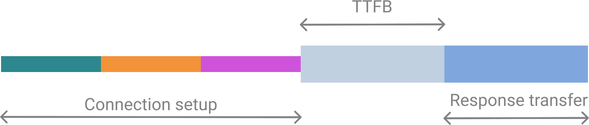

At Google I/O 2019 we shipped [PROXX], a modern Minesweeper-clone on the web. Something that sets PROXX apart from a the other clones out there is the focus on accessibility and the goal to run on a constrained device like a feature phone just as much as a high-end desktop device. Feature phones are constrained in multiple ways: They have weak CPUs, weak or no GPUs, small screens without touch input and small amounts of memory. But they run a modern browser, so you need to be ready if you expect your JavaScript-heavy app to be served to feature phones. You need to pay extra attention to budgets and apply techniques that **make your app resilient to inconsistent performance environments**.

<figure class="w-figure w-figure--center">
  <video controls loop muted
    preload="metadata"
    class="w-screenshot"
    poster="https://storage.googleapis.com/web-dev-assets/js-heavy-sites/proxx-intro-poster.jpg"
    >
    <source
      src="https://storage.googleapis.com/web-dev-assets/js-heavy-sites/proxx-intro.mp4"
      type="video/mp4; codecs=h264">
  </video>
  <figcaption class="w-figcaption w-figcaption--fullbleed">
    The game play of PROXX on a desktop machine.
  </figcaption>
</figure>

## How bad is it?
Before we start into _how_ to address the performance problems, let's cover _why_ it is really necessary. As an example for a JS-heavy website I am going to look at [Reddit]. I ran a trace on a feature phone and a modern phone over the same network with 3G throttling enabled and compared the key metrics:

|   | **Modern phone**  | **Feature phone**  |
|---|---|---|
| **Time to interactive (TTI)** | ~20s  | ~39s  |
| **Total script execution** | ~713ms   | ~16.7s   |
| **Data transferred**  | ~1.1MB  | ~1.1MB  |

The really eye-opening metric here is "Total script execution": In this scenario, the **same amount of code took 20x as long** on a feature phone as it did on a modern mobile phone. **That number is _not_ a rule of thumb**, as there are many factors influencing how long a piece of code takes, but it is indicative of how much more computational power we are used to.

Delivering good performance is paramount to many success metrices that companies rely on. It has been shown that **good performances correlates with increased user retention, improved conversions and &mdash; most importantly &mdash; it's a matter of inclusivity.**. [Jeremy Wagner] has much more data and insight on [why performance matters]. This is doubly true for feature phones: Feature phones are making a resurgence in emerging markets, as they are very cheap to produce and can be sold at very low price points. This allows a whole new audience to come online when they previously couldn't afford to do so. **For 2019 it is projected that around 400 million feature phones will be sold in India alone.**

We have to cover to facets of performance when targeting these devices: Loading performance and runtime performance. Let's pretend we didn't use code splitting with PROXX and see what we can do.

## Loading performance

Testing your loading performance on a _real_ device is critical. If you don't have a real device to hand, I recommend [WebPageTest], specifically the ["simple" setup][wpt simple]. This runs a battery of loading tests on a _real_ device with an emulated 3G connection.


  **Note:** 3G is a good speed to measure. While we might be used to 4G, LTE or soon even 5G, the reality of mobile internet looks quite different. Maybe you are on a train, at a conference, a concert or on a flight. What you will be experiencing there is most likely closer to 3G.

  In emerging markets, 3G coverage is far from complete. Often people are limited to 2G most of the time. Since the PROXX team was targeting feature phones for emerging markets, we will also be looking at 2G speeds in this article.


That being said, we are going to focus on 2G in this article as we were explicitly including feature phones in emerging markets as part of our target audience. Once WebPageTest has run its test, you get a waterfall (similar to what you see in DevTools) as well as a filmstrip at the top. The film strip shows what your user sees at what point in time. On 2G, the loading experience of PROXX was pretty bad:

<figure class="w-figure w-figure--center">
  <video controls muted
    preload="metadata"
    class="w-screenshot"
    poster="https://storage.googleapis.com/web-dev-assets/js-heavy-sites/stupid-proxx-load-poster.jpg"
    >
    <source
      src="https://storage.googleapis.com/web-dev-assets/js-heavy-sites/stupid-proxx-load.mp4"
      type="video/mp4; codecs=h264">
  </video>
  <figcaption class="w-figcaption w-figcaption--fullbleed">
    The filmstrip video shows what the user sees when PROXX is loading on a real, low-end device over an emulated 2G connection.
  </figcaption>
</figure>

When loaded over 3G, the user sees 4 seconds of white nothingness. Over 2G it's even worse: The duration for which the user sees absolutely nothing is over 8 seconds long. If you read Jeremy's article above you know that we have now lost a good porition of our potential users due to impatience. The user needs to download all of 62k of JavaScript to download our UI framework [Preact] and wait for it to put anything on the screen at all. The silver lining in this scenario is that the second anything appears on screen it is also interactive. Or is it?

<figure class="w-figure w-figure--center">
  <picture>
    <source srcset="proxx-first-render.webp" type="image/webp">
    
  </picture>
  <figcaption class="w-figcaption">
    The [First Meaningful Paint (FMP)][FMP] in the unoptimized version of PROXX is _technically_ [interactive][TTI] but useless to the user.
  </figcaption>
</figure>

After about 62kB of gzip'd JS have been downloaded and DOM has been generated, the user gets to see our app. The app is _technically_ interactive. Looking at the visual, however, shows a different reality. The web fonts are still loading in the background and until they are reader the user can see no text. While we can count this state as a ["First Meaningful Paint" (FMP)][FMP], we cannot count it as [interactive][TTI]. It takes another second on 3G and 3 seconds on 2G until the app is ready to go. **All in all, the app takes 6 seconds on 3G and 11 seconds on 2G to load.**

### Waterfall analysis

Now that we know _what_ the user sees, we need to figure out the _why_. For this we will be taking a look at the waterfall and ask ourselves which resources are loading too late. In our 2G trace for PROXX we can see two major red flags:

1. There are multiple thin lines.
2. JavaScript files look sequential.

<figure class="w-figure w-figure--center">
  <picture>
    
  </picture>
  <figcaption class="w-figcaption">
    The waterfall gives insight into which resources are loading when and how long they take. While the colored lines try to estimate multiple metrics (like [Time-to-Meaningful-First-Paint][FMP] or [Time-to-Interactive][TTI]), the film strip is much more reliable for these.
  </figcaption>
</figure>

#### Reducing connection count
Thin lines stand for the creating of a new HTTP/HTTPS/HTTP2 connection. Setting up a new connection is costly and adds around 1s on 3G and roughly 2.5s on 2G. In our waterfall we see a new connection for:

- Our `index.html`
- The styles from `fonts.googleapis.com`
- The fonts themselves from `fonts.gstatic.com`
- Google Analytics
- The Web App Manifest

The new connection for `index.html` is unavoidable. The browser _has_ to create a connection to our server to get the contents. The new connection for Google Analytics might be avoidable with something like [Minimal Analytics], but Google Analytics is not blocking our app from rendering or becoming interactive, so we don't really care about how fast it loads. On the contrary, Google Analytics should be loaded in idle time and should ideally not take up your bandwidth or processing power during the initial load. The new connection for the web app manifest is [prescribed by the fetch spec][fetch connections], as the manifest has to be loaded over a non-credentialed conneciton. Again, the web app manifest doesn't block our app from rendering or becoming interactive, so we don't need to care that much.

The two fonts we are using, however, are a problem as they block rendering and also interactivity. If we look at the CSS that is delivered by `fonts.googleapis.com`, it's just two `@font-face` rules, one for each font. It's so small in fact, that we decided to inline it into our HTML. To avoid the additional connection setup for the font files we can copy them to our own server.


  **Note:** Copying CSS or font files to your own server is okay when using [Google Fonts]. Other font providers might have different rules. Please check with your font provider's terms of service!


#### Paralleleizing loads
Looking at the waterfall, we see that once the first JavaScript file is done loading, new files start loading immediately. This is indicative for module dependencies. Our main file cannot run until the main dependencies have been loaded. The important thing to realize here is that these kind of dependencies are known at build time. We can make use of `<link rel="preload">` tags to make sure all the files we need start loading the second we receive our HTML.

#### Results

At this point it's time to take a quick look at what our changes have achieved. It's important to not change any other variables in our test setup, so we will be using [WebPageTest's easy setup][wpt simple] again and look at the filmstrip:

<figure class="w-figure w-figure--center">
  <video controls muted
    preload="metadata"
    class="w-screenshot"
    poster="https://storage.googleapis.com/web-dev-assets/js-heavy-sites/preload-proxx-load-poster.jpg"
    >
    <source
      src="https://storage.googleapis.com/web-dev-assets/js-heavy-sites/preload-proxx-load.mp4"
      type="video/mp4; codecs=h264">
  </video>
  <figcaption class="w-figcaption w-figcaption--fullbleed">
    Once again we are looking at the filmstrip after our changes have been applied to compare to our earlier results.
  </figcaption>
</figure>

**These changes reduced our TTI from 10.9 to 8.5**, which is roughly the 2.5s connection setup we were expecting to save.

### Prerendering

While we just reduced our [TTI], we haven't really affected the eternally long white screen the user has to endure for 8.5 seconds. Arguably the biggest improvements for Time To First Meaningful Paint (TTFMP)][FMP] can be achieved by adopting a server-side rendering technique (in contrast to a full client-side render). The most common techniques are Prerendering and Server-Side Rendering, which are closely related and are explained in our [Rendering article][Rendering]. Both run the web app in Node to capture the state of the DOM and serialize it to HTML. Server-Side Rendering does this per request on the, well, server's side, while Prerendering does this at build time and stores the output as your new `index.html`. In combination with preloading or even inlining the critical CSS, the browser is able to render the first view much sooner and doesn't have to wait for JavaScript to be downloaded, parsed and executed.

There's many ways to implement a Prerender. In PROXX we chose to use [Puppeteer], which starts Chrome without any UI and allows you to remote control that instance. We utilize this to inject our markup and our initial bundle and then read back the DOM as a string of HTML that has been created. Because we are using [CSS Modules], we get CSS inlining of the styles that we need for free.

```js
  const browser = await puppeteer.launch();
  const page = await browser.newPage();
  await page.setContent(rawIndexHTML);
  await page.evaluate(codeToRun);
  const renderedHTML = await page.content();
  browser.close();
  await writeFile("index.html", renderedHTML);
```

With this in place, we can expect an improvement for our TTFMP, but we still need to load and execute the same amount of JavaScript to become interactive, so we shouldn't expect TTI to change much. If anything, our `index.html` has gotten bigger and might push back our TTI a bit. There's only way to find out: Running WebPageTest.

<figure class="w-figure w-figure--center">
  <video controls muted
    preload="metadata"
    class="w-screenshot"
    poster="https://storage.googleapis.com/web-dev-assets/js-heavy-sites/ssr-proxx-load-poster.jpg"
    >
    <source
      src="https://storage.googleapis.com/web-dev-assets/js-heavy-sites/ssr-proxx-load.mp4"
      type="video/mp4; codecs=h264">
  </video>
  <figcaption class="w-figcaption w-figcaption--fullbleed">
    The filmstrip shows a clear improvement for our TTFMP metric. TTI is mostly unaffected.
  </figcaption>
</figure>

**Our first meaningful paint is moved from 8.5 seconds to 4.9 seconds.** Our TTI still happens at around 8.5 seconds so has been largly unaffected by this change. We did a _perceptual_ change. Some might even call it a sleight of hand. We are visualizing what we are loading, including the user in our progress and changing perceived performance.

### Inlining

Another marker that both DevTools and WebPageTest give us is Time-To-First-Byte (TTFB). This is the time it takes from the first byte of the request being sent to the first byte of the response being received. This time is also often called a Round-Trip-Time (RTT), although technically there is a difference between these two numbers, as RTT does not include the processing time of the request on the server side. The time spent waiting for the first byte is the lighter part of a request in WebPageTest.

<figure class="w-figure w-figure--center">
  <picture>
    
  </picture>
  <figcaption class="w-figcaption">
    The light section of a request signifies the request is waiting to receive the first byte of the response.
  </figcaption>
</figure>

Looking at our waterfall, we can see that the all of requests spend the _majority_ of their time waiting for the first byte of the response to arrive.

This problem was what HTTP/2 Push was originally conceived for. The server-side knows that additional resources are needed and can _push_ the down the wire. By the time the client realizes that it needs additional resources, they are already in the browser's caches. **HTTP/2 turned out to be hard to get right and should be considered deprecated.** This problem will be revisisted during the standardization of HTTP/3. For now, the easiest solution is to _inline_ all the critical resources at the cost of caching efficiency.

Our critical CSS is already inlined thanks to CSS Modules and our Puppeteer-based prerender. For JavaScript we need to inline our critical module _and its dependencies_. This task has varying difficulties, based on the bundler that you are using.


  **Note:** In this step we also subset our fonts to contain only the glyphs that we need for our landing page. I am not going to go into detail on this step as it is not easily abstracted and sometimes not even practical. We still load the full font files lazily, but they are not needed for the initial render.


<figure class="w-figure w-figure--center">
  <video controls muted
    preload="metadata"
    class="w-screenshot"
    poster="https://storage.googleapis.com/web-dev-assets/js-heavy-sites/ssr-proxx-load-poster.jpg"
    >
    <source
      src="https://storage.googleapis.com/web-dev-assets/js-heavy-sites/ssr-proxx-load.mp4"
      type="video/mp4; codecs=h264">
  </video>
  <figcaption class="w-figcaption w-figcaption--fullbleed">
    With the inlining of our JavaScript we have reduced our TTI from 8.5s to 7.2s.
  </figcaption>
</figure>

We have now reached the point where our `index.html` contains everything that is needed for the initial render. The HTML can render while it is still downloading, creating our First Meaningful Paint. The moment the HTML is done parsing and executing, the app is interactive.

### Aggressive code splitting

Yes, our `index.html` contains everything that is needed for the initial render. But on closer inspection it turns out it also contains everything else. Our `index.html` is around 43KiB. Looking at what the user can interact with at the start we have a form to configure the game containing a couple of components, a start button and probably some code to persist and load user settings. That's pretty it. 43KiB seems like a lot.

<figure class="w-figure w-figure--center">
  <picture>
    <source srcset="proxx-loaded.webp" type="image/webp">
    
  </picture>
  <figcaption class="w-figcaption">
    The landing page of PROXX. Everything that is shown here is considered "critical".
  </figcaption>
</figure>

To understand where our bundle size is coming from we can use [source map explorer] or a similar tool to break down what the bundle consists off. It turns out our bundle contains much more code: The game logic, the rendering engine, the win screen, the lose screen and a bunch of utilities. Only a small subset of these modules are needed for the landing page. Moving everything that is not strictly required for the first render into a lazily loaded module will decrease the time needed for the FMP _significantly_.

<figure class="w-figure w-figure--center">
  <style>
    #map {
      --highlight: #ccc;
      background-color: #eee;
      font-family: monospace;
      color: #333;
    }
    .webtreemap-node {
      margin: 3px 0;
      padding: 3px 7px;
      border: 1px solid #bbb;
      border-radius: 2px;
      display: grid;
      place-content: flex-start stretch;
      place-items: flex-start stretch;
    }
    .webtreemap-caption {
      grid-column: 1 / -1;
    }
    .webtreemap-level0 {
      grid-template-columns: repeat(2, 1fr);
      grid-gap: 6px;
    }
    @media (max-width: 480px) {
      .webtreemap-level0 {
        grid-template-columns: repeat(1, 1fr);
      }
    }
  </style>
  <div id="map">
    <div class="webtreemap-node webtreemap-level0" title="/ • 117.39 KB • 100.0%">
      <div class="webtreemap-caption">/ • 117.39 KB • 100.0%</div>
      <div
        class="webtreemap-node webtreemap-level1"
        title="src • 101.51 KB • 86.5%"
      >
        <div class="webtreemap-caption">src • 101.51 KB • 86.5%</div>
        <div
          class="webtreemap-node webtreemap-level2"
          title="main • 101.06 KB • 86.1%"
        >
          <div class="webtreemap-caption">main • 101.06 KB • 86.1%</div>
          <div
            class="webtreemap-node webtreemap-level3"
            title="services • 60.78 KB • 51.8%"
          >
            <div class="webtreemap-caption">services • 60.78 KB • 51.8%</div>
            <div
              class="webtreemap-node webtreemap-level4"
              title="preact-canvas • 58.01 KB • 49.4%"
            >
              <div class="webtreemap-caption">
                preact-canvas • 58.01 KB • 49.4%
              </div>
              <div
                class="webtreemap-node webtreemap-level4"
                title="components • 50.69 KB • 43.2%"
              >
                <div class="webtreemap-caption">
                  components • 50.69 KB • 43.2%
                </div>
                <div
                  class="webtreemap-node webtreemap-level4"
                  title="about • 8.15 KB • 6.9%"
                >
                  <div class="webtreemap-caption">about • 8.15 KB • 6.9%</div>
                </div>
                <div
                  class="webtreemap-node webtreemap-level4"
                  title="board • 7.93 KB • 6.8%"
                >
                  <div class="webtreemap-caption">board • 7.93 KB • 6.8%</div>
                </div>
                <div
                  class="webtreemap-node webtreemap-level4"
                  title="nebula • 5.94 KB • 5.1%"
                >
                  <div class="webtreemap-caption">nebula • 5.94 KB • 5.1%</div>
                </div>
                <div
                  class="webtreemap-node webtreemap-level4"
                  title="showbiz-title • 4.46 KB • 3.8%"
                >
                  <div class="webtreemap-caption">
                    showbiz-title • 4.46 KB • 3.8%
                  </div>
                </div>
                <div
                  class="webtreemap-node webtreemap-level4"
                  title="top-bar • 4.16 KB • 3.5%"
                  style="background-color: var(--highlight)"
                >
                  <div class="webtreemap-caption">top-bar • 4.16 KB • 3.5%</div>
                </div>
                <div
                  class="webtreemap-node webtreemap-level4"
                  title="game • 4.07 KB • 3.5%"
                >
                  <div class="webtreemap-caption">game • 4.07 KB • 3.5%</div>
                </div>
                <div
                  class="webtreemap-node webtreemap-level4"
                  title="intro • 3.79 KB • 3.2%"
                  style="background-color: var(--highlight)"
                >
                  <div class="webtreemap-caption">intro • 3.79 KB • 3.2%</div>
                </div>
                <div
                  class="webtreemap-node webtreemap-level4"
                  title="bottom-bar • 3.53 KB • 3.0%"
                  style="background-color: var(--highlight)"
                >
                  <div class="webtreemap-caption">
                    bottom-bar • 3.53 KB • 3.0%
                  </div>
                </div>
                <div
                  class="webtreemap-node webtreemap-level4"
                  title="win • 3.04 KB • 2.6%"
                >
                  <div class="webtreemap-caption">win • 3.04 KB • 2.6%</div>
                </div>
                <div
                  class="webtreemap-node webtreemap-level4"
                  title="icons • 1.83 KB • 1.6%"
                >
                  <div class="webtreemap-caption">icons • 1.83 KB • 1.6%</div>
                </div>
                <div
                  class="webtreemap-node webtreemap-level4"
                  title="settings • 1.65 KB • 1.4%"
                >
                  <div class="webtreemap-caption">settings • 1.65 KB • 1.4%</div>
                </div>
                <div
                  class="webtreemap-node webtreemap-level4"
                  title="game-loading • 1.5 KB • 1.3%"
                >
                  <div class="webtreemap-caption">
                    game-loading • 1.5 KB • 1.3%
                  </div>
                </div>
              </div>
            </div>
          </div>
          <div
            class="webtreemap-node webtreemap-level3"
            title="rendering • 27.54 KB • 23.5%"
          >
            <div class="webtreemap-caption">rendering • 27.54 KB • 23.5%</div>
          </div>
          <div
            class="webtreemap-node webtreemap-level3"
            title="utils • 10.74 KB • 9.2%"
          >
            <div class="webtreemap-caption">utils • 10.74 KB • 9.2%</div>
            <div
              class="webtreemap-node webtreemap-level4"
              title="shaderbox.ts • 5.9 KB • 5.0%"
            >
              <div class="webtreemap-caption">shaderbox.ts • 5.9 KB • 5.0%</div>
            </div>
            <div
              class="webtreemap-node webtreemap-level4"
              title="focus-visible.js • 2.32 KB • 2.0%"
            >
              <div class="webtreemap-caption">
                focus-visible.js • 2.32 KB • 2.0%
              </div>
            </div>
            <div
              class="webtreemap-node webtreemap-level4"
              title="cell-sizing.ts • 1.44 KB • 1.2%"
            >
              <div class="webtreemap-caption">
                cell-sizing.ts • 1.44 KB • 1.2%
              </div>
            </div>
          </div>
          <div
            class="webtreemap-node webtreemap-level3"
            title="offline • 1.54 KB • 1.3%"
          >
            <div class="webtreemap-caption">offline • 1.54 KB • 1.3%</div>
          </div>
        </div>
      </div>
      <div
        class="webtreemap-node webtreemap-level1"
        title="node_modules • 15.06 KB • 12.8%"
      >
        <div class="webtreemap-caption">node_modules • 15.06 KB • 12.8%</div>
        <div
          class="webtreemap-node webtreemap-level2"
          title="preact • 8.2 KB • 7.0%"
          style="background-color: var(--highlight)"
        >
          <div class="webtreemap-caption">preact • 8.2 KB • 7.0%</div>
        </div>
        <div
          class="webtreemap-node webtreemap-level2"
          title="comlink • 3.32 KB • 2.8%"
        >
          <div class="webtreemap-caption">comlink • 3.32 KB • 2.8%</div>
        </div>
        <div
          class="webtreemap-node webtreemap-level2"
          title="style-inject • 2.81 KB • 2.4%"
          style="background-color: var(--highlight)"
        >
          <div class="webtreemap-caption">style-inject • 2.81 KB • 2.4%</div>
        </div>
      </div>
    </div>
  </div>
  <figcaption class="w-figcaption">
    Anaylizing the initial bundle of PROXX shows a lot of unneeded resources. Critical resources are highlighted.
  </figcaption>
</figure>

What we need to do is [code splitting]. It is the act of breaking apart your monolithic bundle into smaller parts that can be lazy-loaded on-demand. Popular bundlers like [Webpack], [Rollup], and [Parcel] support code splitting by using dynamic `import()`. The bundler will analyze your code and _inline_ all modules that are imported _statically_. Everything that you import _dynamically_ will be put into it's own file and will only be fetched from the network once the `import()` call gets executed. Of course hitting the network has a cost and should only be used if you can afford to wait for the network to respond. The mantra here is to statically import the modules that are _critically_ needed at load time and dynamically load everything else. A good pattern for handling dynamic loading is [Phil Walton]'s ["Idle until Urgent][IUU].

In PROXX we created a `lazy.js` file that statically imports everything that we _don't_ need. In our main file, we can then _dynamically_ import `lazy.js`. Some of our [Preact] components ended up in `lazy.js`, which turned out to be a bit of a complication as [Preact] can't handle lazily loaded components out of the box. For this reason we wrote a little `deferred` component that allows us to render a placeholder until the actual component has loaded.

```js
export default function deferred(componentPromise) {
  return class Deferred extends Component {

    constructor(props) {
      super(props);
      this.state = {
        LoadedComponent: undefined
      };
      componentPromise.then(component => {
        this.setState({ LoadedComponent: component });
      });
    }

    render({ loaded, loading }, { LoadedComponent }) {
      if (LoadedComponent) {
        return loaded(LoadedComponent);
      }
      return loading();
    }
  };
}
```

With this in place, we can use a Promise of a component in our `render()` functions. For example, the `<Nebula>` component, that renders the animated background image, will be replaced by an empty `<div>` while the component is loading. Once the component is loaded and ready to use, the `<div>` will be replaced with the actual component.

```js
const NebulaDeferred = deferred(
  import("/components/nebula").then(m => m.default)
);

return (
  // ...
  <NebulaDeferred
    loading={() => <div />}
    loaded={Nebula => <Nebula />}
  />
);
```

With all of this in place, we reduced our `index.html` to 20KiB, less than half of the orignal size. What effect does this have on TTFMP and TTI? WebPageTest will tell!

<figure class="w-figure w-figure--center">
  <video controls muted
    preload="metadata"
    class="w-screenshot"
    poster="https://storage.googleapis.com/web-dev-assets/js-heavy-sites/optimized-proxx-load-poster.jpg"
    >
    <source
      src="https://storage.googleapis.com/web-dev-assets/js-heavy-sites/optimized-proxx-load.mp4"
      type="video/mp4; codecs=h264">
  </video>
  <figcaption class="w-figcaption w-figcaption--fullbleed">
    The filmstrip confirms: Our TTI is now at 5.4s. A drastic improvement from our original 11s.
  </figcaption>
</figure>

Our TTFMP and TTI are only 100ms apart, as it is only a matter of parsing and executing the JavaScript. At 5.4s, the app is completely interactive while less essential modules are loaded in the background.

## More Sleight of Hand
Start button

## Conclusion


[PROXX]: https://proxx.app
[Reddit]: https://reddit.com
[Webpack]: https://webpack.js.org
[Rollup]: https://rollupjs.org
[Parcel]: https://parceljs.org
[Phil Walton]: https://twitter.com/philwalton
[IUU]: https://philipwalton.com/articles/idle-until-urgent/
[why performance matters]: https://developers.google.com/web/fundamentals/performance/why-performance-matters/
[Jeremy Wagner]: https://twitter.com/malchata
[WebPageTest]: https://webpagetest.org
[wpt simple]: https://webpagetest.org/easy
[Preact]: https://preactjs.com
[source map explorer]: https://npm.im/source-map-explorer
[Rendering]: https://developers.google.com/web/updates/2019/02/rendering-on-the-web
[Puppeteer]: https://pptr.dev
[CSS Modules]: https://github.com/css-modules/css-modules
[Minimal Analytics]: https://minimalanalytics.com
[fetch connections]: https://fetch.spec.whatwg.org/#connections
[Google Fonts]: https://fonts.google.com
[FMP]: https://web.dev/first-meaningful-paint
[TTI]: https://web.dev/interactive
[code splitting]: https://web.dev/codelab-code-splitting
[preact]: https://web.dev/codelab-code-splitting