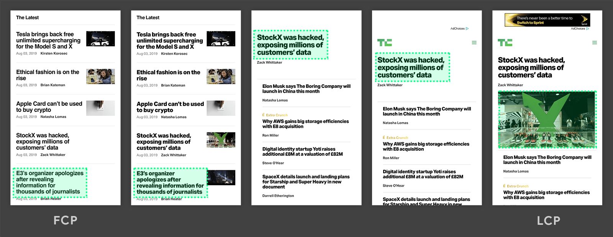
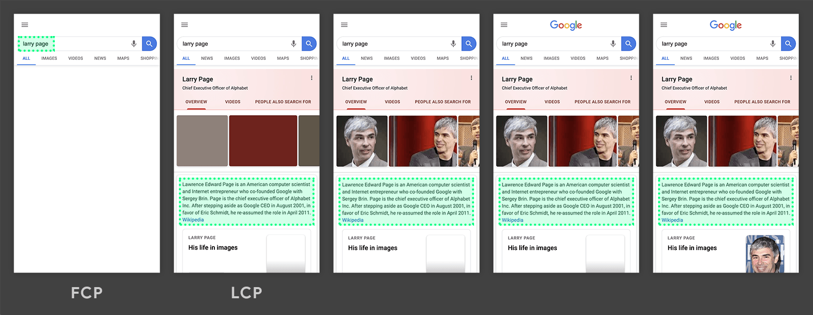

Historically, it's been a challenge for web developers to measure how quickly
the main content of a web page loads and is visible to users.

Older metrics like
[load](https://developer.mozilla.org/en-US/docs/Web/Events/load) or
[DOMContentLoaded](https://developer.mozilla.org/en-US/docs/Web/Events/DOMContentLoaded)
are not good because they don't necessarily correspond to what the user sees on
their screen. And newer, user-centric performance metrics like [First Paint
(FP) and First Contentful Paint
(FCP)](https://developers.google.com/web/fundamentals/performance/user-centric-performance-metrics#first_paint_and_first_contentful_paint)
only capture the very beginning of the loading experience. If a page shows a
splash screen or displays a loading indicator, this moment is not very relevant
to the user.

In the past we've recommended performance metrics like [First Meaningful Paint
(FMP)](https://web.dev/first-meaningful-paint/) and [Speed Index
(SI)](https://web.dev/speed-index/) (both available in Lighthouse) to help
capture more of the loading experience after the initial paint, but these
metrics are complex, hard to explain, and often wrong&mdash;meaning they still do
not identify when the main content of the page has loaded.

Sometimes simpler is better. Based on discussions in the [W3C Web
Performance Working Group](https://www.w3.org/webperf/) and research done at
Google, we've found that a more accurate way to measure when the main content
of a page is loaded is to look at when the largest element was rendered.

## Largest Contentful Paint defined

The [Largest Contentful Paint
(LCP)](https://wicg.github.io/largest-contentful-paint/) API, available in
Chrome 77, reports the render time of the largest content element visible
in the viewport.

### What elements are considered?

As currently specified, the types of elements considered for Largest Contentful
Paint are:

* `` elements
* `<image>` elements inside an `<svg>` element
* An element with a background image loaded via the
  [`url()`](https://developer.mozilla.org/en-US/docs/Web/CSS/url()) function
  (as opposed to a
  [CSS gradient](https://developer.mozilla.org/en-US/docs/Web/CSS/CSS_Images/Using_CSS_gradients))
* [Block-level](https://developer.mozilla.org/en-US/docs/Web/HTML/Block-level_elements)
  elements containing text nodes or other inline-level text elements children.

Note, restricting the elements to this limited set was intentional in order to
keep things simple in the beginning. Additional elements (e.g. `<svg>`,
`<video>`) may be added in the future as more research is conducted.

### How is an element's size determined?

The size of the element reported for Largest Contentful Paint is the size
that's visible to the user within the viewport. If the element extends outside
of the viewport, or if any of the element is clipped or has non-visible
[overflow](https://developer.mozilla.org/en-US/docs/Web/CSS/overflow), those
portions do not count toward the element's size.

For image elements, only the visible size of the rendered image is considered.
The original size of the image is not factored into the element size
calculation, nor is any margin, padding, or border that is applied to the image
via CSS.

For text elements, only the size of its text nodes is considered (the smallest
rectangle that encompases all text nodes). As with images, the element's
margin, padding, and border applied via CSS are not considered part of its
contentful size.


  Determining which text nodes belong to which elements can sometimes
  be tricky, especially for elements whose children includes inline elements and
  plain text nodes but also block-level elements. The key point is that every
  text node belongs to (and only to) its closest block-level ancestor element.
  In [spec
  terms](https://wicg.github.io/element-timing/#set-of-owned-text-nodes):
  each text node belongs to the element that generates its [containing
  block](https://developer.mozilla.org/en-US/docs/Web/CSS/Containing_block).


### When is largest contentful paint reported?

Web pages often load in stages, and as a result, it's possible that the largest
element on the page might change.

To handle this potential for change, the browser dispatches a
[`PerformanceEntry`](https://developer.mozilla.org/en-US/docs/Web/API/PerformanceEntry)
of type `largest-contentful-paint` identifying the largest contentful element
as soon as the browser has painted the first frame. But then, after rendering
subsequent frames, it will dispatch another
[`PerformanceEntry`](https://developer.mozilla.org/en-US/docs/Web/API/PerformanceEntry)
any time the largest contentful element changes.

It's important to note that an element can only be considered the largest
contentful element once it has rendered and is visible to the user. Images that
have not yet loaded are not considered "rendered". Neither are text nodes using
web fonts during the [font block
period](https://developer.mozilla.org/en-US/docs/Web/CSS/@font-face/font-display#The_font_display_timeline).
In such cases a smaller element may be reported as the largest contentful
element, but as soon as the larger element finishes rendering, it'll be
reported via another  `PerformanceEntry` object.

In addition to late-loading images and fonts, a page may add new elements to
the DOM as new content becomes available. If any of these new elements is
larger than the previous largest contentful element, a new `PerformanceEntry`
will also be reported.

The browser will stop reporting new entries as soon as the user interacts with
the page (via a tap, scroll, or keypress), as user interaction often changes
what's visible to the user (which is especially true with scrolling).

For analysis purposes, you should only report the most recently dispatched
`PerformanceEntry` to your analytics service.


  Since users can open pages in a background tab, it's possible that the largest
  contentful paint will not happen until the user focuses the tab, which can be
  much later than when they first loaded it.



#### Load time vs. render time

For security reasons, the render timestamp of images is not exposed for
cross-origin images that lack the
[`Timing-Allow-Origin`](https://developer.mozilla.org/en-US/docs/Web/HTTP/Headers/Timing-Allow-Origin)
header. Instead, only their load time is exposed (since this is already exposed
via many other web APIs).

The [usage example](#how-to-measure-largest-contentful-paint-in-javascript)
below shows how to handle elements whose render time is not available. But,
when possible, it's always recommended to set the
[`Timing-Allow-Origin`](https://developer.mozilla.org/en-US/docs/Web/HTTP/Headers/Timing-Allow-Origin)
header, so your metrics will be more accurate.

### How are element layout and size changes handled?

To keep the performance overhead of calculating and dispatching new performance
entries low, changes to an element's size or position do not generate new LCP
candidates. Only the element's initial size and position in the viewport is
considered.

This means images that are initially rendered off-screen and then transition
on-screen may not be reported. It also means elements initially rendered in the
viewport that then get pushed down, out of view will still report their
initial, in-viewport size.

An element can only be removed from LCP consideration if it's removed from the
DOM.

### Examples

Here are some examples of when the Largest Contentful Paint occurs on a few
popular websites:




In both of the timelines above, the largest element changes as content loads.
In the first example, new content is added to the DOM and that changes what
element is the largest. In the second example, the layout changes and content
that was previously the largest is removed from the viewport.

While it's often the case that late-loading content is larger than content
already on the page, that's not necessarily the case. The next two examples
show the Largest Contentful Paint occurring before the page fully loads.




In the first example, the Instagram logo is loaded relatively early and it
remains the largest element even as other content is progressively shown. In
the Google search results page example, the largest element is a paragraph of
text that is displayed before any of the images or logo finish loading. Since
all the individual images are smaller than this paragraph, it remains the
largest element throughout the load process.


  In the first frame of the Instagram timeline, you may notice the camera logo
  does not have a green box around it. That's because it's an `<svg>` element,
  and `<svg>` elements are not currently considered LCP candidates. The first
  LCP candidate is the text in the second frame.


## How to measure Largest Contentful Paint in JavaScript

The following code block shows how to measure LCP in JavaScript and report it
to an analytics service when the user leaves the tab:

```js
// Create a variable to hold the latest LCP value (since it can change).
let lcp;

// Create the PerformanceObserver instance.
const po = new PerformanceObserver((entryList) => {
  const entries = entryList.getEntries();
  const lastEntry = entries[entries.length - 1];

  // Update `lcp` to the latest value, using `renderTime` if it's available,
  // otherwise using `loadTime`. (Note: `renderTime` may not be available if
  // the element is an image and it's loaded cross-origin without the
  // `Timing-Allow-Origin` header.)
  lcp = entry.renderTime || entry.loadTime;
});

// Observe entries of type `largest-contentful-paint`, including buffered
// entries, i.e. entries that occurred before calling `observe()`.
po.observe({type: 'largest-contentful-paint', buffered: true});

// Send the latest LCP value to your analytics server once the user
// leaves the tab.
addEventListener('visibilitychange', function fn() {
  if (lcp && document.visibilityState === 'hidden') {
    sendToAnalytics({'largest-contentful-paint': lcp});
    removeEventListener('visibilitychange', fn, true);
  }
}, true);
```

Note, this example waits until the user leaves the tab to report LCP as a way
of ensuring it only reports the latest entry. If you would prefer to report
every entry (to avoid potentially missing sessions), make sure to configure
your analytics to only include the last entry received per page load.

## What if the largest element isn't the most important?

In some cases the most important element (or elements) on the page is not the
same as the largest element, and developers may be more interested in measuring
the render times of these other elements instead. This is possible using the
[Element Timing API](https://wicg.github.io/element-timing/).

The Largest Contentful Paint API is actually built on top of the Element Timing
API and adds automatic reporting of the largest contentful element, but you can
report on additional elements by explicitly adding the `elementtiming`
attribute to them, and registering a `PerformanceObserver` to observe the
`element` entry type.

Here's the [example](https://wicg.github.io/element-timing/#sec-example)
used in the specification:

```html

<p elementtiming='important-paragraph'>This is text I care about.</p>
...
<script>
const observer = new PerformanceObserver((list) => {
  let perfEntries = list.getEntries();
  // Process the entries by iterating over them.
});
observer.observe({type: 'element', buffered: true});
</script>
```


  **Important:** the [types of elements](#what-elements-are-considered)
  considered for Largest Contentful Paint are the same as those observable via
  the Element Timing API. If you add the `elementtiming` attribute to an
  element that isn't one of those types, it will be ignored.


## How to improve Largest Contentful Paint on your site

LCP is primarily affected by three factors:

* Server response time
* CSS blocking time
* Asset/subresource load time

Also, if your site is client-rendered, and your largest contentful elements are
added to the DOM via JavaScript, then your script's parse, compile, and
execution time can also be a factor in LCP.

Here is some guidance you can reference to optimize all of these factors:

* [Apply instant loading with the PRPL
  pattern](https://web.dev/apply-instant-loading-with-prpl)
* [Optimizing the Critical Rendering
  Path](https://developers.google.com/web/fundamentals/performance/critical-rendering-path/)
* [Optimize your CSS](https://web.dev/fast#optimize-your-css)
* [Optimize your Images](https://web.dev/fast#optimize-your-images)
* [Optimize web Fonts](https://web.dev/fast#optimize-web-fonts)
* [Optimize you JavaScript](https://web.dev/fast#optimize-your-javascript) (for
  client-rendered sites)