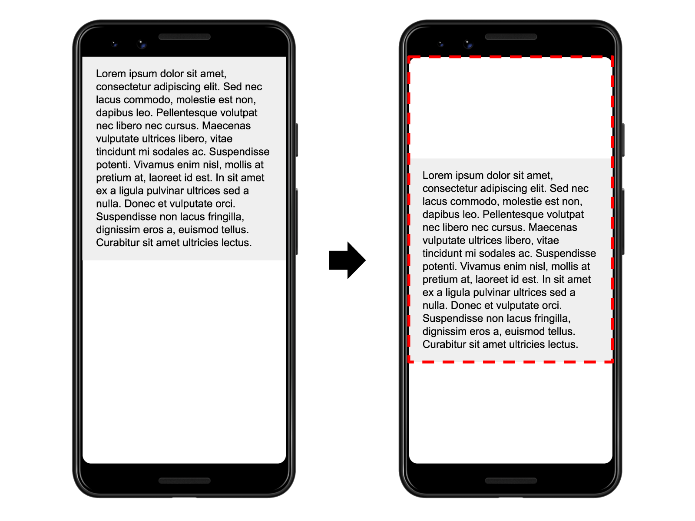
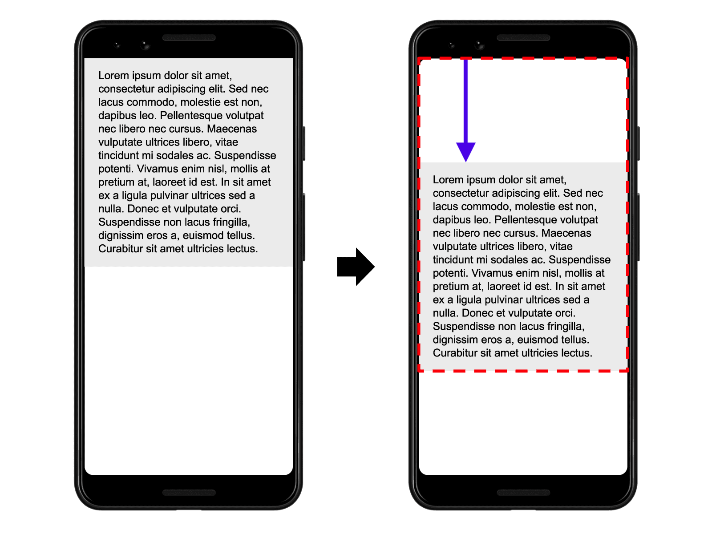

Have you ever been reading an article online when something suddenly changes on
the page? Without warning, the text moves, and you've lost your place. Or even
worse: you're about to tap a link or a button, but in the instant before your
finger lands&mdash;BOOM&mdash;the link moves, and you end up clicking something
else!

Most of the time these kinds of experiences are just annoying, but in some
cases, they can cause real damage.

<figure class="w-figure w-figure--center">
  <video autoplay controls loop muted
    class="w-screenshot"
    poster="https://storage.googleapis.com/web-dev-assets/layout-instability-api/layout-instability-poster.png"
    width="658" height="510">
    <source
      src="https://storage.googleapis.com/web-dev-assets/layout-instability-api/layout-instability2.webm"
      type="video/webm; codecs=vp8">
    <source
      src="https://storage.googleapis.com/web-dev-assets/layout-instability-api/layout-instability2.mp4"
      type="video/mp4; codecs=h264">
  </video>
  <figcaption class="w-figcaption w-figcaption--fullbleed">
    A screencast illustrating how layout instability can negatively affect
    users.
  </figcaption>
</figure>

Unexpected movement of page content usually happens because resources are
loaded asynchronously or DOM elements get dynamically added to the page above
existing content. The culprit might be an image or video with unknown
dimensions, a font that renders larger or smaller than its fallback, or a
third-party ad or widget that dynamically resizes itself.

What makes this issue even more problematic is that how a site functions in
development is often quite different from how users experience it. Personalized
or third-party content often doesn't behave the same in development as it does
in production, test images are often already in the developer's browser cache,
and API calls that run locally are often so fast that the delay isn't
noticeable.

The first step toward properly solving this problem is to give developers the
tools to measure it and understand how often it's occurring for real users. They
can then identify the causes and improve the user experience. The [Layout
Instability API](https://github.com/WICG/layout-instability), currently being
incubated in the [WICG](https://www.w3.org/community/wicg/), aims to address
this.

## How is layout instability determined?

An element is labeled as unstable if it is visible in the viewport and its start
position (for example, its top and left position in the default [writing
mode](https://developer.mozilla.org/en-US/docs/Web/CSS/writing-mode)) changes
between two frames.

Layout shifts only occur when *existing elements* change their *start position*.
If a new element is added to the DOM or an existing element changes size, it
doesn't count as a layout shift&mdash;as long as the change doesn't cause other
visible elements to change their start position.

Layout instability is determined by calculating a _layout shift_ score every
time the browser renders a new frame. A frame that's rendered without any
unexpected layout shifts has a layout shift score of 0.

### Layout shift defined

To calculate the layout shift score, the browser looks at the viewport size and
the movement of unstable elements in the viewport between two rendered frames.
The layout shift score is a product of two measures of that movement: the impact
fraction and the distance fraction.

`impact fraction x distance fraction = layout shift score`

The [impact
fraction](https://github.com/WICG/layout-instability#Impact-Fraction) measures
how unstable elements impact the viewport area between two frames.

The union of the visible areas of all unstable elements for the previous frame
*and* the current frame&mdash;as a fraction of the total area of the
viewport&mdash;is the impact fraction for the current frame.



In the image above there's an element that takes up half of the viewport in one
frame. Then, in the next frame, the element shifts down by 25% of the viewport
height. The red, dotted rectangle indicates the union of the element's visible
area in both frames, which, in this case, is 75% of the total viewport, so its
impact fraction is 0.75.

The other part of the layout shift score equation measures the distance that
unstable elements have moved on the horizontal or vertical axis (whichever is
greater), relative to the viewport. The [distance
fraction](https://github.com/WICG/layout-instability#Distance-Fraction) is the
greatest distance any unstable element has moved in the frame.



In the example above, the unstable element has moved down by 25% of the viewport
height, which makes the distance fraction 0.25.

The layout shift score in this example is 0.75 x 0.25 = 0.1875.


  Initially, the layout shift score was calculated based only on impact
  fraction. The distance fraction is introduced to avoid overly penalizing cases
  where large elements shift by small distances.


The next example illustrates how adding content to an existing element affects
the layout shift score:


The "Click Me!" button is appended to the bottom of the gray box with black
text, which pushes the green box with white text down (and partially out of the
viewport).

In this example, the gray box changes size, but its start position does not
change so it's not an unstable element.

The "Click Me!" button was not previously in the DOM, so its start position
doesn't change either.

The start position of the green box, however, does change, but since it's been
moved partially out of the viewport, the invisible area is not considered when
calculating the impact fraction. The union of the visible areas for the green
box in both frames (illustrated by the red, dotted rectangle) is the same as the
area of the green box in the first frame&mdash;50% of the viewport. The impact
fraction is 0.5.

The distance fraction is illustrated with the purple arrow. The green box has
moved down by about 14% of the viewport so the distance fraction is 0.14.

The layout shift score is 0.5 x 0.14 = 0.07.

This last example illustrates multiple unstable elements:


In the first frame above there are four results of an API request for animals,
sorted in alphabetical order. In the second frame, more results are added to the
sorted list.

The first item in the list ("Cat") does not change its start position between
frames, so it's stable. Similarly, the new items added to the list were not
previously in the DOM, so their start positions don't change either. But the
items labelled "Dog", "Horse", and "Zebra" all shift their start positions,
making them unstable elements.

Again, the red, dotted rectangles represent the union of these three unstable
elements' before and after areas, which in this case is around 38% of the
viewport's area (impact fraction of 0.38).

The arrows represent the distances that unstable elements have moved from their
starting positions. The "Zebra" element, represented by the blue arrow, has
moved the most, by about 30% of the viewport height. That makes the distance
fraction in this example 0.3.

The layout shift score is 0.38 x 0.3 = 0.1172.

### Expected vs. unexpected layout shifts

Not all layout shifts are bad. In fact, many dynamic web applications frequently
change the start position of elements on the page.

#### User-initiated layout shifts

A layout shift is only bad if the user isn't expecting it. On the other hand,
layout shifts that occur in response to user interactions (clicking a link,
pressing a button, typing in a search box and similar) are generally fine, as
long as the shift occurs close enough to the interaction that the relationship
is clear to the user.

For example, if a user interaction triggers a network request that may take a
while to complete, it's best to create some space right away and show a loading
indicator to avoid an unpleasant layout shift when the request completes. If
the user doesn't realize something is loading, or doesn't have a sense of when
the resource will be ready, they may try to click something else while
waiting&mdash;something that could move out from under them.

#### Animations and transitions

Animations and transitions, when done well, are a great way to update content on
the page without surprising the user. Content that shifts abruptly and
unexpectedly on the page almost always creates a bad user experience. But
content that moves gradually and naturally from one position to the next can
often help the user better understand what's going on, and guide them between
state changes.

CSS [`transform`](https://developer.mozilla.org/en-US/docs/Web/CSS/transform)
property allows you to animate elements without triggering layout changes:

* Instead of changing `height` and `width` properties, use `transform: scale()`.
* To move elements around, avoid changing `top`, `right`, `bottom`, or `left`
  properties and use `transform: translate()` instead.

### A cumulative layout shift score

Layout shift scores are calculated per-frame, and they are reported regardless
of whether the shift was triggered as a result of user input. But users can
experience layout instability throughout their entire browser session, and as
mentioned above, not all layout shifts are perceived negatively.

The cumulative layout shift (CLS) score can be determined by calculating the sum
of all "unexpected" layout shift scores from page load until the page's
[lifecycle
state](https://developers.google.com/web/updates/2018/07/page-lifecycle-api)
changes to hidden. Chrome has heuristics to determine which layout shifts are
"unexpected" and only those should count towards the cumulative layout shift
score. For example, shifts that occur within 500 milliseconds of a discrete user
interaction (for example, clicks, taps, and key presses) shouldn't count towards
the CLS.

A page that has no unexpected layout shifts will have a cumulative layout shift
score of 0. Most typical content sites and web applications should strive for a
score of 0 to provide the best experience for their users.


  Sites with, for example, multimedia presentations, progressive visualizations,
  or slideshows can have higher CLS scores and that is perfectly fine. CLS
  scores are intended to help developers who may not be aware of the problems
  that are causing unexpected layout shifts; they're not intended to suggest
  that sites that deliberately shift the layout are necessarily problematic.


## How to use the Layout Instability API

The Layout Instability API is available in Chrome 74+ with the experimental web
platform features flag enabled
(`chrome://flags/#enable-experimental-web-platform-features`) or through the
[Layout Instability Origin
Trial](https://developers.chrome.com/origintrials/#/view_trial/1215971899390033921),
which is be available until Sept. 3, 2019.

Similar to other performance APIs, Layout Instability can be observed via the
`PerformanceObserver` interface, where you can subscribe to entries of type
`layout-shift`.

The following code logs all layout shift entries as they happen:

```js
const observer = new PerformanceObserver((list) => {
  for (const entry of list.getEntries()) {
    console.log(entry);
  }
})

observer.observe({type: 'layout-shift', buffered: true});
```


  The
  [`buffered`](https://w3c.github.io/performance-timeline/#dom-performanceobserverinit-buffered)
  flag in the above example (supported in Chrome 77+) gives you access to
  entries that may have occurred prior to creating the `PerformanceObserver`.



  The `entryType` value for this API has changed a few times during
  the experimentation period. In Chrome 76 it was `layoutShift`, and in Chrome
  74-75 it was `layoutJank`. Developers implementing the stable API should only
  need to observe the current `layout-shift` value (as shown in the example
  above), but developers who are part of the origin trial may need to observe
  multiple entry types to cover their full user base. See [this
  demo](https://output.jsbin.com/zajamil/quiet) for an example of code that
  works in Chrome 74+.


To calculate the cumulative layout shift score for your pages and track them in
your analytics back end, declare a variable that stores the current cumulative
layout shift score, and then increment it any time a new layout shift is
detected. For best results, record scores from the initial page load until the
page's lifecycle state changes to `hidden`:

```js
// Stores the current layout shift score for the page.
let cumulativeLayoutShiftScore = 0;

// Detects new layout shift occurrences and updates the
// `cumulativeLayoutShiftScore` variable.
const observer = new PerformanceObserver((list) => {
  for (const entry of list.getEntries()) {
    // Only count layout shifts without recent user input.
    if (!entry.hadRecentInput) {
      cumulativeLayoutShiftScore += entry.value;
    }
  }
});

observer.observe({type: 'layout-shift', buffered: true});

// Sends the final score to your analytics back end once
// the page's lifecycle state becomes hidden.
document.addEventListener('visibilitychange', () => {
  if (document.visibilityState === 'hidden') {
    // Force any pending records to be dispatched.
    observer.takeRecords();

    // Send the final score to your analytics back end
    // (assumes `sendToAnalytics` is defined elsewhere).
    sendToAnalytics({cumulativeLayoutShiftScore});
  }
});
```


  The cumulative layout shift score has also been added as an experimental
  metric in the [Chrome User Experience
  Report](https://developers.google.com/web/tools/chrome-user-experience-report/)
  (CrUX), a dataset that captures how real-world Chrome users experience popular
  destinations on the web. With the addition of CLS as of the May 2019 release,
  developers can get a better understanding of how users experience layout
  instability on their sites, on their competitors' sites, and on the web as a
  whole.


## How to avoid unexpected layout shifts

For most websites, you can avoid all unexpected layout shifts by sticking to a
few guiding principles:

<ul>
  <li>
    <strong>Always include size attributes on your images and video elements,
    or otherwise reserve the required space with something like
    <a href="https://css-tricks.com/aspect-ratio-boxes/">CSS aspect ratio
    boxes</a>.</strong> This approach ensures that the browser can allocate the
    correct amount of space in the document while the image is loading. Note
    that you can also use the
    <a href="https://github.com/w3c/webappsec-feature-policy/blob/master/policies/unsized-media.md">
    unsized-media feature policy</a> to force this behavior in browsers that
    support feature policies. And in the future you'll be able to use the
    <a href="https://github.com/WICG/intrinsicsize-attribute">
    <code>intrinsicSize</code> attribute</a> to more easily address this issue.
  </li>
  <li>
    <strong>Never insert content above existing content, except in response to
    a user interaction.</strong> This ensures any layout shifts that occur are
    expected.
  </li>
  <li>
    <strong>Prefer transform animations to animations of properties that
    trigger layout changes.</strong> Animate transitions in a way that provides
    context and continuity from state to state.
  </li>
</ul>

## Feedback wanted

The Layout Instability API is being incubated in the WICG, and this is the time
feedback from the developer community is the most helpful&mdash;specifically
feedback on how well the API works on real websites and with the actual
development techniques used today.

* Are there any false positives (good experiences reported as unexpected layout
  shifts)?
* Are there any false negatives (clear examples of layout instability not being
  reported)?
* Are the scores meaningful and the data actionable?

You can give feedback by opening up an issue on the [Layout Instability Spec's
GitHub repo](https://github.com/WICG/layout-instability), or by contributing to
the discussion already happening there.

If your site is available in the CrUX dataset, you [can
query](https://console.cloud.google.com/bigquery?p=chrome-ux-report&d=all&t=201905&page=table)
to see how real Chrome users are experiencing the stability of your site's
layout, and you can compare these results to the results you're seeing when
testing your site locally. If the results you see in CrUX are unexpected, you
can sign up for the [Layout Instability Origin
Trial](https://developers.chrome.com/origintrials/#/view_trial/1215971899390033921)
and monitor your user's experience via the JavaScript API.
